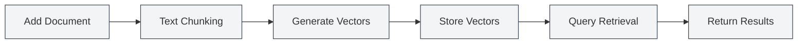
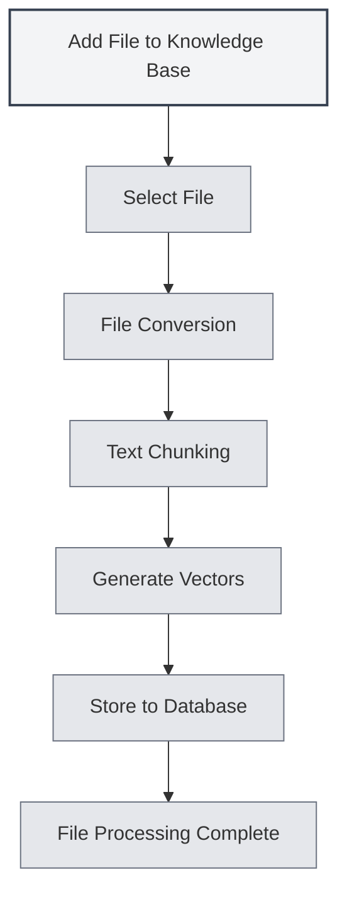

# Knowledge Base Usage

## Overview

The Knowledge Base is MetaDoc's RAG (Retrieval-Augmented Generation) system, providing contextual information for AI features through vector search. Proper use of the Knowledge Base can significantly improve the accuracy and relevance of AI responses.

<KnowledgeBase mode="demo" />

## Introduction to Knowledge Base

### What is a Knowledge Base

A Knowledge Base is a document storage and retrieval system that can:

- **Store Documents**: Convert documents into vectors and store them
- **Semantic Search**: Search for relevant content based on semantic similarity
- **Enhance AI**: Provide contextual information for AI conversations

### How It Works

<RAGToolDisplay mode="demo" />

The Knowledge Base uses vector embedding technology:

1. **Document Processing**: Split documents into text chunks
2. **Vectorization**: Generate vector embeddings for each text chunk
3. **Storage**: Store vectors in the database
4. **Retrieval**: Generate vectors based on queries and search for similar content

<KnowledgeBase mode="demo" />

## Adding Files to the Knowledge Base

### Adding Files

1. Open the Knowledge Base management page
2. Click the "Add File" button
3. Select the file to add
4. Wait for the file processing to complete

### Supported File Formats

The Knowledge Base supports the following file formats:

- **Markdown** (.md): Markdown documents
- **LaTeX** (.tex): LaTeX documents
- **PDF** (.pdf): PDF documents
- **Word** (.docx): Word documents
- **Images** (.png, .jpg, etc.): Text recognized via OCR
- **Plain Text** (.txt): Plain text files

### File Processing

<RAGToolDisplay mode="demo" />

After adding a file, the system automatically:

1. **Converts Text**: Converts the file into text content
2. **Chunks Text**: Splits the text into fixed-size chunks
3. **Generates Vectors**: Generates vector embeddings for each chunk
4. **Stores Data**: Stores vectors and text in the database

Processing time depends on file size; large files may take longer.

<KnowledgeBase mode="demo" />

## Knowledge Base File Management

### File List

The Knowledge Base management page displays all added files:

- **Filename**: The name of the file
- **Size/Chunk Count**: File size and number of data chunks
- **Status**: Whether the file is enabled

### File Operations

<RAGToolDisplay mode="demo" />

#### Enable/Disable File

- **Enable**: The file will be retrieved for AI features
- **Disable**: The file will not be retrieved, but data is retained

#### Preview File

Click on a file to preview its content:

- **View Content**: View file text in the preview panel
- **Open Editor**: Open the file in the editor

#### Rename File

1. Select the file to rename
2. Click the edit button next to the filename
3. Enter the new filename
4. Confirm the rename

#### Delete File

1. Select the file to delete
2. Click the "Delete" button
3. Confirm the deletion

Deleting a file removes all related vectors and data chunks.

#### Download File

You can download files from the Knowledge Base:

1. Select the file to download
2. Click the "Download" button
3. Choose the save location

<KnowledgeBase mode="demo" />

## Vector Search

### Search Principle

Vector search uses ANN (Approximate Nearest Neighbor) algorithms:

- **Vector Similarity**: Calculates similarity between query vectors and document vectors
- **Cosine Similarity**: Uses cosine similarity to measure similarity
- **Sort Results**: Returns results sorted by similarity

### Search Methods

<RAGToolDisplay mode="demo" />

The Knowledge Base supports two search methods:

- **Vector Search**: Based on semantic similarity
- **Hybrid Retrieval**: Combines vector search and keyword matching

### Search Testing

You can test the search function on the Knowledge Base management page:

1. Enter query text in the search box
2. Adjust the confidence threshold
3. Click the "Search" button
4. View the search results

### Confidence Threshold

The confidence threshold controls the filtering of search results:

- **Low Threshold (0.1-0.3)**: Returns more results but may include irrelevant content
- **Medium Threshold (0.4-0.6)**: Balances relevance and quantity (Recommended)
- **High Threshold (0.7-0.9)**: Returns only highly relevant results

<KnowledgeBase mode="demo" />

## Hybrid Retrieval

### Retrieval Mechanism

Hybrid retrieval combines two methods:

- **Vector Search**: Based on semantic similarity
- **Keyword Matching**: Based on text matching

### Scoring Mechanism

Hybrid retrieval uses a composite score:

- **Vector Similarity**: Semantic similarity score
- **Keyword Match**: Text matching score
- **Composite Score**: Final score combining both scores

### Advantages

Advantages of hybrid retrieval:

- **Accuracy**: Vector search provides semantic understanding
- **Precision**: Keyword matching provides exact matches
- **Balance**: Combines the strengths of both methods

<RAGToolDisplay mode="demo" />

## Search Testing

### Testing Search

You can test search on the Knowledge Base management page:

1. **Enter Query**: Enter the content to query in the search box
2. **Adjust Threshold**: Use the slider to adjust the confidence threshold
3. **Execute Search**: Click the "Search" button or press Enter
4. **View Results**: View search results in the results area

### Search Results

Search results display:

- **Matching Text**: Text snippets relevant to the query
- **Similarity**: Similarity score between the text and the query
- **Source File**: The file from which the text originates

### Result Sorting

Search results are sorted by similarity:

- **Most Relevant**: Results with the highest similarity appear first
- **Decreasing Relevance**: Sorted in descending order of similarity

## Vector Rebuilding

### Rebuild Vectors

If a file's vector data has issues, you can rebuild its vectors:

1. Select the file to rebuild
2. Click the "Rebuild Vectors" button
3. Wait for the rebuild to complete

### Rebuild All Vectors

You can rebuild vectors for all files:

1. Click the "Rebuild All Vectors" button
2. Confirm the operation
3. Wait for all files to be rebuilt

### Rebuild Scenarios

Scenarios requiring vector rebuilding:

- **Changing Embedding Model**: Required after switching models
- **Corrupted Vector Data**: When vector data has problems
- **Updating Vector Representation**: When vector representations need updating

## Clearing the Knowledge Base

### Clear Operation

If you need to clear the entire Knowledge Base:

1. Click the "Clear Knowledge Base" button
2. Confirm the operation
3. Wait for the clearing to complete

### Clear Impact

Clearing the Knowledge Base will:

- Delete all file records
- Delete all data chunks
- Delete all vectors
- The operation is irreversible

**Important Notes**:

- The clear operation is irreversible; proceed with caution
- It is recommended to back up important files before clearing
- Files need to be re-added after clearing

<KnowledgeBase mode="demo" />

## Using in AI Features

### AI Conversation

The Knowledge Base automatically provides context for AI conversations:

- **Automatic Retrieval**: Automatically retrieves relevant knowledge based on conversation content
- **Context Injection**: Injects retrieval results into the conversation context
- **Enhanced Responses**: Generates more accurate answers based on Knowledge Base content

### AI Completion

The Knowledge Base can enhance AI completion features:

- **Context Understanding**: Understands context based on Knowledge Base content
- **Content Generation**: Generates content related to Knowledge Base content
- **Accuracy Improvement**: Improves the accuracy of completion content

### Agent Tools

The Knowledge Base can be used as an Agent tool:

- **RAG Tool**: Use RAG retrieval in Agent workflows
- **Context Provision**: Provides relevant context information for Agents
- **Task Execution**: Helps Agents complete tasks requiring knowledge

## Best Practices

1. **File Organization**: Organize files by topic or project
2. **Regular Updates**: Rebuild vectors promptly after file content updates
3. **Threshold Adjustment**: Adjust confidence thresholds based on usage effectiveness
4. **File Cleanup**: Periodically delete files no longer needed
5. **Test Search**: Regularly test the search function to ensure good performance

## Important Notes

1. **Enable Knowledge Base**: The Knowledge Base feature must be enabled before use
2. **File Processing**: Large files take time to process; please be patient
3. **Storage Space**: The Knowledge Base occupies some storage space
4. **Network Connection**: Network connection is required for API mode
5. **Data Security**: Pay attention to protecting sensitive information in the Knowledge Base

## Related Documentation

- [[knowledge-base.management|Knowledge Base Management]]
- [[knowledge-base.config|Knowledge Base Configuration]]
- [[settings.llm|LLM Configuration]]
- [[ai.chat|AI Conversation Feature]]

<KnowledgeBase mode="demo" />

<RAGToolDisplay mode="demo" />
