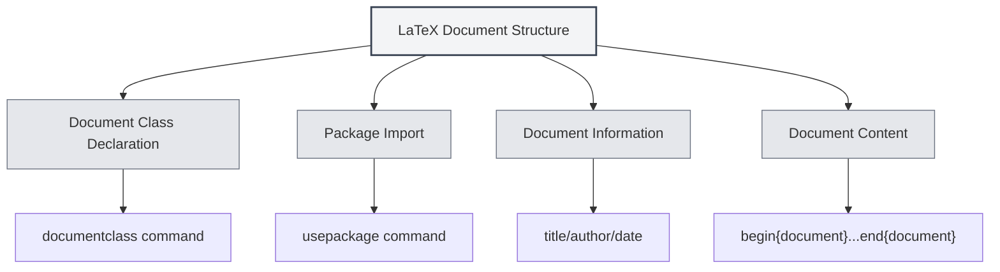

# LaTeX Syntax

## Overview

LaTeX is a typesetting system based on TeX, widely used for writing academic papers and technical documents. MetaDoc provides comprehensive support for LaTeX editing, compilation, and preview.

<LaTeXEditorDemo mode="demo" />

<PdfPreviewPanel mode="demo" />

<LaTeXCompilerPanel mode="demo" />

<LaTeXConsole mode="demo" />

## Basic Syntax

### Document Structure

The basic structure of a LaTeX document:

```latex
\documentclass{article}
\usepackage[utf8]{inputenc}

\title{Document Title}
\author{Author}
\date{\today}

\begin{document}
\maketitle

\section{Section Title}
Content...

\end{document}
```



### Mathematical Formulas

**Inline Formula**:

```latex
This is an inline formula: $E = mc^2$
```

**Block-level Formula**:

```latex
\begin{equation}
\int_{-\infty}^{\infty} e^{-x^2} dx = \sqrt{\pi}
\end{equation}
```

**Multi-line Formula**:

```latex
\begin{align}
x &= a + b \\
y &= c + d
\end{align}
```

### Tables

Use the `tabular` environment:

```latex
\begin{tabular}{|c|c|c|}
\hline
Column1 & Column2 & Column3 \\
\hline
Data1 & Data2 & Data3 \\
\hline
\end{tabular}
```

### Image Insertion

Use the `figure` environment:

```latex
\begin{figure}[h]
\centering
\includegraphics[width=0.8\textwidth]{image.png}
\caption{Image Caption}
\label{fig:example}
\end{figure}
```

### References

Use `BibTeX` or `natbib`:

```latex
\bibliographystyle{plain}
\bibliography{references}
```

## Compilation and Preview

LaTeX documents need to be compiled to generate PDFs. For details, see [[latex.compilation|LaTeX Compilation and Preview]].

After compilation is complete, you can view the results in the [[latex.pdf-preview|PDF Preview Feature]].

## Related Documentation

- [[latex.editor|LaTeX Editor User Guide]]
- [[latex.compilation|LaTeX Compilation and Preview]]
- [[latex.pdf-preview|PDF Preview Feature]]
- [[latex.console|Console Output]]
