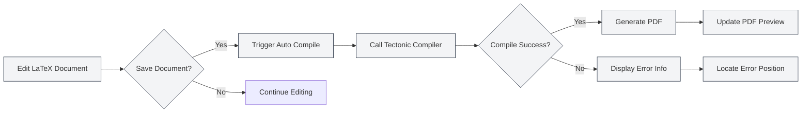
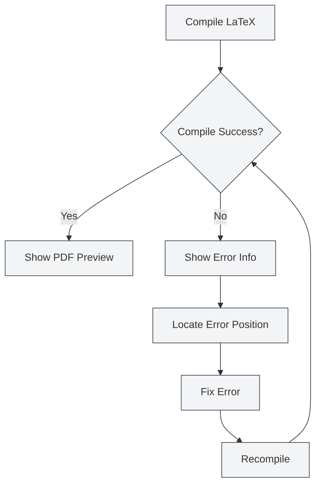

# LaTeX Compilation and Preview

## Overview

LaTeX documents require compilation to generate PDFs. MetaDoc uses the Tectonic compiler, supporting features like automatic compilation, real-time preview, and error localization, enabling you to write and debug LaTeX documents efficiently.

The compilation process automatically downloads required packages, eliminating the need for manual configuration and greatly simplifying the LaTeX workflow.

## Compiling LaTeX Documents

<LaTeXCompilerPanel mode="demo" />

### Automatic Compilation

MetaDoc supports automatic compilation:

- **Compile on Save**: Automatically triggers compilation when saving a LaTeX document.
- **Manual Compilation**: Manually trigger compilation by clicking the "Compile" button in the toolbar.
- **Compilation Status**: Displays progress and status during compilation.

### Compilation Process

<LaTeXConsole mode="demo" />

The compilation process includes the following steps:

1.  **Prepare Environment**: Check if the Tectonic compiler is available.
2.  **Download Packages**: Automatically download LaTeX packages used in the document.
3.  **Execute Compilation**: Run the Tectonic compiler to generate the PDF.
4.  **Process Output**: Handle compilation logs and error messages.
5.  **Update Preview**: Update the PDF preview if compilation is successful.

### Compilation Options

<LaTeXEditorDemo mode="demo" />

Compilation supports the following options:

- **Compiler**: Uses the Tectonic compiler (default).
- **Compilation Mode**: Non-interactive mode, stops on errors.
- **Output Directory**: PDF files are saved in the same directory as the document.

### Compilation Time

<ConsoleTerminal mode="demo" consoleKey="demo" :history='[{"content": "Tectonic compiler starting...", "type": "out"}, {"content": "Parsing document structure", "type": "out"}]' />

Compilation time depends on:

- **Document Size**: Larger documents take longer to compile.
- **Number of Packages**: More packages used means longer first compilation (requires downloading).
- **Number of Images**: More included images increase compilation time.

The first compilation may take longer due to package downloads. Subsequent compilations will be faster.

## PDF Preview

<PdfPreviewPanel mode="demo" pdfUrl="" />

### Automatic Updates

The PDF preview updates automatically after successful compilation:

- **Real-time Preview**: PDF preview displays immediately after successful compilation.
- **Auto-refresh**: Preview refreshes automatically when PDF content changes.
- **Sync Scrolling**: Supports synchronized positioning between PDF and code.

### Preview Features

<LaTeXCompilerPanel mode="demo" />

The PDF preview panel provides the following features:

- **Page Navigation**: Previous page, next page, jump to a specific page.
- **Zoom Control**: Zoom in, zoom out, reset zoom.
- **Refresh Preview**: Manually refresh the PDF preview.
- **Locate to Code**: Navigate from a PDF position to the corresponding LaTeX code.

For details, see [[latex.pdf-preview|PDF Preview Features]].

The PDF preview panel interface is as follows:

<PdfPreviewPanel mode="demo" pdfUrl="" />

## Console Output

<LaTeXConsole mode="demo" />

### Compilation Log

Logs from the compilation process are displayed in the console output panel:

- **Standard Output**: Normal output from the compilation process.
- **Error Messages**: Compilation errors and warnings.
- **Real-time Updates**: Logs update in real-time during compilation.

The console output panel interface is as follows:

<ConsoleTerminal mode="demo" consoleKey="demo" :history='[{"content": "Compilation starting...", "type": "out"}, {"content": "Downloading package: amsmath", "type": "out"}, {"content": "Warning: undefined reference", "type": "warn"}, {"content": "Compilation complete", "type": "out"}]' />

### Error Messages

<ConsoleTerminal mode="demo" consoleKey="demo" :history='[{"content": "Error: undefined command", "type": "error"}, {"content": "Warning: hypertext reference not found", "type": "warn"}]' />

Compilation errors are displayed in different colors:

- **Error**: Red, indicates compilation failure.
- **Warning**: Yellow, indicates potential issues.
- **Info**: Gray, indicates general information.

### Error Localization

Compilation errors display:

- **Error Location**: Shows the line and column number where the error occurred.
- **Error Type**: Shows the error type and description.
- **Quick Jump**: Clicking the error message jumps to the corresponding code location.

For details, see [[latex.console|Console Output]].

## Locating in PDF

<LaTeXEditorDemo mode="demo" />

### From Code to PDF

In the LaTeX editor, you can:

1.  **Select Code**: Select LaTeX code.
2.  **Right-click Menu**: Right-click and choose "Locate in PDF".
3.  **Jump to Preview**: The PDF preview automatically jumps to the corresponding location.

### From PDF to Code

In the PDF preview, you can:

1.  **Click PDF Location**: Click a location in the PDF.
2.  **Auto Jump**: The editor automatically jumps to the corresponding LaTeX code location.

This feature allows you to quickly switch between the PDF and code, facilitating debugging and editing.

## Handling Compilation Errors

<LaTeXConsole mode="demo" />

### Common Error Types

LaTeX compilation may encounter the following errors:

- **Syntax Errors**: Incorrect LaTeX syntax.
- **Missing Packages**: Using packages that are not installed (Tectonic downloads them automatically).
- **Missing Files**: Referenced files do not exist.
- **Encoding Errors**: Incorrect file encoding.

### Error Handling Process

### Debugging Tips

1.  **Check Console**: Carefully review the error messages in the console output.
2.  **Locate Errors**: Use the error localization feature to quickly find problematic code.
3.  **Fix Step-by-Step**: Start from the first error and fix them one by one.
4.  **Check Syntax**: Ensure LaTeX syntax is correct.
5.  **Check Files**: Ensure referenced files exist and paths are correct.

## Tectonic Compiler

<LaTeXCompilerPanel mode="demo" />

### Compiler Introduction

MetaDoc uses the Tectonic compiler, which has the following characteristics:

- **No TeX Distribution Required**: Tectonic is a standalone binary.
- **Automatic Package Downloads**: Automatically downloads required packages from CTAN during compilation.
- **Fast Compilation**: Faster compilation compared to traditional TeX distributions.
- **Cross-platform Support**: Full support for Windows, macOS, and Linux.

### Package Management

Tectonic automatically manages LaTeX packages:

- **Automatic Download**: Downloads automatically on first use.
- **Cache Management**: Downloaded packages are cached for faster subsequent compilations.
- **Version Management**: Automatically manages package versions.

You do not need to manually download or configure any packages; simply use the `\usepackage{}` command in your document.

## Usage Tips

<LaTeXEditorDemo mode="demo" />

### Improving Compilation Speed

1.  **Reduce Images**: Decrease the number of images in the document.
2.  **Optimize Code**: Optimize the LaTeX code structure.
3.  **Use Cache**: Leverage Tectonic's package cache.

### Debugging Compilation Errors

1.  **View Full Log**: Check the complete compilation log in the console.
2.  **Check Syntax**: Carefully inspect LaTeX syntax.
3.  **Compile Stepwise**: Comment out parts of the code to locate the issue step by step.
4.  **Consult Documentation**: Refer to LaTeX package documentation.

### Optimizing the Compilation Workflow

1.  **Compile on Save**: Enable automatic compilation on save.
2.  **Use Preview**: Use the PDF preview to quickly see results.
3.  **Use Locate Feature**: Use the locate feature to quickly switch between code and PDF.

## Frequently Asked Questions

### Q: What to do if compilation fails?

A: Check the error messages in the console output and fix the code based on the error prompts. Common issues include syntax errors, missing files, etc.

### Q: Compilation takes a long time?

A: The first compilation requires downloading packages, so a longer time is normal. Subsequent compilations will be faster. If it remains slow, check the document size and number of images.

### Q: Package download fails?

A: Check your network connection to ensure access to CTAN. Tectonic will automatically retry downloads.

### Q: PDF preview does not update?

A: Click the "Refresh" button to manually refresh the preview, or check if compilation was successful.

### Q: How to view the compilation log?

A: The compilation log is displayed in the console output panel, where you can view standard output, error messages, and warnings.

## Related Documentation

- [[latex.editor|LaTeX Editor User Guide]]
- [[latex.basics|LaTeX Syntax]]
- [[latex.pdf-preview|PDF Preview Features]]
- [[latex.console|Console Output]]

<LaTeXCompilerPanel mode="demo" />

<LaTeXEditorDemo mode="demo" />
