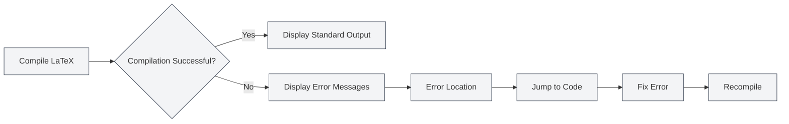

# Console Output

## Overview

The console output panel displays log information from the LaTeX compilation process, including standard output, error messages, warning messages, and more. By viewing the console output, you can understand the compilation process, locate errors, and debug issues.

The console output is displayed using the Monaco editor, supporting features like syntax highlighting, error location, and log filtering, allowing you to efficiently view and analyze compilation logs.

## LaTeX Compilation Output

<LaTeXConsole mode="demo" />

### Standard Output

The standard output from the compilation process is displayed in the console:

- **Compilation Progress**: Shows the various stages of compilation.
- **Package Downloads**: Displays information about downloaded packages.
- **Compilation Information**: Shows detailed information about the compilation process.

Standard output is displayed as plain text, helping you understand the compilation process.

The interface of the console output panel is as follows:

<ConsoleTerminal mode="demo" consoleKey="demo" :history='[{"content": "Compilation started...", "type": "out"}, {"content": "Warning: undefined reference", "type": "warn"}, {"content": "Compilation completed", "type": "out"}]' />

### Output Format

<ConsoleTerminal mode="demo" consoleKey="demo" :history='[{"content": "Standard output message", "type": "out"}, {"content": "Warning message", "type": "warn"}, {"content": "Error message", "type": "error"}]' />

The console output uses different colors to distinguish between types of information:

- **Standard Output**: Gray text, displaying normal compilation information.
- **Error Messages**: Red text, displaying compilation errors.
- **Warning Messages**: Yellow text, displaying compilation warnings.
- **Debug Information**: Dark gray text, displaying debug information.

## Error Message Display

<LaTeXConsole mode="demo" />

### Error Format

Compilation errors are displayed in a specific format:

- **Error Location**: Shows the filename, line number, and column number where the error occurred.
- **Error Type**: Shows the type of error (e.g., syntax error, missing file).
- **Error Description**: Shows a detailed description of the error.

### Error Location

The console output supports error location functionality:

- **Click Error**: Clicking on an error message jumps to the corresponding code location.
- **Highlighting**: The corresponding code line for the error is highlighted.
- **Quick Fix**: Quickly locate the error position for easy fixing.

### Common Error Types

LaTeX compilation may encounter the following errors:

- **Syntax Errors**: Incorrect LaTeX syntax.
- **Undefined Commands**: Use of undefined LaTeX commands.
- **Unclosed Environments**: Environments not properly closed.
- **Missing Files**: Referenced files do not exist.
- **Package Errors**: Package loading failure or conflicts.

## Warning Message Display

<ConsoleTerminal mode="demo" consoleKey="demo" :history='[{"content": "Warning: undefined reference", "type": "warn"}]' />

### Warning Format

Compilation warnings are displayed in a specific format:

- **Warning Location**: Shows the location where the warning occurred.
- **Warning Type**: Shows the type of warning.
- **Warning Description**: Shows a detailed description of the warning.

### Warning Handling

Warning messages typically do not prevent compilation but may affect the final result:

- **Review Warnings**: Carefully review warning messages to understand potential issues.
- **Fix Warnings**: Fix the code based on the warning information.
- **Ignore Warnings**: If the warning does not affect the result, it can be temporarily ignored.

## Log Filtering

<LaTeXConsole mode="demo" />

### Filtering Functionality

The console output supports log filtering functionality:

- **Filter by Type**: Show only errors, warnings, or standard output.
- **Filter by Keyword**: Filter logs containing specific keywords.
- **Filter by Time**: Filter logs from a specific time period.

### Filter Settings

Log filtering can be configured in the console panel:

1. Open the console output panel.
2. Use the filter options to select the content to display.
3. Enter keywords for search filtering.

### Clearing Logs

Clear the console output:

- **Clear Button**: Click the "Clear" button in the console.
- **Keyboard Shortcut**: `Ctrl+L` (if configured).

Clearing logs deletes all displayed log information.

## Log Operations

<ConsoleTerminal mode="demo" consoleKey="demo" :history='[{"content": "Compilation log content...", "type": "out"}]' />

### Copy Logs

Copy console output to the clipboard:

- **Copy Button**: Click the "Copy" button in the console.
- **Keyboard Shortcut**: `Ctrl+C` (after selecting text).

Copied logs can be saved elsewhere or shared with others.

### Save Logs

Save console output to a file:

- **Save Button**: Click the "Save Log" button in the console.
- **File Selection**: Choose the save location and filename.

Saved log files can be used for subsequent analysis or issue reporting.

### AI Analysis

The console output supports AI analysis functionality:

- **Enable AI Analysis**: Enable the AI analysis toggle in the console panel.
- **Automatic Analysis**: AI automatically analyzes error messages and provides fix suggestions.
- **View Suggestions**: View the error fix suggestions provided by AI.

The AI analysis feature can help you quickly understand and fix compilation errors.

## Console Settings

<LaTeXConsole mode="demo" />

### Display Options

The console output supports the following display options:

- **Line Number Display**: Show line numbers for log lines.
- **Word Wrap**: Automatically wrap long lines for display.
- **Font Size**: Adjust the font size for log display.

### Theme Settings

The console output follows the editor theme:

- **Light Theme**: Uses a light background in light theme.
- **Dark Theme**: Uses a dark background in dark theme.
- **Auto Sync**: Automatically syncs with editor theme settings.

## Usage Tips

<ConsoleTerminal mode="demo" consoleKey="demo" :history='[{"content": "Locating error position...", "type": "out"}]' />

### Quickly Locate Errors

1. **Review Error Messages**: Carefully review the format and content of error messages.
2. **Use Location Feature**: Click on error messages to quickly jump to the code location.
3. **Check Context**: Examine the contextual code around the error location.

### Understanding Compilation Logs

1. **Read Standard Output**: Understand the various stages of the compilation process.
2. **Focus on Errors**: Prioritize fixing errors by focusing on error messages.
3. **Review Warnings**: Check warning messages to understand potential issues.

### Debugging Tips

1. **Stepwise Compilation**: Comment out parts of the code to gradually locate problems.
2. **View Full Logs**: View the complete compilation log to understand the process.
3. **Use AI Analysis**: Enable AI analysis to get repair suggestions.

## Frequently Asked Questions

<LaTeXConsole mode="demo" />

### Q: Console output not displaying?

A: Ensure the console output panel is open. It opens automatically when compiling a LaTeX document.

### Q: How to quickly find errors?

A: Error messages are displayed in red. Click on an error message to quickly jump to the code location.

### Q: What if there are too many logs?

A: Use the filtering function to filter out unnecessary logs, or use the clear function to remove old logs.

### Q: How to save compilation logs?

A: Click the "Save Log" button in the console and choose the save location to save the log file.

### Q: AI analysis is inaccurate?

A: AI analysis is for reference only. It is recommended to combine error messages and code context for judgment. You can manually fix or re-analyze.

## Related Documentation

- [[latex.compilation|LaTeX Compilation and Preview]]
- [[latex.editor|LaTeX Editor User Guide]]
- [[latex.pdf-preview|PDF Preview Functionality]]

<PdfPreviewPanel mode="demo" pdfUrl="" />

<LaTeXCompilerPanel mode="demo" />

<LaTeXEditorDemo mode="demo" />