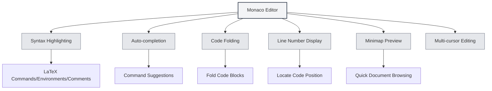

# LaTeX Editor User Guide

## Overview

MetaDoc's LaTeX editor is based on the Monaco Editor, providing a professional LaTeX code editing experience. The editor supports features like syntax highlighting, auto-completion, and code folding to help you write LaTeX documents efficiently.

The Monaco Editor is the core editor used by Visual Studio Code, offering powerful code editing capabilities and a rich set of features.

<PdfPreviewPanel mode="demo" pdfUrl="" />

<ConsoleTerminal mode="demo" consoleKey="demo" :history='[{"content": "Compilation complete", "type": "out"}]' />

<LaTeXEditor mode="demo" />

## Introduction to the Monaco Editor

The Monaco Editor provides the following features for LaTeX editing:

- **Syntax Highlighting**: Different colors for LaTeX commands, environments, comments, and other syntax elements.
- **Auto-completion**: Automatically displays completion suggestions when typing LaTeX commands.
- **Code Folding**: Supports folding code blocks for easier navigation of long documents.
- **Line Number Display**: Shows line numbers for easy code location.
- **Minimap Preview**: Displays a code thumbnail on the right side for quick document structure overview.
- **Multi-cursor Editing**: Supports editing with multiple cursors simultaneously.

<LaTeXEditorDemo mode="demo" />

## Code Highlighting and Syntax Hints

### Syntax Highlighting

The LaTeX editor automatically recognizes and highlights:

- **Commands**: LaTeX commands like `\documentclass`, `\usepackage`.
- **Environments**: Environment markers like `\begin{document}`, `\end{document}`.
- **Comments**: Comment lines starting with `%`.
- **Math Formulas**: Math formula regions wrapped in `$` or `$$`.
- **Special Characters**: Special characters like `&`, `#`, `$`.

Syntax highlighting makes the code structure clearer, facilitating reading and editing.

### Syntax Hints

The editor displays syntax hints in the following situations:

- **Typing Commands**: Automatically shows available LaTeX commands after typing `\`.
- **Typing Environments**: Shows available environment names after typing `\begin{`.
- **Typing Package Names**: Shows common package names after typing `\usepackage{`.

Syntax hints help you quickly input correct LaTeX commands and reduce typing errors.

<LaTeXEditor mode="demo" />

## Line Number Display

### Displaying Line Numbers

Line numbers are displayed on the left side of the editor, helping you:

- **Locate Code**: Quickly jump to a specific line.
- **Find Errors**: Compilation errors display line numbers, making it easy to locate issues.
- **Reference Code**: Convenient for referencing specific lines of code within documentation.

### Configuring Line Numbers

Line number display can be configured in the settings:

1. Open the Settings page.
2. Find the "Line Number Display" option.
3. Toggle the switch to enable or disable line numbers.

Line number settings affect all Monaco editors (LaTeX editor, plain text editor, etc.).

<LaTeXEditorDemo mode="demo" />

## Minimap Preview

### Minimap Function

The Minimap is a code thumbnail on the right side of the editor:

- **Quick Browsing**: View the overall structure of the entire document in the minimap.
- **Quick Navigation**: Click on the minimap to quickly jump to the corresponding position.
- **Structure Preview**: Understand different parts of the document through color differences.

### Showing/Hiding the Minimap

The minimap can be controlled in the following ways:

1. Right-click in the editor.
2. Look for the "Minimap" option.
3. Toggle its display state.

The minimap is particularly useful for editing long documents, helping you quickly understand the document structure.

## Code Folding

### Folding Function

Code folding allows you to collapse code blocks, hiding parts you don't need to see:

- **Fold Environments**: Collapse `\begin{...}...\end{...}` environment blocks.
- **Fold Functions**: Collapse custom command definitions.
- **Fold Comments**: Collapse large comment sections.

### Using Folding

- **Fold**: Click the folding icon to the left of the line number, or use the shortcut `Ctrl+Shift+[`.
- **Expand**: Click the fold marker, or use the shortcut `Ctrl+Shift+]`.
- **Fold All**: Use the shortcut `Ctrl+K Ctrl+0` to fold all code blocks.
- **Expand All**: Use the shortcut `Ctrl+K Ctrl+J` to expand all code blocks.

Code folding helps you focus on the currently edited section, improving editing efficiency.

<LaTeXEditorDemo mode="demo" />

## Auto-completion

### Triggering Completion

The editor automatically displays completion suggestions in the following situations:

- **Typing Commands**: Shows a list of LaTeX commands after typing `\`.
- **Typing Environments**: Shows environment names after typing `\begin{`.
- **Typing Package Names**: Shows common package names after typing `\usepackage{`.
- **Other Characters**: May also show relevant suggestions after typing other characters.

### Accepting Completions

- **Enter Key**: Accepts the currently selected completion suggestion.
- **Tab Key**: Accepts the currently selected completion suggestion.
- **Arrow Keys**: Move selection up and down in the completion list.
- **Esc Key**: Dismisses the completion suggestions.

### Completion Settings

Completion features can be configured in the editor settings:

- **Quick Suggestions**: Automatically show completion suggestions after other characters.
- **Trigger Characters**: Automatically show completion after specific characters (like `\`).
- **Accept Characters**: Automatically accept completion when commit characters are typed.

<LaTeXEditor mode="demo" />

## Editing Features

### Multi-cursor Editing

The Monaco Editor supports editing with multiple cursors simultaneously:

- **Alt+Click**: Adds a new cursor at the clicked position.
- **Ctrl+Alt+Up/Down Arrow**: Adds a cursor above/below.
- **Ctrl+D**: Selects the next occurrence of the same word and adds a cursor.
- **Ctrl+Shift+L**: Selects all occurrences of the same word and adds cursors.

Multi-cursor editing allows modifying multiple locations at once, improving editing efficiency.

### Column Selection

Supports column selection mode:

- **Alt+Shift+Drag**: Selects a rectangular area.
- **Alt+Shift+Arrow Keys**: Extends column selection.

Column selection is suitable for editing tables or aligned code.

### Code Formatting

The editor supports basic code formatting:

- **Auto-indent**: Automatically indents based on code structure.
- **Word Wrap**: Automatically wraps long lines for display.
- **Indentation Style**: Supports different indentation styles (spaces, Tab).

<LaTeXEditorDemo mode="demo" />

## Find and Replace

### Find Function

- **Shortcut**: `Ctrl+F` opens the find dialog.
- **Highlighting**: Search results are highlighted in the document.
- **Cycle Search**: Automatically starts from the beginning after reaching the end of the document.

### Replace Function

- **Shortcut**: `Ctrl+H` opens the find and replace dialog.
- **Replace One**: Replaces matched text one by one.
- **Replace All**: Replaces all matched text at once.

### Advanced Options

Find and replace supports the following options:

- **Match Case**: Only matches text with identical casing.
- **Match Whole Word**: Only matches complete words.
- **Regular Expression**: Uses regular expressions for pattern matching.

<LaTeXEditorDemo mode="demo" />

## Shortcut Reference

### Editing Shortcuts

| Action | Windows/Linux | macOS   |
| ------ | ------------- | ------- |
| Undo   | `Ctrl+Z`      | `Cmd+Z` |
| Redo   | `Ctrl+Y`      | `Cmd+Y` |
| Copy   | `Ctrl+C`      | `Cmd+C` |
| Paste  | `Ctrl+V`      | `Cmd+V` |
| Select All | `Ctrl+A`  | `Cmd+A` |
| Find   | `Ctrl+F`      | `Cmd+F` |
| Replace | `Ctrl+H`     | `Cmd+H` |

### Code Folding Shortcuts

| Action       | Windows/Linux   | macOS          |
| ------------ | --------------- | -------------- |
| Fold         | `Ctrl+Shift+[`  | `Cmd+Option+[` |
| Expand       | `Ctrl+Shift+]`  | `Cmd+Option+]` |
| Fold All     | `Ctrl+K Ctrl+0` | `Cmd+K Cmd+0`  |
| Expand All   | `Ctrl+K Ctrl+J` | `Cmd+K Cmd+J`  |

### Multi-cursor Shortcuts

| Action                     | Windows/Linux  | macOS          |
| -------------------------- | -------------- | -------------- |
| Add Cursor                 | `Alt+Click`    | `Option+Click` |
| Add Cursor Above           | `Ctrl+Alt+↑`   | `Cmd+Option+↑` |
| Add Cursor Below           | `Ctrl+Alt+↓`   | `Cmd+Option+↓` |
| Select Next Same Word      | `Ctrl+D`       | `Cmd+D`        |
| Select All Same Words      | `Ctrl+Shift+L` | `Cmd+Shift+L`  |

<LaTeXEditor mode="demo" />

## Usage Tips

### Quick Input

1. **Command Completion**: Type `\`, use arrow keys to select a command, press Enter to accept.
2. **Environment Completion**: Type `\begin{`, select an environment name, and the editor will automatically complete `\end{...}`.
3. **Package Name Completion**: Type `\usepackage{`, select a package name to quickly add a macro package.

<LaTeXEditor mode="demo" />

### Code Organization

1. **Use Folding**: Fold code blocks you don't need to view, keeping the editing area tidy.
2. **Use Comments**: Add comments to explain code functionality for easier future maintenance.
3. **Proper Indentation**: Maintain consistent code indentation to improve readability.

<LaTeXEditorDemo mode="demo" />

### Error Location

1. **Check Line Numbers**: Compilation errors display line numbers; quickly locate them in the editor.
2. **Use Find**: Use the find function to quickly locate specific commands or text.
3. **Use Minimap**: Quickly browse the document structure in the minimap.

## Frequently Asked Questions

### Q: Auto-completion not showing?

A: Check if the "Quick Suggestions" option is enabled in the editor settings. Completion suggestions should appear automatically after typing `\`.

### Q: How to fold code?

A: Click the folding icon to the left of the line number, or use the shortcut `Ctrl+Shift+[`. Folded environment blocks will show a fold marker to the left of the line number.

### Q: Minimap not showing?

A: Check if the "Minimap" option is enabled in the editor settings. The minimap is displayed on the right side of the editor.

### Q: How to quickly jump to a specific line?

A: Use the shortcut `Ctrl+G` (Windows/Linux) or `Cmd+G` (macOS) to open the "Go to Line" dialog, then enter the line number to jump.

### Q: Code formatting is incorrect?

A: The Monaco Editor automatically indents based on LaTeX syntax. If indentation is incorrect, you can adjust it manually or use the Tab key.

## Related Documentation

- [[latex.basics|LaTeX Syntax]]
- [[latex.compilation|LaTeX Compilation and Preview]]
- [[latex.pdf-preview|PDF Preview Function]]
- [[latex.console|Console Output]]
- [[core.editor-basics|Editor Basic Operations]]
- [[core.editor-settings|Editor Settings]]
