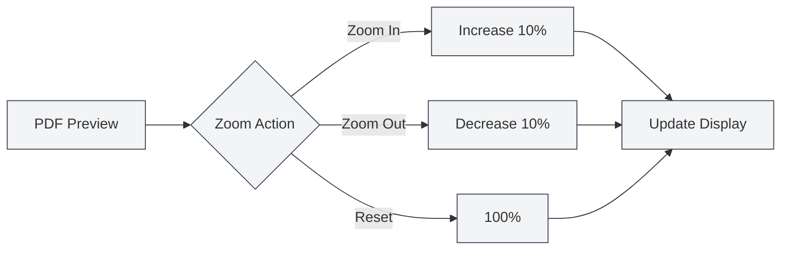

# PDF Preview Feature

## Overview

The PDF preview feature allows you to view the compiled PDF output in real-time while editing your LaTeX document. The preview panel offers rich interactive functionalities, including zooming, page navigation, and source code positioning, enabling efficient editing and debugging of LaTeX documents.

The PDF preview automatically displays after a successful LaTeX compilation. It supports bidirectional positioning with the code editor, facilitating quick switching between the PDF and the source code.

<PdfPreviewPanel mode="demo" pdfUrl="" />

## Introduction to PDF Preview

### Preview Panel

The PDF preview panel is displayed on the right side or below the LaTeX editor and includes:

- **PDF Content Area**: Displays the PDF page content.
- **Toolbar**: Provides operation buttons for zooming, page navigation, refresh, etc.
- **Page Information**: Shows the current page number and total page count.

The interface of the PDF preview panel is as follows:

<PdfPreviewPanel mode="demo" pdfUrl="" />

<LaTeXCompilerPanel mode="demo" />

### Automatic Display

The PDF preview automatically displays under the following circumstances:

- **Successful Compilation**: Automatically shows the PDF preview after a successful LaTeX compilation.
- **Opening a Document**: Automatically shows the preview when opening a LaTeX document that already has a PDF.
- **Manual Opening**: Manually open the preview by clicking the "Preview" button on the toolbar.

<PdfPreviewPanel mode="demo" pdfUrl="" />

## PDF Zoom

### Zoom In

To zoom in on the PDF preview:

- **Toolbar Button**: Click the "Zoom In" button (+ icon) on the toolbar.
- **Mouse Wheel**: Hold the `Ctrl` key and scroll the mouse wheel up.
- **Keyboard Shortcut**: `Ctrl+=` (if configured).

Each zoom-in action increases the zoom level by 10%.

<LaTeXEditorDemo mode="demo" />

### Zoom Out

To zoom out of the PDF preview:

- **Toolbar Button**: Click the "Zoom Out" button (- icon) on the toolbar.
- **Mouse Wheel**: Hold the `Ctrl` key and scroll the mouse wheel down.
- **Keyboard Shortcut**: `Ctrl+-` (if configured).

Each zoom-out action decreases the zoom level by 10%.

### Reset Zoom

To reset the PDF zoom to 100%:

- **Toolbar Button**: Click the "Reset Zoom" button on the toolbar.
- **Keyboard Shortcut**: `Ctrl+0` (if configured).

### Zoom Range

The supported range for PDF zoom is:

- **Minimum**: 20% (0.2x)
- **Maximum**: 500% (5x)
- **Default**: 100% (1x)

The zoom level is automatically constrained within the valid range.

<PdfPreviewPanel mode="demo" pdfUrl="" />

## PDF Refresh

### Manual Refresh

To manually refresh the PDF preview:

- **Toolbar Button**: Click the "Refresh" button on the toolbar.
- **Keyboard Shortcut**: `F5` (if configured).

Refreshing reloads the PDF file, displaying the latest compilation results.

### Automatic Refresh

The PDF preview automatically refreshes under the following circumstances:

- **Successful Compilation**: Automatically refreshes the preview after a successful LaTeX compilation.
- **PDF File Update**: Automatically refreshes when a PDF file update is detected.

### When to Refresh

It is recommended to refresh the PDF in the following situations:

- **After Code Changes**: After modifying LaTeX code and recompiling.
- **Preview Anomaly**: When the PDF preview displays anomalies or incorrect content.
- **Extended Editing**: After a long editing session to view the latest results.

<LaTeXEditorDemo mode="demo" />

## PDF to Code Positioning

### From PDF to Code

Clicking a location in the PDF preview automatically jumps the editor to the corresponding LaTeX code position:

1. **Click PDF Location**: Click the desired location in the PDF preview.
2. **Automatic Jump**: The editor automatically jumps to the corresponding LaTeX code.
3. **Highlight**: The corresponding code line is highlighted.

This feature allows you to quickly locate the source code from the PDF output, facilitating debugging and modification.

<PdfPreviewPanel mode="demo" pdfUrl="" />

### From Code to PDF

In the LaTeX editor, you can:

1. **Select Code**: Select the LaTeX code you want to view.
2. **Right-click Menu**: Right-click and choose "Locate in PDF".
3. **Jump in Preview**: The PDF preview automatically jumps to the corresponding location.

### Bidirectional Positioning

The bidirectional positioning feature between PDF and code:

- **PDF → Code**: Click a PDF location to jump to the code.
- **Code → PDF**: Select code to jump to the PDF location.
- **Synchronous Scrolling**: Supports synchronized scrolling between PDF and code.

<ConsoleTerminal mode="demo" consoleKey="demo" :history='[{"content": "PDF page navigation...", "type": "out"}]' />

## PDF Page Navigation

### Page Navigation Operations

The PDF preview supports the following page navigation operations:

- **Previous Page**: Click the "Previous Page" button on the toolbar, or use the arrow keys.
- **Next Page**: Click the "Next Page" button on the toolbar, or use the arrow keys.
- **Jump to Page**: Enter a page number in the page input box and press Enter.

### Page Information

The PDF preview displays the following page information:

- **Current Page**: Shows the currently viewed page number.
- **Total Pages**: Shows the total number of pages in the PDF.
- **Page Input Box**: Allows direct page number entry for jumping.

### Multi-page Display

The PDF preview supports multi-page display modes:

- **Single Page Mode**: Displays one page at a time.
- **Multi-page Mode**: Displays multiple pages at once (in the main preview).

Multi-page mode is suitable for quickly browsing the entire document.

<PdfPreviewPanel mode="demo" pdfUrl="" />

## PDF Saving

### Save PDF

To save the current PDF file:

- **Toolbar Button**: Click the "Save" button on the toolbar.
- **Menu**: Click "File" → "Save PDF".
- **Keyboard Shortcut**: `Ctrl+S` (if the PDF is the active document).

Saving the PDF stores the file in the same directory as the document.

### Open PDF Directory

To open the directory containing the PDF file:

- **Toolbar Button**: Click the "Open Directory" button on the toolbar.
- **Menu**: Click "File" → "Open PDF Directory".

After opening the directory, you can view and manage the PDF file in the file manager.

<LaTeXEditorDemo mode="demo" />

## PDF Interaction Modes

### Pointer Mode

Pointer mode is the default interaction mode:

- **Select Text**: Allows selecting text within the PDF.
- **Copy Text**: Allows copying selected text.
- **Click to Locate**: Clicking a PDF location positions to the corresponding code.

### Hand Mode

Hand mode is used for dragging the PDF:

- **Drag PDF**: Hold the left mouse button to drag the PDF content.
- **Move View**: Move the PDF view position.
- **Suitable for Large PDFs**: Ideal for viewing large-sized PDFs.

Switching modes:

- **Toolbar Button**: Click the mode toggle button on the toolbar.
- **Keyboard Shortcut**: Press the `H` key to toggle hand mode.

## Usage Tips

### Efficient Previewing

1. **Use Zoom**: Adjust the zoom level appropriately based on the content.
2. **Use Positioning**: Use the positioning feature to quickly switch between code and PDF.
3. **Use Refresh**: Refresh promptly after code changes to see the effects.

### Debugging Tips

1. **Locate Errors**: Position from PDF to code to quickly find problem locations.
2. **Compare Effects**: Compare PDF output with code to check formatting correctness.
3. **Multi-page Browsing**: Use multi-page mode to quickly browse the entire document.

### Performance Optimization

1. **Reasonable Zoom**: Avoid using excessively high zoom levels.
2. **Close Preview**: Close the preview panel when not needed to save resources.
3. **Refresh Strategy**: Choose automatic or manual refresh based on needs.

## Frequently Asked Questions

### Q: PDF preview is not showing?

A: Ensure the LaTeX document has been successfully compiled. If compilation fails, the PDF preview will not display. Check the error messages in the console output.

### Q: PDF preview is not updating?

A: Click the "Refresh" button to manually refresh the preview, or recompile the LaTeX document. Ensure the PDF file has been successfully generated.

### Q: How to position from PDF to code?

A: Click the location you want to view in the PDF preview, and the editor will automatically jump to the corresponding LaTeX code.

### Q: How to position from code to PDF?

A: Select the LaTeX code, right-click and choose "Locate in PDF", and the PDF preview will automatically jump to the corresponding location.

### Q: PDF zoom is not working?

A: Ensure the PDF preview panel has finished loading. If the issue persists, try refreshing the PDF preview.

## Related Documentation

- [[latex.compilation|LaTeX Compilation and Preview]]
- [[latex.editor|LaTeX Editor User Guide]]
- [[latex.console|Console Output]]

<LaTeXCompilerPanel mode="demo" />

<LaTeXEditorDemo mode="demo" />

<ConsoleTerminal mode="demo" consoleKey="demo" :history='[{"content": "Compilation log...", "type": "out"}]' />