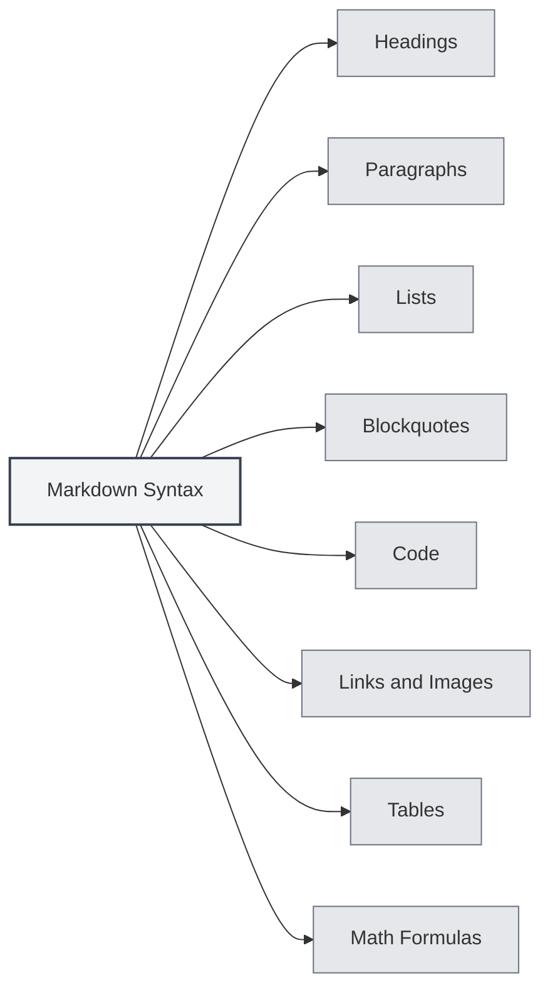

# Markdown Syntax

## Overview

Markdown is a lightweight markup language that allows you to write documents using an easy-to-read, easy-to-write plain text format. MetaDoc provides comprehensive Markdown editing and preview support.

<ViewMenuItemsDemo mode="demo" :items='["outline", "preview"]' />

## Basic Syntax

### Headings

Use the `#` symbol to create headings. The number of `#` symbols indicates the heading level:

```markdown
# Level 1 Heading

## Level 2 Heading

### Level 3 Heading
```



### Paragraphs

Separate paragraphs with blank lines.

### Lists

**Unordered lists** use `-`, `*`, or `+`:

```markdown
- Item 1
- Item 2
- Item 3
```

**Ordered lists** use numbers:

```markdown
1. First item
2. Second item
3. Third item
```

### Blockquotes

Use `>` to create a blockquote:

```markdown
> This is a blockquote
```

### Code

**Inline code** uses backticks:

```markdown
Use `console.log()` to output content
```

**Code blocks** use three backticks:

````markdown
```javascript
function hello() {
  console.log('Hello, World!')
}
```
````

### Links and Images

**Links**:

```markdown
[Link text](https://example.com)
```

**Images**:

```markdown

```

### Tables

```markdown
| Column 1 | Column 2 | Column 3 |
| -------- | -------- | -------- |
| Data 1   | Data 2   | Data 3   |
```

## Math Formulas

### Inline Formulas

Wrap with `$`:

```markdown
This is an inline formula: $E = mc^2$
```

### Block-level Formulas

Wrap with `$$`:

```markdown
$$
\int_{-\infty}^{\infty} e^{-x^2} dx = \sqrt{\pi}
$$
```

## Advanced Features

### LaTeX Formula Conversion

MetaDoc supports converting math formulas in Markdown to LaTeX format. For details, see [[latex.basics|LaTeX Syntax]].

### Chart Support

MetaDoc supports multiple chart formats:

- [[charts.mermaid|Mermaid Charts]]
- [[charts.plantuml|PlantUML Charts]]
- [[charts.echarts|ECharts Charts]]

## Related Documentation

- [[markdown.editor|Markdown Editor User Guide]]
- [[markdown.advanced|Markdown Advanced Features]]
- [[markdown.features|Markdown Editor Features]]
- [[core.editor-basics|Editor Basic Operations]]

<LaTeXEditorDemo mode="demo" />

<Outline mode="demo" />

<ViewMenuItemsDemo mode="demo" :items='["outline"]' />

<MenuItemsDemo mode="demo" :items='[{"id": "file", "items": ["new", "open", "save"]}]' />

<TitleMenu mode="demo" title="Markdown Document Example" path="1" :tree='{}' />

<ViewMenuItemsDemo mode="demo" :items='["editor", "preview"]' />