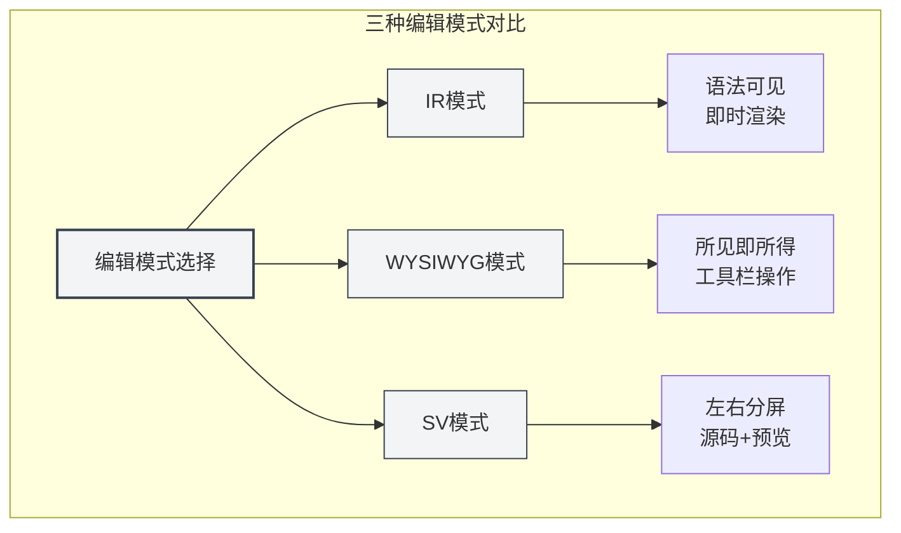
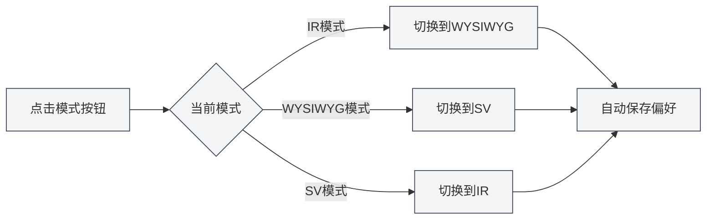
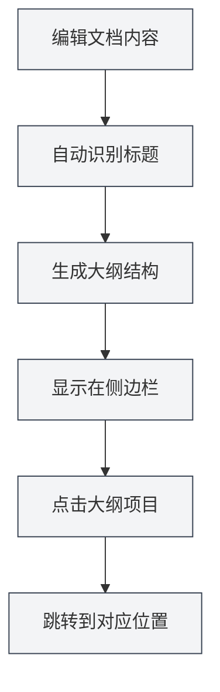
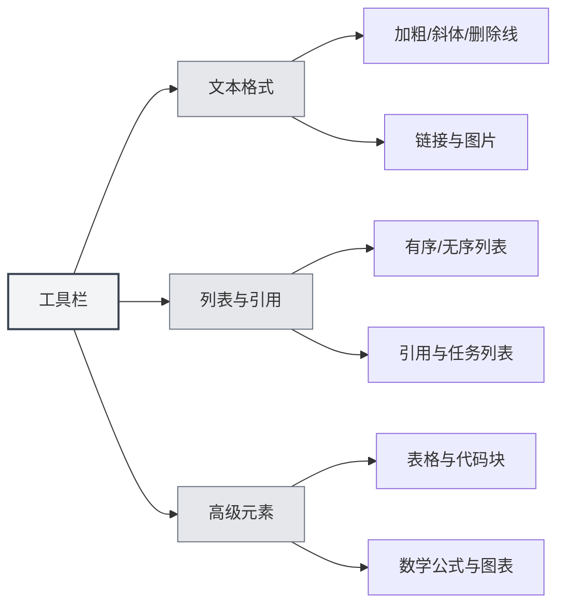

# Markdown Editor User Guide

## Overview

MetaDoc's Markdown editor provides you with a professional and elegant writing environment. It is more than just a text input box; it is a deeply optimized creative space—supporting three flexible editing modes, real-time content preview, and rich formatting tools, allowing you to focus on the content itself without worrying about formatting.

Whether you are writing a technical blog, organizing study notes, or creating project documentation, this editor meets your needs. Especially its deeply integrated AI capabilities can provide intelligent completions and suggestions while you write, making the creative process smoother.

<TitleMenu mode="demo" title="Markdown编辑器示例" path="1" :tree='{}' />

<SectionOptimizer mode="demo" title="段落优化示例" path="1" :tree='{}' language="markdown" :adapter='null' />


## Three Editing Modes

MetaDoc understands that different users have different editing habits, so it offers three editing modes for you to choose from:

### IR Mode (Instant Render)

This is the default editing mode and the preferred choice for most Markdown users. In this mode:

- **Instant Feedback**: Content is immediately displayed in its formatted form as you type Markdown syntax.
- **Syntax Visible**: Markdown markup symbols (like `#`, ` **`) remain visible, allowing you precise control over formatting.
- **Smooth Editing**: Fast rendering speed ensures no lag even when editing long documents.
- **Learning Friendly**: Users learning Markdown syntax can instantly see the correspondence between syntax and its effect.

**Ideal for**:

- Users familiar with Markdown syntax.
- Scenarios requiring precise control over document formatting.
- Editing long technical documents or blog posts.

### WYSIWYG Mode (What You See Is What You Get)

If you prefer a Word-like editing experience, this mode will feel familiar:

- **Direct Editing**: What you see is the final result; you can click directly to edit.
- **No Need to Memorize Syntax**: Perform operations like bold, headings, and lists via toolbar buttons.
- **Intuitive Operation**: Select text and click a button to apply formatting.
- **Lower Barrier to Entry**: Users unfamiliar with Markdown syntax can get started quickly.

**Ideal for**:

- Users new to Markdown.
- Scenarios requiring quick formatting without focusing on underlying syntax.
- Users who prefer visual editing.

### SV Mode (Split View)

This mode splits the editing area in two:

- **Side-by-Side Comparison**: The left side shows Markdown source code, the right side shows the rendered preview.
- **Real-time Synchronization**: The preview on the right updates instantly as you edit on the left.
- **Learning Tool**: You can see both the syntax and the final effect simultaneously, deepening your understanding of Markdown.
- **Precise Proofreading**: Convenient for checking if complex formatting (like tables, nested lists) is correct.

**Ideal for**:

- Users learning Markdown syntax.
- Scenarios requiring simultaneous viewing of source and preview for proofreading.
- Editing documents containing complex formatting.



### How to Switch Modes

Switching editing modes is very simple:

1.  **Toolbar Button**: Find the mode switch button in the editor's top toolbar.
2.  **Cycle Through**: Clicking the button cycles through the three modes.
3.  **Remember Preference**: The system remembers your last used mode and restores it automatically the next time you open the document.



## Real-time Preview

MetaDoc's real-time preview feature makes writing a pleasure:

- **Automatic Rendering**: As you input content on the left, the rendered preview appears immediately on the right (or below).
- **Full Support**: Everything from basic headings and lists to complex mathematical formulas and charts is rendered correctly.
- **Syntax Highlighting**: Code blocks are automatically syntax-highlighted based on language type, making code more readable.
- **Mathematical Formulas**: Supports LaTeX syntax for mathematical formulas, perfectly displaying both inline formulas like `$E=mc^2$` and standalone formula blocks.
- **Image Auto-fit**: Inserted images automatically adapt to the editor width; click to view enlarged.

## Outline Synchronization

Navigating long documents has never been easier:

- **Automatic Extraction**: The editor automatically identifies headings in the document and generates a hierarchical outline.
- **Real-time Updates**: The outline updates synchronously when you add, modify, or delete headings.
- **One-click Navigation**: Click any heading in the outline to instantly jump to its location in the editor.
- **Structure Preview**: Quickly understand the overall structure of the entire document through the outline.

You can access the outline view via the sidebar:

<ViewMenuItemsDemo mode="demo" :items='["editor", "outline"]' />



For a detailed introduction to the outline feature, please refer to [[outline.basics|Outline View Feature]].

## Toolbar Functions

The toolbar at the top of the editor gathers the most commonly used formatting functions:



### Text Formatting

- **Bold** (`Ctrl+B`): Makes key content stand out.
- **Italic** (`Ctrl+I`): Used for emphasis or indicating special meaning.
- **Strikethrough**: Indicates deprecated or modified content.
- **Inline Code**: Marks code snippets or technical terms.
- **Link** (`Ctrl+K`): Inserts a clickable hyperlink.
- **Image**: Inserts a local or web image.

### Lists & Blockquotes

- **Unordered List**: Lists content with bullet points.
- **Ordered List**: Lists content with numbered items.
- **Blockquote**: Quotes others' viewpoints or important notes.
- **Task List**: A to-do list with checkboxes.

### Advanced Elements

- **Table**: Creates structured data tables, supporting alignment and nesting.
- **Code Block**: Inserts multi-line code, supporting syntax highlighting for dozens of programming languages.
- **Mathematical Formula**: Inserts mathematical formulas using LaTeX syntax.
- **Chart**: Inserts charts like Mermaid, PlantUML, ECharts, etc.

## Keyboard Shortcuts

Proficient use of keyboard shortcuts can significantly improve writing efficiency:

### Formatting Shortcuts

| Action         | Windows/Linux | macOS         |
| -------------- | ------------- | ------------- |
| Bold           | `Ctrl+B`      | `Cmd+B`       |
| Italic         | `Ctrl+I`      | `Cmd+I`       |
| Insert Link    | `Ctrl+K`      | `Cmd+K`       |
| Insert Code    | `Ctrl+Shift+K`| `Cmd+Shift+K` |

### Editing Shortcuts

| Action   | Windows/Linux | macOS         |
| -------- | ------------- | ------------- |
| Undo     | `Ctrl+Z`      | `Cmd+Z`       |
| Redo     | `Ctrl+Y`      | `Cmd+Shift+Z` |
| Select All| `Ctrl+A`      | `Cmd+A`       |
| Find     | `Ctrl+F`      | `Cmd+F`       |

## Usage Tips

### Quick Input

1.  **Quick Create Heading**: Type `#` followed by a space to automatically convert to heading format.
2.  **Quick Create List**: Type `-` or `*` followed by a space to automatically convert to a list item.
3.  **Quick Insert Code Block**: Type three backticks ` ``` ` and press Enter.
4.  **Quick Insert Horizontal Rule**: Type three hyphens `---` and press Enter.

### Formatting Tips

1.  **Format After Selecting Text**: First select the text, then click the toolbar button or use the shortcut.
2.  **Batch Replacement**: Use the Find and Replace function (`Ctrl+H`) to modify formatting in bulk.
3.  **Code Highlighting**: Specify the language on the first line of the code block, e.g., ````python`.

### Preview Tips

1.  **Mode Switch Preview**: In SV mode, you can see both source and preview simultaneously.
2.  **Math Formula Preview**: Wrap formulas with `$` to see the rendered effect in real-time.
3.  **Chart Real-time Rendering**: Mermaid charts are automatically rendered after editing is complete.

## Frequently Asked Questions

### Q: How do I insert an image?

A: There are three ways:

1.  Click the image button on the toolbar.
2.  Use the shortcut `Ctrl+Shift+I`.
3.  Directly paste an image from the clipboard.

Images can be saved in the local document directory or uploaded to an image hosting service.

### Q: How do I create a table?

A: It is recommended to use the table button on the toolbar to create a table visually. You can also manually enter Markdown table syntax:

```markdown
| Column 1 | Column 2 | Column 3 |
| -------- | -------- | -------- |
| Content  | Content  | Content  |
```

### Q: What if mathematical formulas don't display?

A: Check if the syntax is correct:

-   Inline formula: Wrap with single `$`, e.g., `$E=mc^2$`.
-   Standalone formula: Wrap with two `$$`, occupying its own line.

### Q: How do I view the document outline?

A: Click the "Outline" icon in the sidebar, or use the shortcut to switch to the outline view. Headings in the document are automatically extracted into the outline.

### Q: Will content be lost after switching editing modes?

A: No. All three modes share the same document content. Switching modes only changes the display and editing method; the content is completely preserved.

## Related Documentation

-   [[markdown.basics|Markdown Syntax]] - Learn basic Markdown syntax.
-   [[markdown.features|Markdown Editor Features]] - Learn more about advanced features.
-   [[core.editor-basics|Editor Basic Operations]] - General editing techniques.
-   [[core.editor-settings|Editor Settings]] - Personalized configuration.
-   [[outline.basics|Outline View Feature]] - Deep dive into the outline feature.

<LaTeXEditorDemo mode="demo" />

<Outline mode="demo" />

<MenuItemsDemo mode="demo" :items='[{"id": "file", "items": ["new", "open", "save"]}]' />

<TitleMenu mode="demo" title="Markdown编辑器示例" path="1" :tree='{}' />

<SectionOptimizer mode="demo" title="段落优化示例" path="1" :tree='{}' language="markdown" :adapter='null' />
