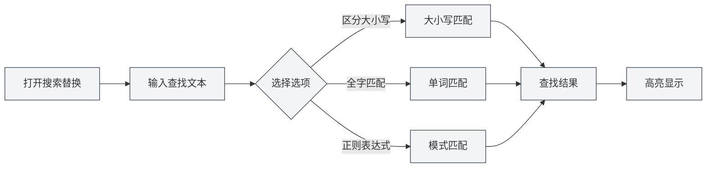
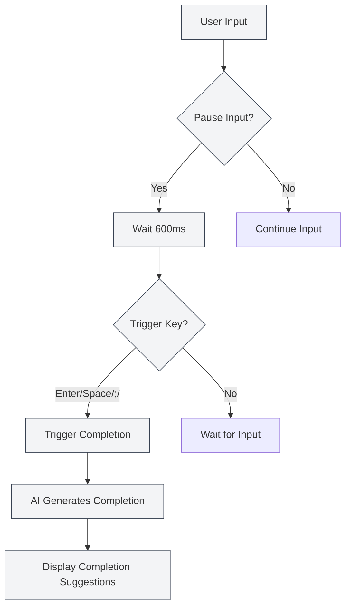

# Markdown Editor Features

## Overview

The Markdown editor offers a rich set of features, including search and replace, right-click context menus, AI auto-completion, knowledge base integration, and more. These features can significantly enhance your editing efficiency and document quality.

This document introduces the various features of the Markdown editor and how to use them.

## Search and Replace

### Opening Search and Replace

There are several ways to open the search and replace function:

- **Keyboard Shortcuts**: `Ctrl+F` to open Find, `Ctrl+H` to open Find and Replace
- **Menu**: Click "Edit" → "Find" or "Find and Replace"
- **Toolbar**: Click the search icon in the toolbar

You can access file operations via the File menu in the top menu bar and editing functions via the Edit menu:

<MenuItemsDemo mode="demo" :items='[{"id": "file", "items": ["new", "open", "save"]}]' />

### Find Function

The Find function supports the following options:

- **Case Sensitive**: Only matches text with identical casing
- **Whole Word**: Only matches complete words (not parts of words)
- **Regular Expression**: Uses regular expressions for pattern matching
- **Preserve Case**: Preserves the original text's case format during replacement

The search and replace menu interface is as follows:

<SearchReplaceMenu mode="demo" :adapter='null' />

### Replace Function

The Replace function supports:

- **Replace Single**: Replace matched text one by one
- **Replace All**: Replace all matched text at once
- **Replace Preview**: Preview the replacement result before applying

### Match List

The search and replace panel displays a match list:

- **Location Display**: Shows the line and column number of each match
- **Context Preview**: Displays the context content around the match
- **Quick Navigation**: Click a match to quickly jump to its location

### Usage Tips

1. **Regular Expressions**: Use regular expressions to implement complex search and replace patterns.
2. **Batch Replacement**: Use "Replace All" to quickly make batch modifications to the document.
3. **Preserve Formatting**: Use the "Preserve Case" option to maintain the original text's case format.

## Right-Click Context Menu

### Basic Editing Operations

The right-click menu provides the following basic editing operations:

- **Cut**: `Ctrl+X` or right-click and select "Cut"
- **Copy**: `Ctrl+C` or right-click and select "Copy"
- **Paste**: `Ctrl+V` or right-click and select "Paste"
- **Select All**: `Ctrl+A` or right-click and select "Select All"

### AI Features

The right-click menu provides the following AI features:

- **AI Analysis**: Analyze the current document content and open the AI chat window
- **Paragraph Optimization**: Optimize the content of the current paragraph
- **Insert Chart**: Use AI to generate chart code and insert it into the document

### Feature Toggles

The right-click menu allows quick toggling of the following features:

- **AI Auto-completion**: Enable/disable the AI auto-completion feature
- **Knowledge Base Integration**: Enable/disable the knowledge base integration feature

### Manual Trigger for Completion

The right-click menu provides a "Manual Trigger for Completion" option:

- **Shortcut**: `Shift+Tab`
- **Right-click Menu**: Right-click and select "Manual Trigger for Completion"

Manually triggering completion immediately initiates AI completion, bypassing the wait for automatic triggering.

## AI Auto-Completion

### Enable/Disable

The AI auto-completion feature can be enabled or disabled in the following locations:

- **Right-click Menu**: Right-click and select "Enable/Disable AI Auto-completion"
- **Settings Page**: Configure AI auto-completion options in the settings

### Automatic Triggering

AI auto-completion automatically triggers under the following conditions:

- **Input Pause**: Automatically triggers 600ms after input stops
- **Trigger Keys**: Triggers after entering specific keys (Enter, Space, `;`, `,`)

### Manual Triggering

Ways to manually trigger completion:

- **Shortcut**: `Shift+Tab`
- **Right-click Menu**: Right-click and select "Manual Trigger for Completion"

Manual triggering immediately initiates completion, skipping the automatic trigger delay.

### Completion Modes

AI auto-completion supports two modes:

- **Full Generation**: Generates complete completion content
- **Partial Generation**: Generates only partial content (based on settings)

The completion mode can be configured in the settings.

### Trigger Key Settings

Completion trigger keys can be configured in the settings:

- **Enter**: Triggered by the Enter key
- **Space**: Triggered by the Space key
- **;**: Triggered by the semicolon
- **,**: Triggered by the comma

Multiple trigger keys can be enabled simultaneously.

### Maximum Completion Tokens

The maximum number of tokens for completion can be configured in the settings:

- **Minimum**: 20 Tokens
- **Maximum**: Unlimited (set to 0 for unlimited)
- **Default**: 50 Tokens

A higher token count results in more completion content but also longer generation time.

### Accepting Completions

After completion suggestions are displayed, you can:

- **Tab Key**: Accept the completion suggestion
- **Esc Key**: Dismiss the completion suggestion
- **Continue Typing**: Dismiss completion and continue typing

<TitleMenu mode="demo" title="Markdown Editor Example" path="1" :tree='{}' />

<SectionOptimizer mode="demo" title="Paragraph Optimization Example" path="1" :tree='{}' language="markdown" :adapter='null' />

<QuickStartMarkdown mode="demo" />

<ViewMenuItemsDemo mode="demo" :items='["editor", "outline", "agent"]' />

## Knowledge Base Integration

### Enable/Disable

The knowledge base integration feature can be enabled or disabled in the following locations:

- **Right-click Menu**: Right-click and select "Enable/Disable Knowledge Base"
- **Settings Page**: Configure knowledge base options in the settings

### Context Retrieval

When knowledge base integration is enabled, AI features automatically retrieve relevant content from the knowledge base:

- **AI Completion**: Completion references relevant content from the knowledge base
- **AI Analysis**: Document analysis utilizes knowledge from the knowledge base
- **Paragraph Optimization**: Paragraph optimization references content from the knowledge base

### Retrieval Principle

Knowledge base retrieval uses vector search technology:

- **Semantic Matching**: Matches relevant content based on semantic similarity
- **Keyword Matching**: Also uses keyword matching to improve accuracy
- **Hybrid Retrieval**: Combines vector search and keyword matching

### Confidence Threshold

Knowledge base retrieval supports setting a confidence threshold:

- **Threshold Range**: 0.0 - 1.0
- **Default Value**: 0.5
- **Purpose**: Only returns content with similarity higher than the threshold

The confidence threshold can be configured in the settings. For details, see [[knowledge-base.config|Knowledge Base Configuration]].

## Combined Feature Usage

### Search and Replace + AI Completion

Combine the use of search and replace with AI completion:

1. Use search and replace to find content that needs modification.
2. Use AI completion to generate new content.
3. Use the replace function to batch update.

### Right-click Menu + Knowledge Base

Combine the use of the right-click menu with the knowledge base:

1. Enable knowledge base integration.
2. Use the AI features in the right-click menu.
3. AI features will automatically utilize content from the knowledge base.

### AI Analysis + Paragraph Optimization

Combine the use of AI analysis with paragraph optimization:

1. Use AI analysis to understand the document content.
2. Use paragraph optimization to improve specific paragraphs.
3. Optimize based on suggestions from the AI analysis.

## Usage Tips

### Improving Completion Quality

1. **Enable Knowledge Base**: Enabling knowledge base integration can improve completion quality.
2. **Adjust Token Count**: Adjust the maximum completion tokens according to your needs.
3. **Manual Triggering**: Use manual triggering when needed for better completion results.

### Efficient Search and Replace

1. **Use Regular Expressions**: Use regular expressions for complex patterns.
2. **Preview Replacements**: Preview replacement results before applying.
3. **Batch Operations**: Use "Replace All" for quick batch modifications.

### Knowledge Base Usage

1. **Add Relevant Documents**: Add relevant documents to the knowledge base.
2. **Adjust Confidence**: Adjust the confidence threshold according to your needs.
3. **Regular Updates**: Regularly update the knowledge base content.

## Frequently Asked Questions

### Q: AI completion not showing?

A: Check if AI auto-completion is enabled and ensure the LLM configuration is correct. Try manually triggering completion (`Shift+Tab`).

### Q: Search and replace not finding content?

A: Check if "Case Sensitive" or "Whole Word" options are enabled. If using regular expressions, check if the expression is correct.

### Q: Knowledge base integration not working?

A: Check if the knowledge base is enabled and ensure there are relevant documents in it. Adjusting the confidence threshold may help retrieve more content.

### Q: How to turn off AI completion?

A: Select "Disable AI Auto-completion" from the right-click menu, or disable the AI auto-completion option in the settings.

### Q: Completion content inaccurate?

A: Try enabling knowledge base integration, adjusting the maximum completion tokens, or using manual triggering for better results.

## Related Documents

- [[markdown.editor|Markdown Editor User Guide]]
- [[markdown.basics|Markdown Syntax]]
- [[ai.completion|AI Auto-Completion]]
- [[knowledge-base.usage|Knowledge Base Usage]]
- [[core.editor-basics|Editor Basic Operations]]

<LaTeXEditorDemo mode="demo" />

<Outline mode="demo" />

<MenuItemsDemo mode="demo" :items='[{"id": "file", "items": ["new", "open", "save"]}]' />

<TitleMenu mode="demo" title="Markdown Editor Feature Examples" path="1" :tree='{}' />

<SearchReplaceMenu mode="demo" :adapter='null' />

<ViewMenuItemsDemo mode="demo" :items='["editor", "outline", "agent"]' />

<QuickStartMarkdown mode="demo" />

<MenuItemsDemo mode="demo" :items='[{"id": "edit", "items": ["find", "replace"]}]' />