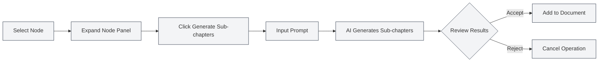
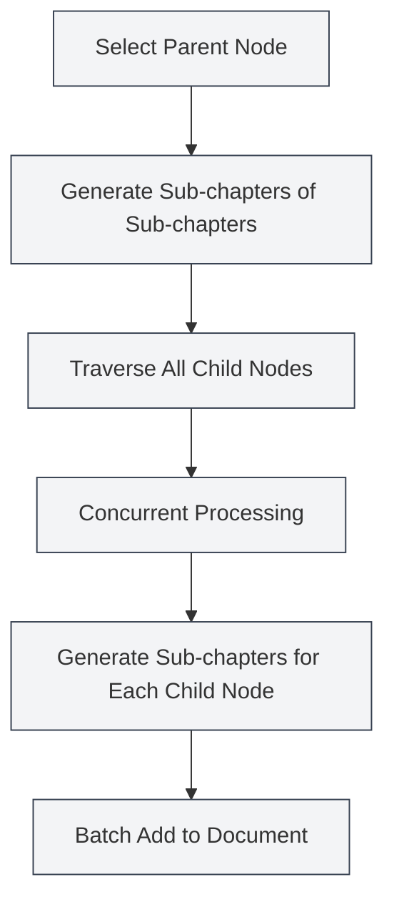

# Outline AI Features

## Overview

The Outline AI features leverage AI technology to help you quickly generate and optimize document structures. Through AI capabilities, you can generate sub-chapters, generate chapter content, optimize outline structures, and more, significantly improving document creation efficiency.

<Outline mode="demo" />

The Outline AI features support multiple operation modes, including single-node operations and batch operations, allowing you to flexibly use AI-assisted document creation.

<Outline mode="demo" />

## Generate Sub-chapters

### Generate Sub-chapters for a Node

Generate sub-chapters for a specified node:

<OutlineAiToolbar mode="demo" />

1.  **Select Node**: Select the node for which you want to generate sub-chapters in the outline view.
2.  **Expand Node**: Click the node to expand its detail panel.
3.  **Generate Sub-chapters**: Click the "Generate Sub-chapters" button.
4.  **Input Prompt**: Optionally input a prompt to guide the AI generation.
5.  **Wait for Generation**: The AI will generate sub-chapters based on the node's title and content.
6.  **Confirm Acceptance**: Review the generated results and accept them after confirmation.

You can access the outline view via the sidebar:

<ViewMenuItemsDemo mode="demo" :items='["outline"]' />

The generated sub-chapters are automatically added to the document, and the outline structure is updated.

### Generation Principle

<OutlineTreeDisplay mode="demo" />

When generating sub-chapters, the AI considers:

*   **Node Title**: Understands the chapter topic based on the node title.
*   **Document Structure**: Considers the overall structure of the document.
*   **User Prompt**: Adjusts the generated content based on the user's prompt.
*   **Format Requirements**: Generates correct heading formats according to the document format (Markdown/LaTeX).

### Usage Tips

1.  **Provide Clear Prompts**: Input clear prompts to guide the AI in generating sub-chapters that meet your needs.
2.  **Reference Existing Structure**: The AI references the existing document structure to maintain style consistency.
3.  **Generate Multiple Times**: If unsatisfied, you can generate multiple times and select the best result.

## Generate Chapter Content

<Outline mode="demo" />

### Generate Content for a Node

Generate body content for a specified node:

1.  **Select Node**: Select the node for which you want to generate content in the outline view.
2.  **Expand Node**: Click the node to expand its detail panel.
3.  **Generate Content**: Click the "Generate Content" button.
4.  **Input Prompt**: Optionally input a prompt to guide the AI generation.
5.  **Set Word Count**: Optionally set a target word count.
6.  **Wait for Generation**: The AI will generate content based on the node title and document structure.
7.  **Confirm Acceptance**: Review the generated results and accept them after confirmation.

The generated content is automatically added to the corresponding chapter in the document.

### Content Generation Modes

<OutlineAiToolbar mode="demo" />

Content generation supports the following modes:

*   **Full Generation**: Generates complete chapter content.
*   **Partial Generation**: Generates only partial content (based on settings).
*   **Append Content**: Appends new content to existing content.

### Word Count Control

You can set a target word count when generating content:

*   **Set Word Count**: Enter the target word count in the generation dialog.
*   **AI Adjustment**: The AI adjusts the level of detail in the generated content based on the word count requirement.
*   **Flexible Control**: You can set different word counts based on chapter importance.

<OutlineTreeDisplay mode="demo" />

## Generate Sub-chapters of Sub-chapters

### Batch Generate Sub-chapters

Batch generate sub-chapters for all child nodes of a specified node:

1.  **Select Node**: Select the node for the batch operation.
2.  **Expand Node**: Click the node to expand its detail panel.
3.  **Generate Sub-chapters of Sub-chapters**: Click the "Generate Sub-chapters of Sub-chapters" button.
4.  **Input Prompt**: Input a prompt to guide the AI generation.
5.  **Wait for Generation**: The AI concurrently processes all child nodes, generating sub-chapters for each.
6.  **Confirm Acceptance**: Review the generated results and accept them after confirmation.

This feature uses a concurrent processing mechanism to quickly batch generate sub-chapters for multiple chapters.

### Advantages of Concurrent Processing

<OutlineAiToolbar mode="demo" />

Batch generation uses a concurrent processing mechanism:

*   **Efficient Processing**: Processes multiple nodes simultaneously, increasing speed by tens of times.
*   **Automatic Synchronization**: Automatically synchronizes to the document after generation is complete.
*   **Progress Display**: Shows the generation progress for each node.

### Usage Scenarios

Suitable for the following scenarios:

*   **Large-scale Generation**: When you need to generate sub-chapters for multiple chapters.
*   **Batch Operations**: Generate sub-chapters for all chapters with one click.
*   **Structured Generation**: Batch generate content according to the outline structure.

## Generate Sub-chapter Content

### Batch Generate Content

Batch generate content for all child nodes of a specified node:

1.  **Select Node**: Select the node for the batch operation.
2.  **Expand Node**: Click the node to expand its detail panel.
3.  **Generate Sub-chapter Content**: Click the "Generate Sub-chapter Content" button.
4.  **Input Prompt**: Input a prompt to guide the AI generation.
5.  **Set Word Count**: Optionally set a target word count.
6.  **Wait for Generation**: The AI concurrently processes all child nodes, generating content for each.
7.  **Confirm Acceptance**: Review the generated results and accept them after confirmation.

This feature can quickly generate content for all chapters of an entire document.

### Recursive Generation

Generating sub-chapter content involves recursive processing:

*   **Traverse All Child Nodes**: Recursively traverses all child nodes.
*   **Generate Content**: Generates content for each child node.
*   **Maintain Structure**: Preserves the hierarchical structure of the document.

### Progress Tracking

Progress is displayed during batch generation:

*   **Node Progress**: Shows the node currently being processed.
*   **Overall Progress**: Shows the overall generation progress.
*   **Real-time Updates**: Updates the generated content in real-time.

<Outline mode="demo" />

## Outline Optimization

### Optimization Features

The outline optimization feature can help you:

*   **Structure Adjustment**: Optimize the structure and hierarchy of the document.
*   **Title Optimization**: Optimize the naming and format of titles.
*   **Structure Reorganization**: Reorganize the document structure.

### Optimization Operations

Outline optimization supports the following operations:

*   **Move Node**: Move a node to a new position.
*   **Delete Node**: Delete unnecessary nodes.
*   **Adjust Hierarchy**: Adjust the hierarchical relationship of nodes.
*   **Merge Nodes**: Merge similar nodes.

### Using Optimization

<OutlineTreeDisplay mode="demo" />

1.  **Analyze Structure**: The AI analyzes the current document structure.
2.  **Provide Suggestions**: Provides optimization suggestions.
3.  **Apply Optimization**: Applies the optimization results after confirmation.

## AI Feature Configuration

### Temperature Setting

You can set the temperature parameter during AI generation:

*   **Temperature Range**: 0.0 - 1.0
*   **Default Value**: According to configuration.
*   **Effect**: Controls the creativity of AI generation (higher temperature = more creative).

### Prompt Settings

You can set prompts for each operation:

*   **General Prompt**: Set a general prompt.
*   **Operation-specific Prompt**: Set specific prompts for each operation.
*   **Word Count Requirement**: Include word count requirements in the prompt.

### Format Recognition

The AI automatically recognizes the document format:

*   **Markdown Format**: Generates titles and content in Markdown format.
*   **LaTeX Format**: Generates titles and content in LaTeX format.
*   **Automatic Adaptation**: Automatically adjusts generated content based on the document format.

## Usage Tips

### Efficient Generation

1.  **Use Batch Operations**: Use batch operations to improve efficiency when generating large amounts of content.
2.  **Provide Clear Prompts**: Input clear prompts to get better generation results.
3.  **Generate Step by Step**: First generate the structure, then generate the content, gradually perfecting the document.

### Quality Control

1.  **Check Generated Results**: Carefully check the results after generation to ensure they meet requirements.
2.  **Generate Multiple Times**: If unsatisfied, you can generate multiple times and select the best result.
3.  **Manual Adjustment**: You can manually adjust and refine the content after generation.

### Structure Planning

1.  **Plan Structure First**: Use AI to generate sub-chapters and plan the document structure.
2.  **Generate Content Later**: Generate specific content after the structure is finalized.
3.  **Gradual Improvement**: Gradually improve the document; avoid generating all content at once.

## Frequently Asked Questions

### Q: The AI-generated content is inaccurate?

A: AI-generated content is for reference only. It is recommended to check and adjust after generation. Providing more detailed prompts can yield better results.

### Q: Batch generation is very slow?

A: Batch generation uses concurrent processing and is already fast. If it's still slow, it might be due to network issues or slow AI service response.

### Q: How to cancel generation?

A: You can click the "Cancel" button during the generation process to cancel the operation. Already generated content will not be lost.

### Q: The generated content format is incorrect?

A: The AI automatically recognizes the document format. If the format is incorrect, check the document format settings or manually adjust the generated content.

### Q: Can I modify the generated content?

A: Yes. Generated content can be edited and modified at any time. Generation is only an aid to creation; the final content is up to you.

## Related Documents

*   [[outline.basics|Outline View Features]]
*   [[ai.llm-config|LLM Configuration]]
*   [[markdown.editor|Markdown Editor User Guide]]
*   [[latex.editor|LaTeX Editor User Guide]]

<Outline mode="demo" />

<OutlineAiToolbar mode="demo" />

<ViewMenuItemsDemo mode="demo" :items='["ai"]' />
