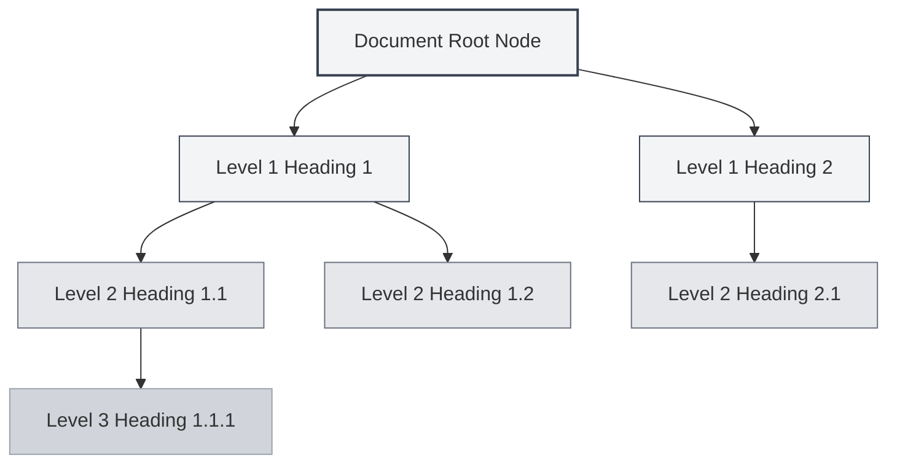
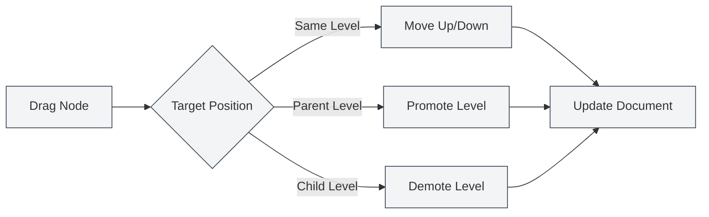

# Outline View Feature

## Overview

The outline view displays the document's heading hierarchy in a tree structure, helping you quickly browse and edit the document's structure. Through the outline view, you can quickly jump to any location in the document, edit the document structure, and use AI features to generate content.

MetaDoc's outline view supports automatic extraction, manual editing, drag-and-drop sorting, AI generation, and other functions, enabling you to efficiently organize and manage your document structure.

## Introduction to Outline View

### View Location

The outline view is typically displayed in the sidebar on the left or right side of the editor:

- **Sidebar**: The outline view is displayed as part of the sidebar.
- **Independent Panel**: The outline view can be displayed or hidden independently.
- **Width Adjustment**: The width of the outline view can be adjusted.

You can access the outline view via the sidebar, which provides switching between views like editor and outline:

<ViewMenuItemsDemo mode="demo" :items='["editor", "outline"]' />

### Interface Preview

The outline view displays the document's heading hierarchy in a tree structure, supporting drag-and-drop sorting and node editing:

<Outline mode="demo" />

<ViewMenuItemsDemo mode="demo" :items='["outline"]' />

### Outline Structure

The outline view displays the document's heading hierarchy in a tree structure:

- **Root Node**: The document's root node (usually not displayed).
- **Level 1 Heading**: The document's first-level headings (H1).
- **Level 2 Heading**: The document's second-level headings (H2).
- **Multi-level Nesting**: Supports nested display of multi-level headings.

### Automatic Extraction

The outline view automatically extracts the heading structure from the document:

- **Markdown Documents**: Extracted from Markdown headings (`#`, `##`, etc.).
- **LaTeX Documents**: Extracted from LaTeX section commands (`\section`, `\subsection`, etc.).
- **Real-time Updates**: The outline structure is automatically updated when editing the document.

## Outline Node Operations

### Adding Child Nodes

Add new child nodes in the outline:

1. **Select Node**: Click on the node where you want to add a child.
2. **Add Button**: Click the "Add Child Node" button (+ icon) next to the node.
3. **Enter Title**: Enter the title for the new node.
4. **Confirm Creation**: Confirm to create the new node.

The new node will be added to the corresponding position in the document, and the document content will be updated automatically.

<Outline mode="demo" />

### Editing Nodes

Edit the title of an outline node:

1. **Select Node**: Click on the node you want to edit.
2. **Edit Button**: Click the "Edit" button next to the node.
3. **Modify Title**: Modify the node title.
4. **Confirm Save**: Confirm to save the changes.

Editing a node title automatically updates the corresponding heading in the document.

<TitleMenu mode="demo" title="Example Title" path="1" :tree='{}' />

<ViewMenuItemsDemo mode="demo" :items='["outline"]' />

### Deleting Nodes

Delete an outline node:

1. **Select Node**: Click on the node you want to delete.
2. **Delete Button**: Click the "Delete" button next to the node.
3. **Confirm Deletion**: Confirm to delete the node.

Deleting a node will also delete the corresponding heading and content in the document (if configured).

<SectionOptimizer mode="demo" title="Outline Node Optimization Example" path="1" :tree='{}' language="markdown" :adapter='null' />

<OutlineTreeDisplay mode="demo" />

### Moving Nodes

Move the position of an outline node:

- **Move Up/Down**: Use the "Move Up" and "Move Down" buttons to change the node order.
- **Move Left/Right**: Use the "Move Left" and "Move Right" buttons to change the node level.
- **Drag and Drop**: Drag the node directly to the target position.

Moving a node automatically updates the document structure.

<OutlineTreeDisplay mode="demo" />

## Outline Node Drag-and-Drop

### Drag-and-Drop Operation

The outline view supports drag-and-drop operations to reorganize the document structure:

1. **Hold Mouse**: Hold down the left mouse button on a node.
2. **Drag Node**: Drag the node to the target position.
3. **Release Mouse**: Release the mouse button to complete the move.

Visual feedback is provided during dragging, showing the target position of the node.

### Drag-and-Drop Modes

Dragging supports the following modes:

- **Move Up/Down**: Move the node up or down within the same level.
- **Move Left/Right**: Change the node's level (promote or demote).
- **Cross-level Move**: Move the node to a different level.

### Drag-and-Drop Restrictions

Drag-and-drop operations have the following restrictions:

- **Root Node**: The root node cannot be dragged.
- **Self-Containment**: A node cannot be dragged into its own child node (to avoid cycles).
- **Level Restrictions**: Some operations may be subject to level restrictions.

<Outline mode="demo" />

## Outline Expand/Collapse

### Expanding Nodes

Expand a node to view its child nodes:

- **Click Node**: Click the node title to expand or collapse it.
- **Expand Icon**: Click the expand icon in front of the node.
- **Expand All**: Use the "Expand All" function to expand all nodes.

### Collapsing Nodes

Collapse a node to hide its child nodes:

- **Click Node**: Click an already expanded node again to collapse it.
- **Collapse Icon**: Click the collapse icon in front of the node.
- **Collapse All**: Use the "Collapse All" function to collapse all nodes.

### Expansion State

The outline's expansion state is saved:

- **Auto-save**: The expansion state is saved automatically.
- **Restore State**: The expansion state is restored the next time the document is opened.
- **Independent State**: The expansion state is saved independently for each document.

## Outline Width Adjustment

### Adjusting Width

The width of the outline view can be adjusted:

1. **Drag Boundary**: Move the mouse to the boundary of the outline view.
2. **Hold and Drag**: Hold down the left mouse button and drag to adjust the width.
3. **Release Mouse**: Release the mouse button to complete the adjustment.

### Width Limits

The outline width has the following limits:

- **Minimum Width**: Cannot be less than the minimum width (typically 150px).
- **Maximum Width**: Cannot be greater than the maximum width (typically 50% of the screen width).
- **Auto-fit**: The width adjusts automatically based on content.

<ResizableDivider mode="demo" />

## Quick Navigation

### Click to Jump

Click an outline node to quickly jump to the corresponding position in the document:

- **Click Node**: Click the node title to jump to the corresponding position.
- **Highlight**: The corresponding heading is highlighted after the jump.
- **Scroll to Position**: The editor automatically scrolls to the corresponding position.

### Synchronized Scrolling

The outline view supports synchronized scrolling with the editor:

- **Sync While Editing**: When editing the document, the outline automatically highlights the current editing position.
- **Sync While Scrolling**: When scrolling the editor, the outline automatically highlights visible headings.
- **Bidirectional Sync**: Two-way synchronization between the outline and the editor.

## Node Information Display

### Node Title

Outline nodes display the following information:

- **Title Text**: Displays the text content of the heading.
- **Heading Level**: Displays the heading level through indentation.
- **Node State**: Displays the node's state (expanded/collapsed).

### Node Operations

Each node provides the following operation buttons:

- **Add Child Node**: Add a child node under the current node.
- **Edit**: Edit the node title.
- **Delete**: Delete the node.
- **Move**: Move the node up, down, left, or right.

Operation buttons are displayed when hovering over or selecting a node.

<OutlineTreeDisplay mode="demo" />

<ViewMenuItemsDemo mode="demo" :items='["editor", "outline"]' />

## Usage Tips

### Organizing Document Structure

1. **Plan with Outline**: Plan the document structure in the outline first, then fill in the content.
2. **Adjust Levels**: Use drag-and-drop to quickly adjust heading levels.
3. **Batch Operations**: Use the outline view to manage multiple headings in batches.

### Quick Navigation

1. **Use Jump**: Click outline nodes to quickly jump to document locations.
2. **Use Search**: Search for headings in the outline to quickly locate them.
3. **Use Collapse**: Collapse sections you don't need to view, focusing on the current content.

### Editing Efficiency

1. **Drag-and-Drop Sorting**: Use drag-and-drop to quickly adjust the document structure.
2. **Batch Editing**: Batch edit multiple headings in the outline.
3. **Structure Preview**: Use the outline to preview the entire document structure.

<OutlineTreeDisplay mode="demo" />

## Frequently Asked Questions

### Q: Outline not updating?

A: The outline updates automatically. If it doesn't update, try switching views or refreshing the document. Ensure the document has correct heading formatting.

### Q: How to quickly add multiple headings?

A: Use the "Add Child Node" function to quickly add headings, or directly type headings in the editor; the outline will update automatically.

### Q: Failed to drag a node?

A: Check if you are dragging the node into its own child node (which would create a cycle). Ensure the target position is valid.

### Q: Outline displaying incorrectly?

A: Check if the heading format in the document is correct. Markdown uses `#`, LaTeX uses commands like `\section`.

### Q: How to reset the outline?

A: The outline is automatically extracted from the document. To reset, you can reopen the document or manually edit the document structure.

## Related Documents

- [[outline.ai-features|Outline AI Features]]
- [[markdown.editor|Markdown Editor User Guide]]
- [[latex.editor|LaTeX Editor User Guide]]
- [[core.editor-basics|Editor Basic Operations]]
