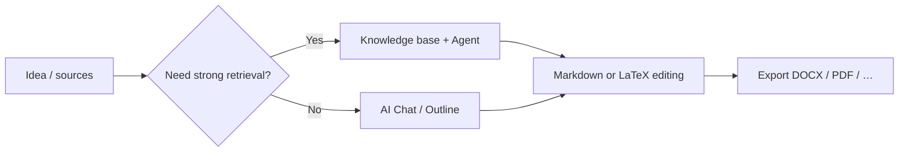

# 🚀 MetaDoc Best Practices Guide

MetaDoc is not a single fixed workflow.

It is closer to a **toolkit**: you can reach the same outcome—writing, charts, translation—in more than one way.

👉 What that means:

* Many tasks **can be done through several paths**
* Paths differ in **speed, cost, and control**
* Picking the right path matters more than memorizing every menu

This guide is not a feature tour. It answers a practical question:

> 👉 **For my situation, which approach should I use first?**

---

## 🧭 How to read the markers

| Marker | Meaning |
| ------ | ------- |
| ⭐⭐⭐⭐⭐ | Default first choice for most people |
| ⭐⭐⭐⭐   | Reliable; may take an extra step |
| ⭐⭐⭐     | Better in specific situations |
| ⚠️       | Watch quality, compliance, or risk |
| 💰       | Higher token / API cost |

---

Main window tabs (sample):

<MainTabs mode="demo" />

---

# 📝 1. Writing: from idea to finished draft

Most articles in MetaDoc follow one of three paths. You only need the one that fits your goal.

---

## ⭐⭐⭐⭐⭐ Path 1 (recommended default)

### Draft in AI chat → edit Markdown → export

**Flow**:
[[ai.chat|AI Chat]] → Markdown editing → [[core.export|Export]]

**Choose this if you:**

* Want to start quickly
* Expect many revision cycles
* Need Word, PDF, or LaTeX deliverables

---

**Why it is the default recommendation**

* Markdown keeps **layout noise low** so you focus on substance
* You polish structure and wording first, format later
* After export you can finish layout in Word or LaTeX

👉 Think of it as: **content first, polish second**

---

**Caveats**

* You must verify facts, quotes, and numbers from AI drafts
* Give exported files a quick layout check

---

AI Chat (sample layout):

<AIChat mode="demo" />

---

## ⭐⭐⭐⭐ Path 2

### Knowledge-backed writing (especially domain-heavy work)

**Flow**:
[[knowledge-base.usage|Knowledge Base]] → [[agent.introduction|Agent]] → consolidate in the editor

---

**Choose this if you:**

* Need traceability (papers, reviews, reports)
* Already have PDFs, docs, or notes to ground on

---

**Strengths**

* Generation can lean on uploaded sources
* Easier to keep claims tied to material you control

---

**Watch-outs**

* ⚠️ Output quality follows your files and chunking
* 💰 Multi-turn + retrieval uses more tokens

---

👉 Short version:

> When you must write **with sources**, start here.

---

Knowledge Base (sample layout):

<KnowledgeBase mode="demo" />

---

## ⭐⭐⭐ Path 3

### Agent builds a LaTeX project end to end

**Flow**:
Agent → LaTeX tree → compile PDF

---

**Choose this if you:**

* Need a conventional paper-shaped project
* Are committed to LaTeX
* Are on a tight schedule

---

### ⚠️ Before you rely on it

* 💰 Usually costs more tokens than short chats or small context-menu actions
* You may still tune packages, paths, or encoding
* Not ideal for highly sensitive or compliance-heavy material without review

---

Agent (sample layout):

<AgentView mode="demo" />

---

**Prompt template (fill in the title)**

```text
You are a LaTeX technical editor. For the topic "(paper or report title here)", generate a compilable LaTeX project in the current workspace.

Requirements:
1) Use article or the document class I specify; main file main.tex; split chapters into .tex files included with \input.
2) Clear tree: figures/, sections/, bib/; include placeholder figures and sample bibliography entries.
3) Use standard packages for math (e.g. amsmath), graphics (graphicx), and citations (biblatex or natbib as appropriate); list extra packages to install.
4) Give recommended build commands (e.g. latexmk -pdf; for Unicode CJK note XeLaTeX or LuaLaTeX).
5) Do not omit file bodies; keep paths consistent. If information is missing, state assumptions first, then generate.
```

---

# 📊 2. Charts and visualization

The useful question is not “where is the button?” but:

> 👉 **Do you want speed or fine control?**

---


| Path | What to do | Rating | Best when |
| ---- | ---------- | ------ | --------- |
| A | Use AI Chat or Agent to emit Mermaid / PlantUML / ECharts code, paste into Markdown | ⭐⭐⭐⭐ | Fast iteration next to the text |
| B | Use the chart window (see [[charts.introduction|Charts]]) | ⭐⭐⭐⭐ | You prefer a UI over raw code |
| C | Select text → context menu → insert chart | ⭐⭐⭐⭐⭐ | Tightest link to the current paragraph |

Related: [[ai.chat|AI Chat]], [[agent.introduction|Agent]].

---

**Quick guidance**

* Everyday writing → context menu (fastest)
* Complex diagrams → chart window
* Exploring options → AI-generated code

---

Chart window (sample layout):

<GraphWindow mode="demo" />

---

# 🌐 3. Translation

One line summary:

> 👉 **Shorter text → simpler tool**

---


| Path | Rating | Good for |
| ---- | ------ | -------- |
| Context-menu translate | ⭐⭐⭐⭐⭐ | Sentences / short paragraphs |
| AI Chat | ⭐⭐⭐⭐   | Several blocks |
| Agent | ⭐⭐⭐⭐   | Long documents |

---

👉 Rule of thumb:

* Short → context menu
* Long → AI Chat or Agent

---

Draggable split bar (sample):

<ResizableDivider mode="demo" />

---

# ✨ 4. Paragraph polish

Sending an entire manuscript to AI at once is often slower and pricier.

Better pattern:

---


| Path | Rating | Why |
| ---- | ------ | --- |
| Right-click optimize in the paragraph | ⭐⭐⭐⭐⭐ | Small context, lower cost |
| Outline-tree passes | ⭐⭐⭐⭐   | Structural cleanup |
| AI Chat / Agent | ⭐⭐⭐⭐   | Large-scale rewrites |

---

👉 Core idea:

> **Work in smaller chunks**

---

Outline view (sample layout):

<Outline mode="demo" />

---

# 🎯 5. Choose by scenario

If you are unsure, skim this section.

---

## 🎒 Lecture notes

**Suggested**

* ⭐⭐⭐⭐⭐ Quick Markdown in class → expand with AI after
* ⭐⭐⭐⭐ Slides/PDF in the knowledge base → review sheet prompts

👉 Capture first, organize second

---

## 🧪 Lab reports

**Suggested**

* ⭐⭐⭐⭐⭐ Markdown → export DOCX for drafts
* ⭐⭐⭐⭐ Knowledge base for Methods/Discussion scaffolding

⚠️ You own the measured data—always verify.

---

## 🛠️ Technical documentation

**Suggested**

* ⭐⭐⭐⭐⭐ Markdown + local right-click polish
* ⭐⭐⭐⭐ Agent + KB when aligning with legacy docs

👉 Clarity and consistency beat flair

---

## 💬 Q&A and blogging

**Suggested**

* ⭐⭐⭐⭐⭐ Outline first → then body
* ⭐⭐⭐⭐ Outline tree to hold structure on long posts

👉 Structure before word count

---

## 📱 Newsletters and creator workflows

**Suggested**

* ⭐⭐⭐⭐⭐ Finish in Markdown → export → polish in the publishing tool
* ⭐⭐⭐⭐ AI for headline and summary variants

⚠️ One-shot “write the whole piece” runs are costly and hard to steer for voice

---

# 🔁 Flow overview



---

# 📚 See also

* [[quick-start.guide|Quick Start Guide]]
* [[core.export|Export]]
* [[features.paragraph-optimization|Paragraph optimization]]
* [[charts.introduction|Charts introduction]]
