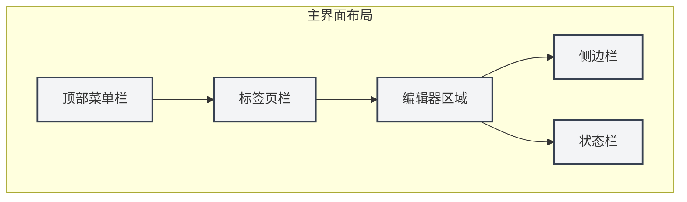
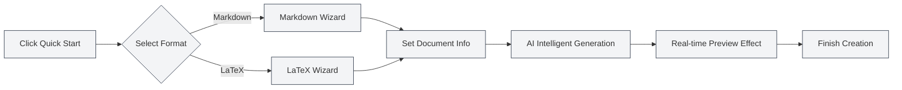

# Quick Start Guide

## Overview

Welcome to MetaDoc! This is an intelligent document processing tool designed for knowledge workers. Whether you're writing a technical blog, organizing study notes, or preparing academic papers, MetaDoc provides you with a professional and elegant editing experience.

MetaDoc deeply integrates AI capabilities and supports two mainstream document formats: Markdown and LaTeX. It's not just a text editor; it's your intelligent writing assistant—built-in features like AI chat, auto-completion, and intelligent proofreading make document creation more efficient and enjoyable.

## First-Time Use

### Launching the Application

After launching MetaDoc, the first thing you see is the Home page. This is a carefully designed starting point that allows you to quickly begin your work:

- **Quick Start**: An intelligent wizard guides you through selecting a document format and creating a new document.
- **New Document**: Directly create a blank document in your chosen format.
- **Open File**: Browse and open existing documents.
- **User Manual**: Access the detailed user guide at any time.

### Interface Introduction

MetaDoc's interface design follows the layout principles of modern editors, making it clear and intuitive:

1.  **Top Menu Bar**

    Located at the very top of the window, it gathers core functions like File, Edit, and View. Whether you need to create a new document, find and replace text, or switch view modes, you can find the entry point here. The menu bar supports customization, allowing you to adjust the display and order of menu items according to your habits.

2.  **Tab Bar**

    Located below the menu bar, it displays all currently open documents. Each document corresponds to a tab; click to switch. Tabs support drag-and-drop sorting, and you can pin frequently used documents to prevent accidental closure. When there are many tabs, you can also organize documents across windows.

3.  **Editor Area**

    This is your main workspace. MetaDoc provides specialized editing environments for different types of documents:

    - **Markdown Editor**: A WYSIWYG (What You See Is What You Get) editing experience, supporting real-time preview, mathematical formulas, charts, and other rich features.
    - **LaTeX Editor**: A professional academic writing environment, supporting features like syntax highlighting, intelligent suggestions, and compilation preview.

4.  **Sidebar**

    Located on the left side of the editor, it is your document navigation center. Here you can:

    - Switch between different views like Editor, Outline, and Agent.
    - View the document structure outline.
    - Manage knowledge bases and reference materials.

5.  **Status Bar**

    Located at the bottom of the window, it displays real-time status information for the current document, including word count, save status, language settings, etc., giving you a clear overview of your work progress.

Below are the corresponding real interface controls for your reference:

**Top Menu Bar**

Located at the top of the window, it contains main menus like File, Edit, and View, providing application-level operation entry points. You can use the menu bar to perform actions like creating, opening, saving documents, and accessing various editing and view functions.

<MenuItemsDemo mode="demo" :items='[{"id": "file", "items": ["new", "open", "save"]}, {"id": "edit", "items": ["undo", "redo", "find"]}, {"id": "view", "items": ["editor", "outline"]}]' />

**Tab Bar**

Located below the menu bar, it displays tabs for all currently open documents. You can switch documents by clicking tabs, adjust their order by dragging, or right-click a tab for more actions (like close, pin, move to new window, etc.).

<MainTabs mode="demo" />

**Sidebar**

Located on the left side of the editor, it provides access to various auxiliary function panels. You can use the sidebar to quickly switch between views like Editor, Outline, and Agent, improving document editing efficiency.

<ViewMenuItemsDemo mode="demo" :items='["editor", "outline", "home"]' />

## Quickly Creating Documents

### Method 1: Using the Quick Start Wizard

MetaDoc's Quick Start Wizard is a thoughtful design. It doesn't just create a blank document; it acts like an experienced assistant, guiding you through every step of document creation:

1.  Click the "Quick Start" button on the Home page.
2.  Select the document format based on your needs:
    - **Markdown**: This is the lightest choice if you're writing blogs, technical documentation, meeting notes, or any daily text content. Markdown syntax is simple and intuitive while meeting rich formatting needs.
    - **LaTeX**: If you're preparing academic papers, theses, or technical documents requiring precise typesetting, LaTeX is the recognized standard in academia. MetaDoc makes complex LaTeX compilation simple and understandable.
3.  Based on your selection, the wizard provides corresponding templates and AI-assisted features.

#### Format Selection Interface

The first step of the wizard is selecting the document format. MetaDoc intelligently recommends suitable options based on your usage scenario:

#### Markdown Quick Start

After selecting Markdown, the wizard provides:

- **Intelligent Title Suggestions**: The AI will suggest suitable document titles based on your initial input.
- **Structured Outline**: Automatically generates a document framework to help you organize your thoughts.
- **Real-time Preview**: Write and see the final presentation effect instantly.

#### LaTeX Quick Start

After selecting LaTeX, the wizard provides:

- **Professional Templates**: Templates optimized for different academic scenarios (papers, reports, presentations, etc.).
- **Structure Guidance**: Automatically generates standard LaTeX document structures.
- **Intelligent Completion**: AI-assisted LaTeX code generation to lower the learning barrier.

#### The Core Value of the Wizard

The essence of the Quick Start Wizard is **lowering the barrier and improving efficiency**:

- **Beginner-Friendly**: No need to memorize complex syntax; the wizard guides you step-by-step.
- **Efficient for Experts**: AI-assisted features can quickly generate document frameworks, saving repetitive work.
- **Context-Aware**: If you already have some ideas, you can tell the AI directly, and it will help you expand them into a complete document structure.

#### Wizard Workflow

### Method 2: Directly Creating a New Document

If you are already familiar with MetaDoc, you can directly create a blank document and start working:

1.  Click the "New Document" button on the Home page, or press the shortcut `Ctrl+N`.
2.  Select the document format (Markdown / LaTeX / Plain Text).
3.  The document opens immediately in the editor, and you can start creating.

This method is suitable for experienced users or scenarios with a clear writing plan.

### Method 3: Opening an Existing File

Continuing your previous work is also simple:

1.  Click the "Open File" button on the Home page, or press `Ctrl+O`.
2.  Find your document in the file browser.
3.  The selected file opens in a new tab, allowing you to seamlessly continue editing.

MetaDoc supports automatically remembering your recently opened documents, making it easy to quickly return to your work.

## Basic Operations

### Editing Documents

MetaDoc's editing experience is carefully designed to keep your focus on the content itself:

- **Smooth Input**: Whether quickly jotting down ideas or meticulously polishing text, the editor keeps up with your train of thought.
- **Intelligent Formatting**: The Markdown editor supports WYSIWYG; the LaTeX editor provides syntax highlighting and intelligent suggestions.
- **Rich Elements**: Easily insert elements like images, tables, code blocks, and mathematical formulas to make documents more vivid and professional.
- **Real-time Preview**: Markdown documents can be previewed while writing, allowing you to see the final effect instantly.

### Saving Documents

MetaDoc provides multiple saving methods to ensure your work is not lost:

- **Quick Save**: `Ctrl+S` quickly saves the current document. This is the most commonly used operation.
- **Save As New Document**: `Ctrl+Shift+S` is used when you need to save the current document as a copy.
- **Batch Save**: `Ctrl+K S` saves all open documents at once, suitable for wrapping up work.

Additionally, you can enable the auto-save function in the settings, allowing MetaDoc to automatically save your documents at regular intervals.

### Switching Views

MetaDoc provides multiple view modes to meet the needs of different work stages:

- **Editor View**: The main workspace for document editing, providing complete editing functions.
- **Outline View**: Displays document heading hierarchy in a tree structure, suitable for quick navigation and structural adjustments.
- **PDF Preview**: Preview of compiled LaTeX documents, convenient for checking the final typesetting effect.

You can quickly switch between different views via the sidebar or keyboard shortcuts.

## Getting Help

MetaDoc has a detailed built-in user manual ready to answer your questions:

1.  Press the `F1` key or click the "User Manual" button on the Home page.
2.  The manual is categorized by topic, covering everything from basic operations to advanced features.
3.  Use the search function to quickly locate the content you need.

The manual covers:
- Detailed guides for using the editor.
- Tips for file and project management.
- In-depth tutorials on AI features.
- How the Agent framework works.
- Personalization setting options.

## Exploring More

Completing the Quick Start is just the first step. MetaDoc has many powerful features waiting for you to explore:

1.  **Master Editing Skills**: Learn about [[core.editor-basics|Editor Basics]] to improve writing efficiency.
2.  **Master File Management**: Learn best practices for [[core.file-operations|File Operations]].
3.  **Dive into Editor Features**:
    - Markdown users: Check the [[markdown.editor|Markdown Editor Usage Guide]].
    - LaTeX users: Check the [[latex.editor|LaTeX Editor Usage Guide]].
4.  **Experience AI Capabilities**: Try the [[ai.chat|AI Chat]] and [[ai.completion|AI Auto-completion]] features.

MetaDoc's design philosophy is **to make technology invisible and creation free**. We hope this tool becomes a powerful assistant for your knowledge work.

## Related Documentation

- [[core.file-operations|File Operations]]
- [[core.editor-basics|Editor Basics]]
- [[markdown.editor|Markdown Editor Usage Guide]]
- [[latex.editor|LaTeX Editor Usage Guide]]
- [[settings.basic|Basic Settings]]
