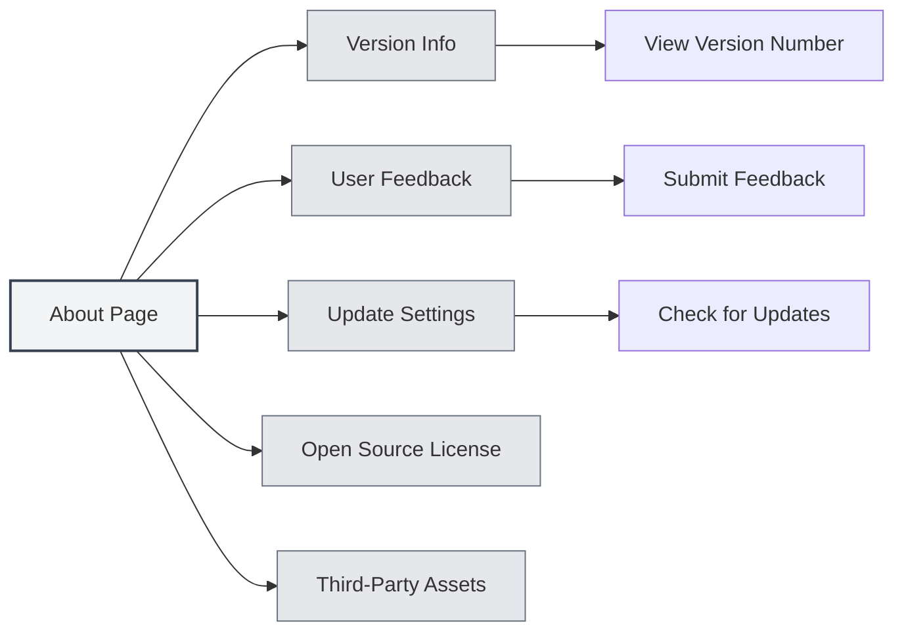
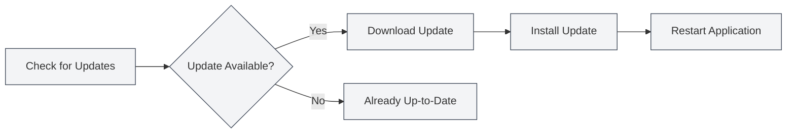

# About Information

## Overview

The About page provides MetaDoc's version information, update settings, open-source licenses, and third-party asset information. You can use this page to learn about the application, check for updates, submit feedback, and more.

## Version Information

### Viewing Version

On the About page, you can view the following information:

- **Application Name**: MetaDoc
- **Version Number**: The version number of the currently installed version
- **Release Date**: The release date of the current version
- **Build Environment**: Development build or release build

You can access the About page via the top menu bar:

<MenuItemsDemo mode="demo" :items='[{"id": "settings", "items": ["about"]}]' />



### Version Format

Version numbers use semantic versioning format:

```
Major.Minor.Patch
```

For example: `0.12.1`

### Build Environment

- **Development Build**: Version built in a development environment, may contain debug information
- **Release Build**: Officially released version, tested and optimized

<SettingAboutSection mode="demo" />

## User Feedback

### Submitting Feedback

You can submit feedback in the following ways:

1. On the About page, click the "User Feedback" button
2. Fill in the feedback content on the feedback page
3. Submit the feedback

### Feedback Content

Feedback can include the following information:

- **Problem Description**: Describe the encountered issue in detail
- **Reproduction Steps**: Explain how to reproduce the problem
- **Expected Behavior**: Describe the expected behavior
- **Actual Behavior**: Describe what actually happened
- **Environment Information**: Operating system, version number, etc.

### Feedback Suggestions

- **Detailed Description**: Describe the problem as thoroughly as possible
- **Provide Screenshots**: Include screenshots or screen recordings if necessary
- **Version Information**: Include the version number and build environment information
- **Reproduction Steps**: Provide clear steps to reproduce the issue

<UserFeedbackView mode="demo" />

## Official QQ Group

### Joining the QQ Group

MetaDoc Official QQ Group: **1079841705**

Joining the QQ group allows you to:

- Get the latest news and update notifications
- Exchange usage experiences with other users
- Receive technical support
- Participate in feature discussions

### Group Resources

The QQ group provides the following resources:

- **Usage Tutorials**: Tutorials available in the group files
- **Problem Solving**: Members help each other within the group
- **Update Notifications**: Receive update information as soon as possible
- **Feature Suggestions**: Participate in feature discussions and suggestions

## Update Settings

### Automatic Update Check

When "Automatically check for updates" is enabled, MetaDoc will automatically check for new versions on startup:

- **Enabled**: Automatically check for updates on startup
- **Disabled**: Do not automatically check for updates

### Update Channel

You can choose an update channel:

- **Stable**: Use officially released versions (recommended)
- **Development**: Use development versions (may be unstable)

<MainTabs mode="demo" />

### Manual Update Check

You can manually check for updates at any time:

1. In the "Update Settings" tab on the About page
2. Click the "Check for Updates" button
3. Wait for the check to complete

### Update Status

After checking for updates, the following statuses may be displayed:

- **Update Available**: Shows new version information; updates can be downloaded
- **Already Up-to-Date**: The current version is the latest
- **Check Failed**: Displays an error message

### Downloading and Installing Updates

If an update is available:

1. **Download Update**: Click the "Download Update" button
2. **Wait for Download**: Monitor the download progress
3. **Install Update**: After the download completes, click the "Install and Restart" button
4. **Automatic Restart**: The application will automatically restart and install the update




## Open Source License

### Viewing the License

On the "Open Source License" tab of the About page, you can view:

- **Open Source License**: The open-source license used by MetaDoc
- **License Content**: The complete license text

### License Information

MetaDoc follows an open-source license. You can:

- View the license content
- Understand the terms of use
- Understand your rights and obligations

## Third-Party Assets

### Viewing Third-Party Assets

On the "Third-Party Assets" tab of the About page, you can view:

- **Third-Party Libraries**: Third-party open-source libraries used by MetaDoc
- **Asset Information**: License and source information for third-party assets

### Asset List

The third-party asset list includes:

- **Library Name**: The name of the third-party library
- **Version**: The version number used
- **License**: The type of license for the library
- **Source**: The source link for the library

## Best Practices

1. **Update Regularly**: It is recommended to enable automatic update checks to get new versions promptly
2. **Report Issues**: Submit feedback promptly when encountering problems
3. **Join the QQ Group**: Join the official QQ group for support and information
4. **Review the License**: Understand the terms of use of the open-source license
5. **Follow Updates**: Pay attention to update notifications to learn about new features and fixes

## Notes

1. **Backup Before Updating**: It is recommended to back up important data before updating
2. **Network Connection**: Checking for updates requires a network connection
3. **Version Compatibility**: Some settings may need to be reconfigured after an update
4. **Feedback Privacy**: Protect private information when submitting feedback
5. **License Compliance**: Please comply with the open-source license when using MetaDoc

<ResizableDivider mode="demo" />

## Related Documentation

- [[settings.basic|Basic Settings]]
- [[settings.logging|Logging Configuration]]
- [[quick-start.guide|Quick Start Guide]]

<SettingAboutSection mode="demo" />

<UserFeedbackView mode="demo" />

<MenuItemsDemo mode="demo" :items='[{"id": "settings", "items": ["about"]}]' />

<MainTabs mode="demo" />
