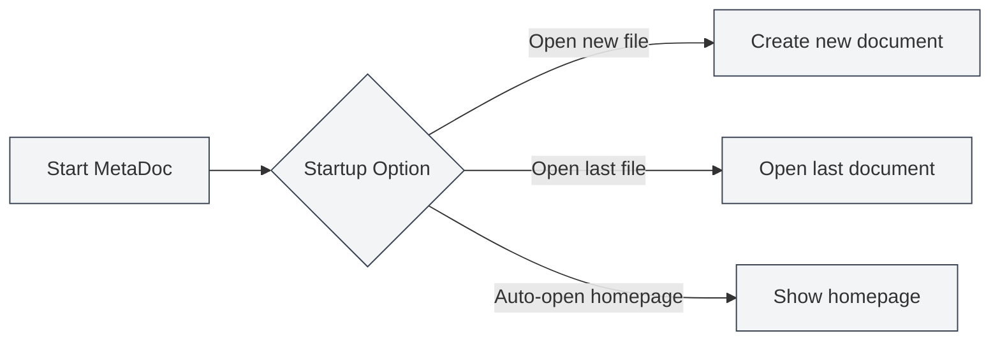
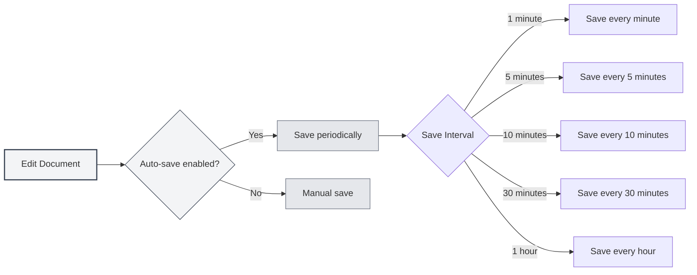
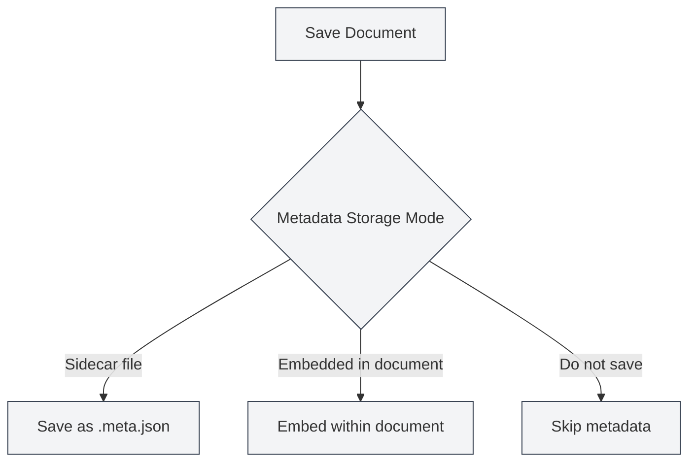

# Basic Settings

## Overview

Basic Settings are the core configuration options of MetaDoc, covering important functions such as application startup behavior, auto-save, document statistics, and metadata management. Properly configuring these options can enhance your user experience and work efficiency.

## Startup Options

### Setting Startup Behavior

Startup options determine the default behavior when MetaDoc launches:

- **Open a new file**: Creates a new blank document each time it starts.
- **Open the last edited file**: Automatically opens the document that was being edited when the application was last closed.

You can choose the appropriate startup option based on your usage habits. If you often need to continue from where you left off, it is recommended to select "Open the last edited file."

You can access the settings via the top menu bar:

<MenuItemsDemo mode="demo" :items='[{"id": "settings"}]' />

### Basic Settings Interface

The following image shows the complete interface of the Basic Settings page:

<SettingBasicSection mode="demo" />

The Basic Settings interface includes the following main configuration areas:

- **Startup Options**: Set the default behavior when the application starts (open new file/last edited file).
- **Auto-save**: Configure the auto-save interval to prevent data loss.
- **Metadata Storage**: Choose how metadata is stored (within the document/in a separate file).
- **Reference Directory**: Manage the storage location for external files referenced by documents.
- **Other Options**: Advanced settings for code block handling, image embedding, mathematical formulas, etc.

### Automatically Open Homepage on Startup

When this option is enabled, MetaDoc will automatically open the homepage tab upon startup. The homepage provides features like quick start and recent document lists, making it convenient for you to quickly access commonly used functions.

## Auto-save

<SettingBasicSection mode="demo" />

### Configuring Auto-save

The auto-save feature can prevent content loss due to unexpected situations (such as program crashes, power outages, etc.). MetaDoc supports the following auto-save intervals:

- **Off**: No auto-save; manual saving is required.
- **1 minute**: Auto-saves every minute.
- **5 minutes**: Auto-saves every 5 minutes.
- **10 minutes**: Auto-saves every 10 minutes.
- **30 minutes**: Auto-saves every 30 minutes.
- **1 hour**: Auto-saves every hour.

### Usage Recommendations

- **Frequent editing**: It is recommended to set a shorter auto-save interval (1-5 minutes) to ensure content is saved promptly.
- **Long writing sessions**: You can set a longer interval (10-30 minutes) to reduce disk write frequency.
- **Important documents**: It is recommended to enable auto-save and complement it with manual saves (`Ctrl+S`) to ensure data security.

Auto-save runs silently in the background and will not interrupt your editing work.

## Document Statistics Settings

<SettingBasicSection mode="demo" />

### Excluding Code Blocks from Statistics

When this option is enabled, content within code blocks will be excluded when counting document word count, word frequency, and other statistics. This is particularly useful for technical documents, as content in code blocks typically should not be counted in the document's text statistics.

**Use Cases**:

- Technical documents containing numerous code examples.
- Need to accurately count the actual text content of a document.
- Avoid code affecting word frequency analysis results.

## Image Processing Settings

<SettingBasicSection mode="demo" />

### Parse Embedded Images (OCR Function)

When this option is enabled, MetaDoc will perform OCR (Optical Character Recognition) processing on images embedded in the document to extract text content from the images. This is particularly useful for handling documents containing images (such as PDFs, Word documents).

**Function Description**:

- Images within uploaded DOCX, PPTX, and PDF files will undergo OCR processing.
- Directly uploaded image files will still undergo OCR processing (unaffected by this option).
- OCR results can be used for knowledge base retrieval and AI-assisted features.

**Notes**:

- OCR processing requires computational resources and may affect document loading speed.
- If extracting text from images is not needed, you can disable this function to improve performance.

### Inline Numbers in Mathematical Formulas

When this option is enabled, numbers within mathematical formulas will be displayed in inline mode instead of block-level mode. This allows formulas to integrate better into the text flow, suitable for inserting simple mathematical expressions within paragraphs.

## Metadata Storage Mode

<SettingBasicSection mode="demo" />

### Setting the Storage Method

Document metadata (title, author, description, keywords, etc.) can be saved in three ways:

- **Sidecar file**: Saves metadata in a separate file (`.meta.json`) in the same directory as the document.
  - Advantages: Does not affect the original document content, facilitates version control.
  - Disadvantages: Requires managing two files simultaneously.
- **Embedded in document**: Embeds metadata within the document file itself.
  - Advantages: Single-file management, easy to share.
  - Disadvantages: Some formats may not support embedding.
- **Do not save**: Does not save metadata.
  - Suitable for: Temporary documents or documents that do not require metadata.

### Selection Recommendations

- **Technical documents**: Recommended to use the "Sidecar file" mode, facilitating management with version control systems like Git.
- **Personal notes**: Can use the "Embedded in document" mode to maintain a clean single file.
- **Temporary documents**: Can choose the "Do not save" mode.

## Reference File Directory Management

<SettingBasicSection mode="demo" />

### Viewing Directory Information

The reference file directory is used to store external files referenced by documents (such as images, attachments, etc.). On the Basic Settings page, you can:

- **View directory size**: Displays the disk space occupied by the reference file directory.
- **Refresh**: Updates the directory size information.
- **Open directory**: Opens the reference file directory in the file explorer.
- **Clear directory**: Deletes all files in the directory (this operation is irreversible).

### Use Cases

The reference file directory is typically used for:

- Storing images inserted into documents.
- Saving document attachments.
- Managing resource files related to documents.

**Notes**:

- The clear directory operation is irreversible; please proceed with caution.
- It is recommended to back up important files before clearing.
- The directory size will increase as files referenced in documents are added.

## Important Notes

1. **Startup Options**: Changes to startup options will take effect the next time the application is launched.
2. **Auto-save**: Auto-save does not overwrite your manual save operations; both can be used together.
3. **Metadata Mode**: After changing the metadata storage mode, newly saved documents will use the new mode; existing documents are not affected.
4. **Reference Directory**: Before clearing the reference directory, ensure no documents are currently using those files.

## Related Documents

- [[core.file-operations|File Operations]]
- [[core.document-metadata|Document Metadata]]
- [[settings.theme|Theme Settings]]
- [[settings.image|Image Settings]]

<MenuItemsDemo mode="demo" :items='[{"id": "settings", "items": ["basic"]}]' />