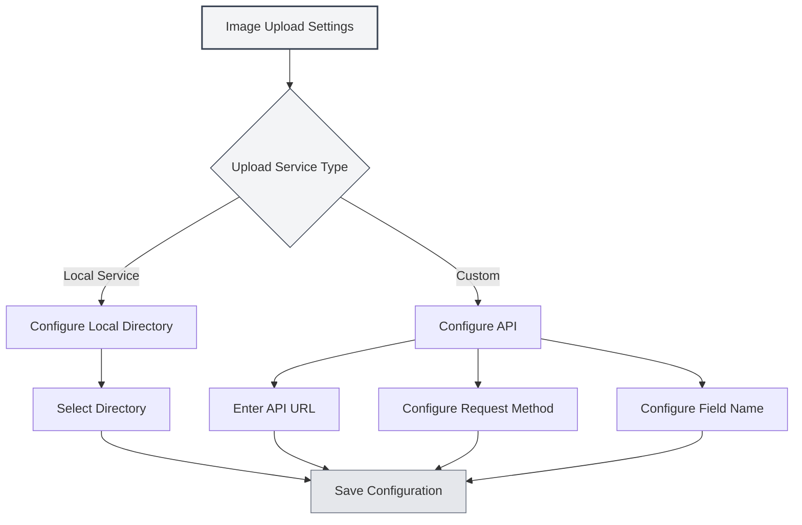

# Upload Service Settings

## Overview

Upload service settings allow you to configure the target service for image uploads. MetaDoc supports two upload methods: local service and custom API. You can choose the appropriate service based on your needs.

## Upload Service Types

### Service Selection

On the image settings page, when the "Insert Image Action" is set to "Upload", you can select the upload service:

- **Local Service**: Saves images to a local directory.
- **Custom**: Uses a custom API to upload images.

You can access the image upload settings via the top menu bar:

<MenuItemsDemo mode="demo" :items='[{"id": "settings"}]' />



### Local Service

The local service saves images to the local file system:

- **Advantages**: Full local control, data security.
- **Disadvantages**: Requires configuration of a local directory.
- **Use Cases**: Local usage, high data privacy requirements.

<SettingImageSection mode="demo" />

### Custom Service

The custom service uses an external API to upload images:

- **Advantages**: Can upload to cloud storage, image hosting services, etc.
- **Disadvantages**: Requires configuration of an API interface.
- **Use Cases**: Need for cloud storage, image CDN, etc.

<MainTabs mode="demo" />

## Local Image Directory Configuration

### Setting the Directory

When using the local service, you need to configure the image save directory:

1. On the image settings page, select "Local Service".
2. Click the "Browse" button to select a directory.
3. Or directly enter the directory path in the input box.
4. Click the "Open" button to open the directory in the file manager.

### Directory Selection

When selecting an image directory:

- **Browse Button**: Opens the directory selection dialog.
- **Path Input**: Directly enter the directory path.
- **Open Button**: Opens the configured directory in the file manager.

### Default Directory

If no local image directory is set, the system uses the default directory:

- **Windows**: `%APPDATA%/MetaDoc/images`
- **macOS**: `~/Library/Application Support/MetaDoc/images`
- **Linux**: `~/.config/MetaDoc/images`


### Directory Management

- **View Directory**: Click the "Open" button to view directory contents.
- **Change Directory**: Click the "Browse" button to select a new directory.
- **Directory Requirements**: Ensure the directory exists and has write permissions.

## Custom Upload API Configuration

### API URL Configuration

When using the custom service, you need to configure the API address:

1. On the image settings page, select the "Custom" service.
2. Enter the API address in the "Custom Upload API URL" input box.
3. Format example: `https://api.example.com/upload`

### API Method Configuration

Configure the API request method:

- **POST**: Use the POST method for upload (recommended).
- **PUT**: Use the PUT method for upload.

Most APIs use the POST method; some specific APIs may use the PUT method.

### Field Name Configuration

Configure the field name for the uploaded file:

- **Default Value**: `file`
- **Custom**: Set the field name according to API requirements.

Different APIs may use different field names, such as `file`, `image`, `upload`, etc.

### API Configuration Examples

**Example 1: Standard Image Hosting API**

```
API URL: https://api.example.com/upload
Method: POST
Field Name: file
```

**Example 2: Custom Field Name API**

```
API URL: https://api.example.com/image
Method: POST
Field Name: image
```

**Example 3: PUT Method API**

```
API URL: https://api.example.com/upload
Method: PUT
Field Name: file
```

<ViewMenuItemsDemo mode="demo" :items='["home", "editor"]'
/>

## API Response Format

### Response Requirements

The custom API must return a JSON response in the following format:

```json
{
  "success": true,
  "imagePath": "https://example.com/image.png"
}
```

### Response Fields

- **success**: Boolean, indicates whether the upload was successful.
- **imagePath**: String, returns the URL or path of the image.

### Error Handling

If the upload fails, the API should return:

```json
{
  "success": false,
  "message": "Error message"
}
```

<DialogDemo mode="demo" dialogType="api-config" />

## Configuration Validation

### Testing Configuration

After configuring a custom API, it is recommended to test the configuration:

1. Insert an image into a document.
2. Check the upload result.
3. If it fails, check if the configuration is correct.

### Common Issues

**Connection Failure**:

- Check if the API URL is correct.
- Check the network connection.
- Check if the API service is running normally.

**Upload Failure**:

- Check if the API method is correct.
- Check if the field name is correct.
- Check if the API response format meets the requirements.

**Permission Issues**:

- Check if the API requires authentication.
- Check if the API Key or Token is correct.

<SettingBasicSection mode="demo" />

## Local Service Configuration

### Directory Permissions

When using the local service, ensure the directory has write permissions:

- **Windows**: Check folder permission settings.
- **macOS/Linux**: Check directory permissions (chmod).

### Directory Structure

The local service saves images in the specified directory:

- **File Naming**: Uses timestamp + original filename.
- **File Format**: Maintains the original format.
- **Directory Structure**: All images are saved in the same directory.

<OcrWindow mode="demo" />

### Image Access

Images from the local service can be accessed in the following ways:

- **HTTP Service**: Accessed via the runtime server's `/images/` path (default address configured by the app, e.g., `http://127.0.0.1:52521/images/`).
- **File Path**: Directly using the file system path.

## Best Practices

1. **Local Use**: For local use, the local service is recommended.
2. **Cloud Storage**: Use a custom API when cloud storage is needed.
3. **Directory Management**: Regularly clean the image directory to avoid excessive space usage.
4. **API Testing**: Test the custom API after configuration.
5. **Backup Strategy**: Important images should be backed up.

<MenuItemsDemo mode="demo" :items='[{"id": "file", "items": ["new", "open", "save"]}]' />

## Notes

1. **Configuration Takes Effect**: Configuration changes only apply to newly inserted images.
2. **API Compatibility**: Ensure the custom API meets the response format requirements.
3. **Directory Permissions**: Ensure the local directory has write permissions.
4. **Network Connection**: Custom API requires a network connection.
5. **Storage Space**: Local service consumes local storage space.

## Related Documents

- [[settings.image|Image Upload Configuration]]
- [[settings.basic|Basic Settings]]
- [[core.file-operations|File Operations]]

<ResizableDivider mode="demo" />
