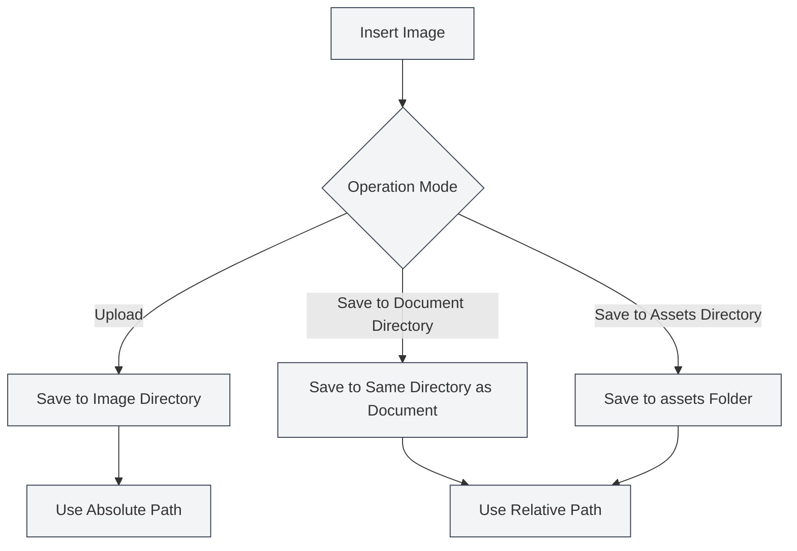

# Image Upload Configuration

## Overview

Image upload configuration determines how images are handled when inserted into documents. MetaDoc supports multiple image processing modes, allowing you to choose the appropriate configuration based on your needs.

## Insert Image Operation

### Operation Modes

When inserting an image, you can choose from the following operation modes:

- **Upload**: Upload the image to a specified image directory.
- **Save to Document Directory**: Save the image to the directory where the document is located.
- **Save to Assets Directory**: Save the image to the `assets` folder under the document directory.

You can access image settings via the top menu bar:

<MenuItemsDemo mode="demo" :items='[{"id": "settings"}]' />

### Image Settings Interface

The following image shows the complete interface of the image settings page:

<SettingImageSection mode="demo" />

The image settings interface includes the following main configuration areas:

- **Image Upload Service**: Choose between local storage or a third-party image hosting service.
- **Local Storage Path**: Set the local directory for saving images.
- **Network Image Handling**: Configure options such as whether to preserve the original URL, whether to automatically save images locally, etc.

### Upload Mode

Upload mode saves images to the configured local image directory:

- **Advantages**: Centralized management of all images, facilitating backup and migration.
- **Disadvantages**: Images are separated from documents; moving a document requires moving the images simultaneously.
- **Applicable Scenarios**: Multiple documents sharing images, centralized management of image resources.

<DialogDemo mode="demo" dialogType="image-upload" />

### Save to Document Directory

Saves the image to the directory where the document is located:

- **Advantages**: Images and documents are in the same directory, making management easier.
- **Disadvantages**: Each document directory contains images, potentially leading to duplication.
- **Applicable Scenarios**: Single-document projects, documents that need to be packaged independently.

<DialogDemo mode="demo" dialogType="file-save" />

### Save to Assets Directory

Saves the image to the `assets` folder under the document directory:

- **Advantages**: Images are uniformly stored in the `assets` folder, resulting in a clear structure.
- **Disadvantages**: Requires creating an `assets` folder.
- **Applicable Scenarios**: Need for a clear file structure, documents intended for export and sharing.

<DialogDemo mode="demo" dialogType="folder-select" />

## Preserve Network Image URL

### Function Description

When "Preserve Network Image URL" is enabled, inserting a network image will not download the image but will directly use the original URL:

- **Enabled**: Preserves the original URL of the network image; it is not downloaded locally.
- **Disabled**: Downloads the network image locally and uses the local path.

### Usage Scenarios

- **Enabled Scenarios**:

  - Image resources are large, and local backup is not needed.
  - Images are updated regularly, requiring real-time display of the latest version.
  - To save local storage space.

- **Disabled Scenarios**:
  - Need for offline access to images.
  - Need to back up image resources.
  - Network images may become unavailable.

### Notes

- When preserving network URLs, an internet connection is required to display the images.
- If a network image becomes unavailable, the image in the document will not display.
- It is recommended to disable this option for important images to ensure their availability.

## Automatically Escape Image URLs

### Function Description

When "Automatically Escape Image URLs" is enabled, special characters in the URL are automatically escaped when inserting an image:

- **Enabled**: Automatically escapes special characters in the URL (such as spaces, Chinese characters, etc.).
- **Disabled**: Keeps the URL as-is without escaping.

### Escape Rules

The system automatically escapes the following characters:

- **Spaces**: Converted to `%20`.
- **Chinese Characters**: URL-encoded.
- **Special Characters**: Escaped to URL-safe format.

### Usage Recommendations

- **Enable**: Recommended to enable, ensuring URLs can be correctly parsed in various environments.
- **Disable**: Only disable when you are certain the URL format is correct and escaping is unnecessary.

## Path Format

### Absolute Path

When using upload mode, images use absolute paths:

- **Format**: `/path/to/image.png`
- **Advantages**: Path is explicit and not affected by document location.
- **Disadvantages**: Path becomes invalid if the document or image is moved.

### Relative Path

When using "Save to Document Directory" or "Save to Assets Directory," images use relative paths:

- **Format**: `./image.png` or `./assets/image.png`
- **Advantages**: Documents and images can be moved together.
- **Disadvantages**: Paths need adjustment if the document location changes.

## Configuration Effectiveness

### Effective Timing

Changes to image upload configuration take effect under the following circumstances:

- **Newly Inserted Images**: Use the new configuration immediately.
- **Open Documents**: Need to reopen the document for changes to take effect.
- **Saved Documents**: Already saved documents are not affected.

### Reopening Files

Some configuration changes require reopening the file to take effect:

1. Modify image upload configuration.
2. Close the current document.
3. Reopen the document.
4. New configuration becomes effective.

## Best Practices

1. **Unified Management**: Use upload mode for centralized image management.
2. **Document Independence**: Use "Save to Document Directory" when documents need to be independent.
3. **Clear Structure**: Use the assets directory mode to maintain a clear file structure.
4. **Network Images**: For important images, it is recommended to disable the "Preserve URL" option.
5. **Path Escaping**: It is recommended to enable automatic escaping to ensure compatibility.

## Notes

1. **Configuration Effectiveness**: Some configurations require reopening the file to take effect.
2. **Path Format**: Pay attention to the difference between absolute and relative paths.
3. **Network Images**: An internet connection is required when preserving network URLs.
4. **Image Backup**: For important images, it is recommended to disable URL preservation to ensure backup.
5. **Storage Space**: Upload mode consumes local storage space.

## Related Documents

- [[settings.image-upload|Upload Service Settings]]
- [[settings.basic|Basic Settings]]
- [[core.file-operations|File Operations]]

<SettingImageSection mode="demo" />

<MenuItemsDemo mode="demo" :items='[{"id": "settings", "items": ["image"]}]' />

<DialogDemo mode="demo" dialogType="image-upload" />

<DialogDemo mode="demo" dialogType="file-save" />