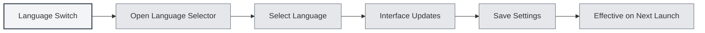

# Multilingual Support

## Overview

MetaDoc supports a multilingual interface, allowing you to choose a language that suits your usage habits. After switching languages, the interface will immediately update to the selected language.

## Supported Languages

MetaDoc currently supports the following languages:

- **Simplified Chinese** (zh_CN): Default language
- **English** (en_US): English
- **Japanese** (ja_JP): Japanese
- **Korean** (ko_KR): Korean
- **French** (fr_FR): French
- **German** (de_DE): German

## Language Switching

### Switching Languages

1. Click the language selector at the bottom of the left-hand menu
2. Select the language you wish to use
3. The interface will immediately update to the selected language

You can access language settings via the top menu bar:

<MenuItemsDemo mode="demo" :items='[{"id": "settings"}]' />

<SettingBasicSection mode="demo" />

<SettingLlmSection mode="demo" />



### Language Saving

The selected language is automatically saved:

- **Auto-save**: Saves immediately after selecting a language
- **Next Launch**: The application will use the last selected language upon next startup
- **Multi-window Sync**: All windows automatically synchronize language settings

<SettingThemeSection mode="demo" />

## Interface Localization

### Localization Scope

Language switching affects the following interface elements:

- **Menu Items**: All menus and menu items
- **Button Text**: Text on all buttons
- **Dialogs**: All dialog boxes and prompt messages
- **Settings Pages**: Labels and descriptions on all settings pages
- **Error Messages**: Error and warning messages

### Content Language

Language settings only affect the interface language, not:

- **Document Content**: Document content remains unchanged
- **File Paths**: File paths remain unchanged
- **User Input**: Content entered by the user is not affected

<ViewMenuItemsDemo mode="demo" :items='["settings"]' />

## Language Selection Suggestions

### Based on Usage Habits

- **Chinese Users**: Use Simplified Chinese for a more familiar interface
- **English Users**: Use English to match usage habits
- **Other Languages**: Choose based on personal preference

### Based on Document Language

- **Chinese Documents**: You can use the Chinese interface
- **English Documents**: You can use the English interface
- **Multilingual Documents**: Choose the most frequently used language

## Language Switching Effects

### Immediate Effect

Language switching takes effect immediately:

- **Interface Update**: All interface elements update immediately
- **No Restart Needed**: No need to restart the application
- **State Preservation**: Current editing state is not lost

<MainTabs mode="demo" />

### Multi-window Synchronization

All windows automatically synchronize the language:

- **Main Window**: Main window language switch
- **Auxiliary Windows**: All auxiliary windows update synchronously
- **New Windows**: Newly opened windows use the current language

## Language Files

### Language File Location

Language files are stored in the application directory:

- **File Format**: JSON format
- **File Location**: `src/renderer/src/locales/`
- **File Naming**: Named using language codes (e.g., `zh_cn.json`)

### Language File Structure

Language files use a key-value pair structure:

```json
{
  "common": {
    "confirm": "Confirm",
    "cancel": "Cancel"
  },
  "setting": {
    "basic": "Basic Settings"
  }
}
```

## Notes

1. **Language Codes**: Language codes use underscore format (e.g., `zh_CN`)
2. **Translation Completeness**: Some new features may temporarily have only partial language translations
3. **Fallback Language**: If a translation is missing, it will fall back to Simplified Chinese
4. **Document Content**: Language settings do not affect document content
5. **File Paths**: Language settings do not affect file path display

## Related Documentation

- [[settings.basic|Basic Settings]]
- [[quick-start.guide|Quick Start Guide]]

<ViewMenuItemsDemo mode="demo" :items='["settings"]' />