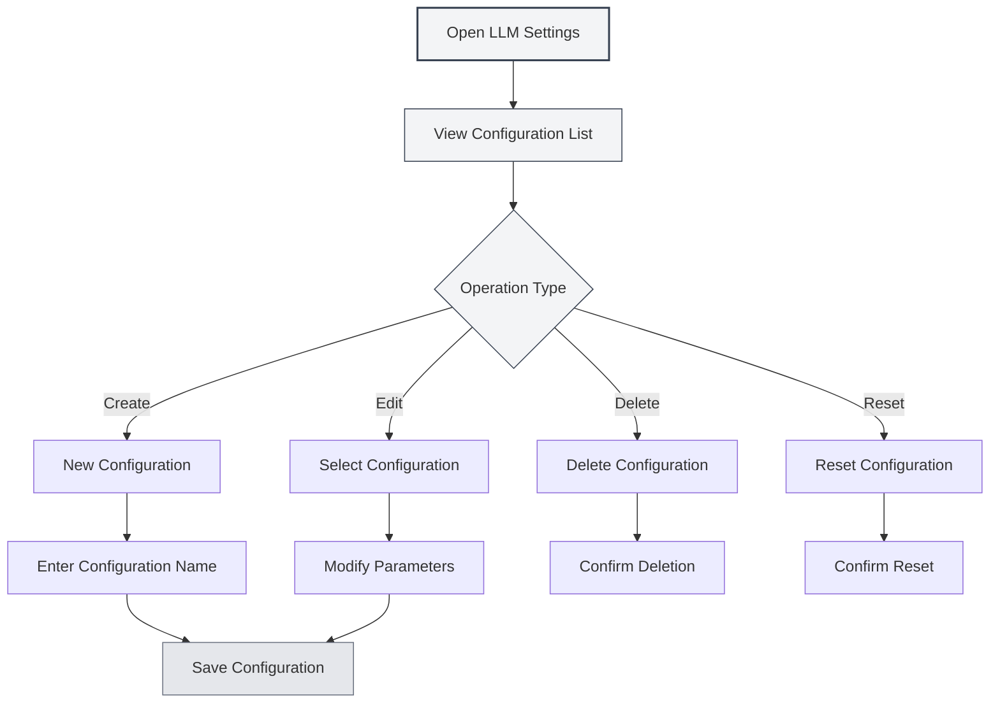

# LLM Configuration Management

## Overview

LLM Configuration Management allows you to create, edit, delete, and manage multiple LLM configurations. Through configuration management, you can set up different LLM services for various usage scenarios and flexibly switch between them to meet diverse needs.

## Creating Configurations

### Create a New Configuration

1. On the LLM Settings page, click the "New Configuration" button (+ icon) above the configuration list on the left.
2. Enter a configuration name in the pop-up dialog.
3. The system will create a new configuration based on the current settings.
4. After successful creation, it will automatically switch to the new configuration.

You can access LLM Settings via the top menu bar:

<MenuItemsDemo mode="demo" :items='[{"id": "settings"}]' />

### Configuration Interface Demo

The following figure shows the main features of the LLM Configuration Management interface:

<SettingLlmSection mode="demo" />

**Notes**:

- Configuration names cannot be empty.
- Configuration names should be descriptive for easy identification.
- Newly created configurations inherit all current settings.
- The manual configuration type does not support creating new configurations.



### Create from Current Settings

When creating a new configuration, the system will:

- Copy the currently selected LLM type.
- Copy all current configuration parameters (API URL, API Key, model, etc.).
- Create a new configuration ID.
- Add the new configuration to the configuration list.

You can create a new configuration based on an existing one and then modify parameters, allowing for quick creation of similar configurations.

<DialogDemo mode="demo" dialogType="llm-config" />

## Editing Configurations

### Modifying Configuration Parameters

1. Select the configuration to edit from the configuration list.
2. Modify various parameters in the form on the right.
3. After modification, the system will mark it as "Unsaved Changes".
4. Click the "Save Changes" button to save the modifications.

<DialogDemo mode="demo" dialogType="api-config" />

### Configuration Parameter Description

Configuration parameters differ by LLM type:

- **MetaDoc API**: Model selection
- **Ollama**: API URL, Model selection, Max Tokens
- **OpenAI Compatible**: API URL, API Key, Model selection, Suffix configuration
- **OpenAI Official**: API Key, Model selection
- **DeepSeek**: API Key, Model selection
- **Gemini**: API Key, Model selection

### Live Preview

When modifying configuration parameters, the system detects changes in real-time:

- A warning label appears when there are unsaved changes.
- You can click "Discard Changes" at any time to revert.
- Changes take effect immediately after saving.

<AIChat mode="demo" />

## Deleting Configurations

### Delete a Configuration

1. Click the "More" button (three dots icon) to the right of the configuration item.
2. Select "Delete Configuration".
3. Confirm the deletion operation.

**Restrictions**:

- At least one configuration must remain; the last configuration cannot be deleted.
- Default configurations (isDefault) cannot be deleted, only reset.
- Deletion is irreversible; please proceed with caution.

### Deletion Confirmation

Before deleting a configuration, the system will ask for confirmation:

- After confirmation, the configuration will be permanently deleted.
- If the currently active configuration is deleted, the system will automatically switch to another configuration.
- Deleted configurations cannot be recovered; ensure the configuration is no longer needed.

<DialogDemo mode="demo" dialogType="confirm-delete" />

## Resetting Configurations

### Reset Default Configuration

For default configurations (e.g., "Ollama (Default)"), you can reset them to their initial values:

1. Click the "More" button to the right of the configuration item.
2. Select "Reset Configuration".
3. Confirm the reset operation.

After resetting, the configuration reverts to its default values at creation, and all custom modifications will be cleared.

**Applicable Scenarios**:

- Configuration was accidentally modified and needs to be restored to defaults.
- Need to reset after testing a configuration.
- Cleaning up unwanted custom settings.

## Exporting Configurations

### Export a Single Configuration

1. Click the "More" button to the right of the configuration item.
2. Select "Export Configuration".
3. The system generates a configuration file in JSON format.
4. Save the file locally.

<DialogDemo mode="demo" dialogType="export-config" />

The exported configuration file contains:

- Configuration ID and name
- LLM type
- All configuration parameters
- Creation and update timestamps

### Export All Configurations

1. Click the "Export All Configurations" button (download icon) above the configuration list.
2. The system exports all configurations to a single JSON file.
3. Save the file locally.

Exporting all configurations can be used for:

- Backing up all configurations.
- Migrating to another device.
- Sharing configurations with other users.

## Importing Configurations

### Import a Configuration

1. Click the "Import Configuration" button (document copy icon) above the configuration list.
2. Select a previously exported configuration file.
3. The system parses and imports the configuration.
4. The imported configuration is added to the configuration list.

<DialogDemo mode="demo" dialogType="import-config" />

**Import Rules**:

- Supports importing a single configuration or an array of configurations.
- If an imported configuration ID already exists, a new ID is created to avoid conflicts.
- After import, you need to manually switch to the new configuration.

### Import Format

The configuration file should be in JSON format, supporting the following structures:

```json
{
  "id": "config-xxx",
  "name": "Configuration Name",
  "type": "ollama",
  "ollama": {
    "apiUrl": "http://localhost:11434/api",
    "selectedModel": "llama2"
  }
}
```

Or an array of configurations:

```json
[
  { "id": "config-1", ... },
  { "id": "config-2", ... }
]
```

## Configuration Sorting

### Drag-and-Drop Sorting

The configuration list supports drag-and-drop sorting:

1. Click and hold a configuration item.
2. Drag it to the target position.
3. Release the mouse button to complete the sorting.

The sorted order is saved and will persist the next time you open the settings page.

**Use Cases**:

- Place frequently used configurations at the top.
- Sort by usage frequency.
- Group by LLM type.

## Configuration Status

### Current Configuration

The currently active configuration will:

- Be highlighted in the list.
- Display an "Unsaved Changes" label (if there are unsaved modifications).
- Be used by all AI features for their LLM service.

### Switching Configurations

When switching configurations:

- The system checks if the current configuration has unsaved changes.
- If there are unsaved changes, it's recommended to save or discard them first.
- The switch takes effect immediately; all AI features use the new configuration.

## Best Practices

1. **Naming Convention**: Use clear configuration names, such as "Work-Ollama", "Experiment-OpenAI".
2. **Regular Backups**: Regularly export and back up important configurations.
3. **Test Configurations**: Test new configurations after creation to confirm usability before using them.
4. **Clean Up Unused Configurations**: Periodically delete configurations no longer in use to keep the list tidy.
5. **Documentation**: Add notes or documentation for complex configurations.

## Important Notes

1. **Configuration Security**: Keep configurations containing API Keys secure; do not share them.
2. **Configuration Conflicts**: Be aware of ID conflicts when importing configurations.
3. **Default Configurations**: Default configurations cannot be deleted, only reset.
4. **Configuration Dependencies**: Some features may depend on specific configurations; verify before deletion.
5. **Multi-Window Synchronization**: Configuration modifications are synchronized across all windows.

## Related Documentation

- [[settings.llm|LLM Configuration]]
- [[settings.llm-types|LLM Type Configuration]]
- [[ai.chat|AI Chat Feature]]
- [[agent.config|Agent Configuration Management]]

<QuickStartPanel mode="demo" />

<MainTabs mode="demo" />