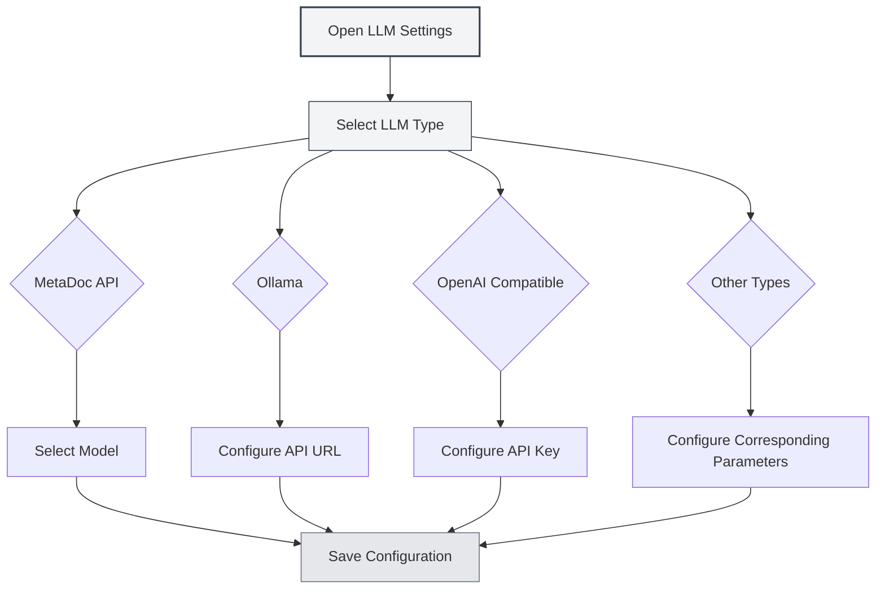

# LLM Type Configuration

## Overview

MetaDoc supports multiple LLM service providers, each with different configuration requirements. This document explains how to configure various LLM types, including MetaDoc API, Ollama, OpenAI, DeepSeek, and Gemini.

## MetaDoc API

### Configuration Description

MetaDoc API is the official LLM service provided by MetaDoc. It is simple to use and does not require configuring an API key.

### Configuration Steps

1. Select "MetaDoc" from the LLM type dropdown.
2. Choose an available model from the "Select Model" dropdown.
3. Configure the maximum token count (optional).

You can access the LLM settings via the top menu bar:

<MenuItemsDemo mode="demo" :items='[{"id": "settings"}]' />

### LLM Configuration Interface Demo

The following image shows the main functional areas of the LLM configuration page:

<SettingLlmSection mode="demo" />

### Configuration Requirements

- **Logged-in Account**: Requires a logged-in MetaDoc account to use.
- **Model Selection**: Choose from the list of available models.
- **Maximum Tokens**: Optional, limits the maximum number of tokens per request.

<MainTabs mode="demo" />

### Applicable Scenarios

- Quickly start using AI features.
- No need to configure external services.
- Using MetaDoc's official service.

<DialogDemo mode="demo" dialogType="llm-config" />

## Ollama

### Configuration Description

Ollama is a local LLM runtime environment that allows you to run large language models locally without an internet connection.

### Configuration Steps

1. Select "Ollama" from the LLM type dropdown.
2. Configure the API Base URL (default: `http://localhost:11434/api`).
3. Click the "Select Model" dropdown; the system will automatically fetch the list of available local models.
4. Select the model to use.
5. Configure the maximum token count (optional).

### Configuration Requirements

- **Install Ollama**: Requires Ollama to be installed and the service to be running.
- **API URL**: Default is `http://localhost:11434/api`. Modify if Ollama is running at a different address.
- **Model Download**: Models must be downloaded using Ollama first (e.g., `ollama pull llama2`).

### Fetching the Model List

When you click the "Select Model" dropdown, MetaDoc automatically connects to the Ollama service and retrieves the list of available models. If the connection fails, please check:

- Whether the Ollama service is running.
- If the API URL is correct.
- If the network connection is normal.

### Applicable Scenarios

- Running LLMs locally to protect data privacy.
- No internet connection required.
- Sufficient computational resources available (GPU recommended).

<DialogDemo mode="demo" dialogType="api-config" />

## OpenAI Compatible

### Configuration Description

OpenAI Compatible API supports all services compatible with the OpenAI API format, including the official OpenAI API and third-party compatible services.

### Configuration Steps

1. Select "OpenAI Compatible" from the LLM type dropdown.
2. Configure the API Base URL (default: `https://api.openai.com/v1`).
3. Enter the API Key.
4. Click the "Select Model" dropdown to fetch the list of available models.
5. Select the model to use.
6. Configure the Completion Suffix and Chat Suffix (optional, for custom API paths).
7. Configure the maximum token count (optional).

### Configuration Requirements

- **API URL**: The API address for the official OpenAI API or a compatible service.
- **API Key**: The API key obtained from the service provider.
- **Model List**: The system automatically fetches the list of available models.

### API Suffix Configuration

Some compatible services may require custom API paths:

- **Completion Suffix**: Custom path suffix for the Completion API.
- **Chat Suffix**: Custom path suffix for the Chat API.

In most cases, configuration is not needed; default values can be used.

### Applicable Scenarios

- Using the official OpenAI API.
- Using third-party services compatible with the OpenAI API.
- Services requiring custom API paths.

<MainTabs mode="demo" />

## OpenAI Official

### Configuration Description

The OpenAI Official configuration is specifically for the official OpenAI API. It is simpler to configure, and the API URL is fixed.

### Configuration Steps

1. Select "OpenAI Official" from the LLM type dropdown.
2. Enter your OpenAI API Key.
3. Click the "Select Model" dropdown to fetch the list of available models.
4. Select the model to use.
5. Configure the maximum token count (optional).

### Configuration Requirements

- **API Key**: The API key obtained from the OpenAI website.
- **API URL**: Fixed as `https://api.openai.com/v1` and cannot be modified.

### Obtaining an API Key

1. Visit the [OpenAI website](https://platform.openai.com/).
2. Register or log in to your account.
3. Go to the API Keys page.
4. Create a new API Key.
5. Copy the API Key and paste it into the MetaDoc configuration.

<ResizableDivider mode="demo" />

### Applicable Scenarios

- Using OpenAI's official GPT models.
- Needing stable official service.
- Having an OpenAI account and API quota.

## DeepSeek

### Configuration Description

DeepSeek is a high-performance LLM service provider offering strong Chinese language understanding capabilities.

### Configuration Steps

1. Select "DeepSeek" from the LLM type dropdown.
2. Enter your DeepSeek API Key.
3. Select a model (deepseek-chat or deepseek-reasoner).
4. Configure the maximum token count (optional).

### Configuration Requirements

- **API Key**: The API key obtained from the DeepSeek website.
- **Model Selection**:
  - `deepseek-chat`: General-purpose conversational model.
  - `deepseek-reasoner`: Reasoning model.

### Obtaining an API Key

1. Visit the [DeepSeek website](https://www.deepseek.com/).
2. Register or log in to your account.
3. Go to the API Keys page.
4. Create a new API Key.
5. Copy the API Key and paste it into the MetaDoc configuration.

### Applicable Scenarios

- Requiring strong Chinese language understanding.
- Needing reasoning capabilities (use deepseek-reasoner).
- Cost-effective LLM service.

<SettingKnowledgeBaseSection mode="demo" />

<CompletionSettingsPanel mode="demo" />

## Gemini

### Configuration Description

Gemini is an LLM service provided by Google, supporting multimodal capabilities.

### Configuration Steps

1. Select "Gemini" from the LLM type dropdown.
2. Enter your Gemini API Key.
3. Click the "Select Model" dropdown to fetch the list of available models.
4. Select the model to use.
5. Configure the maximum token count (optional).

### Configuration Requirements

- **API Key**: The API key obtained from Google AI Studio.
- **Model Selection**: The system automatically fetches the list of available models.

### Obtaining an API Key

1. Visit [Google AI Studio](https://makersuite.google.com/app/apikey).
2. Log in with your Google account.
3. Create a new API Key.
4. Copy the API Key and paste it into the MetaDoc configuration.

### Applicable Scenarios

- Using Google's LLM service.
- Requiring multimodal capabilities.
- Having a Google account.

<AgentView mode="demo" />

## Maximum Token Count Configuration

### Function Description

The maximum token count limits the maximum number of tokens that can be generated in a single request. Enabling this feature allows you to:

- Control the length of generated content.
- Save on API costs.
- Avoid generating overly long content.

### Configuration Method

1. Enable the "Maximum Tokens" switch.
2. Set the token count (range: 1-32768).
3. Save the configuration.

### Usage Suggestions

- **Short Text Generation**: 100-500 tokens.
- **Medium Length**: 500-2000 tokens.
- **Long Text Generation**: 2000-8000 tokens.
- **Unlimited**: Turn off this option.

## Configuration Verification

### Testing Configuration

After configuration, it is recommended to test if the configuration is working correctly:

1. Save the configuration.
2. Enable the LLM feature.
3. Try using the AI chat function.
4. If errors occur, check if the configuration is correct.

### Common Issues

**Connection Failed**:

- Check if the API URL is correct.
- Check the network connection.
- Check if the service is running normally.

**Authentication Failed**:

- Check if the API Key is correct.
- Check if the API Key has expired.
- Check if the account has sufficient quota.

**Model Unavailable**:

- Check if the model name is correct.
- Check if the account has permission to use the model.
- Check if the service supports the model.

## Notes

1. **API Key Security**: Keep your API keys secure and do not share them with others.
2. **Cost Control**: Using external APIs may incur costs; please monitor your usage.
3. **Network Requirements**: Using external APIs requires a stable network connection.
4. **Service Availability**: The availability and stability of different services may vary.
5. **Model Selection**: Different models have different capabilities and limitations; choose according to your needs.

## Related Documentation

- [[settings.llm|LLM Configuration]]
- [[settings.llm-management|LLM Configuration Management]]
- [[ai.chat|AI Chat Function]]
- [[ai.completion|AI Auto-completion]]

<MenuItemsDemo mode="demo" :items='[{"id": "file"}]' />

<ViewMenuItemsDemo mode="demo" :items='["settings"]' />

<SettingLlmSection mode="demo" />

<DialogDemo mode="demo" dialogType="llm-config" />

<MainTabs mode="demo" />
