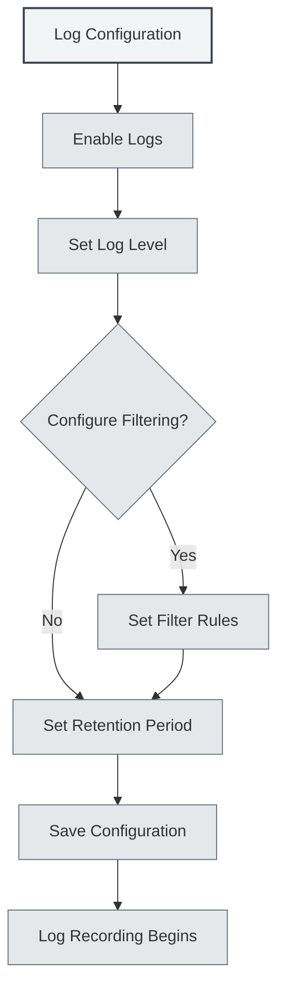

# Log Configuration

## Overview

Log configuration allows you to manage MetaDoc's logging functionality. By configuring logs, you can record the application's operational status, facilitating troubleshooting and performance analysis.

<Demo component="SettingLoggerSection" mode="demo" />

## Enabling Logs

### Enabling Logging Functionality

On the log settings page, you first need to enable the logging function:

1.  Locate the "Enable Logs" toggle.
2.  Switch the toggle to the "Enabled" state.
3.  Logs will begin recording to a file.

You can access log settings via the top menu bar:

<MenuItemsDemo mode="demo" :items='[{"id": "settings"}]' />

After enabling logs, the system will record the application's operational information, including:

-   Operation records
-   Error messages
-   Warning messages
-   Debug information (if enabled)



**Important Notes**:

-   Logs consume a certain amount of disk space.
-   It is recommended to enable logging when troubleshooting issues.
-   In production environments, it can be disabled to reduce resource usage.

## Log Levels

### Level Descriptions

The log level determines which levels of logs are recorded:

<ConsoleTerminal mode="demo" consoleKey="log-levels" :history='[{"content": "[INFO] 应用启动完成", "type": "out"}, {"content": "[DEBUG] 加载配置文件", "type": "out"}, {"content": "[WARN] 配置项缺失，使用默认值", "type": "warn"}, {"content": "[ERROR] 连接失败，正在重试...", "type": "error"}]' />

-   **DEBUG**: Detailed debugging information, including all operational details.
-   **INFO**: General information, recording important operations and statuses.
-   **WARN**: Warning messages, recording potential issues.
-   **ERROR**: Error messages, recording errors and exceptions.

### Level Priority

Log levels have a priority relationship:

```
DEBUG < INFO < WARN < ERROR
```

When a specific level is selected, logs of that level and higher levels are recorded. For example:

-   Selecting INFO: Records INFO, WARN, ERROR.
-   Selecting WARN: Records only WARN and ERROR.
-   Selecting ERROR: Records only ERROR.

### Level Selection Recommendations

-   **Development/Debugging**: Use the DEBUG level to obtain detailed information.
-   **Daily Use**: Use the INFO level to record important operations.
-   **Troubleshooting**: Use the WARN level to focus on warnings and errors.
-   **Production Environment**: Use the ERROR level to record only errors.

<SettingLoggerSection mode="demo" />

## Log Filtering

### Filtering Function

Log filtering allows you to record logs only from specific scopes:

-   **Filter by scope**: Record logs only from specific modules.
-   **Prefix matching**: Supports prefix matching, e.g., "ai-graph" matches all scopes starting with "ai-graph".
-   **Exact matching**: Supports exact matching, e.g., "[ai-graph][WorkflowTool]".

### Filter Rules

Filter rules support the following formats:

-   **Simple Match**: `ai-graph` - Matches all scopes containing "ai-graph".
-   **Prefix Match**: `ai-` - Matches all scopes starting with "ai-".
-   **Exact Match**: `[ai-graph][WorkflowTool]` - Exactly matches that scope.

### Use Cases

-   **Debugging Specific Modules**: Record logs only for a particular module.
-   **Reducing Log Volume**: Filter out logs of no interest.
-   **Problem Isolation**: Focus on logs for specific functionalities.

<SettingDebugSection mode="demo" />

### Filtering Examples

**Example 1: Record only AI-related logs**

```
Filter Condition: ai-
```

**Example 2: Record only workflow logs**

```
Filter Condition: workflow
```

**Example 3: Record logs for a specific tool only**

```
Filter Condition: [ai-graph][WorkflowTool]
```

## Log Retention Period

### Retention Period Settings

The log retention period determines how long log files are kept:

-   **Do Not Retain**: Does not automatically clean up logs.
-   **1 Day**: Retains logs for 1 day.
-   **3 Days**: Retains logs for 3 days.
-   **7 Days**: Retains logs for 7 days.
-   **1 Month**: Retains logs for 1 month.
-   **3 Months**: Retains logs for 3 months.
-   **6 Months**: Retains logs for 6 months.
-   **1 Year**: Retains logs for 1 year.
-   **Permanent**: Permanently retains logs.

### Automatic Cleanup

After setting a retention period, the system automatically cleans up expired log files:

-   **Cleanup Trigger**: Cleanup is performed immediately when the retention period is changed.
-   **Cleanup Rule**: Deletes log files older than the retention period.
-   **Cleanup Scope**: Only cleans up files within the log directory.

<ConsoleTerminal mode="demo" consoleKey="cleanup" :history='[{"content": "[INFO] 开始清理过期日志文件...", "type": "out"}, {"content": "[INFO] 删除: 2026-02-10 10-30-45.log (超过保留期限)", "type": "out"}, {"content": "[INFO] 删除: 2026-02-11 14-20-30.log (超过保留期限)", "type": "out"}, {"content": "[INFO] 清理完成，共删除 2 个文件", "type": "out"}]' />

### Selection Recommendations

-   **Development Environment**: Use a shorter retention period (1-3 days).
-   **Production Environment**: Use a medium retention period (7 days - 1 month).
-   **Important Projects**: Use a longer retention period (3-6 months).
-   **Audit Requirements**: Use permanent retention.

## Log File Path

### Viewing Log Paths

On the log settings page, you can view:

-   **Log File Path**: The full path to the current log file.
-   **Log Directory Path**: The directory path where log files are stored.

### Opening a Log File

1.  On the log settings page, locate the "Log File Path".
2.  Click the "Open Log File" button.
3.  The system will open the log file with the default text editor.

### Opening the Log Directory

1.  On the log settings page, locate the "Log Directory".
2.  Click the "Open Log Directory" button.
3.  The system will open the log directory in the file manager.

<ViewMenuItemsDemo mode="demo" :items='["home", "editor"]'
/>

## Log Console

### Viewing Logs in Real-Time

The log settings page provides a log console for viewing logs in real-time:

-   **Real-time Display**: Shows the latest log entries.
-   **History**: Displays recent log history (up to 500 entries).
-   **Log Levels**: Logs of different levels are displayed in different colors.

<ConsoleTerminal mode="demo" consoleKey="realtime-logs" :history='[{"content": "[2026-02-24 10:30:15] [INFO] [main][App] 应用启动完成", "type": "out"}, {"content": "[2026-02-24 10:30:16] [DEBUG] [renderer][Editor] 编辑器初始化", "type": "out"}, {"content": "[2026-02-24 10:30:18] [INFO] [renderer][Workspace] 加载工作目录", "type": "out"}]' />

### Console Features

-   **View Logs**: View application logs in real-time.
-   **Filter Display**: Filter display based on log level.
-   **Search Logs**: Search log content within the console.

## Log File Format

### File Naming

Log files use the following naming format:

```
YYYY-MM-DD HH-mm-ss.log
```

Example: `2026-02-19 14-30-45.log`

### Log Format

Each log entry contains the following information:

-   **Timestamp**: The time the log was recorded.
-   **Level**: The log level (DEBUG/INFO/WARN/ERROR).
-   **Process Type**: main (main process) or renderer (renderer process).
-   **Scope**: The module or component that is the source of the log.
-   **Message**: The log message content.

### Log Examples

```
[2026-02-19 14:30:45] [INFO] [main][Logger] 日志配置更新: enabled=true, level=info
[2026-02-19 14:30:46] [DEBUG] [renderer][Editor] 文档已保存
[2026-02-19 14:30:47] [WARN] [main][RAG] 知识库文件未找到
[2026-02-19 14:30:48] [ERROR] [renderer][LLM] API调用失败
```

<ConsoleTerminal mode="demo" consoleKey="log-examples" :history='[{"content": "[2026-02-19 14:30:45] [INFO] [main][Logger] 日志配置更新: enabled=true, level=info", "type": "out"}, {"content": "[2026-02-19 14:30:46] [DEBUG] [renderer][Editor] 文档已保存", "type": "out"}, {"content": "[2026-02-19 14:30:47] [WARN] [main][RAG] 知识库文件未找到", "type": "warn"}, {"content": "[2026-02-19 14:30:48] [ERROR] [renderer][LLM] API调用失败", "type": "error"}]' />

## Best Practices

1.  **Set Levels Appropriately**: Choose the appropriate log level based on the usage scenario.
2.  **Use Filtering**: Use filtering to reduce log volume.
3.  **Regular Cleanup**: Set a reasonable retention period to avoid excessive space usage.
4.  **Troubleshooting**: Temporarily increase the log level when encountering issues to obtain detailed information.
5.  **Log Backup**: It is recommended to back up important logs.

<MainTabs mode="demo" />

## Important Notes

1.  **Disk Space**: Logs consume disk space; ensure regular cleanup.
2.  **Performance Impact**: The DEBUG level may impact performance; it is recommended to use it only during debugging.
3.  **Privacy and Security**: Logs may contain sensitive information; protect log files accordingly.
4.  **File Permissions**: Ensure the log directory has write permissions.
5.  **Log Location**: The log file location is automatically managed by the system; manual modification is not recommended.

## Related Documentation

-   [[settings.basic|Basic Settings]]
-   [[settings.about|About Information]]

<QuickStartPanel mode="demo" />

<ResizableDivider mode="demo" />