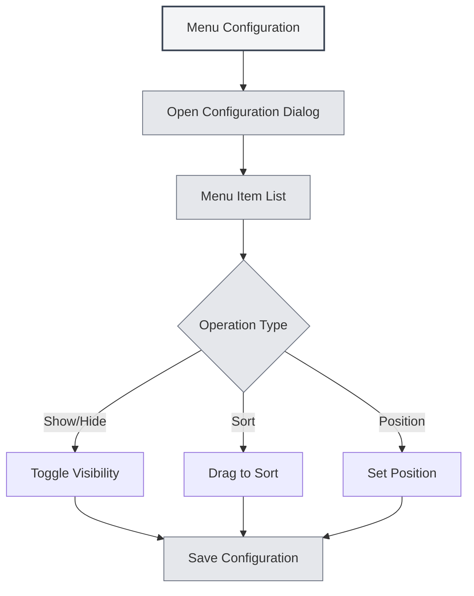

# Menu Configuration

## Overview

The menu configuration feature allows you to customize the display and order of the left-side menu. Through menu configuration, you can hide unwanted menu items, adjust menu order, set menu positions, and create a personalized interface layout.

## Opening Menu Configuration

### Access Methods

You can open menu configuration in the following ways:

- **Settings Page**: There may be a menu configuration entry in the settings page.
- **Menu Options**: There may be a menu configuration option within "More Features" in the left-side menu.
- **Right-click Menu**: Some menu items may have configuration options.

You can access menu configuration via the top menu bar:

<MenuItemsDemo mode="demo" :items='[{"id": "settings"}]' />

## Menu Item Management

### Menu Item List

The menu configuration page displays all configurable menu items:

- **Menu Item Name**: Displays the name of the menu item.
- **Visibility**: Indicates whether the menu item is visible.
- **Position**: Shows the position of the menu item (Top/Bottom).
- **Core Flag**: Identifies core menu items (cannot be hidden).

### Menu Item Types

Menu items are divided into two types:

- **Core Menu Items**: Menu items that must be displayed and cannot be hidden.
  - Home
  - File
  - Settings
  - More Features
  - Exit
- **Regular Menu Items**: Menu items that can be hidden.
  - AI Assistant
  - Recent Files
  - Knowledge Base
  - Working Directory
  - User Manual
  - User Feedback
  - LLM Statistics
  - Debug Tools (Development Environment)

## Showing/Hiding Menu Items

### Hiding Menu Items

You can hide unwanted menu items:

1. **Open Configuration**: Open the menu configuration dialog.
2. **Find Menu Item**: Locate the menu item you want to hide.
3. **Toggle Visibility**: Toggle the visibility switch for the menu item.
4. **Save Configuration**: Click the "Save" button to save the configuration.

<DialogDemo mode="demo" dialogType="menu-config" />

### Showing Menu Items

You can show previously hidden menu items:

1. **Open Configuration**: Open the menu configuration dialog.
2. **Find Menu Item**: Locate the menu item you want to show.
3. **Toggle Visibility**: Toggle the visibility switch for the menu item.
4. **Save Configuration**: Click the "Save" button to save the configuration.

### Core Menu Item Restrictions

Core menu items cannot be hidden:

- **Forced Display**: Core menu items are always displayed.
- **Cannot Hide**: The visibility switch for core menu items is disabled.
- **Automatic Recovery**: If an attempt is made to hide a core menu item, it will automatically revert to the visible state.

## Menu Item Sorting

### Drag-and-Drop Sorting

You can adjust the order of menu items by dragging:

1. **Open Configuration**: Open the menu configuration dialog.
2. **Drag Menu Item**: Click and drag the drag handle of the menu item.
3. **Adjust Position**: Drag the menu item to the target position.
4. **Save Configuration**: Click the "Save" button to save the configuration.

### Sorting Rules

Menu item sorting follows these rules:

- **Position Grouping**: Top menu items and bottom menu items are sorted separately.
- **Divider Line**: A divider line appears between the top and bottom sections.
- **Automatic Adjustment**: Dragging to a different position automatically adjusts the position property.

## Menu Position Settings

### Position Types

Menu items can be set to two positions:

- **Top**: Displayed in the top area of the menu bar.
- **Bottom**: Displayed in the bottom area of the menu bar.

### Setting Position

You can set the position of a menu item:

1. **Open Configuration**: Open the menu configuration dialog.
2. **Drag to Position**: Drag the menu item to the top or bottom area.
3. **Automatic Adjustment**: The system automatically adjusts the position property.
4. **Save Configuration**: Click the "Save" button to save the configuration.

<LeftMenu mode="demo" />

### Position Divider Line

A divider line appears between the top and bottom sections:

- **Automatic Display**: A divider line is automatically displayed if there are both top and bottom menu items.
- **Not Draggable**: The divider line cannot be dragged; it is used for visual separation.
- **Automatic Hiding**: The divider line is automatically hidden if there are only top or only bottom menu items.

## Configuration Saving

### Automatic Saving

Some operations automatically save the configuration:

- **Visibility Toggle**: Automatically saves when toggling menu item visibility.
- **Position Adjustment**: Automatically saves when adjusting menu position.

### Manual Saving

You can also save the configuration manually:

1. **Adjust Configuration**: Adjust the order and visibility of menu items.
2. **Click Save**: Click the "Save" button.
3. **Configuration Takes Effect**: The configuration takes effect immediately.

### Resetting Configuration

You can reset the menu configuration:

1. **Open Configuration**: Open the menu configuration dialog.
2. **Click Reset**: Click the "Reset" button.
3. **Confirm Reset**: Confirm the reset operation.
4. **Restore Defaults**: The configuration is restored to the default state.

**Notes**:

- The reset operation cannot be undone.
- Core menu items will remain visible after reset.

<DialogDemo mode="demo" dialogType="confirm-reset" />

## Configuration Persistence

### Configuration Storage

Menu configuration is saved locally:

- **Local Storage**: Configuration is saved in local settings.
- **Automatic Loading**: Configuration is automatically loaded the next time the application starts.
- **Multi-Window Sync**: Configuration is synchronized across all windows.

### Configuration Migration

Configuration from older versions is automatically migrated:

- **Position Migration**: The "middle" position from older versions is automatically migrated to "bottom".
- **Compatibility Handling**: The system automatically handles configuration formats from older versions.
- **Smooth Upgrade**: Configuration automatically adapts to the new version after an upgrade.

## Best Practices

1. **Simplify Menu**: Hide infrequently used menu items to keep the interface clean.
2. **Logical Ordering**: Place frequently used menu items at the front for easy access.
3. **Position Grouping**: Place related menu items in the same position area.
4. **Regular Adjustment**: Periodically adjust menu configuration based on usage habits.
5. **Backup Configuration**: Important configurations can be backed up for easy restoration.

## Notes

1. **Core Menu Items**: Core menu items cannot be hidden and must be displayed.
2. **Configuration Saving**: Some operations save automatically, while others require manual saving.
3. **Reset Operation**: The reset operation cannot be undone; use it with caution.
4. **Multi-Window Sync**: Configuration is synchronized across all windows.
5. **Development Tools**: Debug tools are only displayed in the development environment.

## Related Documentation

- [[settings.basic|Basic Settings]]
- [[core.multi-tab|Multi-Tab Management]]

<MainTabs mode="demo" />

<LeftMenu mode="demo" />

<MenuItemsDemo mode="demo" :items='[{"id": "settings"}]' />

<DialogDemo mode="demo" dialogType="menu-config" />

<MenuItemsDemo mode="demo" :items='[{"id": "file", "items": ["new", "open"]}]' />

<DialogDemo mode="demo" dialogType="confirm-reset" />
