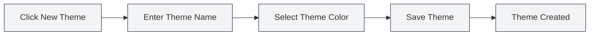

# Custom Theme Management

## Overview

Custom theme management allows you to create, edit, delete, and duplicate custom themes. Through custom themes, you can tailor the interface appearance to your personal preferences, enhancing the user experience.

## Creating a New Custom Theme

### Creating a New Theme

1.  On the theme settings page, click the "New Theme" card (+ icon).
2.  In the dialog box that appears:
    *   Enter a theme name (optional, defaults to the color value).
    *   Select a theme color (using the color picker).
3.  Click the "Save" button.

You can access theme settings via the top menu bar:

<MenuItemsDemo mode="demo" :items='[{"id": "settings"}]' />

### Theme Color Selection

The color picker provides the following features:

*   **Color Selection**: Click on the color area to select a color.
*   **Preset Colors**: Choose from a list of preset colors.
*   **Transparency Adjustment**: Adjust the color's transparency (Alpha channel).
*   **Color Value Input**: Directly input a HEX color value.

### Theme Naming

*   **Automatic Naming**: If no name is entered, the system will use the color value as the name.
*   **Custom Name**: Enter a meaningful name for easy identification and management.
*   **Naming Suggestions**: Use descriptive names such as "Work Theme," "Night Mode," etc.

<SettingThemeSection mode="demo" />

## Editing a Custom Theme

### Modifying a Theme

1.  In the theme list, locate the custom theme you wish to edit.
2.  Click the "More" button (three-dot icon) on the theme card.
3.  Select "Edit."
4.  Modify the theme name or color in the dialog box.
5.  Click the "Save" button.

<DialogDemo mode="demo" dialogType="theme-edit" />

### Quick Color Editing

You can also edit the color directly on the theme card:

1.  Click the color picker on the theme card.
2.  Select a new color.
3.  The color will be applied immediately.

**Notes**:

*   Preset themes cannot be edited.
*   Only custom themes can be edited.
*   Changes must be saved to take effect permanently.

## Deleting a Custom Theme

### Deleting a Theme

1.  In the theme list, locate the custom theme you wish to delete.
2.  Click the "More" button on the theme card.
3.  Select "Delete."
4.  Confirm the deletion.

**Notes**:

*   Deletion is irreversible.
*   If the currently active theme is deleted, the system will automatically switch to the default theme.
*   Preset themes cannot be deleted.

## Duplicating a Theme

### Duplicating an Existing Theme

1.  In the theme list, locate the theme you wish to duplicate.
2.  Click the "More" button on the theme card.
3.  Select "Duplicate."
4.  The system will create a copy with "Copy" appended to the name.
5.  You can edit the copy to create a new theme.

### Use Cases

*   **Creating a new theme based on an existing one**: Duplicate and then modify the colors.
*   **Creating theme variants**: Create themes that are similar but slightly different.
*   **Backing up a theme**: Duplicate as a backup.

## Theme Color Settings

### Color Picker Features

The color picker offers rich color selection features:

*   **Color Panel**: Click to select a color.
*   **Preset Colors**: Quickly select commonly used colors.
*   **Color Value Input**: Directly input HEX, RGB, HSL, etc., formats.
*   **Transparency Adjustment**: Adjust the color's transparency.

<DialogDemo mode="demo" dialogType="color-picker" />

### Preset Colors

MetaDoc provides a variety of preset colors:

*   **Basic Colors**: Red, Orange, Yellow, Green, Cyan, Blue, Purple, Gray.
*   **Light Colors**: Light Red, Light Orange, Light Yellow, etc.
*   **Dark Colors**: Dark Red, Dark Orange, Dark Yellow, etc.

### Color Formats

Supported color formats:

*   **HEX**: `#FF5733` (most common).
*   **RGB**: `rgb(255, 87, 51)`.
*   **HSL**: `hsl(9, 100%, 60%)`.

## Applying Themes

### Applying a Custom Theme

1.  In the theme list, click the card of the custom theme you want to use.
2.  The theme will be applied immediately.
3.  Interface colors will be automatically generated based on the theme color.

### Theme Color Impact

The theme color affects the following interface elements:

*   **Background Colors**: Primary and secondary backgrounds.
*   **Text Colors**: Primary and secondary text.
*   **Sidebar**: Sidebar background and text.
*   **Editor**: Editor background and toolbar.
*   **Other Elements**: Buttons, borders, highlights, etc.

### Automatic Color Scheme

MetaDoc automatically generates a color scheme based on the theme color:

*   **Light Theme**: Generates a light color scheme when the theme color is bright.
*   **Dark Theme**: Generates a dark color scheme when the theme color is dark.
*   **Color Algorithm**: Uses color blending and saturation adjustment.

## Theme Management

### Theme List

The theme settings page displays all available themes:

*   **Preset Themes**: System-built-in themes.
*   **Custom Themes**: Themes created by the user.
*   **Current Theme**: Indicated by a selection marker.

### Theme Order

Themes are displayed in the following order:

1.  System Sync Theme (Follows System).
2.  Light/Dark Preset Themes.
3.  Custom Themes (by creation time).

### Theme Status

Each theme card displays:

*   **Theme Color Preview**: Shows the theme's primary color.
*   **Theme Name**: Shows the theme's name.
*   **Color Value**: Shows the HEX value of the color.
*   **Selection Marker**: Indicates the currently active theme.

## Best Practices

1.  **Theme Naming**: Use meaningful names for easy identification.
2.  **Color Selection**: Choose eye-friendly colors; avoid overly bright ones.
3.  **Theme Backup**: It is recommended to duplicate important themes as backups.
4.  **Regular Cleanup**: Delete unused themes to keep the list tidy.
5.  **Test Effects**: Test the actual effect after creating a theme and adjust based on usage experience.

## Notes

1.  **Preset Themes**: Preset themes cannot be edited or deleted.
2.  **Theme Compatibility**: Some themes may display differently in various environments.
3.  **Color Selection**: It is recommended to choose colors with moderate contrast to ensure readability.
4.  **Number of Themes**: Avoid creating too many themes to keep the list concise.
5.  **Theme Synchronization**: Theme changes are synchronized across all windows.

## Related Documentation

*   [[settings.theme|Theme Configuration]]
*   [[settings.basic|Basic Settings]]
*   [[core.editor-settings|Editor Settings]]

<ResizableDivider mode="demo" />

<SettingThemeSection mode="demo" />

<MenuItemsDemo mode="demo" :items='[{"id": "settings", "items": ["theme"]}]' />

<DialogDemo mode="demo" dialogType="color-picker" />

<DialogDemo mode="demo" dialogType="theme-edit" />

<MenuItemsDemo mode="demo" :items='[{"id": "settings"}]' />
