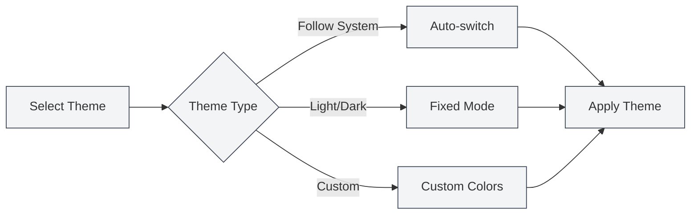

# Theme Configuration

## Overview

Theme configuration allows you to customize the appearance of MetaDoc, including global themes, content themes, code themes, and more. Proper theme configuration can enhance the user experience and reduce visual fatigue.

## Global Theme

### Theme Types

MetaDoc supports the following global theme types:

- **Follow System Light/Dark**: Automatically follows the operating system's light/dark mode.
- **Follow System Color**: Follows the operating system's accent color (Windows 11).
- **Light**: Uses a fixed light theme.
- **Dark**: Uses a fixed dark theme.
- **Custom**: Uses custom theme colors.

### Selecting a Theme

1. On the theme settings page, browse the theme cards.
2. Click on the theme card you wish to use.
3. The theme will be applied immediately.

You can access theme settings via the top menu bar:

<MenuItemsDemo mode="demo" :items='[{"id": "settings"}]' />

### Light Theme Preview

<SettingThemeSection mode="demo" theme="light" />

### Dark Theme Preview

<SettingThemeSection mode="demo" theme="dark" />

### Theme Settings Interface

The image below shows the complete interface of the theme settings page:

<SettingThemeSection mode="demo" />

<ViewMenuItemsDemo mode="demo" :items='["editor", "outline"]' />

The theme settings interface includes the following main functional areas:

- **Global Theme**: Choose light, dark, follow system, or custom themes.
- **Content Theme**: Set the display theme for the editor area.
- **Code Theme**: Select the syntax highlighting theme for code blocks.
- **Line Number Display**: Control whether line numbers are shown for code blocks.
- **Custom Theme**: Create and manage custom color themes.

### Theme Preview

Each theme card displays:

- **Theme Color Preview**: Shows the primary colors of the theme.
- **Theme Name**: Displays the name of the theme.
- **Selection Marker**: The currently active theme will show a selection marker.

## Content Theme

<SettingThemeSection mode="demo" />

### Setting the Content Theme

The content theme controls the display theme for the document editing area:

- **Auto**: Follows the global theme.
- **Light**: Uses a fixed light content theme.
- **Dark**: Uses a fixed dark content theme.

### Use Cases

- **Global Dark, Content Light**: Suitable for editing light-colored documents in dark environments.
- **Global Light, Content Dark**: Suitable for editing dark-colored documents in bright environments.
- **Auto Mode**: The content theme automatically follows the global theme.

## Code Theme

<SettingThemeSection mode="demo" />

### Setting the Code Theme

The code theme controls the syntax highlighting theme for code blocks:

- **Auto**: Automatically selected based on the global theme.
- **Custom**: Choose from a list of code themes.

### Code Theme List

MetaDoc supports various code themes, including:

- **Light Themes**: GitHub, VS, OneLight, etc.
- **Dark Themes**: Monokai, Dracula, OneDark, etc.

### Selection Suggestions

- **Light Documents**: Use light code themes.
- **Dark Documents**: Use dark code themes.
- **Auto Mode**: Let the system choose automatically to maintain consistency.

## Line Number Display

<SettingThemeSection mode="demo" />

### Displaying Line Numbers

When "Show line numbers in code blocks" is enabled, line numbers will be displayed for code blocks:

- **Enabled**: Line numbers appear on the left side of the code block.
- **Disabled**: Line numbers are not shown.

### Use Cases

- **Code Debugging**: Line numbers help locate specific code positions.
- **Code Sharing**: Line numbers facilitate referencing specific lines.
- **Code Reading**: Line numbers aid in understanding code structure.

## Theme Switching

<SettingThemeSection mode="demo" />

<ViewMenuItemsDemo mode="demo" :items='["editor", "outline"]' />

### Real-time Switching

Theme changes take effect immediately:

1. Select a new theme.
2. The interface updates instantly.
3. The theme is applied synchronously across all windows.

### Theme Synchronization

- **Multi-window Sync**: All windows automatically synchronize the theme.
- **Settings Saved**: Theme selections are automatically saved.
- **Next Launch**: The last selected theme will be used upon the next launch.

## Preset Themes

<SettingThemeSection mode="demo" />

### Built-in Themes

MetaDoc provides a variety of preset themes:

- **Light Themes**: Suitable for bright environments.
- **Dark Themes**: Suitable for dark environments.
- **System Sync**: Automatically follows system settings.

### Preset Theme Features

- **Optimized Color Schemes**: Carefully designed color palettes.
- **Eye-friendly Design**: Reduces visual fatigue.
- **Consistency**: Ensures consistency across interface elements.

## Best Practices

1. **Environment Adaptation**: Choose themes based on your usage environment.
2. **Content Matching**: Match the content theme to the document type.
3. **Code Readability**: Select code themes that offer high readability.
4. **Regular Adjustment**: Adjust theme settings based on your experience.

## Notes

1. **System Compatibility**: Following the system theme requires operating system support.
2. **Theme Consistency**: It is recommended to maintain consistency between the global and content themes.
3. **Code Theme**: The code theme affects code readability.
4. **Custom Themes**: Custom themes require manual creation and management.

## Related Documents

- [[settings.theme-custom|Custom Theme Management]]
- [[settings.basic|Basic Settings]]
- [[core.editor-settings|Editor Settings]]