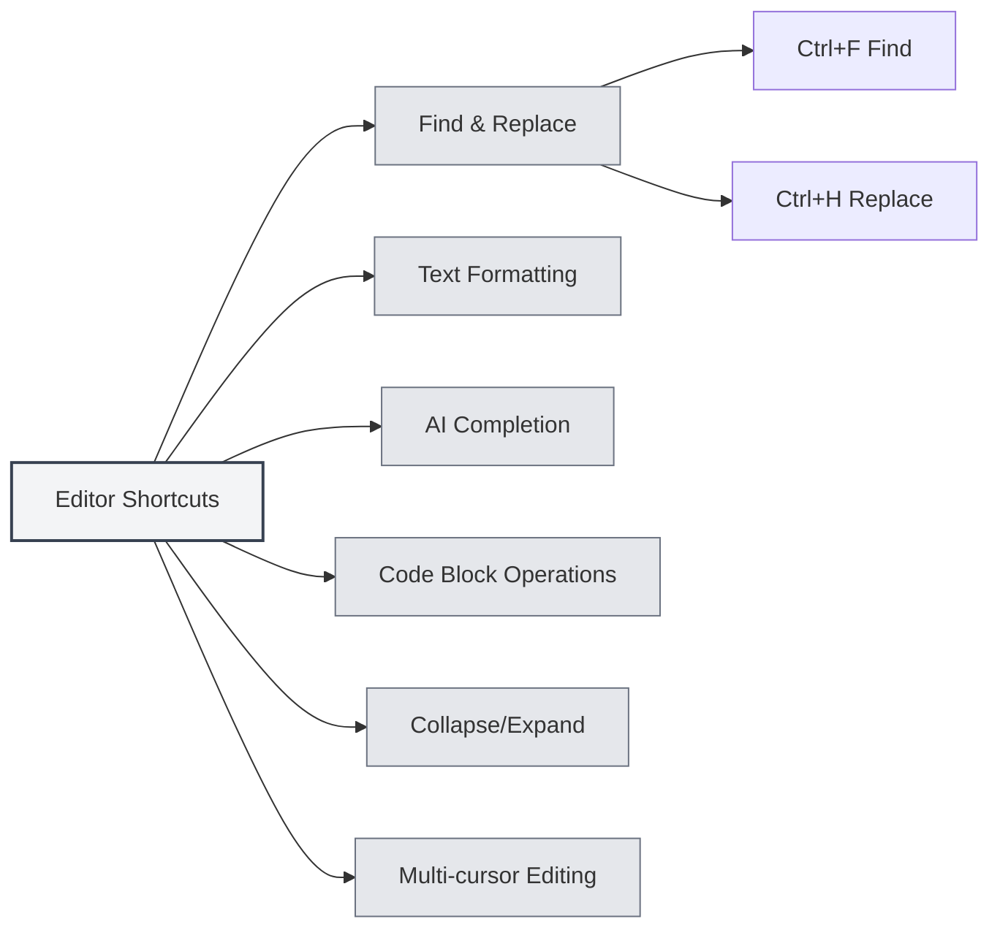

# Editor Shortcuts

## Overview

Editor shortcuts are keyboard shortcuts used within the editor interface, including functions for text editing, find and replace, formatting, and more. Mastering these shortcuts can significantly improve editing efficiency.

<MenuItemsDemo mode="demo" :items='[{"id": "edit"}]' />

<ViewMenuItemsDemo mode="demo" :items='["editor", "outline"]' />

**Note**: Find/Replace (Ctrl+F, Ctrl+H) is implemented globally by the application. Bold/Italic/Link/Code block formatting, etc., are provided by the underlying editor (Vditor for Markdown, Monaco for LaTeX). If they are ineffective, please refer to the actual editor behavior.

## Find and Replace

### Find

- **Shortcut**: `Ctrl+F` (Windows/Linux) or `Cmd+F` (macOS)
- **Function**: Opens the Find dialog
- **Use Case**: Search for specific text within a document

### Find and Replace

- **Shortcut**: `Ctrl+H` (Windows/Linux) or `Cmd+H` (macOS)
- **Function**: Opens the Find and Replace dialog
- **Use Case**: Find and replace text

### Find Features

The Find dialog supports the following features:

- **Find Text**: Enter the text to search for
- **Replace Text**: Enter the replacement text
- **Regular Expression**: Supports regex search
- **Case Sensitive**: Match case
- **Whole Word**: Match whole words only

The Find and Replace menu interface is as follows:

<SearchReplaceMenu mode="demo" :position='{"top": 100, "left": 200}' :adapter='null' />

<SearchReplaceMenu mode="demo" :position='{"top": 150, "left": 200}' :adapter='null' />

## Text Formatting

<TextFormatToolbar mode="demo" />

### Bold

- **Shortcut**: `Ctrl+B` (Windows/Linux) or `Cmd+B` (macOS)
- **Function**: Makes the selected text bold
- **Use Case**: Emphasize important content

### Italic

- **Shortcut**: `Ctrl+I` (Windows/Linux) or `Cmd+I` (macOS)
- **Function**: Sets the selected text to italic
- **Use Case**: Indicate a quote or add emphasis

### Insert Link

- **Shortcut**: `Ctrl+K` (Windows/Linux) or `Cmd+K` (macOS)
- **Function**: Inserts a link
- **Use Case**: Add a hyperlink

**Note**: This shortcut may conflict with Save All (Ctrl+K S). You need to press Ctrl+K first, then K, not simultaneously.

## AI Completion

<AISuggestionGhost mode="demo" />

<CompletionSettingsPanel mode="demo" />

### Manual Trigger Completion

- **Shortcut**: `Shift+Tab`
- **Function**: Manually triggers AI auto-completion
- **Use Case**: Manually trigger when AI completion is needed

### Auto-trigger Keys

AI completion can also be automatically triggered by the following keys:

- **Enter**: Triggered by pressing Enter
- **Space**: Triggered by pressing Space
- **Semicolon**: Triggered by pressing semicolon (`;`)
- **Slash**: Triggered by pressing slash (`/`)

These trigger keys can be configured in [[settings.llm|LLM Configuration]].

## Code Block Operations

### Insert Code Block

- **Shortcut**: `Ctrl+Shift+K` (Markdown editor)
- **Function**: Inserts a code block
- **Use Case**: Add code examples

## Collapse and Expand

### Collapse Code Block

- **Shortcut**: `Ctrl+Shift+[` (Windows/Linux) or `Cmd+Option+[` (macOS)
- **Function**: Collapses the current code block or environment
- **Use Case**: Hide code that doesn't need to be viewed

### Expand Code Block

- **Shortcut**: `Ctrl+Shift+]` (Windows/Linux) or `Cmd+Option+]` (macOS)
- **Function**: Expands a collapsed code block or environment
- **Use Case**: View collapsed content

## Multi-cursor Editing

### Select All Occurrences

- **Shortcut**: `Ctrl+Shift+L` (Windows/Linux) or `Cmd+Shift+L` (macOS)
- **Function**: Selects all identical words in the document and adds cursors
- **Use Case**: Batch edit identical text

## Undo and Redo

### Undo

- **Shortcut**: `Ctrl+Z` (Windows/Linux) or `Cmd+Z` (macOS)
- **Function**: Undoes the last action
- **Use Case**: Undo a mistake

### Redo

- **Shortcut**: `Ctrl+Y` or `Ctrl+Shift+Z` (Windows/Linux) or `Cmd+Shift+Z` (macOS)
- **Function**: Redoes the undone action
- **Use Case**: Restore an undone action

## Selection Operations

### Select All

- **Shortcut**: `Ctrl+A` (Windows/Linux) or `Cmd+A` (macOS)
- **Function**: Selects all text
- **Use Case**: Select all content for copying or deletion

### Copy

- **Shortcut**: `Ctrl+C` (Windows/Linux) or `Cmd+C` (macOS)
- **Function**: Copies the selected text
- **Use Case**: Copy content to the clipboard

### Paste

- **Shortcut**: `Ctrl+V` (Windows/Linux) or `Cmd+V` (macOS)
- **Function**: Pastes clipboard content
- **Use Case**: Paste copied content

### Cut

- **Shortcut**: `Ctrl+X` (Windows/Linux) or `Cmd+X` (macOS)
- **Function**: Cuts the selected text
- **Use Case**: Move text content

## Editor Shortcut List

### Windows/Linux Shortcuts

| Function                 | Shortcut                   |
| ------------------------ | -------------------------- |
| Find                     | `Ctrl+F`                   |
| Find and Replace         | `Ctrl+H`                   |
| Bold                     | `Ctrl+B`                   |
| Italic                   | `Ctrl+I`                   |
| Insert Link              | `Ctrl+K`                   |
| Insert Code Block        | `Ctrl+Shift+K`             |
| Collapse                 | `Ctrl+Shift+[`             |
| Expand                   | `Ctrl+Shift+]`             |
| Select All Occurrences   | `Ctrl+Shift+L`             |
| Undo                     | `Ctrl+Z`                   |
| Redo                     | `Ctrl+Y` or `Ctrl+Shift+Z` |
| Select All               | `Ctrl+A`                   |
| Copy                     | `Ctrl+C`                   |
| Paste                    | `Ctrl+V`                   |
| Cut                      | `Ctrl+X`                   |
| AI Completion            | `Shift+Tab`                |

### macOS Shortcuts

| Function                 | Shortcut           |
| ------------------------ | ------------------ |
| Find                     | `Cmd+F`            |
| Find and Replace         | `Cmd+H`            |
| Bold                     | `Cmd+B`            |
| Italic                   | `Cmd+I`            |
| Insert Link              | `Cmd+K`            |
| Insert Code Block        | `Cmd+Shift+K`      |
| Collapse                 | `Cmd+Option+[`     |
| Expand                   | `Cmd+Option+]`     |
| Select All Occurrences   | `Cmd+Shift+L`      |
| Undo                     | `Cmd+Z`            |
| Redo                     | `Cmd+Shift+Z`      |
| Select All               | `Cmd+A`            |
| Copy                     | `Cmd+C`            |
| Paste                    | `Cmd+V`            |
| Cut                      | `Cmd+X`            |
| AI Completion            | `Shift+Tab`        |

## Markdown Editor Specific Shortcuts

<LaTeXEditorDemo mode="demo" />

### Vditor Shortcuts

The Markdown editor is based on Vditor and supports the following shortcuts:

- **Bold**: `Ctrl+B`
- **Italic**: `Ctrl+I`
- **Insert Link**: `Ctrl+K`
- **Insert Code Block**: `Ctrl+Shift+K`

## LaTeX Editor Specific Shortcuts

<LaTeXEditorDemo mode="demo" />

### Monaco Editor Shortcuts

The LaTeX editor is based on Monaco Editor and supports the following shortcuts:

- **Collapse**: `Ctrl+Shift+[`
- **Expand**: `Ctrl+Shift+]`
- **Select All Occurrences**: `Ctrl+Shift+L`
- **Multi-cursor Editing**: `Alt+Click` to add a cursor

## Shortcut Usage Tips

<LaTeXEditorDemo mode="demo" />

<Outline mode="demo" />

### Combining Shortcuts

Multiple shortcuts can be combined:

1.  **Find and Replace**: Use `Ctrl+H` to open Find and Replace, then use Tab to switch between input fields.
2.  **Format Text**: Select text and use `Ctrl+B` or `Ctrl+I` to format.
3.  **Batch Edit**: Use `Ctrl+Shift+L` to select all identical words, then edit them uniformly.

### Shortcut Mnemonics

- **Formatting**: B (Bold), I (Italic) correspond to bold and italic.
- **Find**: F (Find), H (Hunt/Find and Replace).
- **Collapse**: `[` and `]` correspond to collapse and expand.

## Best Practices

<MainTabs mode="demo" />

1.  **Master Common Shortcuts**: Become proficient with frequently used editing shortcuts.
2.  **Combine Operations**: Use multiple shortcuts together to complete complex edits.
3.  **Batch Editing**: Utilize multi-cursor features for batch editing.
4.  **Quick Formatting**: Use shortcuts for rapid text formatting.
5.  **Find and Replace**: Use find and replace functions to improve efficiency.

## Notes

1.  **Platform Differences**: Windows/Linux uses Ctrl, macOS uses Cmd.
2.  **Shortcut Conflicts**: Some shortcuts may conflict with editor functions.
3.  **Context Dependent**: Some shortcuts are only effective in specific contexts.
4.  **Editor Differences**: Markdown and LaTeX editors may support different shortcuts.
5.  **AI Completion**: Shift+Tab is for manual triggering; auto-trigger requires configuring trigger keys.

## Related Documentation

- [[shortcuts.global|Global Shortcuts]]
- [[core.editor-basics|Editor Basics]]
- [[markdown.features|Markdown Editor Features]]
- [[ai.completion|AI Auto-completion]]

<MenuItemsDemo mode="demo" :items='[{"id": "file"}]' />

<ViewMenuItemsDemo mode="demo" :items='["editor"]' />

<AISuggestionGhost mode="demo" />

<CompletionSettingsPanel mode="demo" />

<LaTeXEditorDemo mode="demo" />
