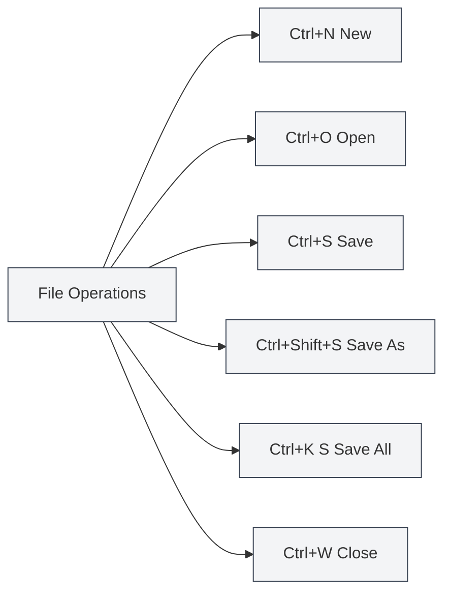

# Global Shortcuts

## Overview

Global shortcuts are keyboard shortcuts in MetaDoc that can be used on any interface. Mastering these shortcuts can significantly improve work efficiency.

**Note**: The shortcuts in this document have been verified against the current code implementation and are all implemented and available in the main or renderer processes.

## File Operations

### New Document

- **Shortcut**: `Ctrl+N` (Windows/Linux) or `Cmd+N` (macOS)
- **Function**: Create a new blank document
- **Use Case**: Quickly start editing a new document

### Open Document

- **Shortcut**: `Ctrl+O` (Windows/Linux) or `Cmd+O` (macOS)
- **Function**: Open the file selection dialog
- **Use Case**: Open an existing document

### Save Document

- **Shortcut**: `Ctrl+S` (Windows/Linux) or `Cmd+S` (macOS)
- **Function**: Save the current document
- **Use Case**: Save edited content to prevent loss

### Save As

- **Shortcut**: `Ctrl+Shift+S` (Windows/Linux) or `Cmd+Shift+S` (macOS)
- **Function**: Save the current document as a new file
- **Use Case**: Create a copy of a document or change the save location

### Save All Documents

- **Shortcut**: `Ctrl+K S` (Windows/Linux) or `Cmd+K S` (macOS)
- **Function**: Save all open documents
- **Usage Instructions**: First press `Ctrl+K` (or `Cmd+K`), then press `S`
- **Use Case**: Save all documents at once

<MenuItemsDemo mode="demo" :items='[{"id": "file", "items": ["save-all"]}]' />

### Close File

- **Shortcut**: `Ctrl+W` (Windows/Linux) or `Cmd+W` (macOS)
- **Function**: Close the current tab
- **Use Case**: Close an unneeded document

## Tab Operations

The tab bar displays all open documents and supports operations like new, switch, and close:

<MainTabs mode="demo" />

<ViewMenuItemsDemo mode="demo" :items='["editor", "outline"]' />

### New Tab

- **Shortcut**: `Ctrl+T` (Windows/Linux) or `Cmd+T` (macOS)
- **Function**: Create a new tab
- **Use Case**: Quickly create a new document

### Switch Tabs

#### Next Tab

- **Shortcut**: `Ctrl+Tab` (Windows/Linux) or `Cmd+Tab` (macOS)
- **Function**: Switch to the next tab
- **Usage Instructions**: Holding `Ctrl+Tab` displays a tab switching overlay; you can continue pressing Tab to select or click directly
- **Use Case**: Quickly switch between multiple documents

<TabSwitcherOverlay mode="demo" />

#### Previous Tab

- **Shortcut**: `Ctrl+Shift+Tab` (Windows/Linux) or `Cmd+Shift+Tab` (macOS)
- **Function**: Switch to the previous tab
- **Use Case**: Switch tabs in reverse order

### Reopen Closed Tab

- **Shortcut**: `Ctrl+Shift+T` (Windows/Linux) or `Cmd+Shift+T` (macOS)
- **Function**: Reopen the most recently closed tab
- **Usage Instructions**: Can be used consecutively to restore recently closed tabs in order (up to 20 tabs can be restored)
- **Use Case**: Quickly recover a tab closed by mistake

<MainTabs mode="demo" />

## Other Shortcuts

### Open User Manual

- **Shortcut**: `F1`
- **Function**: Open the user manual page
- **Use Case**: When you need to view the help documentation

<MenuItemsDemo mode="demo" :items='[{"id": "help"}]' />

## Shortcut List

### Windows/Linux Shortcuts

| Function               | Shortcut           |
| ---------------------- | ------------------ |
| New Document           | `Ctrl+N`           |
| Open Document          | `Ctrl+O`           |
| Save Document          | `Ctrl+S`           |
| Save As                | `Ctrl+Shift+S`     |
| Save All               | `Ctrl+K S`         |
| Close Tab              | `Ctrl+W`           |
| New Tab                | `Ctrl+T`           |
| Next Tab               | `Ctrl+Tab`         |
| Previous Tab           | `Ctrl+Shift+Tab`   |
| Reopen Closed          | `Ctrl+Shift+T`     |
| Open User Manual       | `F1`               |

### macOS Shortcuts

| Function               | Shortcut          |
| ---------------------- | ----------------- |
| New Document           | `Cmd+N`           |
| Open Document          | `Cmd+O`           |
| Save Document          | `Cmd+S`           |
| Save As                | `Cmd+Shift+S`     |
| Save All               | `Cmd+K S`         |
| Close Tab              | `Cmd+W`           |
| New Tab                | `Cmd+T`           |
| Next Tab               | `Cmd+Tab`         |
| Previous Tab           | `Cmd+Shift+Tab`   |
| Reopen Closed          | `Cmd+Shift+T`     |
| Open User Manual       | `F1`              |

## Shortcut Usage Tips

### Key Combination Order

Some shortcuts require keys to be pressed in sequence:

- **Save All**: First press `Ctrl+K`, then press `S` (not simultaneously)
- **Tab Switching**: Hold `Ctrl+Tab` to display the overlay, then continue pressing Tab to select

### Customizing Shortcuts

You can manage global shortcuts in **Settings → Shortcuts**:

- **Key Schemes**: The program provides three default schemes for Windows, Linux, and macOS. The appropriate one is automatically selected based on your system upon first launch.
- **Create/Edit Scheme**: You can create custom schemes and modify the keys for each action.
- **Import/Export**: Supports exporting a scheme as a JSON file or importing a scheme from a file.
- **Restore Default**: For each key binding that differs from the default scheme, you can click "Restore Default" to revert it.

Changes to a scheme only take effect after clicking "Save" at the bottom.

### Shortcut Conflicts

If a shortcut conflicts with the system or other software:

- **System Shortcuts**: Some system shortcuts may take priority.
- **Other Software**: Close the conflicting software or modify its shortcuts.
- **Custom Shortcuts**: You can modify them to other keys in **Settings → Shortcuts**.

### Memorization Tips

- **File Operations**: Use standard file operation shortcuts (Ctrl+N/O/S)
- **Tab Operations**: Use Tab key related combinations
- **Save All**: Use Ctrl+K as a command prefix

## Best Practices

1. **Master Common Shortcuts**: Become proficient with frequently used shortcuts to improve efficiency.
2. **Combine Shortcuts**: Use multiple shortcuts together to complete complex operations.
3. **Tab Switching**: Use Ctrl+Tab for quick switching to avoid mouse operations.
4. **Save Regularly**: Develop the habit of using Ctrl+S to save periodically.
5. **Quick Recovery**: Use Ctrl+Shift+T to quickly recover a tab closed by mistake.

## Notes

1. **Platform Differences**: Windows/Linux use Ctrl, macOS uses Cmd.
2. **Shortcut Conflicts**: Be aware of conflicts with shortcuts in other software.
3. **Key Combination Order**: Some shortcuts require keys to be pressed in sequence.
4. **Tab Switching**: Ctrl+Tab displays an overlay where you can continue selecting.
5. **Save All**: Ctrl+K S requires pressing Ctrl+K first, then S.

## Related Documents

- [[shortcuts.editor|Editor Shortcuts]]
- [[core.file-operations|File Operations]]
- [[core.multi-tab|Multi-Tab Management]]

<MenuItemsDemo mode="demo" :items='[{"id": "file"}]' />

<MainTabs mode="demo" />

<ViewMenuItemsDemo mode="demo" :items='["editor", "outline", "agent"]' />

<QuickStartPanel mode="demo" />