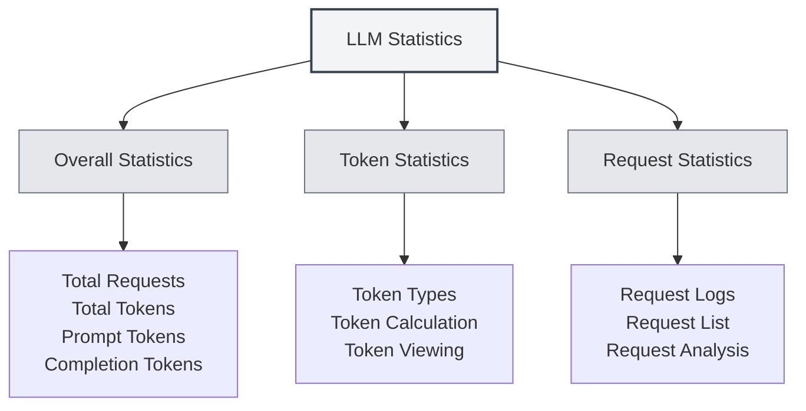

# LLM Statistics

## Overview

The LLM Statistics feature is used to track and view the usage of LLM APIs, including token consumption, request counts, cost statistics, and other information. These statistics help you understand LLM usage patterns and optimize your usage strategy.

## Opening LLM Statistics

### Access Methods

You can open the LLM Statistics page in the following ways:

- **Settings Page**: There may be an LLM Statistics entry in the settings page.
- **Menu Options**: Some menus may contain an LLM Statistics option.
- **Keyboard Shortcut**: In some cases, a keyboard shortcut may be available (may be supported in the future).

<SettingLlmSection mode="demo" />

## Statistical Information

<LlmStatisticsView mode="demo" />

<LlmStatisticsContent mode="demo" />

### Overall Statistics

The LLM Statistics page displays the following overall statistical information:

- **Total Requests**: The total number of all LLM requests.
- **Total Tokens**: The total number of tokens used across all requests.
- **Prompt Tokens**: The total number of Prompt tokens for all requests.
- **Completion Tokens**: The total number of Completion tokens for all requests.

### Time Range Filtering

You can filter statistics by time range:

- **All Time**: View statistics for all time.
- **Today**: View statistics for today.
- **This Week**: View statistics for this week.
- **This Month**: View statistics for this month.
- **Custom Range**: Select a custom start and end date.

### Statistical Charts

<ChartGenerationDisplay mode="demo" />

The statistics page may include the following charts:

- **Token Usage Trend**: Shows the trend of token usage over time.
- **Request Count Trend**: Shows the trend of request counts over time.
- **Model Usage Distribution**: Shows the usage distribution of different models.
- **Request Type Distribution**: Shows the distribution of different request types.

## Token Statistics

<DataAnalysisDisplay mode="demo" />

### Token Types

Token statistics include the following types:

- **Prompt Tokens**: The number of tokens in the input prompt.
- **Completion Tokens**: The number of tokens in the generated content.
- **Total Tokens**: The total number of tokens (Prompt + Completion).

### Token Calculation

Token calculation methods:

- **Automatic Logging**: Token usage is automatically logged after each LLM request.
- **Real-time Updates**: Statistics are updated in real-time.
- **Cumulative Statistics**: Statistics are calculated cumulatively.

### Viewing Tokens

You can view the following token information:

- **Total Tokens**: The total number of tokens across all requests.
- **Average Tokens**: The average number of tokens per request.
- **Maximum Tokens**: The maximum number of tokens in a single request.
- **Minimum Tokens**: The minimum number of tokens in a single request.

## Request Statistics

<LlmStatisticsContent mode="demo" />

### Request Logs

Each LLM request logs the following information:

- **Timestamp**: The time of the request.
- **Model Name**: The name of the model used.
- **Request Type**: The type of request (chat/completion).
- **Token Usage**: The token usage for this request.

### Request List

You can view the request list:

- **Time Sorting**: Sorted in reverse chronological order.
- **Detailed Information**: View detailed information for each request.
- **Filtering Function**: Filter requests by model, type, etc.

### Request Analysis

You can analyze requests:

- **Request Frequency**: Analyze the frequency of requests.
- **Model Usage**: Analyze the usage of different models.
- **Type Distribution**: Analyze the distribution of different request types.

## Cost Statistics

<LlmStatisticsView mode="demo" />

### Cost Calculation

Cost statistics are based on the following information:

- **Token Usage**: Costs are calculated based on token usage.
- **Model Pricing**: Different models have different pricing.
- **Cost Estimation**: Provides cost estimates (if supported).

### Viewing Costs

You can view the following cost information:

- **Total Cost**: The total cost of all requests.
- **Average Daily Cost**: The average cost per day.
- **Model Costs**: The cost distribution across different models.
- **Cost Trend**: The trend of costs over time.

**Note**: Cost statistics are for reference only. Actual costs are subject to the API provider's billing.

## Data Export

<DataAnalysisDisplay mode="demo" />

### Export Function

You can export statistical data:

- **Export Formats**: May support multiple formats (JSON, CSV, etc.).
- **Export Scope**: Can choose to export all data or filtered data.
- **Export Content**: Can choose which statistical information to export.

### Data Backup

Statistical data is automatically saved:

- **Local Storage**: Statistical data is saved locally.
- **Auto-save**: Data is automatically saved after each request.
- **Data Persistence**: Data persists after the application restarts.

## Clearing Statistics

### Clear Operation

You can clear statistical data:

1. Open the LLM Statistics page.
2. Find the "Clear Statistics" button.
3. Confirm the clear operation.
4. Statistical data will be cleared.

**Notes**:

- The clear operation cannot be undone.
- It is recommended to export a data backup before clearing.
- All statistical data will be lost after clearing.

## Statistics Settings

### Statistics Toggle

You can control the statistics feature:

- **Enable Statistics**: Enable LLM usage statistics.
- **Disable Statistics**: Disable the statistics feature (data will not be recorded).

### Statistics Precision

You can set the statistics precision:

- **Detailed Logging**: Log detailed information for each request.
- **Simplified Logging**: Only log overall statistical information.

## Best Practices

1. **Regular Review**: Regularly review LLM usage statistics to understand usage patterns.
2. **Cost Control**: Control usage based on cost statistics.
3. **Optimization Strategy**: Optimize usage strategies based on statistical data.
4. **Data Backup**: Regularly export statistical data for backup.
5. **Reasonable Use**: Use LLM features reasonably based on statistical information.

## Notes

1. **Statistical Accuracy**: Statistics are based on token information returned by the API.
2. **Cost Estimation**: Cost statistics are for reference only. Actual costs are subject to the bill.
3. **Data Storage**: Statistical data is stored locally and is not uploaded.
4. **Privacy Protection**: Statistics do not contain specific content, only usage information.
5. **Performance Impact**: The statistics feature has minimal performance impact and can be used with confidence.

## Related Documentation

- [[settings.llm|LLM Configuration]]
- [[ai.chat|AI Chat Function]]
- [[ai.completion|AI Auto-completion]]

<LlmStatisticsView mode="demo" />

<LlmStatisticsContent mode="demo" />