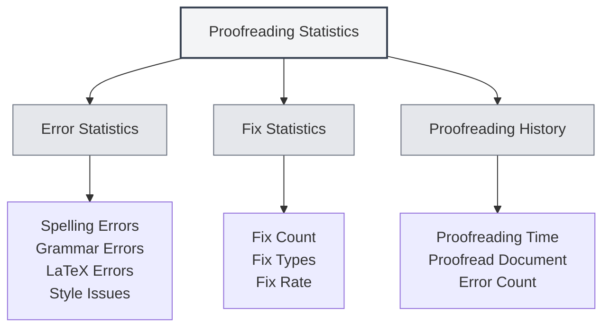

# Proofreading Tool Statistics

## Overview

The proofreading tool statistics feature is used to track and view the usage of document proofreading, including statistical information such as spell checking and grammar checking. These statistics can help you understand the usage of proofreading features and optimize your proofreading strategy.

<ProofreadView mode="demo" />

<ProofreadDisplay mode="demo" />

<DataAnalysisDisplay mode="demo" />

## Introduction to Proofreading Statistics

### What are Proofreading Statistics

Proofreading statistics record relevant information during the document proofreading process:

- **Error Statistics**: Record the number and types of errors detected.
- **Fix Statistics**: Record the number of errors fixed.
- **Proofreading History**: Record the history of proofreading operations.

### Types of Statistics

Proofreading statistics include the following types:

- **Spelling Errors**: Errors found by spell checking.
- **Grammar Errors**: Errors found by grammar checking.
- **LaTeX Errors**: Errors found by LaTeX syntax checking.
- **Style Issues**: Issues found by style checking.
- **Other Errors**: Other types of errors.

## Error Statistics

<DataAnalysisDisplay mode="demo" />

<ChartGenerationDisplay mode="demo" />

### Error Classification

The proofreading tool classifies and counts errors:

- **Spelling Errors**: The number of word spelling errors.
- **Grammar Errors**: The number of grammar errors.
- **LaTeX Errors**: The number of LaTeX syntax errors.
- **Style Issues**: The number of writing style issues.
- **Other Errors**: The number of other types of errors.

### Error Counting

Each proofreading session counts errors:

- **Total Errors**: The total number of all errors.
- **Error Count by Type**: The number of errors for each type.
- **Error Distribution**: The distribution of error types.

## Fix Statistics

### Fix Records

Records the status of error fixes:

- **Fix Count**: The number of errors that have been fixed.
- **Fix Types**: The types of errors that were fixed.
- **Fix Rate**: The proportion of errors that were fixed.

### Fix History

You can view the fix history:

- **Fix Time**: The time when the error was fixed.
- **Fix Content**: The specific content that was fixed.
- **Fix Method**: The method of fixing (manual/automatic).

## Proofreading History

### History Records

Records the history of proofreading operations:

- **Proofreading Time**: The time of the proofreading operation.
- **Proofread Document**: The document that was proofread.
- **Error Count**: The number of errors found.
- **Fix Count**: The number of errors fixed.

### Viewing History

You can view the proofreading history:

- **History List**: Displays all proofreading history records.
- **Detailed Information**: View detailed information for each proofreading session.
- **Statistical Analysis**: Perform statistical analysis on historical data.

## Statistics View

<ProofreadView mode="demo" />

### Unified View

The unified view displays all errors:

- **Error List**: Displays all errors in order.
- **Error Details**: Displays detailed information for each error.
- **Error Location**: Can locate the error position.

<DataAnalysisDisplay mode="demo" />

### Categorized View

The categorized view displays errors by type:

- **Grouped by Type**: Errors are displayed grouped by type.
- **Type Statistics**: Displays the error count for each type.
- **Type Filtering**: Can filter errors of specific types.

## Statistics Export

### Export Function

You can export proofreading statistics:

- **Export Format**: May support multiple formats (JSON, CSV, etc.).
- **Export Scope**: Can choose to export all data or filtered data.
- **Export Content**: Can choose which statistical information to export.

<ChartGenerationDisplay mode="demo" />

## Best Practices

1. **Regular Proofreading**: Regularly use the proofreading feature to check documents.
2. **Monitor Statistics**: Pay attention to error statistics to understand document quality.
3. **Fix Promptly**: Fix errors promptly upon discovery.
4. **Analyze Trends**: Analyze error trends to improve writing habits.
5. **Utilize History**: Use historical records to track document improvements.

## Notes

1. **Statistical Accuracy**: Statistics are based on the detection results of the proofreading tool.
2. **False Positive Handling**: Some detections may be false positives and require manual judgment.
3. **Data Storage**: Statistical data is stored locally and is not uploaded.
4. **Privacy Protection**: Statistics do not contain specific content, only statistical information.
5. **Performance Impact**: The statistics feature has minimal impact on performance and can be used with confidence.

## Related Documents

- [[ai.proofread|AI Proofreading Feature]]
- [[statistics.llm|LLM Statistics]]