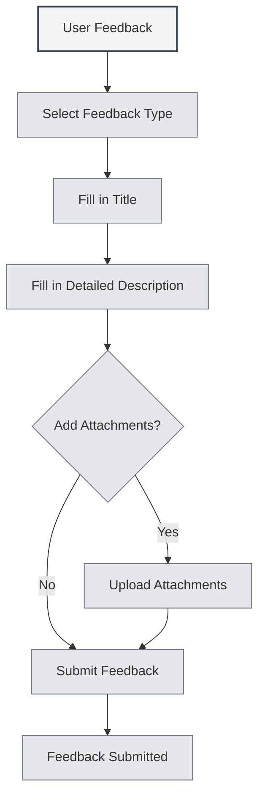

# User Feedback

## Overview

The user feedback feature allows you to submit bug reports, feature suggestions, or other feedback to the MetaDoc team. Your feedback is crucial for us to improve the product.

## Opening User Feedback

### Access Methods

You can open the user feedback page in the following ways:

- **Settings Page**: Click the "User Feedback" button on the "About" settings page.
- **Menu Option**: Some menus may have a user feedback option.
- **Shortcut Key**: There may be a shortcut key in some cases (may be supported in the future).

<SettingAboutSection mode="demo" />

## Feedback Types

### Feedback Type Selection

You need to select a feedback type when submitting:

- **Bug Report**: Report software errors or issues.
- **Feature Suggestion**: Propose new features or improvement suggestions.
- **Security Feedback**: Report security issues.
- **Other**: Other types of feedback.

<DialogDemo mode="demo" dialogType="feedback" />

### Type Descriptions

- **Bug Report**: Used to report software bugs, crashes, abnormal behavior, etc.
- **Feature Suggestion**: Used to propose new feature requests or improvements to existing features.
- **Security Feedback**: Used to report security vulnerabilities or security issues.
- **Other**: Used for other types of feedback, such as usage problems, documentation issues, etc.

## Feedback Content

### Title

The feedback title should be:

- **Concise and Clear**: Briefly describe the issue or suggestion.
- **Specific and Precise**: Avoid using vague titles.
- **Required Field**: The title is a mandatory field.

### Detailed Description

The detailed description should include:

- **Problem Description**: Clearly describe the encountered issue.
- **Expected Result**: Explain the expected outcome.
- **Additional Information**: Provide other information helpful for diagnosis.
- **Contact Information**: Optional contact details for follow-up.

### Feedback Template

The system provides a feedback template containing the following sections:

- **System Information**: Automatically filled system information.
- **Problem Description**: Area to describe the problem.
- **Expected Result**: Area for the expected outcome.
- **Additional Information**: Area for other information.
- **Contact Information**: Optional contact details.

<MenuItemsDemo mode="demo" :items='[{"id": "settings"}]' />

## Attachment Upload

### Attachment Support

You can upload attachments to help illustrate the issue:

- **File Types**: Supports any type of file.
- **File Size**: Individual files should not exceed 10MB.
- **Total Size**: The total size of all attachments should not exceed 50MB.
- **File Count**: Upload up to 5 attachments maximum.

<SettingImageSection mode="demo" />

### Attachment Purpose

Attachments can be used for:

- **Screenshots**: Provide screenshots of the issue.
- **Log Files**: Provide error logs.
- **Example Files**: Provide example files demonstrating the issue.
- **Other Files**: Provide other relevant files.

### Attachment Rules

- **Single File Limit**: Individual files must not exceed 10MB.
- **Total Size Limit**: The total size of all attachments must not exceed 50MB.
- **Quantity Limit**: Upload a maximum of 5 attachments.
- **Type Restriction**: No restriction on file types, subject to Gist capabilities.

## Submitting Feedback

### Submission Steps

1. **Select Type**: Choose the feedback type.
2. **Fill in Title**: Enter the feedback title.
3. **Fill in Description**: Provide a detailed description.
4. **Add Attachments**: Optional, add attachments.
5. **Submit Feedback**: Click the "Submit Feedback" button.

You can access user feedback via the settings page:

<MenuItemsDemo mode="demo" :items='[{"id": "settings"}]' />

<QuickStartPanel mode="demo" />

### Submission Validation

Validation is performed before submission:

- **Title Validation**: Ensures the title is not empty.
- **Description Validation**: Ensures the description is not empty.
- **Attachment Validation**: Ensures attachments comply with the rules.

<DialogDemo mode="demo" dialogType="submit-confirm" />

### Submission Result

The result is displayed after submission:

- **Submission Successful**: Shows a success message.
- **Submission Failed**: Shows an error message and the reason.

## Other Contact Methods

### Email Feedback

You can also provide feedback via email:

- **Email Address**: Displayed at the bottom of the feedback page.
- **Copy Email**: You can copy the email address.
- **Email Subject**: It is recommended to use a clear subject.

<ViewMenuItemsDemo mode="demo" :items='["settings"]' />

### QQ Group

You can join the official QQ group:

- **QQ Group Number**: Displayed at the bottom of the feedback page.
- **Copy Group Number**: You can copy the QQ group number.
- **Join Group**: After joining the group, you can provide real-time feedback.

## Feedback Handling

### Feedback Process

The handling process after feedback submission:

1. **Receive Feedback**: The system receives your feedback.
2. **Categorize**: Categorize based on the feedback type.
3. **Issue Analysis**: Analyze the problem or suggestion.
4. **Follow-up Handling**: Follow up and handle according to the situation.
5. **Feedback Response**: May respond via email or QQ group.

### Feedback Priority

Feedback is prioritized based on type and severity:

- **Security Feedback**: Highest priority.
- **Critical Bugs**: High priority.
- **Feature Suggestions**: Medium priority.
- **Other Feedback**: General priority.

<MainTabs mode="demo" />

## Best Practices

1. **Detailed Description**: Describe the issue or suggestion in as much detail as possible.
2. **Provide Screenshots**: If possible, provide screenshots of the issue.
3. **Provide Logs**: If encountering an error, provide error logs.
4. **Provide Examples**: If possible, provide example files demonstrating the issue.
5. **Contact Information**: Provide contact details for follow-up.

## Notes

1. **Feedback Format**: Fill in the feedback according to the template format.
2. **Attachment Size**: Pay attention to the attachment size limits.
3. **Contact Information**: Provide contact details for follow-up.
4. **Feedback Type**: Select the correct feedback type.
5. **System Information**: System information is automatically filled; do not delete it.

## Related Documentation

- [[settings.about|About Information]]
- [[user.profile|User Profile]]

<AIChat mode="demo" />