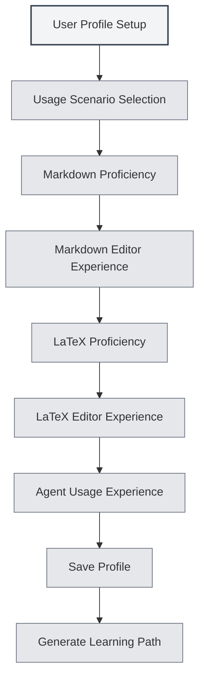

# User Profile

## Overview

The User Profile feature allows you to set personal information and usage preferences, helping MetaDoc better understand your needs and provide a personalized user experience and learning path.

## User Profile Settings

### Opening the User Profile

You can open the User Profile dialog in the following ways:

- **Home Page Prompt**: On first use, the home page may prompt you to set up your user profile.
- **User Manual**: Access user profile settings from within the user manual.
- **Menu Option**: Some menus may contain a user profile option.

<QuickStartPanel mode="demo" />

### User Profile Interface

The User Profile interface consists of the following main sections:

<UserProfileView mode="demo" />

### Profile Setup Wizard

User profile setup follows a step-by-step wizard format:

1.  **Usage Scenario**: Select your primary usage scenario.
2.  **Markdown Proficiency**: Assess your familiarity with Markdown syntax.
3.  **Markdown Editor Experience**: Select the types of Markdown editors you have used.
4.  **LaTeX Proficiency**: Assess your familiarity with LaTeX syntax.
5.  **LaTeX Editor Experience**: Select the types of LaTeX editors you have used.
6.  **Agent Usage Experience**: Assess your experience with Agent frameworks.

## Usage Scenario Selection

### Scenario Types

You can choose from the following usage scenarios:

- **Student**: Suitable for student users, focusing on learning basic editing and Markdown features.
- **Researcher**: Suitable for researchers, focusing on learning LaTeX and academic writing features.
- **IT Professional**: Suitable for IT professionals, focusing on learning Agent frameworks and advanced features.
- **Office User**: Suitable for office users, focusing on learning basic features and export functions.
- **Other**: Other usage scenarios.

### Scenario Impact

The selected scenario affects:

- **Learning Path**: The system will recommend a corresponding learning path.
- **Feature Recommendations**: Relevant features will be prioritized in recommendations.
- **AI Understanding**: Helps the AI better understand your needs.

## Skill Assessment

### Markdown Proficiency

Assess your familiarity with Markdown syntax:

- **No Experience**: Never used Markdown before.
- **Beginner**: Understand basic syntax (headings, lists, links, etc.).
- **Intermediate**: Familiar with common syntax and extended features.
- **Advanced**: Proficient in Markdown, knowledgeable about various extended syntaxes.

<QuickStartLatex mode="demo" />

### LaTeX Proficiency

Assess your familiarity with LaTeX syntax:

- **No Experience**: Never used LaTeX before.
- **Beginner**: Understand basic syntax and document structure.
- **Intermediate**: Familiar with common environments and commands.
- **Advanced**: Proficient in LaTeX, capable of writing complex documents.

<MenuItemsDemo mode="demo" :items='[{"id": "file"}]' />

### Agent Usage Experience

Assess your experience with Agent frameworks:

- **No Experience**: Never used Agent features before.
- **Beginner**: Understand basic concepts, have used simple features.
- **Intermediate**: Familiar with toolkits and workflows.
- **Advanced**: Capable of creating complex Agent configurations and workflows.

<AgentView mode="demo" />

## Editor Experience

### Markdown Editor Experience

Select the types of Markdown editors you have used:

- **WYSIWYG Editor**: Have used What-You-See-Is-What-You-Get editors.
- **Other Markdown Editors**: Have used other Markdown editors.

### LaTeX Editor Experience

Select the types of LaTeX editors you have used:

- **Online LaTeX Editor**: Have used online LaTeX editors.
- **Local LaTeX Editor**: Have used local LaTeX editors.

## Usage Preference Settings

### Editing Preferences

You can set preferences related to editing:

- **Editing Mode**: Preferred editing mode.
- **Preview Method**: Preferred preview method.
- **Auto-save**: Auto-save preference.

<MainTabs mode="demo" />

### Feature Preferences

You can set preferences related to features:

- **Frequently Used Features**: Mark commonly used features.
- **Feature Priority**: Set the priority of features.
- **Interface Layout**: Preferred interface layout.

<ViewMenuItemsDemo mode="demo" :items='["settings"]' />

## User Persona Settings

### Persona Generation

Based on your settings, the system generates a user persona:

- **Skill Level**: Assesses levels in various skills.
- **Usage Scenario**: Identifies the primary usage scenario.
- **Learning Needs**: Analyzes learning requirements.

### Persona Application

The user persona is applied to:

- **Learning Path**: Recommends a personalized learning path.
- **Feature Recommendations**: Prioritizes recommendations of relevant features.
- **AI Assistance**: Helps the AI better understand your needs.

## Learning Path Recommendations

### Path Types

Based on the user profile, the system recommends corresponding learning paths:

- **Student Path**: Learning path suitable for student users.
- **Researcher Path**: Learning path suitable for researchers.
- **IT Professional Path**: Learning path suitable for IT professionals.
- **Office User Path**: Learning path suitable for office users.

<AIChat mode="demo" />

### Path Content

The learning path includes:

- **Document List**: Learning documents arranged in sequence.
- **Learning Objectives**: The learning objectives for each document.
- **Estimated Time**: Estimated time required to complete the learning.

## Profile Updates

### Modifying the Profile

You can modify your user profile at any time:

1.  Open the User Profile dialog.
2.  Modify the various settings.
3.  Save the changes.

### Profile Synchronization

The user profile will be:

- **Saved Locally**: Stored locally.
- **Synchronized Across Windows**: Synchronized across all windows.
- **Persistent**: Remain effective upon next startup.

## Best Practices

1.  **Fill in Truthfully**: Provide accurate information to receive more precise recommendations.
2.  **Update Regularly**: Update your profile regularly as your skills improve.
3.  **Scenario Selection**: Choose the scenario that best matches your actual usage.
4.  **Skill Assessment**: Objectively assess your own skill levels.
5.  **Utilize Recommendations**: Make full use of the learning paths recommended by the system.

## Notes

1.  **Profile Privacy**: User profiles are stored locally only and are not uploaded.
2.  **Profile Optional**: User profile setup is optional; you may choose not to set it up.
3.  **Recommendations as Reference**: Learning path recommendations are for reference only; you can adjust them as needed.
4.  **Skill Changes**: Skill levels change; it is recommended to update your profile periodically.
5.  **Multiple Scenarios**: If you use multiple scenarios, select the primary one.

## Related Documents

- [[home.features|Home Page Features]]
- [[user.feedback|User Feedback]]
- [[quick-start.guide|Quick Start Guide]]

<QuickStartPanel mode="demo" />

<MenuItemsDemo mode="demo" :items='[{"id": "settings"}]' />

<MainTabs mode="demo" />