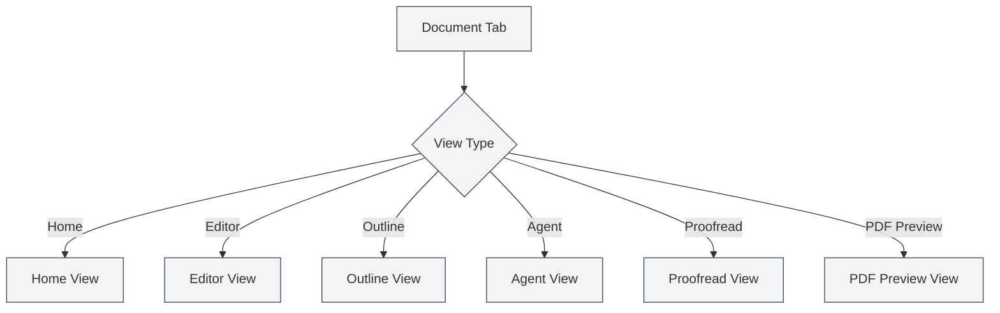

# View Types

## Overview

MetaDoc supports multiple view types, each providing different functionalities and interfaces. You can switch between different views as needed to accomplish various tasks.

## Introduction to View Types

### Home View

The Home View is the entry interface of MetaDoc, offering quick start and recent document features.

**Main Features**:

- **Quick Start**: Select a document format to quickly create a new document.
- **Recent Documents**: Displays a list of recently opened documents.
- **User Manual**: Quick access to the user manual.
- **User Profile**: Access user profile settings.

**Use Cases**:

- The initial interface after launching the application.
- When needing to quickly create a new document.
- To view recently used documents.

You can switch between different views via the sidebar.

### Editor View

The Editor View is the main interface for document editing, supporting Markdown, LaTeX, and plain text editing.

<LaTeXEditor mode="demo" />

**Main Features**:

- **Markdown Editing**: Edit Markdown documents using the Vditor editor.
- **LaTeX Editing**: Edit LaTeX documents using the Monaco editor.
- **Plain Text Editing**: Edit plain text using the Monaco editor.
- **Live Preview**: The Markdown editor supports live preview.

**Use Cases**:

- Editing document content.
- Writing technical documentation.
- Composing academic papers.

### Outline View

The Outline View displays a structured outline of the document, making it easy to view and edit the document structure.

<Outline mode="demo" />

**Main Features**:

- **Outline Display**: Shows document headings in a tree structure.
- **Node Operations**: Add, edit, delete, and move nodes.
- **Drag-and-Drop Sorting**: Adjust order by dragging nodes.
- **AI Features**: Generate sub-chapters, generate content, optimize outline.

**Use Cases**:

- Viewing document structure.
- Quickly navigating to specific sections.
- Editing the document outline.
- Using AI to generate content.

### Agent View

The Agent View provides an interactive interface for the Agent framework, used to create and manage Agent sessions.

<AgentView mode="demo" />

**Main Features**:

- **Session Management**: Create, edit, and delete Agent sessions.
- **Tool Configuration**: Configure the toolset used by the Agent.
- **Workflow**: Create and execute workflows.
- **Message Interaction**: Converse with the Agent.

**Use Cases**:

- Using an Agent to complete complex tasks.
- Automating document processing.
- Performing batch operations on documents.

### Proofread View

The Proofread View provides AI-powered proofreading functionality, checking for errors in documents and offering correction suggestions.

<ProofreadView mode="demo" />

**Main Features**:

- **Error Detection**: Detects spelling, grammar, and LaTeX syntax errors.
- **Error List**: Displays all detected errors.
- **Error Fixing**: Fix errors individually or fix all with one click.
- **Dictionary Management**: Add words to the dictionary.

**Use Cases**:

- Checking documents for errors.
- Improving document quality.
- Correcting spelling and grammar errors.

### PDF Preview View

The PDF Preview View displays a preview of the compiled PDF for LaTeX documents (LaTeX documents only).

<PdfPreviewPanel mode="demo" pdfUrl="" />

**Main Features**:

- **PDF Display**: Shows the content of the compiled PDF.
- **Zoom Control**: Zoom in and out of the PDF.
- **Refresh PDF**: Recompile and refresh the PDF.
- **Locate in Code**: Navigate from a PDF location to the corresponding LaTeX code.

**Use Cases**:

- Previewing the effect of a LaTeX document.
- Checking PDF formatting.
- Locating issues within the PDF.

## Switching Views

### Switching Methods

You can switch views using the following methods:

<MainTabs mode="demo" />

<ViewMenuItemsDemo mode="demo" :items='["editor", "outline", "agent"]' />

1.  **View Menu**: Click the view menu button on the left.
2.  **View Selector**: Select the view to switch to from the view menu.
3.  **Keyboard Shortcuts**: Some views may have shortcuts (may be supported in the future).

### View Menu

The view menu is displayed in the left sidebar:

-   **Home**: Switch to the Home View.
-   **Editor**: Switch to the Editor View.
-   **Outline**: Switch to the Outline View.
-   **Agent**: Switch to the Agent View.
-   **Proofread**: Switch to the Proofread View.
-   **PDF Preview**: Switch to the PDF Preview View (LaTeX documents only).

### View State

Each document tab has its own independent view state:

-   **View Memory**: The view state is saved after switching.
-   **Next Open**: The document will restore to the last used view when opened next time.
-   **Multiple Tabs**: Different tabs can use different views.

## View Characteristics

### View Independence

Each view is independent:

-   **State Independence**: Each view has its own independent state.
-   **Data Synchronization**: Data is automatically synchronized between views.
-   **Fast Switching**: View switching is very fast and does not require reloading.

### View Combination

Some views can be used in combination:

-   **Editor + Outline**: View the editor and outline simultaneously.
-   **Editor + PDF Preview**: The LaTeX editor can display both code and PDF.
-   **Editor + Proofread**: Proofread while editing.

## View Usage Suggestions

### Editing Documents

-   **Editor View**: Primarily use the Editor View for editing.
-   **Outline View**: Switch to the Outline View when you need to view the structure.
-   **PDF Preview**: Use PDF Preview to check the result while editing LaTeX documents.

### Document Proofreading

-   **Proofread View**: Specifically used for document proofreading.
-   **Editor View**: Return to the Editor View to continue editing after proofreading.

### Agent Tasks

-   **Agent View**: Create and manage Agent sessions.
-   **Editor View**: View documents processed by the Agent.

## Notes

1.  **View Switching**: View switching saves the current state.
2.  **PDF Preview**: The PDF Preview View is only supported for LaTeX documents.
3.  **View State**: The view state for each tab is saved independently.
4.  **Data Synchronization**: Data is automatically synchronized between views.
5.  **Performance Consideration**: Some views may consume more resources.

## Related Documentation

-   [[core.multi-tab|Multi-Tab Management]]
-   [[outline.basics|Outline View Features]]
-   [[agent.session|Agent Session Management]]
-   [[ai.proofread|AI Proofreading Features]]
-   [[latex.pdf-preview|PDF Preview Features]]
