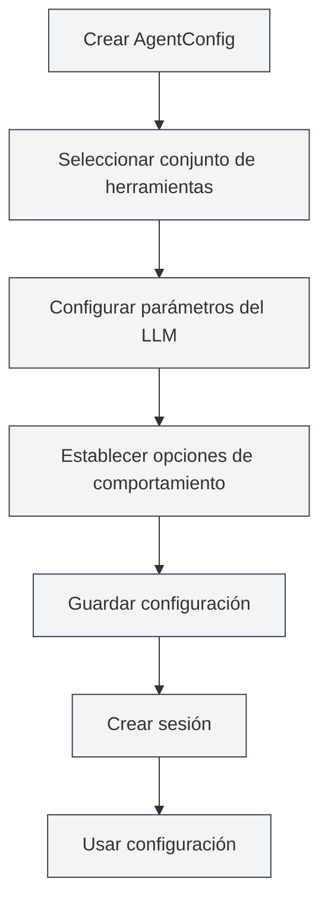

# Gestión de Configuración de Agentes

## Visión General

La configuración del agente (AgentConfig) es un componente central del marco de agente, utilizado para definir la identidad y el alcance de capacidades del agente. Cada AgentConfig está asociado a un conjunto de herramientas, determinando qué herramientas puede usar el agente, y permite configurar parámetros del LLM y opciones de comportamiento.

AgentConfig controla de manera flexible el alcance de capacidades del agente a través del mecanismo de intersección de conjuntos de herramientas, permitiéndole crear configuraciones de agente especializadas para diferentes escenarios.

<AgentView mode="demo" />

## Conceptos Clave

### Estructura de AgentConfig

AgentConfig contiene las siguientes partes principales:

- **Información básica**: ID, nombre, descripción, número de versión
- **Asociación de conjuntos de herramientas**: Lista de IDs de conjuntos de herramientas asociados (se toma la intersección)
- **Configuración del LLM**: Modelo, temperatura, número máximo de tokens, prompt del sistema, etc.
- **Configuración de comportamiento**: Si se permiten llamadas a herramientas, número máximo de llamadas, etc.
- **Tipo de escenario**: outline, editor, analysis, visualization, custom

### Intersección de Conjuntos de Herramientas

Cuando un AgentConfig está asociado a múltiples conjuntos de herramientas, las herramientas disponibles son la intersección de todos los conjuntos:

- El conjunto de herramientas A contiene: `[tool1, tool2, tool3]`
- El conjunto de herramientas B contiene: `[tool2, tool3, tool4]`
- Las herramientas disponibles para AgentConfig son: `[tool2, tool3]`

Este mecanismo le permite controlar con precisión el alcance de capacidades del agente.

<AgentConfigManager mode="demo" />

## Crear un AgentConfig

### Crear una Nueva Configuración

Pasos para crear un AgentConfig:

1. **Abrir la gestión de agentes**: En la vista de agente, haga clic en "Gestionar" → "Configuración de agente"
2. **Crear configuración**: Haga clic en el botón "Nueva configuración"
3. **Completar información básica**:
   - Nombre: Nombre de la configuración (admite múltiples idiomas)
   - Descripción: Descripción de la configuración (admite múltiples idiomas)
4. **Seleccionar conjunto de herramientas**: Seleccione uno o más conjuntos de herramientas de la lista desplegable
5. **Configurar LLM** (opcional):
   - Prompt del sistema: Prompt del sistema personalizado
   - Inyectar marca de tiempo: Si se debe inyectar la hora actual en el prompt del sistema
6. **Establecer comportamiento** (opcional):
   - Número máximo de llamadas a herramientas: Limita el número de llamadas a herramientas del agente (null significa sin límite)
7. **Guardar configuración**: Haga clic en el botón "Guardar"

<AgentView mode="demo" />

Puede acceder a la vista de agente a través de la barra lateral:

### Configuración Predeterminada

El sistema proporciona un AgentConfig predeterminado (`default-agent-config`), que incluye todas las herramientas integradas, no se puede eliminar pero se puede copiar.

## Editar un AgentConfig

### Operación de Edición

Editar un AgentConfig existente:

1. **Abrir la interfaz de gestión**: En la interfaz de gestión de configuración de agentes, encuentre la configuración a editar
2. **Hacer clic en editar**: Haga clic en el botón "Editar" en la tarjeta de configuración
3. **Modificar configuración**: Modifique el nombre, descripción, conjuntos de herramientas, configuración del LLM o configuración de comportamiento
4. **Guardar cambios**: Haga clic en el botón "Guardar"

**Nota**: La configuración predeterminada (`default-agent-config`) no permite edición, pero se puede copiar y luego editar.

<AgentConfigManager mode="demo" />

## Eliminar un AgentConfig

### Operación de Eliminación

Eliminar un AgentConfig no necesario:

1. **Abrir la interfaz de gestión**: En la interfaz de gestión de configuración de agentes, encuentre la configuración a eliminar
2. **Hacer clic en eliminar**: Haga clic en el botón "Eliminar" en la tarjeta de configuración
3. **Confirmar eliminación**: Confirme la eliminación en el cuadro de diálogo de confirmación que aparece

<AgentConfigManager mode="demo" />

**Nota**:

- La configuración predeterminada (`default-agent-config`) no se puede eliminar
- Eliminar una configuración no afecta las sesiones ya creadas, pero las nuevas sesiones no podrán usar esa configuración
- Si la configuración está siendo usada por una sesión, se le notificará antes de eliminar

## Copiar un AgentConfig

### Operación de Copia

Copiar un AgentConfig existente:

1. **Abrir la interfaz de gestión**: En la interfaz de gestión de configuración de agentes, encuentre la configuración a copiar
2. **Hacer clic en copiar**: Haga clic en el botón "Copiar" en la tarjeta de configuración
3. **Editar la copia**: El sistema creará una copia, con el nombre automáticamente añadiendo el sufijo " (copia)"
4. **Guardar modificaciones**: Modifique la copia según sea necesario y guárdela

<AgentView mode="demo" />

Copiar una configuración duplica todos los ajustes, incluyendo la asociación de conjuntos de herramientas, configuración del LLM y configuración de comportamiento.

## Importar/Exportar AgentConfig

### Exportar Configuración

Exportar un AgentConfig a un archivo JSON:

1. **Abrir la interfaz de gestión**: En la interfaz de gestión de configuración de agentes, encuentre la configuración a exportar
2. **Hacer clic en exportar**: Haga clic en el botón "Exportar" en la tarjeta de configuración
3. **Seleccionar ubicación**: Elija la ubicación y nombre del archivo para guardar
4. **Guardar archivo**: Haga clic en guardar para exportar la configuración

El archivo JSON exportado contiene toda la información de la configuración y puede usarse para respaldo o compartir.

<AgentConfigManager mode="demo" />

### Importar Configuración

Importar un AgentConfig desde un archivo JSON:

1. **Abrir la interfaz de gestión**: En la interfaz de gestión de configuración de agentes
2. **Hacer clic en importar**: Haga clic en el botón "Importar configuración"
3. **Seleccionar archivo**: Seleccione el archivo JSON a importar
4. **Validar datos**: El sistema valida el formato y contenido del archivo
5. **Importar configuración**: Después de una importación exitosa, se crea una nueva configuración

La configuración importada crea un nuevo ID, no sobrescribe configuraciones existentes (a menos que se use el modo de sobrescritura).

## Configuración del LLM

### Prompt del Sistema

AgentConfig puede configurar un prompt del sistema personalizado:

- **Prompt predeterminado**: Si no se establece, se usa el prompt del sistema predeterminado del marco de agente
- **Prompt personalizado**: Se puede establecer un prompt del sistema especializado, definiendo el rol y comportamiento del agente
- **Inyección de marca de tiempo**: Se puede elegir si inyectar la hora actual en el prompt del sistema

### Parámetros del LLM

AgentConfig puede sobrescribir la configuración global del LLM:

- **Modelo**: Especifica el modelo LLM a usar
- **Temperatura**: Controla la aleatoriedad de la salida (0-2)
- **Número máximo de tokens**: Limita el número máximo de tokens por llamada

**Nota**: Si AgentConfig no establece parámetros del LLM, se usará la configuración global del LLM.

<AgentConfigManager mode="demo" />

## Configuración de Comportamiento

### Control de Llamadas a Herramientas

AgentConfig puede controlar el comportamiento de llamadas a herramientas:

- **Permitir llamadas a herramientas**: Si se permite al agente llamar a herramientas (por defecto permitido)
- **Número máximo de llamadas a herramientas**: Limita el número máximo de llamadas a herramientas por tarea (null significa sin límite)
- **Permitir llamadas a flujos de trabajo**: Si se permite al agente llamar a flujos de trabajo (por defecto permitido)

### Escenarios de Uso

Diferentes configuraciones de comportamiento son adecuadas para diferentes escenarios:

- **Escenario de puro diálogo**: Deshabilitar llamadas a herramientas, solo diálogo
- **Escenario de herramientas limitadas**: Limitar el número de llamadas a herramientas, evitar llamadas excesivas
- **Escenario de funcionalidad completa**: Permitir todas las llamadas a herramientas, sin límites

<AgentConfigManager mode="demo" />

## Tipos de Escenario

AgentConfig puede establecer un tipo de escenario, utilizado para clasificación y gestión:

- **outline**: Escenario de esquema, para tareas relacionadas con la estructura de documentos
- **editor**: Escenario de editor, para tareas de edición de documentos
- **analysis**: Escenario de análisis, para tareas de análisis de documentos
- **visualization**: Escenario de visualización, para tareas de generación de gráficos
- **custom**: Escenario personalizado

El tipo de escenario se usa principalmente para clasificación, no afecta el comportamiento real del agente.

## Consejos de Uso

### Organización de Configuraciones

1. **Convención de nombres**: Use nombres claros, como "Agente de análisis de datos", "Agente de edición de documentos"
2. **Clasificación por escenario**: Use tipos de escenario para gestión clasificada
3. **Selección de conjuntos de herramientas**: Elija combinaciones de conjuntos de herramientas apropiadas según los requisitos de la tarea

<AgentConfigManager mode="demo" />

### Intersección de Conjuntos de Herramientas

1. **Control preciso**: Use la intersección de múltiples conjuntos de herramientas para controlar con precisión las capacidades del agente
2. **Diseño de conjuntos de herramientas**: Diseñe conjuntos de herramientas especializados, luego combínelos mediante intersección
3. **Prueba y verificación**: Después de crear una configuración, pruebe si la intersección de conjuntos de herramientas es correcta

<AgentConfigManager mode="demo" />

### Configuración del LLM

1. **Prompt del sistema**: Escriba prompts del sistema especializados para diferentes escenarios
2. **Ajuste de parámetros**: Ajuste la temperatura y el número máximo de tokens según las características de la tarea
3. **Inyección de marca de tiempo**: Para tareas que requieren conciencia del tiempo, habilite la inyección de marca de tiempo

## Preguntas Frecuentes

### P: ¿Cómo crear una configuración de agente especializada?

R: Cree una nueva configuración, seleccione conjuntos de herramientas especializados, establezca un prompt del sistema personalizado y configuración de comportamiento. Por ejemplo, cree un "Agente de análisis de datos", asocie conjuntos de herramientas de análisis de datos, establezca un prompt del sistema especializado.

### P: ¿Qué significa intersección de conjuntos de herramientas?

R: Cuando un AgentConfig está asociado a múltiples conjuntos de herramientas, las herramientas disponibles son la intersección de todos los conjuntos. Por ejemplo, si el conjunto de herramientas A contiene `[tool1, tool2, tool3]` y el conjunto de herramientas B contiene `[tool2, tool3, tool4]`, entonces las herramientas disponibles para AgentConfig son `[tool2, tool3]`.

### P: ¿Se puede modificar la configuración predeterminada?

R: La configuración predeterminada (`default-agent-config`) no permite edición, pero se puede copiar y luego editar. Copie la configuración predeterminada y luego modifique la copia.

### P: ¿Cuál es la relación entre la configuración del LLM y la configuración global?

R: Si AgentConfig establece parámetros del LLM, se usarán los ajustes de AgentConfig; de lo contrario, se usará la configuración global del LLM. Los ajustes de AgentConfig tienen mayor prioridad.

### P: ¿Cómo limitar el número de llamadas a herramientas del agente?

R: En la configuración de comportamiento de AgentConfig, establezca el "Número máximo de llamadas a herramientas". Establezca un número específico (ej. 10) para limitar las llamadas, o establezca null para indicar sin límite.

### P: ¿Eliminar una configuración afecta las sesiones existentes?

R: Eliminar una configuración no afecta las sesiones ya creadas, pero las nuevas sesiones no podrán usar esa configuración. Si la configuración está siendo usada por una sesión, se le notificará antes de eliminar.

<AgentView mode="demo" />

## Documentación Relacionada

- [[agent.introduction|Visión General del Marco de Agente]]
- [[agent.tools|Gestión de Conjuntos de Herramientas]]
- [[agent.session|Gestión de Sesiones de Agente]]
- [[agent.engine|Gestión del Motor de Agente]]