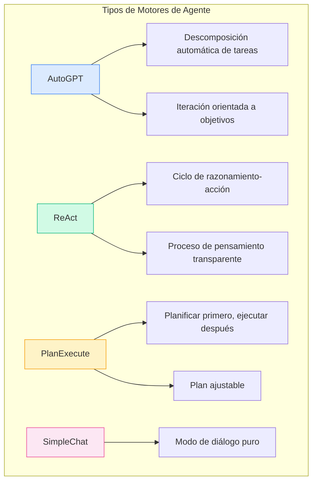
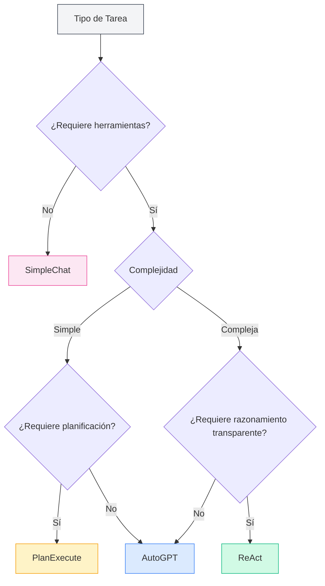
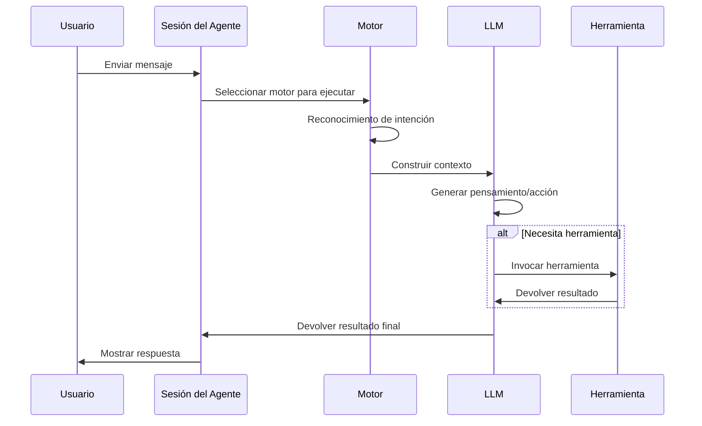

# Gestión del Motor de Agentes

## Descripción General

El motor de agentes define la estrategia de ejecución y el modo de comportamiento del agente. MetaDoc proporciona múltiples motores integrados, cada uno empleando un paradigma de ejecución de IA diferente, adecuado para distintos escenarios de tareas. Al seleccionar el motor apropiado, puede permitir que el agente complete tareas específicas de la manera más adecuada.

<AgentView mode="demo" />

## Tipos de Motores

MetaDoc admite los siguientes motores de agentes:

| Nombre del Motor | Características                             | Escenario Aplicable       |
| ---------------- | ------------------------------------------- | ------------------------- |
| **AutoGPT**      | Descomposición automática de tareas, iteración orientada a objetivos | Tareas complejas de múltiples pasos |
| **ReAct**        | Ciclo de razonamiento-acción, proceso de pensamiento transparente | Tareas que requieren razonamiento detallado |
| **PlanExecute**  | Planificar primero, ejecutar después, plan ajustable | Tareas estructuradas      |
| **SimpleChat**   | Puro diálogo, no invoca herramientas        | Preguntas y respuestas simples |



## Detalles de los Motores

### Motor AutoGPT

**Características**:

- **Descomposición automática de tareas**: Descompone automáticamente tareas complejas en subtareas.
- **Orientado a objetivos**: Ejecuta iterativamente en torno al objetivo final.
- **Toma de decisiones autónoma**: El agente decide autónomamente la siguiente acción.

<AgentView mode="demo" />
<AgentEngineManager mode="demo" />

**Escenarios aplicables**:

- Investigación y recopilación de información.
- Procesamiento de documentos de múltiples pasos.
- Tareas de creación abiertas.

**Ejemplo**:

```
Usuario: Ayúdame a escribir un artículo de revisión sobre inteligencia artificial.
Agente: [Descompone automáticamente en: 1. Recopilar información 2. Organizar esquema 3. Redactar contenido 4. Pulir y modificar]
```

### Motor ReAct

**Características**:

- **Ciclo de razonamiento-acción**: Muestra explícitamente el proceso de pensamiento (Reasoning) y la acción (Action).
- **Rastreable**: Cada paso tiene una base de razonamiento clara.
- **Transparente y controlable**: El usuario puede ver la lógica de pensamiento del agente.

<AgentView mode="demo" />
<AgentEngineManager mode="demo" />

**Escenarios aplicables**:

- Tareas que requieren explicar el proceso de razonamiento.
- Tareas de análisis lógico.
- Escenarios de demostración educativa.

**Ejemplo**:

```
Pensando: El usuario necesita que explique la funcionalidad de este código.
Acción: Invocar la herramienta de análisis de código.
Observación: [La herramienta devuelve el resultado]
Pensando: Basándome en el resultado del análisis, puedo explicar...
```

### Motor PlanExecute

**Características**:

- **Planificar primero, ejecutar después**: Primero formula un plan completo, luego ejecuta según el plan.
- **Plan ajustable**: El plan puede modificarse durante la ejecución.
- **Salida estructurada**: Formato de salida estandarizado, fácil de entender.

<AgentView mode="demo" />
<AgentEngineManager mode="demo" />

**Escenarios aplicables**:

- Tareas de gestión de proyectos.
- Generación de documentos estructurados.
- Trabajos procesuales.

**Ejemplo**:

```
Plan:
1. Analizar requisitos.
2. Diseñar solución.
3. Implementar funcionalidad.
4. Probar y verificar.

Ejecución: Completar cada fase paso a paso.
```

### Motor SimpleChat

**Características**:

- **Modo de diálogo puro**: Solo realiza conversación, no invoca ninguna herramienta.
- **Respuesta rápida**: No necesita esperar la ejecución de herramientas.
- **Simple y directo**: Adecuado para preguntas y respuestas simples.

**Escenarios aplicables**:

- Preguntas y respuestas generales.
- Explicación de conceptos.
- Diálogos simples.

**Nota**: Este motor no invoca herramientas, por lo tanto, no puede realizar funciones como operaciones de archivos, análisis de datos, etc.

<AgentEngineManager mode="demo" />

## Seleccionar Motor

### Cómo elegir el motor adecuado

Seleccione el motor según las características de la tarea:



<AgentView mode="demo" />

### Recomendaciones de selección

| Escenario de Tarea | Motor Recomendado       |
| ------------------ | ----------------------- |
| Preguntas y respuestas diarias | SimpleChat           |
| Edición de documentos | AutoGPT o ReAct     |
| Análisis de datos  | ReAct o PlanExecute |
| Escritura de código | ReAct                |
| Investigación y estudio | AutoGPT              |
| Gestión de proyectos | PlanExecute          |

<AgentView mode="demo" />

## Configurar Motor

### Seleccionar motor en la configuración del Agente

1. Acceda a [[agent.config|Gestión de Configuración de Agentes]].
2. Cree o edite una configuración de agente.
3. En la opción "Motor", seleccione el tipo de motor deseado.
4. Guarde la configuración.

### Configuración de parámetros del motor

Diferentes motores pueden tener configuraciones de parámetros específicas:

**Parámetros generales**:

- **Número máximo de iteraciones**: Limita las rondas de pensamiento y acción del agente.
- **Tiempo de espera**: Tiempo máximo de espera para una sola invocación.
- **Temperatura**: Controla el grado de creatividad de la salida.

**Parámetros específicos del motor**:

- **AutoGPT**: Profundidad de descomposición de objetivos.
- **ReAct**: Opciones de visualización del proceso de pensamiento.
- **PlanExecute**: Permisos de ajuste del plan.

## Flujo de Ejecución del Motor

### Flujo de ejecución general



### Características de ejecución de diferentes motores

**Características de ejecución de AutoGPT**:

1. Analizar el objetivo del usuario.
2. Descomponer automáticamente en subtareas.
3. Ejecutar subtareas una por una.
4. Resumir resultados y devolver.

**Características de ejecución de ReAct**:

1. Generar proceso de pensamiento.
2. Determinar la siguiente acción.
3. Ejecutar acción (invocar herramienta o generar respuesta).
4. Observar resultado.
5. Repetir hasta completar la tarea.

**Características de ejecución de PlanExecute**:

1. Analizar requisitos.
2. Formular un plan completo.
3. Ejecutar paso a paso.
4. Devolver resultados estructurados.

## Motor Personalizado

### Personalización de configuración del motor

Para usuarios avanzados, se puede personalizar el comportamiento del motor:

1. **Modificar indicaciones del sistema**: Ajustar el rol y comportamiento del agente.
2. **Establecer preferencias de herramientas**: Especificar herramientas de uso prioritario.
3. **Ajustar parámetros de razonamiento**: Temperatura, número máximo de tokens, etc.

### Crear motor personalizado (Avanzado)

Los desarrolladores pueden crear nuevos tipos de motores:

1. Heredar la interfaz del motor base.
2. Implementar lógica de ejecución específica.
3. Registrar en el gestor de motores.
4. Seleccionar para usar en la configuración.

## Mejores Prácticas

### Principios de selección de motor

1. **Comenzar simple**: Si no está seguro, pruebe primero con SimpleChat.
2. **Seleccionar según complejidad**: Usar AutoGPT o ReAct para tareas complejas.
3. **Considerar explicabilidad**: Usar ReAct cuando se necesite explicación.

### Optimizar el efecto del motor

1. **Describir requisitos claramente**: El efecto del motor depende en gran medida de la claridad de la entrada.
2. **Usar herramientas razonablemente**: Configurar un conjunto de herramientas adecuado para el agente.
3. **Establecer límites razonables**: Controlar costos mediante parámetros como el número máximo de iteraciones.
4. **Retroalimentación oportuna**: Proporcionar retroalimentación a las respuestas del agente para ayudar a mejorar.

## Preguntas Frecuentes

### P: ¿Por qué el agente no se ejecuta como se esperaba?

R: Posibles razones:

- Selección de motor inadecuada.
- Configuración insuficiente del conjunto de herramientas.
- Descripción de la tarea poco clara.
- Se alcanzó el límite de número máximo de iteraciones.

### P: ¿Se puede cambiar de motor durante una conversación?

R: Actualmente no se admite cambiar de motor en una sola conversación. Si necesita cambiar de motor, se recomienda:

1. Finalizar la sesión actual.
2. Crear una nueva sesión.
3. Seleccionar una configuración de agente que use un motor diferente.

### P: ¿Qué motor es más adecuado para principiantes?

R: Recomendaciones:

- Primero usar SimpleChat para familiarizarse con la función de diálogo.
- Luego probar ReAct para observar el proceso de razonamiento.
- Una vez familiarizado, usar AutoGPT para manejar tareas complejas.

### P: ¿El motor afecta la calidad de las respuestas?

R: Sí. Diferentes motores tienen diferentes formas de pensar y estrategias de ejecución:

- La misma tarea puede dar respuestas diferentes con motores distintos.
- Elegir el motor adecuado puede mejorar significativamente el efecto.
- Se recomienda configurar agentes diferentes para diferentes tipos de tareas.

## Documentación Relacionada

- [[agent.introduction|Descripción General del Marco de Agentes]]
- [[agent.config|Gestión de Configuración de Agentes]]
- [[agent.session|Gestión de Sesiones de Agentes]]
- [[agent.tools|Gestión de Conjuntos de Herramientas]]