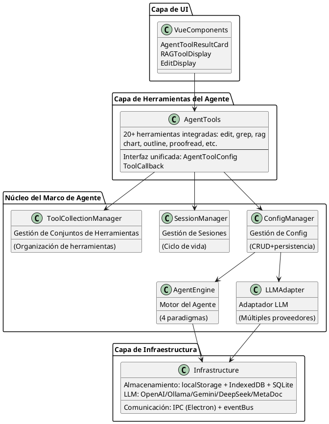
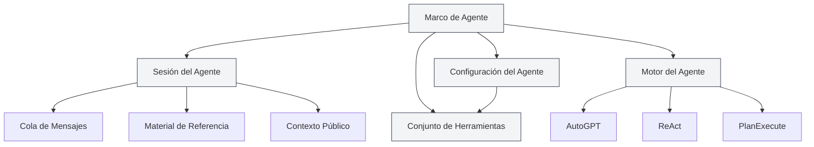
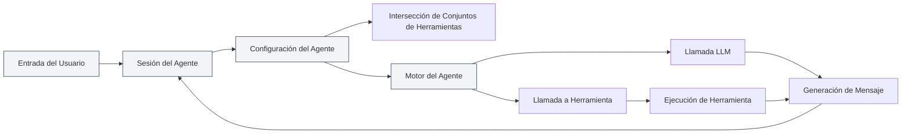
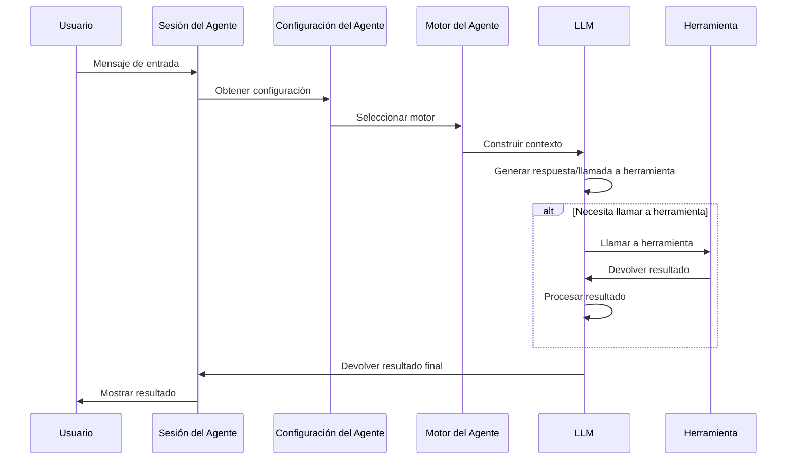

# Resumen del Marco de Agente

## Visión General

El Marco de Agente es el núcleo de MetaDoc para construir y gestionar sistemas de Agentes Inteligentes, empleando un **diseño de arquitectura por capas**. Proporciona una gestión completa del ciclo de vida del Agente, incluyendo funciones como gestión de sesiones, gestión de configuración, gestión de conjuntos de herramientas y gestión de motores.

El Marco de Agente se construye sobre el sistema de Herramientas existente. A través de componentes clave como la configuración del Agente (AgentConfig), los conjuntos de herramientas (ToolCollection) y las sesiones del Agente (AgentSession), implementa un sistema de Agente flexible y extensible.

<AgentSessionManager mode="demo" />

## Vista Previa de la Interfaz

El Marco de Agente proporciona una interfaz intuitiva para gestionar sesiones y herramientas del Agente:

<AgentView mode="demo" />

## Arquitectura Técnica

### Capas de la Arquitectura



### Rutas de Archivos Principales

| Categoría         | Ruta del Archivo                                                          | Descripción                              |
| ----------------- | ------------------------------------------------------------------------- | ---------------------------------------- |
| **Definiciones de Tipo** | `src/renderer/src/types/agent-framework.ts`                               | Definiciones de tipos principales del Marco de Agente |
| **Definiciones de Tipo** | `src/renderer/src/types/agent-tool.ts`                                    | Definiciones de tipos de herramientas del Agente |
| **Gestión de Configuración** | `src/renderer/src/utils/agent-framework/agent-config-manager.ts`          | CRUD y persistencia de AgentConfig       |
| **Gestión de Sesiones** | `src/renderer/src/utils/agent-framework/agent-session-manager.ts`         | Gestión del ciclo de vida de AgentSession |
| **Gestión de Conjuntos de Herramientas** | `src/renderer/src/utils/agent-framework/tool-collection-manager.ts`       | Organización y gestión de conjuntos de herramientas |
| **Gestión de Motores** | `src/renderer/src/utils/agent-framework/agent-engine-manager.ts`          | Gestión de configuración del motor del Agente |
| **Ejecución del Motor** | `src/renderer/src/utils/agent-framework/agent-engine-executor.ts`         | Implementación de los 4 paradigmas de ejecución |
| **Ejecución de Herramientas** | `src/renderer/src/utils/agent-framework/tool-runner.ts`                   | Punto de entrada unificado para llamadas a herramientas |
| **Adaptación LLM** | `src/renderer/src/utils/agent-framework/llm-adapter.ts`                   | Adaptación para múltiples proveedores LLM |



## Conceptos Principales

### Sesión del Agente (AgentSession)

<AgentView mode="demo" />

Una sesión del Agente es una instancia de AgentConfig, que representa un entorno de ejecución de Agente independiente y con contexto. Implementada en `agent-session-manager.ts`, cada sesión mantiene su propio historial de mensajes, material de referencia, espacio de contexto público y admite funciones avanzadas como cola de mensajes, reintentos, Duplicate, etc.

**Definición de Tipo** (líneas 387-424 de `types/agent-framework.ts`):

```typescript
export interface AgentSession {
  entityType: 'agent-session'
  id: string
  title: string
  agentConfigId: string // AgentConfig asociado
  messages: AgentMessage[] // Historial de mensajes
  messageQueue: QueuedMessage[] // Cola de mensajes
  referenceStore: Reference[] // Material de referencia
  publicContext: PublicContext // Contexto público
  executionNodes: ExecutionNode[] // Nodos de ejecución (para reintentos)
  status: AgentSessionStatus // Estado de la sesión
}
```

**Máquina de Estados de la Sesión**:

```
idle → thinking → generating → tool-calling → waiting-input → error
```

Ver detalles en [[agent.session|Gestión de Sesiones del Agente]].

### Configuración del Agente (AgentConfig)

<CompletionSettingsPanel mode="demo" />

AgentConfig define la identidad y el alcance de capacidades del Agente, implementado en `agent-config-manager.ts`.

**Definición de Tipo** (líneas 242-289 de `types/agent-framework.ts`):

```typescript
export interface AgentConfig {
  entityType: 'agent-config'
  id: string
  name: LocalizedText // Nombre con soporte i18n
  description: LocalizedText // Descripción con soporte i18n
  toolCollectionIds: string[] // IDs de conjuntos de herramientas asociados (intersección)
  maxToolCalls?: number | null // Número máximo de llamadas a herramientas
  llmConfig?: {
    model?: string
    temperature?: number
    systemPrompt?: string // Prompt del sistema
    injectTimestamp?: boolean
  }
  behavior?: {
    allowToolCalls?: boolean
  }
  scenario?: 'outline' | 'editor' | 'analysis' | 'visualization' | 'custom'
}
```

**Funcionalidades Principales**:

- **Configuración Predeterminada**: `default-agent-config` (integrada, no se puede eliminar)
- **Intersección de Conjuntos de Herramientas**: Cuando se asocian múltiples conjuntos de herramientas, las herramientas disponibles son la intersección de todos ellos.
- **Sobrescritura de Parámetros LLM**: Puede sobrescribir la configuración global de LLM.
- **Persistencia**: Almacenada en `localStorage`, clave `'agent-configs'`.

La gestión relacionada con el Agente está en el menú de la **vista Agente**. Empiece por [[agent.tools|Gestión de Conjuntos de Herramientas]] y [[agent.capabilities|Reglas, habilidades y gestión MCP]]. (La entrada de índice de «Configuración del Agente» se eliminó; el artículo sigue como referencia.)

### Conjunto de Herramientas (ToolCollection)

<DataAnalysisDisplay mode="demo" />

Un conjunto de herramientas es una colección de herramientas del Agente, utilizada para organizar y gestionar las herramientas disponibles para el Agente. Un AgentConfig puede asociarse con múltiples conjuntos de herramientas; las herramientas disponibles son la intersección de todos los conjuntos asociados.

Ver detalles en [[agent.tools|Gestión de Conjuntos de Herramientas]].

### Material de Referencia (Reference)

<RAGToolDisplay mode="demo" />

El material de referencia son documentos y archivos a los que se hace referencia en una sesión del Agente. El Agente puede percibir este contenido y razonar y operar basándose en él. Admite varios tipos de referencias como archivos, URL, bases de conocimiento, etc.

Las referencias se usan y gestionan en sesiones; vea [[agent.session|Gestión de Sesiones del Agente]]. (La entrada independiente de «Material de referencia» se quitó del índice.)

### Motor del Agente (AgentEngine)

<DiffDisplay mode="demo" />

El motor del Agente define la estrategia de ejecución y el modo de comportamiento del Agente, incluyendo múltiples paradigmas como AutoGPT, ReAct, PlanExecute, etc. Diferentes motores son adecuados para diferentes escenarios de tareas.

Los paradigmas de ejecución se eligen según el contexto de la sesión; vea [[agent.session|Gestión de Sesiones del Agente]]. (La entrada «Motor del Agente» se quitó del índice.)

## Arquitectura del Sistema

La arquitectura del sistema del Marco de Agente es la siguiente:



## Flujo de Ejecución

El flujo de ejecución básico del Agente:

1. **Entrada del Usuario**: El usuario ingresa un mensaje en la sesión del Agente.
2. **Reconocimiento de Intención**: El sistema reconoce la intención del usuario y actualiza la descripción de las herramientas disponibles.
3. **Selección del Motor**: Selecciona el motor de ejecución según la configuración del Agente.
4. **Construcción del Contexto**: Construye un contexto que incluye historial de mensajes, material de referencia, descripciones de herramientas.
5. **Llamada LLM**: Invoca al LLM para generar una respuesta o una llamada a herramienta.
6. **Ejecución de Herramienta**: Si el LLM decide llamar a una herramienta, ejecuta la herramienta correspondiente.
7. **Procesamiento del Resultado**: Devuelve el resultado de la ejecución de la herramienta como una Observación (Observation) al LLM.
8. **Ciclo Iterativo**: Dependiendo del tipo de motor, puede realizar múltiples iteraciones hasta completar la tarea.
9. **Salida del Resultado**: Muestra el resultado final al usuario.



## Características Funcionales

### Funciones Principales

- **Gestión de Sesiones**: Crear, eliminar, copiar, exportar/importar sesiones.
- **Gestión de Configuración**: Configuración flexible del Agente, soporte para intersección de múltiples conjuntos de herramientas.
- **Gestión de Conjuntos de Herramientas**: Organizar y gestionar herramientas del Agente.
- **Gestión de Material de Referencia**: Gestionar documentos y archivos de referencia en la sesión.
- **Gestión de Motores**: Soporte para múltiples paradigmas de ejecución, motores personalizables.

### Funciones Avanzadas

- **Cola de Mensajes**: Insertar mensajes durante la ejecución del Agente.
- **Mecanismo de Reintento**: Soporte para reintentar nodos de ejecución fallidos.
- **Función Duplicate**: Copiar sesiones o nodos de ejecución.
- **Contexto Público**: Espacio de contexto compartido a nivel de sesión.
- **Seguimiento de Nodos de Ejecución**: Registrar el estado y resultado de cada nodo de ejecución.

## Escenarios de Uso

El Marco de Agente es adecuado para los siguientes escenarios:

- **Edición de Documentos**: Usar herramientas del Agente para editar y optimizar documentos.
- **Análisis de Datos**: Usar herramientas de análisis de datos para procesamiento y visualización de datos.
- **Generación de Contenido**: Usar el motor del Agente con conjuntos de herramientas para generar contenido estructurado.
- **Recuperación de Conocimiento**: Realizar búsquedas inteligentes y análisis combinados con bases de conocimiento.
- **Tareas Automatizadas**: Implementar tareas de múltiples pasos a través del Agente y conjuntos de herramientas.

## Comienzo Rápido

Para comenzar a usar el Marco de Agente, se recomienda aprender en el siguiente orden:

1. [[agent.introduction|Resumen del Marco de Agente]] (este documento)
2. [[agent.tools|Gestión de Conjuntos de Herramientas]]: Aprender a gestionar conjuntos de herramientas.
3. [[agent.capabilities|Reglas, habilidades y gestión MCP]]: Reglas, skills del espacio de trabajo y MCP.
4. [[agent.session|Gestión de Sesiones del Agente]]: Crear y gestionar sesiones.

## Preguntas Frecuentes

### P: ¿Cuál es la diferencia entre el Marco de Agente y el Chat de IA?

R: El Chat de IA es una función de conversación simple, mientras que el Marco de Agente proporciona un sistema completo de Agente, incluyendo funciones avanzadas como llamadas a herramientas, gestión de material de referencia, etc. El Marco de Agente puede ejecutar tareas complejas, no solo conversar.

### P: ¿Cómo elegir el motor de Agente adecuado?

R:

- **Motor AutoGPT**: Adecuado para la mayoría de las tareas inteligentes, con gran capacidad de toma de decisiones autónoma.
- **Motor ReAct**: Adecuado para tareas que requieren pasos de razonamiento detallados, con proceso de pensamiento explícito.
- **Motor PlanExecute**: Adecuado para tareas que requieren ejecución estructurada, primero planificar luego ejecutar.
- **Motor SimpleChat**: Adecuado para tareas de pura conversación, sin llamadas a herramientas.

### P: ¿Qué significa intersección de conjuntos de herramientas?

R: Cuando un AgentConfig está asociado a múltiples conjuntos de herramientas, las herramientas disponibles son la intersección de todos los conjuntos. Por ejemplo, si el conjunto A contiene `[tool1, tool2, tool3]` y el conjunto B contiene `[tool2, tool3, tool4]`, entonces las herramientas disponibles para el AgentConfig son `[tool2, tool3]`.

## Documentación Relacionada

- [[agent.session|Gestión de Sesiones del Agente]]
- [[agent.tools|Gestión de Conjuntos de Herramientas]]
- [[agent.capabilities|Reglas, habilidades y gestión MCP]]
- [[ai.llm-config|Configuración LLM]]

<QuickStartPanel mode="demo" />