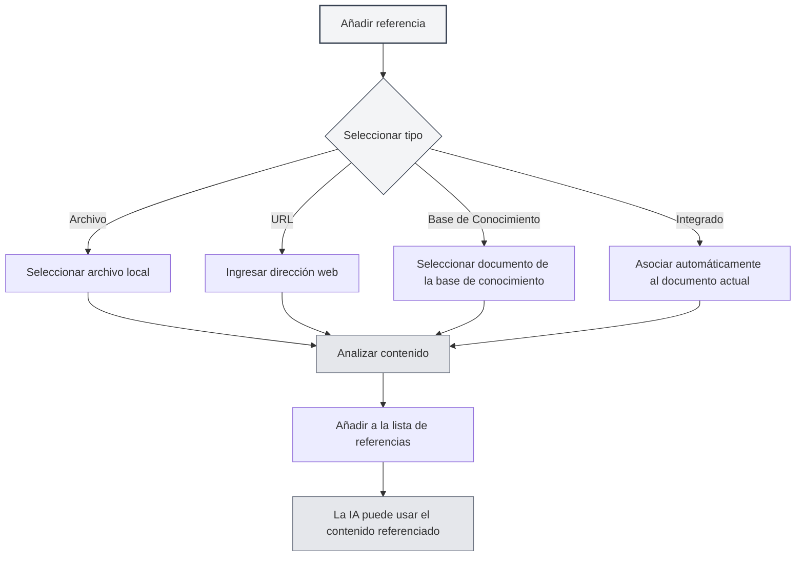

# Gestión de Material de Referencia

## Visión General

El material de referencia es una función importante en las sesiones del Agente, que le permite incorporar contenido externo como documentos, páginas web, archivos, etc., a la conversación. El Agente puede razonar y responder basándose en este material de referencia, haciendo que las respuestas de la IA sean más precisas y relevantes.

A través del material de referencia, usted puede:

- Hacer que la IA consulte contenido específico de documentos.
- Discutir basándose en información de páginas web.
- Analizar el contenido de archivos locales.
- Realizar preguntas y respuestas profundas combinando con la base de conocimiento.

## Abrir la Gestión de Referencias

En la interfaz de sesión del Agente, haga clic en la pestaña "Referencias" para abrir el panel de gestión de material de referencia.

El panel de referencias muestra todo el material de referencia añadido en la sesión actual, incluyendo:

- Nombre del archivo o URL.
- Tipo de referencia (Archivo/URL/Base de Conocimiento/Documento Integrado).
- Estado de activación.
- Vista previa del contenido.

Puede acceder a la vista del Agente a través de la barra lateral:

<ReferenceManager mode="demo" />
<ReferenceDisplay mode="demo" />

## Añadir Referencias

### Añadir Referencia de Archivo

Añadir un archivo local como material de referencia:

1. En el panel de referencias, haga clic en el botón "Añadir referencia".
2. Seleccione el tipo "Archivo".
3. En el selector de archivos, elija el archivo que desea referenciar.
4. Confirme la adición.

**Formatos de archivo admitidos**:

- Documentos Markdown (.md).
- Documentos LaTeX (.tex).
- Archivos PDF (.pdf).
- Documentos de Word (.docx).
- Archivos de texto plano (.txt).
- Archivos de imagen (.png, .jpg).

<ReferenceManager mode="demo" />

### Añadir Referencia de URL

Referenciar contenido de una página web:

1. En el panel de referencias, haga clic en el botón "Añadir referencia".
2. Seleccione el tipo "URL".
3. Ingrese la dirección web que desea referenciar.
4. Haga clic en confirmar.

MetaDoc capturará automáticamente el contenido de la página web y lo añadirá a las referencias.

<ReferenceManager mode="demo" />
<ReferenceDisplay mode="demo" />

### Añadir Referencia de Base de Conocimiento

Referenciar documentos de la base de conocimiento:

1. En el panel de referencias, haga clic en el botón "Añadir referencia".
2. Seleccione el tipo "Base de Conocimiento".
3. Desde la lista de la base de conocimiento, seleccione el documento que desea referenciar.
4. Confirme la adición.

<ReferenceDisplay mode="demo" />

### Referencia de Documento Integrado

Cada sesión del Agente tiene habilitada por defecto la "Referencia de Documento Integrado" (referencia número 0), que obtiene dinámicamente el contenido del documento actualmente abierto como material de referencia.



## Gestionar Referencias

### Activar/Desactivar Referencias

Cada material de referencia puede controlarse independientemente su estado de activación:

- **Activar**: El contenido referenciado participará en el proceso de razonamiento de la IA.
- **Desactivar**: El contenido referenciado no participará temporalmente en el razonamiento, pero se mantendrá en la lista.

Haga clic en el interruptor al lado del material de referencia para cambiar su estado de activación.

<ReferenceDisplay mode="demo" />

### Vista Previa del Contenido Referenciado

Haga clic en un material de referencia para obtener una vista previa de su contenido:

- **Referencia de archivo**: Muestra una vista previa de texto del contenido del archivo.
- **Referencia de URL**: Muestra el contenido capturado de la página web.
- **Referencia de base de conocimiento**: Muestra fragmentos relevantes de la base de conocimiento.
- **Referencia integrada**: Muestra el contenido del documento actual.

### Eliminar Referencias

Eliminar referencias que ya no sean necesarias de la lista:

1. En el panel de referencias, encuentre la referencia que desea eliminar.
2. Haga clic en el botón de eliminar (icono ×).
3. Confirme la eliminación.

**Nota**: Eliminar una referencia solo elimina la relación de referencia, no afecta el archivo original.

<ReferenceManager mode="demo" />

## El Papel de las Referencias en la Conversación

### Conciencia de Referencias

Cuando usted activa referencias, el Agente al responder:

1. **Analiza el contenido referenciado**: Comprende el contenido de los documentos, páginas web o archivos referenciados.
2. **Combina el contexto**: Integra el contenido referenciado con el historial de la conversación.
3. **Genera la respuesta**: Produce respuestas más precisas basándose en el contenido referenciado.

### Ejemplos de Uso

**Escenario 1: Preguntas y respuestas basadas en documentos**

```
Usuario: [Añadió un documento técnico como referencia]
Pregunta del usuario: ¿Cuáles son las mejores prácticas mencionadas en este documento?
IA: Según el documento que usted ha referenciado, las mejores prácticas incluyen...
```

**Escenario 2: Comparación de múltiples documentos**

```
Usuario: [Añadió dos artículos de investigación como referencias]
Pregunta del usuario: Compara los métodos de investigación de estos dos artículos.
IA: El primer artículo utilizó... mientras que el segundo artículo adoptó...
```

**Escenario 3: Análisis de contenido web**

```
Usuario: [Añadió una página web de noticias como referencia]
Pregunta del usuario: Resume el contenido principal de este reportaje.
IA: Según el contenido de la página web, se reporta principalmente...
```

## Mejores Prácticas

### Uso Eficiente de las Referencias

1. **Seleccionar material relevante**: Añada solo referencias relacionadas con el tema actual, evitando la sobrecarga de información.
2. **Controlar la cantidad de referencias**: Se recomienda no tener más de 5 referencias activas simultáneamente para garantizar la eficiencia del procesamiento.
3. **Limpiar oportunamente**: Al finalizar la conversación, elimine las referencias que ya no necesite para mantener la lista ordenada.

### Estrategias de Referencia

1. **Análisis de documentos**: Al analizar documentos largos, añada la referencia del documento y haga preguntas específicas.
2. **Recuperación de conocimiento**: Utilice referencias de la base de conocimiento para preguntas y respuestas basadas en ella.
3. **Información en tiempo real**: Obtenga información web actualizada a través de referencias de URL.
4. **Continuidad del contexto**: Utilice la referencia integrada para que la IA comprenda el documento que está editando actualmente.

## Consejos de Uso

### Adición Rápida

- **Añadir por arrastre**: Arrastre y suelte archivos directamente en el panel de referencias.
- **Añadir con clic derecho**: Haga clic derecho en un archivo o página web y seleccione "Añadir a referencias".
- **Atajos de teclado**: Use atajos de teclado para abrir rápidamente el panel de referencias.

<ReferenceManager mode="demo" />

### Combinación de Referencias

Puede añadir simultáneamente múltiples referencias de diferentes tipos:

- Un documento PDF + un enlace web.
- Múltiples documentos de la base de conocimiento.
- Archivo local + referencia de documento integrado.

La IA analizará de manera integral el contenido de todas las referencias activadas.

<ReferenceDisplay mode="demo" />

### Desactivación Temporal

Si no está seguro de si una referencia es útil, puede desactivarla primero:

1. Observe la respuesta de la IA sin esa referencia.
2. Luego active la referencia y compare la diferencia en las respuestas.
3. Decida si mantenerla según el resultado.

## Preguntas Frecuentes

### P: ¿Hay límites de tamaño para el contenido referenciado?

R: Sí. Los archivos demasiado grandes pueden ser truncados. Se recomienda:

- Añadir documentos muy grandes por capítulos.
- Usar la base de conocimiento para manejar grandes volúmenes de documentos.
- Para documentos largos, extraer primero las partes clave.

### P: ¿Por qué la IA parece no usar una referencia que he añadido?

R: Posibles causas:

- La referencia no está activada (verifique el estado del interruptor).
- El contenido referenciado no está relacionado con la pregunta.
- Falló el análisis de la referencia (verifique el formato del archivo).

### P: ¿Qué hacer si falla una referencia de URL?

R: Posibles causas:

- La página web requiere inicio de sesión para acceder.
- La página web tiene mecanismos anti-rastreo.
- Problemas de conexión de red.
  Recomendación: Guarde el contenido de la página web como archivo y luego añádalo como referencia de archivo.

### P: ¿Las referencias ocupan espacio de almacenamiento?

R: Las referencias en sí son solo enlaces y no ocupan espacio adicional. Sin embargo, los resultados del análisis de las referencias se almacenan en caché localmente.

## Documentación Relacionada

- [[agent.session|Gestión de Sesiones del Agente]]
- [[agent.config|Gestión de Configuración del Agente]]
- [[knowledge-base.usage|Uso de la Base de Conocimiento]]
- [[agent.introduction|Visión General del Marco del Agente]]