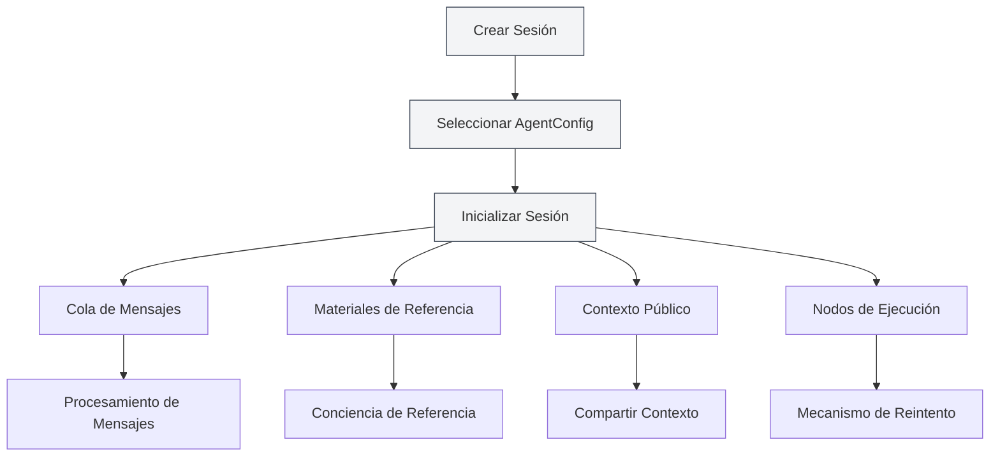
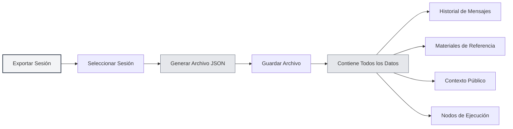
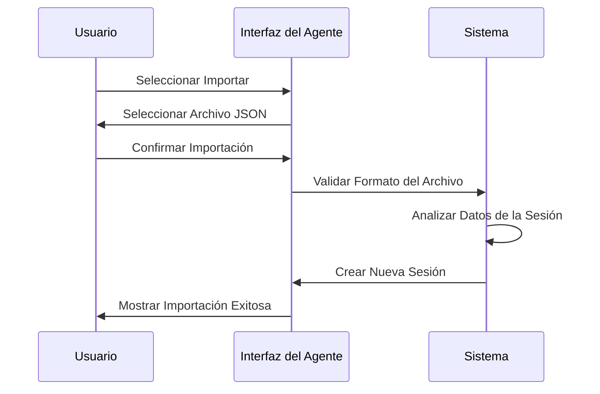
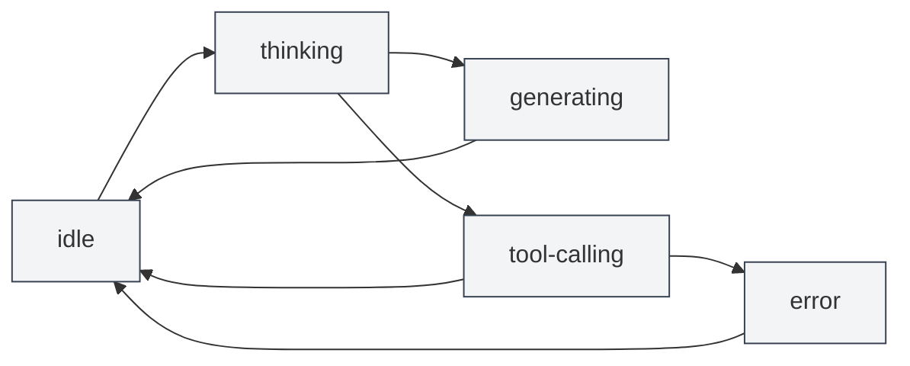

# Gestión de Sesiones del Agente

## Visión General

La sesión del Agente es un componente central del marco del Agente, que representa un entorno de ejecución del Agente independiente y con contexto. Cada sesión mantiene su propio historial de mensajes, materiales de referencia, espacio de contexto público y admite funciones avanzadas como cola de mensajes, reintentos, duplicación, etc.

<AgentView mode="demo" />

La sesión del Agente se crea basándose en AgentConfig, heredando el conjunto de herramientas y el alcance de capacidades de AgentConfig, pero cada sesión tiene un estado de ejecución e historial independientes.

## Crear una Sesión

### Crear una Nueva Sesión

Pasos para crear una sesión del Agente:

<AgentView mode="demo" />

1.  **Abrir la Vista del Agente**: Haz clic en "AI" → "Agent" en la barra de menú para abrir la vista del Agente.
2.  **Seleccionar AgentConfig**: Selecciona el AgentConfig a utilizar en la parte superior de la lista de sesiones.
3.  **Crear Sesión**: Haz clic en el botón "Nueva Sesión".
4.  **Ingresar Título**: Opcionalmente, ingresa un título para la sesión (por defecto se usa el primer mensaje como título).
5.  **Comenzar Diálogo**: Ingresa el primer mensaje para comenzar a interactuar con el Agente.

### Inicialización de la Sesión

Al crear una sesión, el sistema automáticamente:

<AgentSessionManager mode="demo" />

-   **Crea un ID de Sesión**: Genera un identificador único para la sesión.
-   **Asocia AgentConfig**: Lo vincula al AgentConfig especificado.
-   **Inicializa la Cola de Mensajes**: Crea una cola de mensajes vacía.
-   **Inicializa los Materiales de Referencia**: Crea un almacenamiento vacío para materiales de referencia.
-   **Inicializa el Contexto Público**: Crea un espacio de contexto público, que incluye información como la hora actual.
-   **Crea un Saludo**: Agrega automáticamente un mensaje de saludo del Agente.
-   **Habilita la Referencia Interna**: Habilita por defecto la referencia interna número 0 (obtiene dinámicamente el contenido del documento actual).

## Renombrar una Sesión

### Operación de Renombrar

Para renombrar una sesión existente:

<AgentView mode="demo" />

1.  **Menú Contextual (clic derecho)**: Haz clic derecho en la sesión y selecciona "Renombrar".
2.  **Ingresar Nuevo Nombre**: Ingresa el nuevo nombre de la sesión en el cuadro de diálogo emergente.
3.  **Confirmar y Guardar**: Haz clic en confirmar para guardar el nuevo nombre.

El nombre de la sesión se utiliza para identificar y distinguir diferentes sesiones; se recomienda usar nombres descriptivos.

## Eliminar una Sesión

### Operación de Eliminación

Para eliminar sesiones no deseadas:

<AgentSessionManager mode="demo" />

1.  **Menú Contextual (clic derecho)**: Haz clic derecho en la sesión y selecciona "Eliminar".
2.  **Confirmar Eliminación**: Confirma la eliminación en el cuadro de diálogo de confirmación.

**Nota**: Eliminar una sesión también elimina todo su historial de mensajes, materiales de referencia y nodos de ejecución. Esta operación no se puede deshacer.

### Eliminación Masiva

Actualmente no se admite la eliminación masiva; es necesario eliminar las sesiones una por una.

## Duplicar una Sesión

### Operación de Duplicación

Para duplicar una sesión existente:

<AgentView mode="demo" />

1.  **Menú Contextual (clic derecho)**: Haz clic derecho en la sesión y selecciona "Duplicar".
2.  **Crear Copia**: El sistema creará una nueva copia de la sesión.

Duplicar una sesión copia:

-   **Historial de Mensajes**: Todos los registros de mensajes.
-   **Materiales de Referencia**: Todos los materiales de referencia.
-   **Contexto Público**: El contenido del espacio de contexto público.
-   **Nodos de Ejecución**: Todos los registros de nodos de ejecución.

La sesión duplicada es independiente; los cambios en ella no afectarán a la sesión original.

### Casos de Uso

Duplicar una sesión es útil para:

-   **Discusión Ramificada**: Continuar discutiendo diferentes temas basándose en un diálogo existente.
-   **Pruebas Experimentales**: Probar diferentes configuraciones del Agente o conjuntos de herramientas.
-   **Copia de Seguridad**: Guardar estados importantes de sesión.

## Exportar/Importar Sesiones

### Exportar una Sesión

<AgentView mode="demo" />

Para exportar una sesión a un archivo JSON:

<AgentView mode="demo" />

1.  **Menú Contextual (clic derecho)**: Haz clic derecho en la sesión y selecciona "Exportar".
2.  **Seleccionar Ubicación**: Elige la ubicación y el nombre del archivo para guardar.
3.  **Guardar Archivo**: Haz clic en guardar para exportar la sesión.

El archivo JSON exportado contiene:

-   Información básica de la sesión (ID, título, descripción, etc.)
-   Historial de mensajes
-   Materiales de referencia
-   Contexto público
-   Nodos de ejecución

### Importar una Sesión

<AgentSessionManager mode="demo" />

Para importar una sesión desde un archivo JSON:

1.  **Abrir Importación**: Encuentra la función de importación en la vista del Agente.
2.  **Seleccionar Archivo**: Selecciona el archivo JSON que deseas importar.
3.  **Validar Datos**: El sistema valida el formato y contenido del archivo.
4.  **Importar Sesión**: Si la importación es exitosa, se crea una nueva sesión.

La sesión importada creará un nuevo ID de sesión y no sobrescribirá sesiones existentes.

## Reintentar una Sesión

### Función de Reintento

La función de reintento permite volver a ejecutar tareas del Agente que hayan fallado:

1.  **Ver Nodos de Ejecución**: Revisa la lista de nodos de ejecución dentro de la sesión.
2.  **Seleccionar Nodo**: Selecciona el nodo de ejecución que deseas reintentar.
3.  **Reintentar Ejecución**: Haz clic en el botón "Reintentar" para ejecutarlo nuevamente.

El reintento comienza desde el nodo de ejecución seleccionado, conservando el historial de mensajes anterior.

### Nodos de Ejecución

Los nodos de ejecución registran cada paso en el proceso de ejecución del Agente:

-   **Nodo de Mensaje**: Mensaje del usuario o respuesta de la IA.
-   **Nodo de Llamada a Herramienta**: Llamada a herramienta y resultado de su ejecución.
-   **Nodo de Llamada a Flujo de Trabajo**: Proceso de ejecución de un flujo de trabajo.
-   **Nodo de Llamada a LLM**: Llamada al LLM y su respuesta.

Cada nodo tiene un estado (pendiente, en ejecución, exitoso, fallido, cancelado) y un resultado.

## Gestión de Mensajes de la Sesión

### Operaciones con Mensajes

Se pueden realizar las siguientes operaciones con los mensajes de la sesión:

-   **Editar Mensaje**: Editar un mensaje del usuario y reenviarlo.
-   **Regenerar**: Regenerar la respuesta de la IA.
-   **Copiar Mensaje**: Copiar el contenido del mensaje.
-   **Eliminar Mensaje**: Eliminar un mensaje (esto eliminará todos los mensajes posteriores a él).

### Cola de Mensajes

<AgentView mode="demo" />

La cola de mensajes permite insertar mensajes durante la ejecución del Agente:

1.  **Momento de Inserción**: Cuando el Agente está generando una respuesta o llamando a una herramienta, los mensajes se almacenan temporalmente en la cola.
2.  **Momento de Procesamiento**: Una vez que se completa la tarea actual, antes de ejecutar el siguiente paso, se procesan los mensajes en la cola.
3.  **Información de Anotación**: Los mensajes en cola se anotan con la marca de tiempo de inserción y el ID del mensaje en ese momento, para ayudar al Agente a comprender el contexto.

La función de cola de mensajes te permite proporcionar información o instrucciones adicionales durante la ejecución del Agente.

## Gestión de Materiales de Referencia

### Agregar Referencias

<ReferenceManager mode="demo" />

Para agregar materiales de referencia a una sesión:

1.  **Abrir Gestor de Referencias**: Haz clic en la pestaña "Referencias" dentro de la sesión.
2.  **Agregar Referencia**: Haz clic en el botón "Agregar Referencia".
3.  **Seleccionar Tipo**: Elige el tipo de referencia (archivo, URL, texto, etc.).
4.  **Seleccionar Contenido**: Selecciona el contenido que deseas referenciar.

Para más detalles, consulta [[agent.references|Gestión de Materiales de Referencia]].

### Tipos de Referencia

Se admiten los siguientes tipos de referencia:

-   **Referencia de Archivo**: Referencia a un archivo local (Markdown, LaTeX, PDF, Word, imágenes, etc.).
-   **Referencia de URL**: Referencia a una URL de página web.
-   **Referencia de Texto**: Referencia a contenido de texto personalizado.
-   **Referencia de Base de Conocimiento**: Referencia a contenido dentro de una base de conocimiento.
-   **Referencia Interna**: Obtiene dinámicamente el contenido del documento actual (habilitada por defecto).

### Activar Referencias

<ReferenceManager mode="demo" />

Los materiales de referencia se pueden activar o desactivar:

-   **Activar Referencia**: Las referencias activadas se utilizarán durante la ejecución del Agente.
-   **Desactivar Referencia**: Las referencias desactivadas no afectarán la ejecución del Agente.

El Agente puede percibir el contenido de los materiales de referencia y razonar u operar basándose en ellos.

## Contexto Público

### Espacio de Contexto

El contexto público es un espacio de contexto compartido a nivel de sesión que contiene:

<AgentView mode="demo" />

-   **Hora Actual**: Marca de tiempo que se actualiza automáticamente.
-   **Información del Documento**: Información del documento actualmente abierto (si está habilitado).
-   **Datos Personalizados**: Datos de contexto definidos por el usuario.

### Casos de Uso

El contexto público es útil para:

-   **Conciencia Temporal**: Permitir que el Agente conozca la hora actual.
-   **Conciencia del Documento**: Permitir que el Agente conozca el documento abierto actualmente.
-   **Compartir Estado**: Compartir información de estado dentro de un flujo de trabajo.

## Estado de la Sesión

<AgentSessionManager mode="demo" />

### Tipos de Estado

Una sesión puede tener los siguientes estados:

-   **idle**: Estado inactivo, esperando entrada del usuario.
-   **thinking**: El Agente está pensando.
-   **generating**: El Agente está generando una respuesta.
-   **tool-calling**: El Agente está llamando a una herramienta.
-   **waiting-input**: Esperando entrada del usuario.
-   **error**: Ocurrió un error.

### Transiciones de Estado

## Consejos de Uso

<AgentView mode="demo" />

### Organización de Sesiones

1.  **Gestión por Categorías**: Crea sesiones diferentes para temas distintos.
2.  **Convención de Nombres**: Usa nombres de sesión claros y descriptivos.
3.  **Limpieza Periódica**: Elimina periódicamente las sesiones que ya no necesites.

### Gestión de Mensajes

1.  **Editar Mensajes**: Si la respuesta de la IA no es ideal, puedes editar el mensaje del usuario y reenviarlo.
2.  **Usar Referencias**: Agrega materiales de referencia para proporcionar más contexto.
3.  **Cola de Mensajes**: Usa la cola de mensajes para insertar información adicional durante la ejecución del Agente.

### Mecanismo de Reintento

1.  **Revisar Nodos**: Revisa los nodos de ejecución para comprender el proceso del Agente.
2.  **Seleccionar Reintento**: Selecciona los nodos fallidos para reintentarlos.
3.  **Ajustar Configuración**: Si los fallos son frecuentes, considera ajustar el AgentConfig o el conjunto de herramientas.

## Preguntas Frecuentes

<AgentView mode="demo" />

### P: ¿Cómo creo una nueva sesión?

R: En la vista del Agente, selecciona un AgentConfig y luego haz clic en el botón "Nueva Sesión". Después de crear la sesión, ingresa el primer mensaje para comenzar el diálogo.

### P: ¿Se guarda el historial de mensajes de la sesión?

R: Sí, el historial de mensajes de la sesión se guarda automáticamente en los metadatos del documento. Todas las sesiones se restauran al reabrir el documento.

### P: ¿Cómo elimino una sesión?

R: Haz clic derecho en la sesión, selecciona "Eliminar" y luego confirma la eliminación en el cuadro de diálogo. Esta operación no se puede deshacer.

### P: ¿Qué se copia al duplicar una sesión?

R: Al duplicar una sesión, se copian el historial de mensajes, los materiales de referencia, el contexto público y los nodos de ejecución. La sesión duplicada es independiente.

### P: ¿Cómo exporto una sesión?

R: Haz clic derecho en la sesión, selecciona "Exportar" y luego elige la ubicación para guardar. El archivo JSON exportado contiene toda la información de la sesión.

### P: ¿Qué es la cola de mensajes?

R: La cola de mensajes permite insertar mensajes durante la ejecución del Agente. Los mensajes en la cola se procesan después de que se complete la tarea actual.

### P: ¿Cómo reintento una ejecución fallida?

R: En la sesión, revisa la lista de nodos de ejecución, selecciona el nodo fallido y luego haz clic en el botón "Reintentar".

### P: ¿Cómo afectan los materiales de referencia al Agente?

R: El Agente puede percibir el
