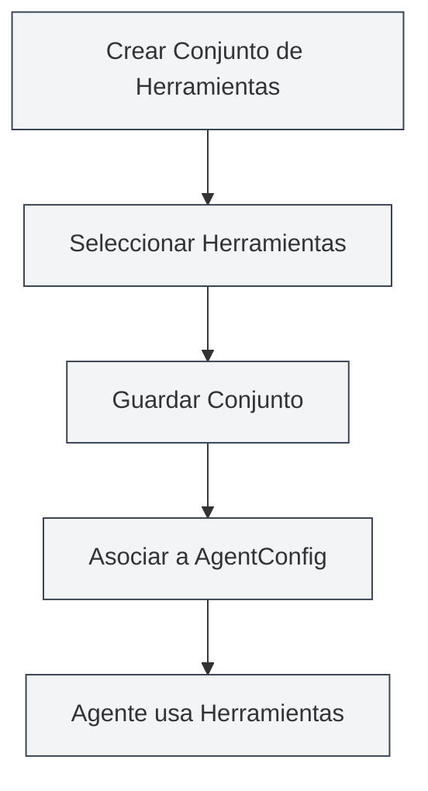

# Gestión de Conjuntos de Herramientas

## Visión General

Un Conjunto de Herramientas (ToolCollection) es una colección en el marco de Agent para organizar y gestionar las herramientas del Agente. Los conjuntos de herramientas agrupan herramientas relacionadas, facilitando su gestión y reutilización. AgentConfig determina qué herramientas puede usar un Agente asociando conjuntos de herramientas.

Los conjuntos de herramientas admiten la adición y eliminación dinámica de herramientas. Se pueden crear conjuntos para propósitos específicos o combinar múltiples conjuntos para su uso.

## Conceptos Clave

### Estructura del Conjunto de Herramientas

<AgentView mode="demo" />

Un conjunto de herramientas consta de las siguientes partes principales:

- **Información Básica**: ID, nombre, descripción, número de versión.
- **Lista de Herramientas**: Lista de IDs de herramientas incluidas (herramientas internas y externas).
- **Estado de Activación**: Si el conjunto está habilitado o no.
- **Etiquetas**: Etiquetas para categorización y búsqueda.
- **Indicador Integrado**: Si es un conjunto de herramientas integrado (no eliminable).

### Tipos de Herramientas

<GrepDisplay mode="demo" />

Un conjunto de herramientas puede contener los siguientes tipos de herramientas:

- **Herramientas Internas**: Herramientas de Agente integradas en MetaDoc (como edit-tool, proofread-tool, etc.).
- **Herramientas Externas**: Herramientas externas personalizadas por el usuario.

### Conjunto de Herramientas Predeterminado

El sistema proporciona un conjunto de herramientas predeterminado (`default-tool-set`) que contiene todas las herramientas de Agente integradas. No se puede eliminar, pero se puede copiar.

## Crear un Conjunto de Herramientas

<AgentView mode="demo" />

### Crear un Nuevo Conjunto

Pasos para crear un conjunto de herramientas:

1.  **Abrir la Gestión de Conjuntos**: En la vista de Agente, hacer clic en "Gestionar" → "Conjuntos de Herramientas".
2.  **Crear Conjunto**: Hacer clic en el botón "Nuevo Conjunto de Herramientas".
3.  **Completar Información Básica**:
    - Nombre: Nombre del conjunto (admite múltiples idiomas).
    - Descripción: Descripción del conjunto (admite múltiples idiomas).
4.  **Seleccionar Herramientas**: Elegir una o más herramientas de la lista desplegable.
    - Se puede buscar por nombre de herramienta.
    - Admite selección múltiple.
    - Muestra el tipo y descripción de la herramienta.
5.  **Guardar el Conjunto**: Hacer clic en el botón "Guardar".

Puede acceder a la vista de Agente a través de la barra lateral:

### Interfaz de Conjuntos de Herramientas del Agente

La siguiente imagen muestra las funciones principales de la interfaz de gestión de conjuntos de herramientas:

<AgentView mode="demo" />

### Selección de Herramientas

Al seleccionar herramientas, el sistema muestra:

- **Nombre de la Herramienta**: Nombre para mostrar de la herramienta.
- **ID de la Herramienta**: Identificador único de la herramienta.
- **Tipo de Herramienta**: Herramienta interna, externa o de flujo de trabajo.
- **Descripción de la Herramienta**: Breve descripción de la herramienta.

<DialogDemo mode="demo" dialogType="tool-select" />

## Editar un Conjunto de Herramientas

<AgentView mode="demo" />

### Operación de Edición

Para editar un conjunto de herramientas existente:

1.  **Abrir Interfaz de Gestión**: Encontrar el conjunto a editar en la interfaz de gestión.
2.  **Hacer clic en Editar**: Hacer clic en el botón "Editar" en la tarjeta del conjunto.
3.  **Modificar Información**: Cambiar nombre, descripción o lista de herramientas.
4.  **Guardar Cambios**: Hacer clic en el botón "Guardar".

**Nota**: El conjunto predeterminado (`default-tool-set`) no se puede editar, pero se puede copiar y luego editar la copia.

### Agregar Herramientas

Para agregar herramientas a un conjunto:

1.  **Abrir Interfaz de Edición**: Editar el conjunto de herramientas.
2.  **Seleccionar Herramientas**: Elegir las herramientas a agregar en la lista desplegable.
3.  **Guardar Cambios**: Hacer clic en el botón "Guardar".

### Eliminar Herramientas

Para quitar herramientas de un conjunto:

1.  **Abrir Interfaz de Edición**: Editar el conjunto de herramientas.
2.  **Deseleccionar**: Desmarcar las herramientas a eliminar en la lista.
3.  **Guardar Cambios**: Hacer clic en el botón "Guardar".

## Eliminar un Conjunto de Herramientas

<AgentView mode="demo" />

### Operación de Eliminación

Para eliminar un conjunto de herramientas no necesario:

1.  **Abrir Interfaz de Gestión**: Encontrar el conjunto a eliminar en la interfaz de gestión.
2.  **Hacer clic en Eliminar**: Hacer clic en el botón "Eliminar" en la tarjeta del conjunto.
3.  **Confirmar Eliminación**: Confirmar la eliminación en el cuadro de diálogo de confirmación.

**Nota**:

- El conjunto predeterminado (`default-tool-set`) no se puede eliminar.
- Eliminar un conjunto no afecta a los AgentConfig ya creados, pero los AgentConfig asociados a ese conjunto no podrán usarlo.
- Si el conjunto está siendo usado por un AgentConfig, se mostrará una advertencia antes de eliminarlo.

## Copiar un Conjunto de Herramientas

### Operación de Copia

<OutlineTreeDisplay mode="demo" />

Para copiar un conjunto de herramientas existente:

1.  **Abrir Interfaz de Gestión**: Encontrar el conjunto a copiar en la interfaz de gestión.
2.  **Hacer clic en Copiar**: Hacer clic en el botón "Copiar" en la tarjeta del conjunto.
3.  **Editar la Copia**: El sistema crea una copia, con el nombre automáticamente añadiendo el sufijo " (copia)".
4.  **Guardar Modificaciones**: Modificar la copia según sea necesario y guardar.

Copiar un conjunto duplica todas las herramientas, incluyendo la lista y configuración.

## Importar/Exportar Conjuntos de Herramientas

### Exportar un Conjunto

Para exportar un conjunto de herramientas como archivo JSON:

1.  **Abrir Interfaz de Gestión**: Encontrar el conjunto a exportar en la interfaz de gestión.
2.  **Hacer clic en Exportar**: Hacer clic en el botón "Exportar" en la tarjeta del conjunto.
3.  **Seleccionar Ubicación**: Elegir la ubicación y nombre del archivo.
4.  **Guardar Archivo**: Hacer clic en guardar para exportar el conjunto.

<DialogDemo mode="demo" dialogType="export-config" />

El archivo JSON exportado contiene toda la información del conjunto y puede usarse para copias de seguridad o compartir.

### Importar un Conjunto

<DataAnalysisDisplay mode="demo" />

Para importar un conjunto de herramientas desde un archivo JSON:

1.  **Abrir Interfaz de Gestión**: En la interfaz de gestión de conjuntos.
2.  **Hacer clic en Importar**: Hacer clic en el botón "Importar Conjunto de Herramientas".
3.  **Seleccionar Archivo**: Elegir el archivo JSON a importar.
4.  **Validar Datos**: El sistema verifica el formato y contenido del archivo.
5.  **Importar Conjunto**: Tras el éxito, se crea un nuevo conjunto.

<DialogDemo mode="demo" dialogType="import-config" />

El conjunto importado crea un nuevo ID y no sobrescribe conjuntos existentes (a menos que se use el modo de sobrescritura).

## Conjuntos de Herramientas y AgentConfig

### Asociar Conjuntos

AgentConfig determina las herramientas disponibles asociando conjuntos:

1.  **Crear AgentConfig**: Crear un nuevo AgentConfig.
2.  **Seleccionar Conjuntos**: Elegir uno o más conjuntos de herramientas en el AgentConfig.
3.  **Intersección de Herramientas**: Si se seleccionan múltiples conjuntos, las herramientas disponibles son la intersección de todos ellos.

### Intersección de Conjuntos

<DiffDisplay mode="demo" />

Cuando un AgentConfig asocia múltiples conjuntos de herramientas:

- Conjunto A contiene: `[tool1, tool2, tool3]`
- Conjunto B contiene: `[tool2, tool3, tool4]`
- Herramientas disponibles para AgentConfig: `[tool2, tool3]` (intersección)

Este mecanismo permite controlar con precisión el alcance de las capacidades del Agente.

## Consejos de Uso

### Organización de Conjuntos

1.  **Por Función**: Crear conjuntos categorizados por función, como "Conjunto de Edición de Documentos", "Conjunto de Análisis de Datos".
2.  **Por Escenario**: Crear conjuntos categorizados por escenario, como "Conjunto para Escritura Académica", "Conjunto para Análisis de Código".
3.  **Normas de Nomenclatura**: Usar nombres claros para facilitar la identificación y gestión.

### Diseño de Conjuntos

1.  **Responsabilidad Única**: Cada conjunto debe centrarse en una función o escenario específico.
2.  **Combinación de Herramientas**: Combinar herramientas relacionadas de manera razonable, evitando conjuntos demasiado grandes.
3.  **Reutilización**: Diseñar conjuntos reutilizables para facilitar su uso en diferentes AgentConfig.

### Gestión de Conjuntos

1.  **Limpieza Periódica**: Eliminar conjuntos que ya no se usen.
2.  **Gestión de Versiones**: Hacer copias de seguridad de conjuntos importantes mediante la función de exportación.
3.  **Documentación**: Explicar el propósito y escenarios de uso en la descripción del conjunto.

## Preguntas Frecuentes

### P: ¿Cómo crear un conjunto de herramientas especializado?

R: Cree un nuevo conjunto, seleccione las herramientas relevantes, establezca un nombre y descripción claros. Por ejemplo, cree un "Conjunto de Análisis de Datos" seleccionando herramientas relacionadas con el análisis de datos.

### P: ¿Cuál es la relación entre un conjunto de herramientas y AgentConfig?

R: AgentConfig determina las herramientas disponibles asociando conjuntos. Un AgentConfig puede asociar múltiples conjuntos; las herramientas disponibles son la intersección de todos ellos.

### P: ¿Se puede modificar el conjunto de herramientas predeterminado?

R: El conjunto predeterminado (`default-tool-set`) no se puede editar, pero se puede copiar y luego editar la copia. Copie el conjunto predeterminado y modifique la copia.

### P: ¿Cómo agregar herramientas personalizadas a un conjunto?

R: Primero debe registrar la herramienta personalizada, luego seleccionarla al crear o editar un conjunto. Las herramientas personalizadas deben cumplir con la especificación de herramientas de Agente.

### P: ¿Eliminar un conjunto afecta a AgentConfig?

R: Eliminar un conjunto no afecta a los AgentConfig ya creados, pero los AgentConfig asociados a ese conjunto no podrán usarlo. Si el conjunto está en uso, se mostrará una advertencia antes de eliminarlo.

## Documentación Relacionada

- [[agent.introduction|Visión General del Marco de Agent]]
- [[agent.introduction|Gestión de Configuración de Agent]]
- [[agent.session|Gestión de Sesiones de Agent]]
