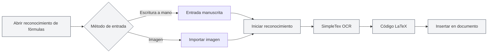

# Funciones del Asistente de IA

## Descripción general

La función del Asistente de IA proporciona múltiples herramientas de asistencia inteligente para ayudarle en tareas como creación de documentos, reconocimiento de fórmulas, generación de gráficos, análisis de datos, entre otras. A través del Asistente de IA, puede completar eficientemente diversos trabajos de procesamiento de documentos.

Las funciones del Asistente de IA incluyen: Chat de IA, Reconocimiento de fórmulas escritas a mano, Asistente de dibujo inteligente, Herramientas de análisis de datos, Reconocimiento de texto OCR, Herramienta de análisis de archivos adjuntos, Detección AIGC, etc.

<AgentView mode="demo" />

## Chat de IA

### Descripción de la función

La función de Chat de IA proporciona un asistente de conversación inteligente que puede dialogar basándose en el contenido del documento actual:

- **Comprensión del contexto**: Comprende el contenido y el contexto del documento actual.
- **Respuestas inteligentes**: Responde preguntas relacionadas según el contenido del documento.
- **Análisis de documentos**: Analiza la estructura, contenido, estilo, etc., del documento.

Puede acceder a la función de Chat de IA a través del menú del Asistente de IA:

<MenuItemsDemo mode="demo" :items='[{"id": "ai-assistant", "items": ["ai-chat"]}]' />

### Vista previa de la interfaz

La interfaz de Chat de IA incluye una lista de conversaciones y un área de diálogo, compatible con la gestión de múltiples conversaciones y la referencia de materiales:

<AIChat mode="demo" />

Consulte [[ai.chat|Chat de IA]] para más detalles.

## Reconocimiento de fórmulas escritas a mano

### Descripción de la función

La función de Reconocimiento de fórmulas escritas a mano convierte fórmulas matemáticas manuscritas en código LaTeX:

<FormulaRecognition mode="demo" />

- **Entrada manuscrita**: Compatible con entrada manuscrita mediante ratón o pantalla táctil.
- **Importación de imágenes**: Compatible con la importación de imágenes de fórmulas para su reconocimiento.
- **Reconocimiento en tiempo real**: Utiliza la API SimpleTex OCR para el reconocimiento.
- **Salida LaTeX**: Convierte automáticamente al formato LaTeX estándar.

### Método de uso

1. **Abrir reconocimiento de fórmulas**: Abra la ventana de reconocimiento de fórmulas desde el menú del Asistente de IA.
2. **Entrada manuscrita**: Escriba a mano la fórmula matemática en el lienzo.
3. **O importar imagen**: Haga clic en el botón de importar y seleccione la imagen de la fórmula.
4. **Iniciar reconocimiento**: Haga clic en el botón de reconocer.
5. **Ver resultado**: Revise el código LaTeX reconocido.
6. **Insertar en el documento**: Inserte el código LaTeX en el documento.

Puede acceder a la función de Reconocimiento de fórmulas escritas a mano a través del menú del Asistente de IA:

<MenuItemsDemo mode="demo" :items='[{"id": "ai-assistant", "items": ["formula-recognition"]}]' />

### Precisión del reconocimiento

- **Reconocimiento de alta precisión**: La API SimpleTex OCR proporciona un reconocimiento de fórmulas matemáticas de alta precisión.
- **Soporte para fórmulas complejas**: Compatible con fórmulas complejas como fracciones, raíces, integrales, sumatorias, etc.
- **Corrección automática**: Los resultados del reconocimiento se pueden editar y corregir manualmente.

## Asistente de dibujo inteligente

### Descripción de la función

El Asistente de dibujo inteligente utiliza IA para generar código de gráficos, compatible con múltiples formatos de gráficos:

- **Gráficos Mermaid**: Diagramas de flujo, diagramas de secuencia, diagramas de clases, diagramas de estado, etc.
- **Gráficos PlantUML**: Diagramas UML, diagramas de secuencia, diagramas de actividad, etc.
- **Gráficos ECharts**: Gráficos de líneas, gráficos de barras, gráficos de pastel, gráficos de dispersión, etc.
- **Inserción directa**: Los gráficos generados se pueden insertar directamente en el documento.

### Vista previa de la interfaz

El Asistente de dibujo inteligente admite la gestión de múltiples conversaciones, selecciona automáticamente el motor de gráficos y genera gráficos visuales:

<GraphWindow mode="demo" />

<MenuItemsDemo mode="demo" :items='[{"id": "ai-assistant"}]' />

### Método de uso

1. **Abrir asistente de dibujo**: Abra el asistente de dibujo desde el menú o la barra de herramientas.
2. **Describir la necesidad**: Describa en lenguaje natural el gráfico que desea generar.
3. **Seleccionar tipo**: Elija el tipo de gráfico (Mermaid, PlantUML, ECharts, etc.).
4. **Generar gráfico**: La IA genera el código del gráfico según la descripción.
5. **Previsualizar gráfico**: Vea una vista previa del gráfico generado.
6. **Insertar en el documento**: Inserte el gráfico en el documento.

### Tipos de gráficos compatibles

- **Mermaid**: Diagramas de flujo, diagramas de secuencia, diagramas de clases, diagramas de estado, diagramas ER, diagramas de Gantt, gráficos de pastel, diagramas Git, mapas de viaje, mapas mentales, líneas de tiempo, etc.
- **PlantUML**: Diagramas UML, diagramas de secuencia, diagramas de actividad, diagramas de componentes, diagramas de despliegue, etc.
- **ECharts**: Gráficos de líneas, gráficos de barras, gráficos de pastel, gráficos de dispersión, gráficos de radar, mapas de calor, diagramas de árbol, diagramas de árbol rectangular, gráficos solares, etc.

Consulte [[charts.introduction|Introducción a las funciones de gráficos]] para más detalles.

## Herramientas de análisis de datos

### Descripción de la función

Las herramientas de análisis de datos pueden analizar tablas de datos en documentos y generar gráficos visuales:

- **Reconocimiento de tablas**: Identifica automáticamente los datos de las tablas en el documento.
- **Análisis de datos**: Analiza la información estadística de los datos de la tabla.
- **Generación de gráficos**: Genera gráficos visuales basados en los datos.
- **Inserción de gráficos**: Inserta los gráficos generados en el documento.

<DataAnalysisWindow mode="demo" />

### Método de uso

1. **Abrir análisis de datos**: Abra la ventana de análisis de datos desde el menú o la barra de herramientas.
2. **Seleccionar tabla**: Seleccione la tabla que desea analizar en el documento.
3. **Analizar datos**: Haga clic en el botón de análisis, la IA analiza los datos de la tabla.
4. **Generar gráfico**: Genera un gráfico visual basado en los resultados del análisis.
5. **Insertar en el documento**: Inserte el gráfico en el documento.

## Reconocimiento de texto OCR

### Descripción de la función

La función de Reconocimiento de texto OCR puede identificar texto en imágenes y extraer su contenido:

- **Reconocimiento de imágenes**: Identifica el contenido de texto en las imágenes.
- **Soporte multilingüe**: Compatible con chino, inglés y otros idiomas.
- **Extracción de texto**: Extrae el contenido de texto reconocido.
- **Inserción en documento**: Inserta el texto extraído en el documento.

### Vista previa de la interfaz

La ventana de reconocimiento OCR admite la gestión de múltiples imágenes, ajuste de parámetros de preprocesamiento de imágenes y edición de resultados de reconocimiento:

<OcrWindow mode="demo" />

<MenuItemsDemo mode="demo" :items='[{"id": "ai-assistant", "items": ["proofread"]}]' />

### Método de uso

1. **Abrir reconocimiento OCR**: Abra la ventana de reconocimiento OCR desde el menú o la barra de herramientas.
2. **Importar imagen**: Importe la imagen que desea reconocer.
3. **Iniciar reconocimiento**: Haga clic en el botón de reconocer.
4. **Ver resultado**: Revise el contenido de texto reconocido.
5. **Insertar en documento**: Inserte el texto en el documento.

## Herramienta de análisis de archivos adjuntos

### Descripción de la función

La herramienta de análisis de archivos adjuntos puede analizar archivos adjuntos como PDF, Word, etc., y extraer su contenido:

- **Análisis de archivos**: Analiza formatos de archivo como PDF, Word, etc.
- **Extracción de contenido**: Extrae texto e imágenes del archivo.
- **Agregar a base de conocimiento**: Agrega el contenido extraído a la base de conocimiento.
- **Referencia en documento**: Hace referencia al contenido del archivo adjunto en el documento.

<KnowledgeBase mode="demo" />

### Método de uso

1. **Abrir análisis de archivos adjuntos**: Abra la ventana de análisis de archivos adjuntos desde el menú o la barra de herramientas.
2. **Seleccionar archivo**: Seleccione el archivo PDF o Word que desea analizar.
3. **Iniciar análisis**: Haga clic en el botón de analizar.
4. **Ver resultado**: Revise el contenido extraído.
5. **Agregar a base de conocimiento**: Agregue el contenido a la base de conocimiento (opcional).

## Detección AIGC

### Descripción de la función

La función de Detección AIGC puede detectar si un texto es contenido generado por IA:

- **Detección de texto**: Detecta si el texto es generado por IA.
- **Puntuación de confianza**: Proporciona una puntuación de probabilidad de generación por IA.
- **Informe de detección**: Genera un informe de detección detallado.

<AigcDetectionWindow mode="demo" />

### Método de uso

1. **Abrir detección AIGC**: Abra la ventana de detección AIGC desde el menú o la barra de herramientas.
2. **Seleccionar texto**: Seleccione el texto que desea detectar.
3. **Iniciar detección**: Haga clic en el botón de detectar.
4. **Ver resultado**: Revise el resultado de la detección y la puntuación de confianza.

## Consejos de uso

### Uso eficiente del Asistente de IA

1. **Definir necesidades claras**: Describa sus necesidades con claridad para obtener mejores resultados.
2. **Proporcionar contexto**: Proporcione suficiente información contextual.
3. **Optimización iterativa**: Optimice sus necesidades de forma iterativa según los resultados.

### Consejos para el reconocimiento de fórmulas

1. **Escritura clara**: Mantenga la escritura clara y evite los garabatos al escribir a mano.
2. **Formato correcto**: Utilice el formato correcto para los símbolos matemáticos.
3. **Verificar resultados**: Revise los resultados después del reconocimiento y corríjalos manualmente si es necesario.

### Consejos para la generación de gráficos

1. **Descripción detallada**: Describa en detalle los requisitos del gráfico, incluyendo tipo de datos, estilo, etc.
2. **Seleccionar tipo**: Elija el tipo de gráfico adecuado según sus necesidades.
3. **Previsualizar y ajustar**: Previsualice el gráfico y ajústelo según sea necesario.

## Preguntas frecuentes

### P: ¿El reconocimiento de fórmulas no es preciso?

R: El reconocimiento de fórmulas se basa en la API SimpleTex OCR y puede no ser preciso. Se recomienda escribir con claridad o utilizar la importación de imágenes.

### P: ¿La generación de gráficos no cumple con las expectativas?

R: Puede describir sus necesidades con más detalle o editar manualmente el código del gráfico generado para ajustarlo.

### P: ¿Qué idiomas admite el reconocimiento OCR?

R: El reconocimiento OCR admite chino, inglés y otros idiomas, dependiendo del servicio OCR utilizado.

### P: ¿Qué formatos admite el análisis de archivos adjuntos?

R: El análisis de archivos adjuntos admite formatos comunes como PDF, Word, etc., dependiendo de la capacidad del servicio de análisis.

<AgentView mode="demo" />

## Documentación relacionada

- [[ai.chat|Chat de IA]]
- [[charts.introduction|Introducción a las funciones de gráficos]]
- [[knowledge-base.usage|Uso de la base de conocimiento]]