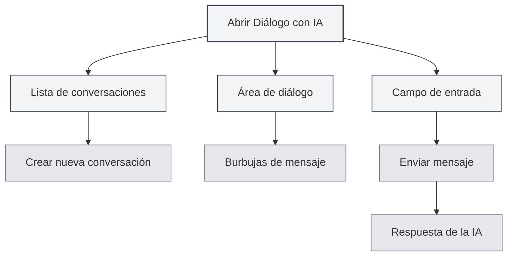
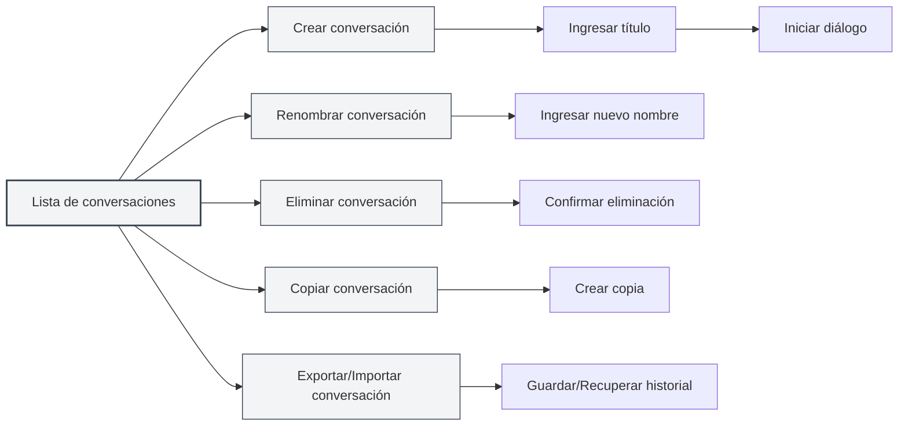
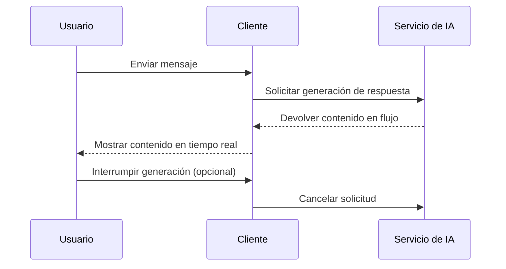
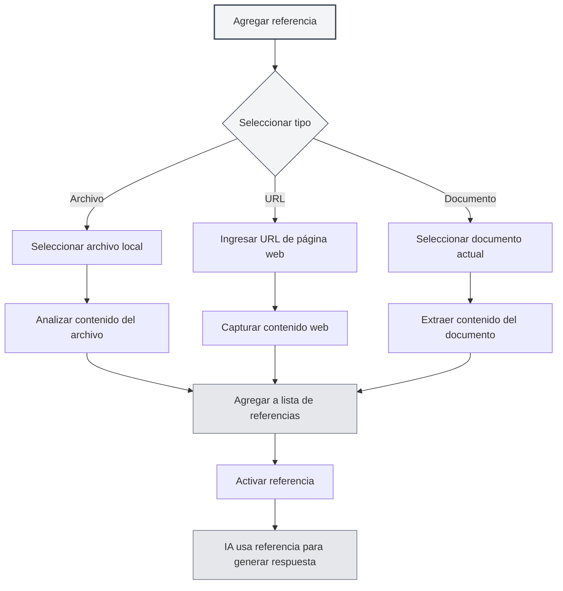

# Diálogo con IA

## Descripción general

La función de Diálogo con IA proporciona un asistente de conversación inteligente que puede ayudarle a responder preguntas, generar contenido, analizar documentos, etc. A través del Diálogo con IA, puede interactuar con la IA en lenguaje natural, obteniendo ayuda y sugerencias inteligentes.

El Diálogo con IA admite funciones como la gestión de múltiples conversaciones, la referencia a materiales y la integración con bases de conocimiento, permitiéndole utilizar la asistencia de la IA de manera eficiente para completar diversas tareas.

## Abrir el Diálogo con IA

### Formas de abrir

Hay varias formas de abrir el Diálogo con IA:

- **Barra de menú**: Haga clic en el menú "IA" y seleccione "Diálogo con IA"
- **Atajo de teclado**: Use un atajo de teclado para abrirlo rápidamente (si está configurado)
- **Barra lateral**: Abra el panel de Diálogo con IA desde la barra lateral

Puede acceder a la función de Diálogo con IA a través del menú de Asistente de IA en la barra de menú superior:

<MenuItemsDemo mode="demo" :items='[{"id": "ai-assistant", "items": ["ai-chat"]}]' />

### Descripción de la interfaz

La interfaz de Diálogo con IA contiene las siguientes partes:

<AIChat mode="demo" />

- **Lista de conversaciones**: Muestra la lista de todas las conversaciones en el lado izquierdo
- **Área de diálogo**: Muestra los mensajes de la conversación en el centro
- **Campo de entrada**: Ingrese mensajes en la parte inferior
- **Gestión de referencias**: Administra los materiales de referencia

## Gestión de conversaciones

El Diálogo con IA admite la gestión de múltiples conversaciones. Puede crear, renombrar, eliminar y copiar conversaciones.

<AIChat mode="demo" />

### Crear conversación

Crear una nueva conversación de Diálogo con IA:

1. **Haga clic en Nuevo**: Haga clic en el botón "Nueva conversación" sobre la lista de conversaciones
2. **Ingrese un título**: Opcionalmente, ingrese un título para la conversación (por defecto se usa el primer mensaje)
3. **Iniciar diálogo**: Ingrese el primer mensaje para comenzar el diálogo

### Operaciones con conversaciones

### Renombrar conversación

Renombrar una conversación existente:

1. **Menú contextual**: Haga clic derecho en la conversación y seleccione "Renombrar"
2. **Ingresar nuevo nombre**: Ingrese el nuevo nombre para la conversación
3. **Confirmar y guardar**: Guarde el nuevo nombre después de confirmar

### Eliminar conversación

Eliminar conversaciones no deseadas:

1. **Menú contextual**: Haga clic derecho en la conversación y seleccione "Eliminar"
2. **Confirmar eliminación**: Elimine la conversación después de confirmar

Eliminar una conversación también eliminará todo el historial de mensajes de esa conversación.

### Copiar conversación

Copiar una conversación existente:

1. **Menú contextual**: Haga clic derecho en la conversación y seleccione "Copiar"
2. **Crear copia**: El sistema creará una nueva copia de la conversación

Copiar una conversación duplica todo el historial de mensajes, facilitando continuar la discusión basándose en un diálogo existente.

### Exportar/Importar conversación

Exportar e importar conversaciones:

- **Exportar conversación**: Haga clic derecho en la conversación, seleccione "Exportar" y guárdela como un archivo JSON
- **Importar conversación**: Importe una conversación desde un archivo para recuperar el historial de mensajes

La función de exportar/importar le permite hacer copias de seguridad y compartir el contenido de las conversaciones fácilmente.

<MenuItemsDemo mode="demo" :items='[{"id": "file", "items": ["save", "open"]}]' />

## Enviar mensajes

El Diálogo con IA proporciona funciones completas para enviar mensajes.

<AIChat mode="demo" />

### Ingresar mensaje

Ingrese un mensaje en el campo de entrada:

1. **Ingresar texto**: Ingrese su pregunta o solicitud en el campo de entrada
2. **Formatear**: Admite formato Markdown para formatear el texto
3. **Enviar mensaje**: Haga clic en el botón de enviar o presione `Enter` para enviar

### Tipos de mensaje

Se admiten los siguientes tipos de mensaje:

- **Mensaje de texto**: Mensaje de texto normal
- **Mensaje Markdown**: Mensaje que admite formato Markdown
- **Mensaje con código**: Mensaje que contiene código

### Atajos de teclado

Atajos de teclado para enviar mensajes:

- **Enter**: Enviar mensaje
- **Shift+Enter**: Salto de línea (no enviar)
- **Ctrl+Enter**: Enviar mensaje (en algunas configuraciones)

## Respuesta de la IA

La función de respuesta de la IA proporciona salida en flujo y funciones de operación de mensajes.

<AIChat mode="demo" />

<AIChat mode="demo" />

### Salida en flujo

La respuesta de la IA utiliza salida en flujo:

- **Visualización en tiempo real**: El contenido generado por la IA se muestra en tiempo real
- **Generación gradual**: El contenido se genera paso a paso, sin necesidad de esperar a que termine
- **Se puede interrumpir**: Se puede interrumpir la generación de la IA en cualquier momento

### Operaciones con mensajes

Se pueden realizar las siguientes operaciones en las respuestas de la IA:

- **Copiar**: Copiar el contenido de la respuesta de la IA
- **Regenerar**: Regenerar la respuesta de la IA
- **Editar**: Editar la respuesta de la IA (si es compatible)
- **Eliminar**: Eliminar la respuesta de la IA

### Edición de mensajes

Editar mensajes del usuario:

1. **Haga clic en Editar**: Haga clic en el botón de edición junto al mensaje
2. **Modificar contenido**: Modifique el contenido del mensaje
3. **Reenviar**: Reenvíe el mensaje modificado

Editar un mensaje eliminará todos los mensajes posteriores a ese mensaje, reiniciando la conversación.

## Materiales de referencia

Puede agregar materiales de referencia al Diálogo con IA para ayudar a la IA a comprender mejor el contexto.

<AIChat mode="demo" />

### Agregar referencia

Agregar materiales de referencia a una conversación:

1. **Abrir gestión de referencias**: Haga clic en la etiqueta de referencia sobre el área de diálogo
2. **Agregar referencia**: Haga clic en el botón "Agregar referencia"
3. **Seleccionar tipo**: Seleccione el tipo de referencia (archivo, URL, etc.)
4. **Seleccionar contenido**: Seleccione el contenido que desea referenciar

### Tipos de referencia

Se admiten los siguientes tipos de referencia:

- **Referencia de archivo**: Referenciar un archivo local
- **Referencia de URL**: Referenciar una URL de página web
- **Referencia de documento**: Referenciar el documento actualmente abierto

### Activar referencia

Activar y desactivar referencias:

- **Activar referencia**: Haga clic en la etiqueta de referencia para activarla
- **Desactivar referencia**: Haga clic nuevamente para desactivarla
- **Estado activo**: Las referencias activadas se utilizarán cuando la IA genere una respuesta

Después de activar una referencia, la IA considerará el contenido referenciado al generar su respuesta.

### Vista previa de referencia

Vista previa del contenido de referencia:

- **Haga clic para vista previa**: Haga clic en la etiqueta de referencia para ver su contenido
- **Ver detalles**: Ver el contenido detallado de la referencia
- **Editar referencia**: Editar o eliminar la referencia

## Integración con base de conocimiento

El Diálogo con IA puede integrarse con una base de conocimiento para recuperar automáticamente información relevante.

<KnowledgeBase mode="demo" />

<AIChat mode="demo" />

### Habilitar base de conocimiento

Habilitar la consulta a la base de conocimiento:

1. **Abrir configuración**: Encuentre el interruptor de base de conocimiento debajo del campo de entrada
2. **Habilitar consulta**: Active el interruptor para habilitar la consulta a la base de conocimiento
3. **Recuperación automática**: La IA recuperará automáticamente información de la base de conocimiento al responder

### Recuperación de base de conocimiento

Funciones de recuperación de base de conocimiento:

- **Recuperación automática**: Recupera automáticamente información relevante al enviar un mensaje
- **Comprensión de contexto**: Recupera contenido relevante basándose en el contexto de la conversación
- **Integración de resultados**: Integra los resultados de la recuperación en la respuesta de la IA

### Configuración de recuperación

Configuración de recuperación de base de conocimiento:

- **Umbral de confianza**: Establecer el umbral de confianza para la recuperación
- **Cantidad de resultados**: Establecer la cantidad de resultados de recuperación
- **Alcance de recuperación**: Establecer el alcance de la recuperación

Consulte [[knowledge-base.config|Configuración de base de conocimiento]] para más detalles.

## Gestión de mensajes

Administrar los mensajes en el Diálogo con IA.

<AIChat mode="demo" />

### Operaciones con mensajes

Se pueden realizar las siguientes operaciones en los mensajes:

- **Copiar mensaje**: Copiar el contenido del mensaje
- **Editar mensaje**: Editar mensajes del usuario
- **Eliminar mensaje**: Eliminar un mensaje
- **Regenerar**: Regenerar la respuesta de la IA

### Historial de mensajes

Gestión del historial de mensajes:

- **Guardado automático**: El historial de mensajes se guarda automáticamente
- **Aislamiento por conversación**: El historial de mensajes de cada conversación es independiente
- **Recuperación de historial**: Se recupera el historial al reabrir una conversación

### Formato de mensajes

Los mensajes admiten los siguientes formatos:

<AIChat mode="demo" />

- **Markdown**: Admite formato Markdown
- **Bloques de código**: Admite resaltado de sintaxis en bloques de código
- **Fórmulas matemáticas**: Admite fórmulas matemáticas en LaTeX
- **Tablas**: Admite visualización de tablas

## Consejos de uso

Puede utilizar la función de Diálogo con IA de manera más eficiente mediante los siguientes consejos.

<AIChat mode="demo" />

### Diálogo eficiente

1. **Plantear preguntas claras**: Haga preguntas claras para obtener mejores respuestas
2. **Proporcionar contexto**: Proporcione suficiente información de contexto
3. **Usar referencias**: Use materiales de referencia para proporcionar más información

### Organización de conversaciones

1. **Gestión por categorías**: Cree conversaciones separadas para diferentes temas
2. **Convención de nombres**: Use nombres de conversación claros
3. **Limpieza periódica**: Elimine periódicamente las conversaciones no deseadas

### Uso de la base de conocimiento

1. **Agregar documentos relevantes**: Agregue documentos relevantes a la base de conocimiento
2. **Habilitar consultas**: Habilite la consulta a la base de conocimiento para obtener mejores respuestas
3. **Ajustar configuración**: Ajuste la configuración de recuperación según sus necesidades

## Preguntas frecuentes

<AIChat mode="demo" />

<MenuItemsDemo mode="demo" :items='[{"id": "ai-assistant"}]' />

### P: ¿La respuesta de la IA no es precisa?

R: Las respuestas de la IA se basan en datos de entrenamiento y pueden no ser precisas. Puede proporcionar más información de contexto o usar materiales de referencia para mejorar la precisión.

### P: ¿Cómo interrumpir la generación de la IA?

R: Haga clic en el botón "Cancelar" para interrumpir la generación de la IA. El contenido ya generado no se perderá.

### P: ¿Se perdió el historial de mensajes?

R: El historial de mensajes se guarda automáticamente. Si se pierde, verifique si eliminó la conversación o borró los datos.

### P: ¿Cómo mejorar la calidad de las respuestas?

R: Proporcionar contexto claro, usar materiales de referencia y habilitar la consulta a la base de conocimiento pueden mejorar la calidad de las respuestas.

### P: ¿Qué LLM son compatibles?

R: Se admiten varios LLM, incluyendo OpenAI, Ollama, DeepSeek, etc. Consulte [[ai.llm-config|Configuración de LLM]] para más detalles.

## Documentación relacionada

- [[ai.proofread|Corrección con IA]]
- [[ai.completion|Autocompletado con IA]]
- [[knowledge-base.config|Configuración de base de conocimiento]]
- [[ai.llm-config|Configuración de LLM]]
