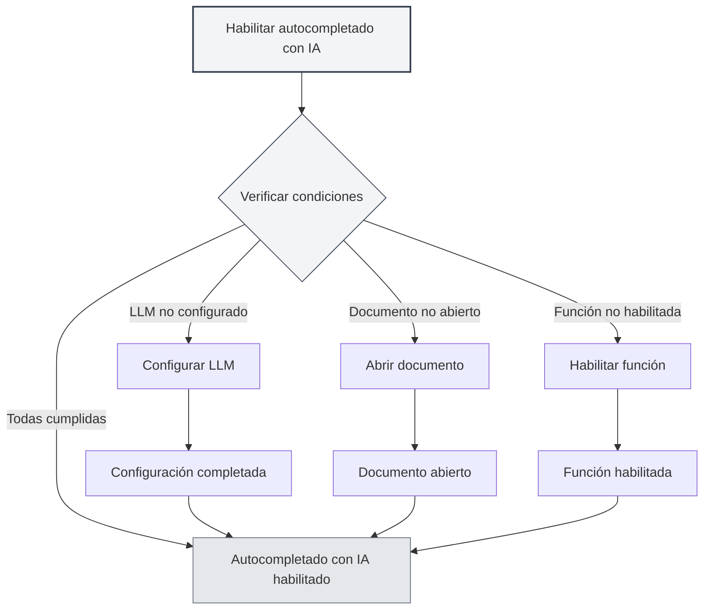
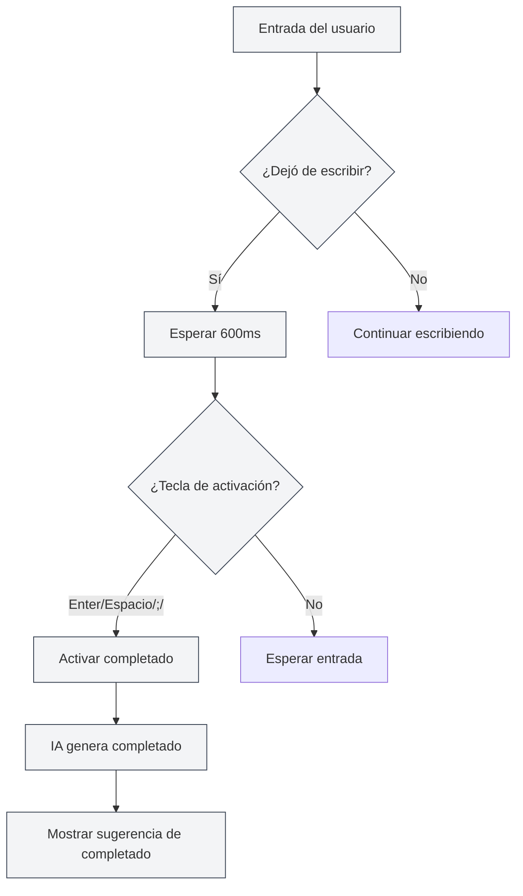
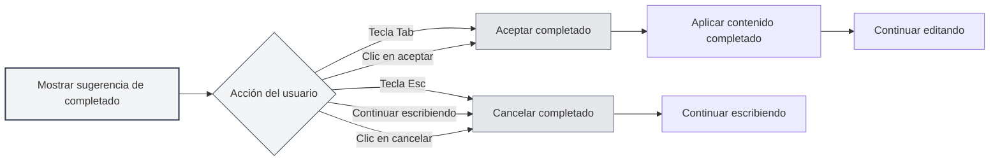

# Autocompletado con IA

## Descripción general

La función de autocompletado con IA utiliza tecnología de inteligencia artificial para completar automáticamente lo que estás escribiendo. Cuando dejas de escribir, la IA genera automáticamente sugerencias de completado basándose en el contexto, ayudándote a finalizar la redacción de documentos rápidamente.

El autocompletado con IA admite múltiples formatos de documento (Markdown, LaTeX, texto plano), puede comprender el contexto de manera inteligente y generar sugerencias de completado que se ajusten al estilo y contenido del documento.

## Habilitar el autocompletado con IA

### Métodos de habilitación

Existen varias formas de habilitar el autocompletado automático con IA:

- **Menú contextual**: Haz clic con el botón derecho en el editor y selecciona "Habilitar autocompletado con IA"
- **Página de configuración**: Habilita la función de autocompletado con IA en la configuración
- **Atajo de teclado**: Usa un atajo de teclado para alternar rápidamente (si está configurado)

Puedes acceder a la configuración a través de la barra de menú superior:

<MenuItemsDemo mode="demo" :items='[{"id": "settings"}]' />

<CompletionSettingsPanel mode="demo" />

### Condiciones de habilitación

Para habilitar el autocompletado automático con IA se deben cumplir las siguientes condiciones:

- **LLM configurado**: Es necesario configurar un servicio LLM
- **Documento abierto**: Se debe tener un documento abierto en el editor
- **Función habilitada**: La función de autocompletado con IA debe estar habilitada en la configuración

Consulta [[ai.llm-config|Configuración de LLM]] para más detalles.

<CompletionSettingsPanel mode="demo" />

## Activación automática

<AISuggestionGhost mode="demo" />

### Condiciones de activación

El autocompletado con IA se activará automáticamente en las siguientes situaciones:

- **Dejar de escribir**: Se activa automáticamente después de 600ms de inactividad
- **Teclas de activación**: Se activa al presionar teclas específicas (Enter, Espacio, `;`, `,`, etc.)

### Retraso de activación

Configuración del retraso de activación:

- **Retraso predeterminado**: 600ms (0.6 segundos)
- **Configurable**: Se puede ajustar el tiempo de retraso en la configuración
- **Consideración de equilibrio**: Un retraso demasiado corto activa frecuentemente, uno demasiado largo afecta la experiencia

<CompletionSettingsPanel mode="demo" />

### Teclas de activación

Teclas de activación admitidas:

- **Enter**: Se activa con la tecla Intro
- **Espacio**: Se activa con la barra espaciadora
- **;**: Se activa con punto y coma
- **,**: Se activa con coma

Puedes configurar las teclas de activación en la configuración, admitiendo la habilitación simultánea de múltiples teclas.

## Activación manual

<AISuggestionGhost mode="demo" />

### Métodos de activación

Formas de activar el completado manualmente:

- **Atajo de teclado**: Presiona `Shift+Tab` para activar el completado manualmente
- **Menú contextual**: Haz clic derecho y selecciona "Activar completado manualmente"

La activación manual inicia el completado inmediatamente, omitiendo el retraso de la activación automática.

<CompletionSettingsPanel mode="demo" />

### Casos de uso

Escenarios adecuados para la activación manual:

- **Necesidad inmediata de completado**: Cuando se requiere una sugerencia de completado de inmediato
- **Fallo en activación automática**: Cuando la activación automática no funciona
- **Posición específica**: Cuando se necesita completado en una ubicación específica

## Contenido del completado

<AISuggestionGhost mode="demo" />

### Comprensión del contexto

El completado con IA comprende el siguiente contexto:

- **Párrafo actual**: Comprende el contenido del párrafo actual
- **Estructura del documento**: Comprende la estructura general del documento
- **Estilo del documento**: Comprende el estilo de escritura del documento
- **Tema del documento**: Comprende el tema y contenido del documento

### Modos de completado

El completado con IA admite dos modos:

- **Generación completa**: Genera contenido de completado completo
- **Generación parcial**: Solo genera parte del contenido (según la configuración)

El modo de completado se puede configurar en los ajustes.

<CompletionSettingsPanel mode="demo" />

### Longitud del completado

Control de la longitud del contenido del completado:

- **Número máximo de tokens**: Se puede establecer el número máximo de tokens para el completado
- **Valor predeterminado**: 50 tokens
- **Rango**: Desde 20 tokens hasta ilimitado (0 significa sin límite)

A mayor número de tokens, más contenido se completará, pero el tiempo de generación también será mayor.

<CompletionSettingsPanel mode="demo" />

## Aceptar el completado

<AISuggestionGhost mode="demo" />

### Métodos de aceptación

Formas de aceptar una sugerencia de completado:

- **Tecla Tab**: Presiona la tecla `Tab` para aceptar la sugerencia de completado
- **Clic en aceptar**: Haz clic en el botón "Aceptar" en la sugerencia de completado

### Cancelar el completado

Formas de cancelar una sugerencia de completado:

- **Tecla Esc**: Presiona la tecla `Esc` para cancelar la sugerencia de completado
- **Continuar escribiendo**: Continuar escribiendo cancela automáticamente el completado
- **Clic en cancelar**: Haz clic en el botón "Cancelar" en la sugerencia de completado

### Editar el completado

Después de aceptar el completado, se puede seguir editando:

- **Edición directa**: Tras aceptar, se puede editar directamente el contenido completado
- **Aceptación parcial**: Se puede aceptar solo parte del contenido completado
- **Modificar completado**: Se puede modificar el contenido completado antes de usarlo

## Integración con base de conocimientos

### Habilitar la base de conocimientos

Para habilitar la integración con la base de conocimientos:

1. **Abrir configuración**: Habilita la integración con la base de conocimientos en la configuración
2. **Configurar base de conocimientos**: Configura los ajustes relacionados con la base de conocimientos
3. **Búsqueda automática**: Durante el completado, se buscará automáticamente en la base de conocimientos

Consulta [[knowledge-base.config|Configuración de la base de conocimientos]] para más detalles.

### Búsqueda contextual

Funcionalidad de búsqueda en la base de conocimientos:

- **Búsqueda automática**: Busca automáticamente conocimientos relevantes durante el completado
- **Coincidencia semántica**: Encuentra contenido relacionado según la similitud semántica
- **Integración de resultados**: Integra los resultados de la búsqueda en las sugerencias de completado

### Configuración de búsqueda

Ajustes de búsqueda en la base de conocimientos:

- **Umbral de confianza**: Establece el umbral de confianza para la búsqueda
- **Cantidad de resultados**: Configura el número de resultados de búsqueda
- **Alcance de búsqueda**: Define el alcance de la búsqueda

## Configuración del completado

### Configuración básica

Ajustes básicos del completado con IA:

- **Habilitar/Deshabilitar**: Activa o desactiva la función de completado con IA
- **Retraso de activación**: Establece el tiempo de retraso para la activación automática
- **Teclas de activación**: Configura las teclas de activación
- **Número máximo de tokens**: Establece el número máximo de tokens para el completado

<CompletionSettingsPanel mode="demo" />

### Configuración avanzada

Ajustes avanzados del completado con IA:

- **Modo de completado**: Selecciona el modo de completado (generación completa/parcial)
- **Longitud del contexto**: Establece la longitud del contexto utilizado para el completado
- **Configuración de temperatura**: Ajusta el parámetro de temperatura para la generación de IA
- **Integración con base de conocimientos**: Configura las opciones de integración con la base de conocimientos

<CompletionSettingsPanel mode="demo" />

### Configuración de formato

Ajustes de completado para diferentes formatos:

- **Markdown**: Configuración de completado para formato Markdown
- **LaTeX**: Configuración de completado para formato LaTeX
- **Texto plano**: Configuración de completado para formato de texto plano

Diferentes formatos pueden tener diferentes estrategias y configuraciones de completado.

## Consejos de uso

### Mejorar la calidad del completado

1. **Proporcionar contexto**: Proporciona suficiente información contextual en el documento
2. **Habilitar base de conocimientos**: Habilitar la integración con la base de conocimientos puede mejorar la calidad del completado
3. **Ajustar configuración**: Ajusta la configuración de completado según tus necesidades

### Uso eficiente

1. **Uso razonable**: No dependas excesivamente del completado con IA
2. **Verificar contenido**: Después de aceptar el completado, verifica que el contenido sea correcto
3. **Ajuste manual**: Ajusta manualmente el contenido completado cuando sea necesario

### Evitar problemas

1. **Evitar activaciones frecuentes**: Evita activar el completado con demasiada frecuencia, ya que puede afectar la experiencia de escritura
2. **Verificar precisión**: Comprueba la precisión del contenido completado
3. **Cancelar oportunamente**: Cancela los completados no deseados a tiempo

## Preguntas frecuentes

### P: ¿El completado no es preciso?

R: El completado con IA se basa en el contexto y datos de entrenamiento, por lo que puede no ser preciso. Puedes proporcionar más información contextual o habilitar la integración con la base de conocimientos para mejorar la precisión.

### P: ¿El completado es muy lento?

R: La velocidad del completado depende de la respuesta del servicio de IA. Puedes ajustar la configuración de completado o usar un servicio LLM más rápido.

### P: ¿Cómo desactivar el autocompletado?

R: Deshabilita la función de autocompletado con IA en la configuración, o usa el menú contextual para desactivarlo.

### P: ¿Se pueden personalizar las teclas de activación?

R: Sí. Configura las teclas de activación en los ajustes, admitiendo la habilitación simultánea de múltiples teclas.

### P: ¿El contenido completado es demasiado largo?

R: Puedes ajustar el número máximo de tokens para el completado en la configuración, limitando así la longitud del contenido completado.

## Documentación relacionada

- [[ai.chat|Chat con IA]]
- [[ai.proofread|Corrección con IA]]
- [[knowledge-base.config|Configuración de la base de conocimientos]]
- [[ai.llm-config|Configuración de LLM]]
