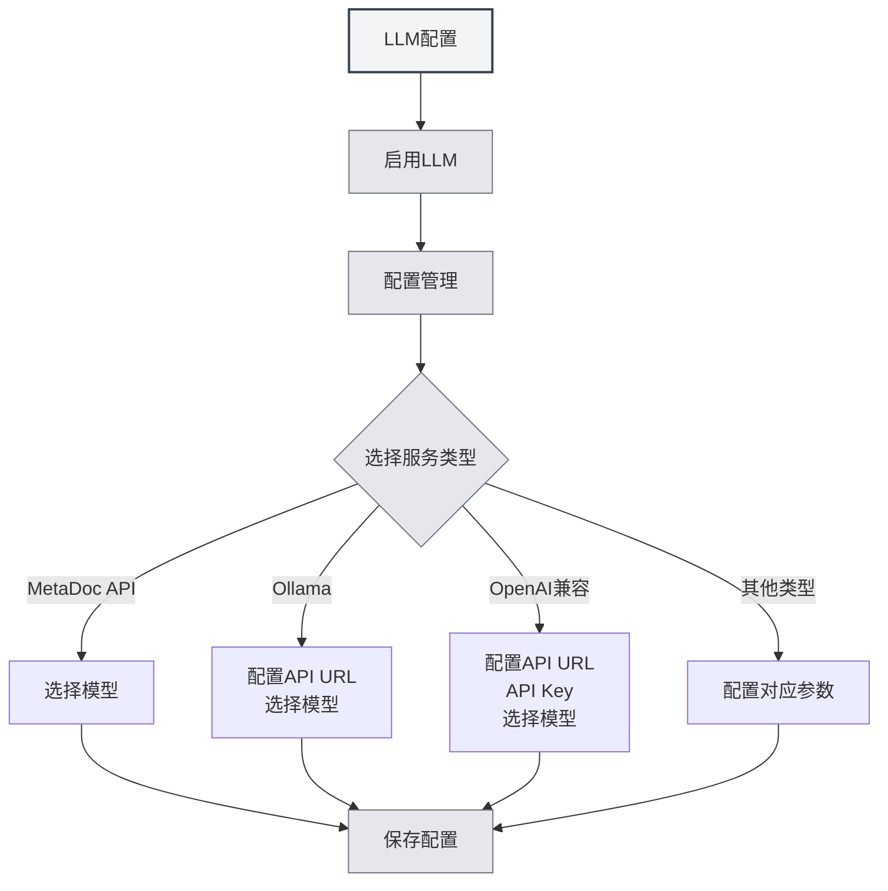

# Guía de configuración de LLM

## Descripción general

Los LLM (modelos de lenguaje grandes) son la base común para funciones como el diálogo con IA, corrección, autocompletado, asistentes y Agent en MetaDoc. Este documento explica por qué es necesario configurar el LLM, qué funciones se ven afectadas por la configuración y cómo acceder a la interfaz de configuración específica.

**Canal de distribución**: si usa MetaDoc a través de **Steam**, lea primero la sección **Steam / MetaDoc Cloud** en **[[settings.llm|Configuración de LLM]]** (recarga, saldo, cambio de modelo). Solo si necesita una **API de terceros propia**, active la **conectividad experimental** en **Opciones experimentales** y continúe abajo; consulte también **[[settings.llm-types|Tipos de proveedor LLM]]**.

<Demo component="SettingLlmSection" mode="demo" />

## Por qué configurar el LLM

- **Llamadas a la API**: Funciones como diálogo, autocompletado y corrección solicitan la interfaz del LLM que seleccione, requiriendo la configuración correcta de la dirección y la clave de la API.
- **Diferencias entre modelos**: Los diferentes modelos varían considerablemente en calidad, velocidad y costo. Elegir el modelo adecuado según el escenario mejora la experiencia y controla los costos.
- **Punto de entrada unificado**: Gestiona de forma centralizada el estado de activación, la temperatura, las etiquetas de razonamiento, etc., en [[settings.llm|Configuración de LLM]]. Una sola configuración afecta a todas las funciones de IA.

## Qué funciones se ven afectadas por la configuración

Una vez configurado y activado el LLM, afectará las siguientes capacidades:

| Función        | Descripción                 |
| ----------- | -------------------- | ---------------------------------------------- |
| **Diálogo con IA** | [[ai.chat            | Función de diálogo con IA]]: Diálogo de múltiples turnos con IA, respuestas basadas en contexto |
| **Corrección con IA** | [[ai.proofread       | Función de corrección con IA]]: Verificación de gramática y ortografía, sugerencias de modificación         |
| **Autocompletado con IA** | [[ai.completion      | Autocompletado con IA]]: Continuación y completado inteligente durante la escritura           |
| **Asistentes de IA** | [[ai.assistants      | Función de asistentes de IA]]: Reconocimiento de fórmulas, asistente de dibujo, análisis de datos, etc.   |
| **Agent**   | [[agent.introduction | Marco de Agent]]: Conversación, llamadas a herramientas, ejecución de flujos de trabajo        |

Cuando el LLM esté desactivado o no se haya configurado un servicio disponible, las funciones anteriores no estarán disponibles o solicitarán completar la configuración primero.

## Cómo configurar el LLM

### Acceder a la página de configuración

1.  Abre **Configuración** → **Configuración de LLM** (o la entrada equivalente dentro de la aplicación).
2.  En la página «[[settings.llm|Configuración de LLM]]» puedes:
    -   Activar/Desactivar el LLM
    -   Configurar opciones globales como la temperatura, si eliminar automáticamente las etiquetas de razonamiento, etc.
    -   Gestionar múltiples configuraciones de LLM (crear, editar, eliminar, ordenar)

Puedes acceder a la configuración de LLM desde la barra de menú superior:

<MenuItemsDemo mode="demo" :items='[{"id": "settings"}]' />

<MenuItemsDemo mode="demo" :items='[{"id": "ai"}]' />

### Configurar un servicio específico

En **Gestión de configuración de LLM**, selecciona o crea una nueva configuración y completa los campos según el tipo de servicio:

-   **MetaDoc API / Ollama / OpenAI compatible / OpenAI oficial / DeepSeek / Gemini**, etc.  
    Consulta [[settings.llm-types|Configuración de tipos de LLM]] para ver los campos detallados y los pasos (dirección de la API, clave de la API, nombre del modelo, tokens máximos, etc.).

### Recomendaciones de uso

-   **Primer uso**: Primero completa y guarda una configuración de LLM funcional, luego activa la opción «Activar LLM».
-   **Múltiples configuraciones**: Puedes crear varias configuraciones para diferentes escenarios (por ejemplo, «Diálogo diario», «Especial para corrección») y seleccionar cuál usar en la función correspondiente o en la configuración del Agent.
-   **Costo y privacidad**: El uso de API en la nube generará costos y puede implicar la carga de contenido. Si necesitas privacidad y operación local, considera priorizar métodos de despliegue local como Ollama (consulta [[settings.llm-types|Configuración de tipos de LLM]]).

## Documentación relacionada

- [[settings.llm|Configuración de LLM]]
- [[settings.llm-types|Configuración de tipos de LLM]]
- [[settings.llm-management|Gestión de configuración de LLM]]
- [[ai.chat|Función de diálogo con IA]]
- [[agent.introduction|Descripción general del marco de Agent]]

<AIChat mode="demo" />
