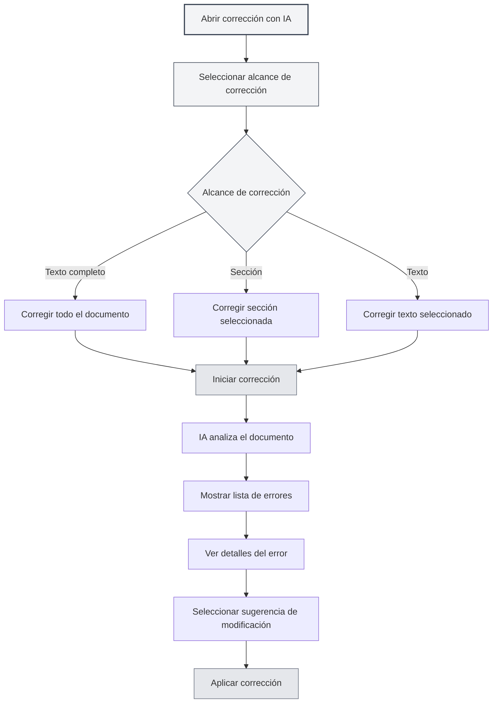
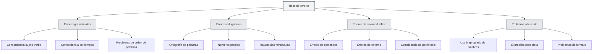
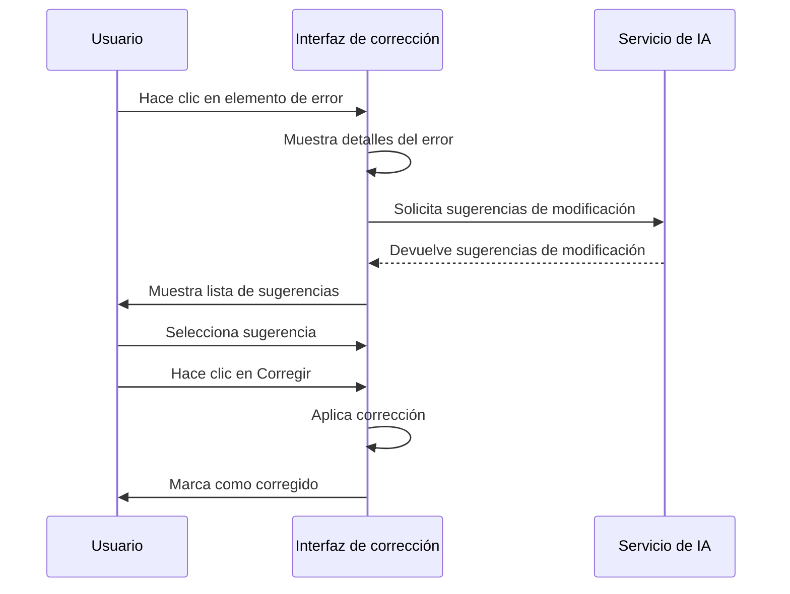

# Corrección con IA

## Descripción general

La función de corrección con IA utiliza tecnología de inteligencia artificial para verificar automáticamente errores gramaticales, ortográficos, de sintaxis LaTeX, entre otros, en los documentos, y proporciona sugerencias de corrección. A través de la corrección con IA, puede descubrir y corregir rápidamente errores en sus documentos, mejorando su calidad.

La corrección con IA admite múltiples formatos de documento (Markdown, LaTeX, texto plano), puede revisar el texto completo o secciones específicas, y proporciona información detallada sobre los errores y sugerencias de modificación.

## Abrir la corrección con IA

### Métodos para abrir

Existen varias formas de abrir la corrección con IA:

- **Barra de menú**: Haga clic en el menú "AI" y seleccione "Corrección con IA"
- **Atajo de teclado**: Use el atajo de teclado para abrir rápidamente (si está configurado)
- **Barra lateral**: Abra el panel de corrección con IA desde la barra lateral

Puede acceder a la función de corrección con IA a través del menú del Asistente de IA en la barra de menú superior:

<MenuItemsDemo mode="demo" :items='[{"id": "ai-assistant", "items": ["proofread"]}]' />

### Descripción de la interfaz

La interfaz de corrección con IA contiene las siguientes partes:

- **Lista de errores**: Muestra todos los errores en el lado izquierdo
- **Vista previa del documento**: Muestra el contenido del documento en el lado derecho
- **Estadísticas de errores**: Muestra información estadística de errores en la parte superior
- **Botones de acción**: Proporciona botones de acción en la parte superior

<ProofreadView mode="demo" />

<ProofreadDisplay mode="demo" />

## Alcance de la corrección

### Corregir texto completo

Corregir todo el documento:

1. **Abrir corrección**: Abra el panel de corrección con IA
2. **Hacer clic en Iniciar**: Haga clic en el botón "Iniciar corrección"
3. **Esperar a que finalice**: Espere a que la IA complete la corrección

La corrección del texto completo verificará automáticamente todo el contenido del documento.

<ProofreadView mode="demo" />

<ProofreadDisplay mode="demo" />

### Corregir sección específica

Corregir una sección específica del documento:

1. **Seleccionar sección**: Seleccione la sección a corregir en la vista de esquema
2. **Abrir corrección**: Abra el panel de corrección con IA
3. **Especificar sección**: Especifique la ruta de la sección en la configuración de corrección
4. **Iniciar corrección**: Haga clic en el botón "Iniciar corrección"

La corrección de una sección específica solo revisa el contenido de la sección seleccionada y sus subsecciones.

<ProofreadView mode="demo" />

<ProofreadDisplay mode="demo" />

### Corregir texto especificado

Corregir contenido de texto específico:

1. **Seleccionar texto**: Seleccione el texto a corregir en el editor
2. **Abrir corrección**: Abra el panel de corrección con IA
3. **Pegar texto**: Pegue el texto en el cuadro de entrada de corrección
4. **Iniciar corrección**: Haga clic en el botón "Iniciar corrección"

<ProofreadDisplay mode="demo" />

## Tipos de errores

La corrección con IA puede detectar los siguientes tipos de errores:

### Errores gramaticales

Verificar errores gramaticales en el documento:

<ProofreadDisplay mode="demo" />

- **Concordancia sujeto-verbo**: Verificar problemas de concordancia sujeto-verbo
- **Concordancia de tiempos**: Verificar problemas de concordancia de tiempos verbales
- **Problemas de orden de palabras**: Verificar problemas en el orden de las palabras
- **Otra gramática**: Verificar otros problemas gramaticales

### Errores ortográficos

Verificar errores ortográficos en el documento:

- **Ortografía de palabras**: Verificar errores de ortografía en palabras
- **Nombres propios**: Verificar ortografía de nombres propios
- **Mayúsculas/minúsculas**: Verificar problemas de uso de mayúsculas y minúsculas

### Errores de sintaxis LaTeX

Verificar errores de sintaxis en documentos LaTeX:

- **Errores de comandos**: Verificar errores en comandos LaTeX
- **Errores de entorno**: Verificar errores en entornos LaTeX
- **Coincidencia de paréntesis**: Verificar problemas de coincidencia de paréntesis
- **Otra sintaxis**: Verificar otros problemas de sintaxis LaTeX

### Problemas de estilo

Verificar problemas de estilo en el documento:

- **Uso inapropiado de palabras**: Verificar si el uso de palabras es apropiado
- **Expresión poco clara**: Verificar si la expresión es clara
- **Problemas de formato**: Verificar problemas de formato

## Información de errores

### Visualización de errores

La información del error contiene lo siguiente:

<ProofreadDisplay mode="demo" />

- **Tipo de error**: Muestra el tipo de error (gramática, ortografía, LaTeX, etc.)
- **Ubicación del error**: Muestra el número de línea y columna donde se encuentra el error
- **Texto del error**: Muestra el contenido de texto con el error
- **Sugerencia de modificación**: Muestra sugerencias de corrección
- **Gravedad**: Muestra el nivel de gravedad del error

### Niveles de gravedad

Los errores se clasifican por nivel de gravedad:

- **Error (Error)**: Errores que deben corregirse
- **Advertencia (Warning)**: Problemas que se recomienda corregir
- **Información (Info)**: Información solo para referencia

### Localización de errores

Localizar rápidamente la posición del error:

1. **Hacer clic en el error**: Haga clic en el elemento de error en la lista de errores
2. **Localización automática**: El editor se desplaza automáticamente a la posición del error
3. **Resaltado**: La posición del error se resaltará

## Sugerencias de modificación

### Ver sugerencias

Ver las sugerencias de modificación proporcionadas por la IA:

<ProofreadDisplay mode="demo" />

- **Sugerencia única**: Si solo hay una sugerencia, se muestra directamente
- **Múltiples sugerencias**: Si hay varias sugerencias, se muestran en forma de etiquetas
- **Seleccionar sugerencia**: Haga clic en la etiqueta de sugerencia para seleccionarla

### Aplicar corrección

Aplicar sugerencias de modificación:

<ProofreadDisplay mode="demo" />

1. **Seleccionar sugerencia**: Haga clic en la etiqueta de sugerencia para seleccionarla
2. **Hacer clic en Corregir**: Haga clic en el botón "Corregir"
3. **Confirmar corrección**: Después de confirmar, se aplica la corrección

Después de la corrección, el error se marcará como "corregido".

### Corrección en un clic

Corregir todos los errores con un clic:

1. **Hacer clic en Corregir todo**: Haga clic en el botón "Corregir todo en un clic"
2. **Confirmar corrección**: Después de confirmar, se corrigen todos los errores

La corrección en un clic utilizará la primera sugerencia para corregir todos los errores.

## Gestión de errores

### Ignorar errores

Ignorar errores que no necesitan corrección:

1. **Seleccionar error**: Seleccione el error que desea ignorar
2. **Hacer clic en Ignorar**: Haga clic en el botón "Ignorar"
3. **Confirmar ignorar**: Después de confirmar, se ignora el error

Los errores ignorados se eliminarán de la lista de errores.

### Agregar al diccionario

Agregar palabras al diccionario:

1. **Seleccionar error**: Seleccione un error ortográfico
2. **Agregar al diccionario**: Haga clic en el botón "Agregar al diccionario"
3. **Confirmar agregar**: Después de confirmar, se agrega al diccionario

Después de agregar al diccionario, esa palabra ya no se marcará como error ortográfico.

### Vaciar corregidos

Vaciar los errores ya corregidos:

1. **Hacer clic en Vaciar**: Haga clic en el botón "Vaciar corregidos"
2. **Confirmar vaciar**: Después de confirmar, se vacían los errores corregidos

Vaciar los errores corregidos puede hacer que la lista de errores sea más clara.

## Consejos de uso

<ProofreadView mode="demo" />

### Corrección eficiente

1. **Primero corregir texto completo**: Primero corrija el texto completo para entender la situación general
2. **Luego corregir secciones**: Realice una corrección detallada de las secciones problemáticas
3. **Corrección por lotes**: Use la corrección en un clic para corregir rápidamente errores comunes

### Manejo de errores

1. **Priorizar errores graves**: Priorice el manejo de errores graves
2. **Revisar sugerencias**: Revise cuidadosamente las sugerencias de modificación
3. **Ajuste manual**: Ajuste manualmente el contenido modificado cuando sea necesario

### Gestión del diccionario

1. **Agregar terminología profesional**: Agregue terminología profesional al diccionario
2. **Actualizar periódicamente**: Actualice periódicamente el contenido del diccionario
3. **Exportar diccionario**: Exporte el diccionario para realizar copias de seguridad

## Preguntas frecuentes

### P: ¿Los resultados de la corrección no son precisos?

R: La corrección con IA se basa en modelos de IA y puede no ser precisa. Se recomienda verificar manualmente los resultados de la corrección, especialmente la terminología profesional y expresiones especiales.

### P: ¿Cómo corregir una sección específica?

R: Especifique la ruta de la sección en la configuración de corrección (por ejemplo, "1.1"), o use la vista de esquema para seleccionar la sección.

### P: ¿Se pueden ignorar ciertos errores?

R: Sí. Puede hacer clic en el botón "Ignorar" para omitir errores que no necesitan corrección.

### P: ¿Cómo agregar al diccionario?

R: Seleccione un error ortográfico y haga clic en el botón "Agregar al diccionario" para agregar la palabra al diccionario.

### P: ¿La corrección es muy lenta?

R: La velocidad de corrección depende del tamaño del documento y de la velocidad de respuesta del servicio de IA. Para documentos grandes, se recomienda realizar la corrección por secciones.

## Documentación relacionada

- [[ai.chat|Chat con IA]]
- [[ai.completion|Autocompletado con IA]]
- [[outline.basics|Funciones de la vista de esquema]]