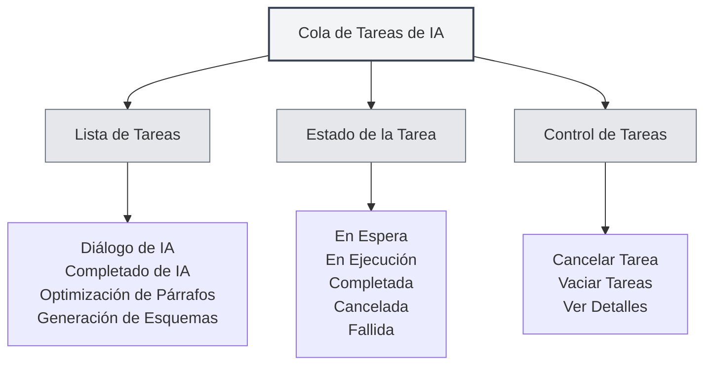

# Cola de Tareas de IA

## Descripción General

La cola de tareas de IA se utiliza para gestionar y supervisar todas las tareas de IA en ejecución. A través de la cola de tareas, puede ver el estado de las tareas, cancelarlas, consultar su progreso y garantizar el funcionamiento eficiente de las funciones de IA.

## Introducción a la Cola de Tareas

<AITaskQueue mode="demo" />

### ¿Qué es la Cola de Tareas?

La cola de tareas de IA es una interfaz de gestión que muestra todas las tareas de IA en ejecución o en espera:

- **Lista de Tareas**: Muestra todas las tareas y sus estados.
- **Estado de la Tarea**: Muestra el estado de ejecución de la tarea.
- **Progreso de la Tarea**: Muestra el progreso de ejecución de la tarea.
- **Control de Tareas**: Permite cancelar o gestionar tareas.

### Tipos de Tareas

La cola de tareas puede contener los siguientes tipos de tareas:

- **Diálogo de IA**: Tareas de conversación con IA.
- **Completado de IA**: Tareas de autocompletado de IA.
- **Optimización de Párrafos**: Tareas de optimización de párrafos.
- **Generación de Esquemas**: Tareas de generación de esquemas.
- **Otras Tareas de IA**: Otras tareas relacionadas con IA.

## Abrir la Cola de Tareas

### Métodos de Acceso

Puede abrir la cola de tareas de las siguientes maneras:

- **Barra Lateral**: Puede haber una entrada a la cola de tareas en la barra lateral.
- **Opción de Menú**: Algunos menús pueden tener una opción para la cola de tareas.
- **Atajo de Teclado**: En algunos casos, puede haber un atajo de teclado (posible soporte futuro).

### Panel de la Cola de Tareas

<AITaskQueue mode="demo" />

La cola de tareas generalmente se muestra como un panel lateral:

- **Lista de Tareas**: Muestra todas las tareas.
- **Detalles de la Tarea**: Muestra información detallada de la tarea seleccionada.
- **Botones de Control**: Proporciona funciones de control de tareas.

## Visualización de Tareas

<AITaskQueue mode="demo" />

### Lista de Tareas

La lista de tareas muestra todas las tareas:

- **Nombre de la Tarea**: Muestra el nombre de la tarea.
- **Estado de la Tarea**: Muestra el estado actual de la tarea.
- **Progreso de la Tarea**: Muestra el progreso de ejecución de la tarea.
- **Hora de la Tarea**: Muestra la hora de creación de la tarea.

### Estado de la Tarea

Una tarea puede estar en los siguientes estados:

- **En Espera**: La tarea ha sido creada y está esperando ejecución.
- **En Ejecución**: La tarea se está ejecutando.
- **Completada**: La tarea ha finalizado su ejecución.
- **Cancelada**: La tarea ha sido cancelada.
- **Fallida**: La tarea ha fallado durante la ejecución.

### Detalles de la Tarea

Puede ver información detallada de la tarea:

- **Nombre de la Tarea**: El nombre de la tarea.
- **Tipo de Tarea**: El tipo de tarea.
- **Parámetros de la Tarea**: Los parámetros de la tarea.
- **Resultado de la Tarea**: El resultado de la tarea (si está completada).
- **Información de Error**: Información de error de la tarea (si falló).

## Control de Tareas

<AITaskQueue mode="demo" />

### Cancelar Tarea

Puede cancelar una tarea en ejecución:

1. **Seleccionar Tarea**: Seleccione la tarea a cancelar en la lista de tareas.
2. **Hacer Clic en Cancelar**: Haga clic en el botón "Cancelar".
3. **Confirmar Cancelación**: Confirme la operación de cancelación.
4. **Tarea Cancelada**: La tarea será cancelada y eliminada.

<AITaskQueue mode="demo" />

### Vaciar Tareas

Puede vaciar todas las tareas:

1. **Abrir Cola de Tareas**: Abra el panel de la cola de tareas.
2. **Hacer Clic en Vaciar**: Haga clic en el botón "Vaciar".
3. **Confirmar Vaciar**: Confirme la operación de vaciado.
4. **Tareas Vaciadas**: Todas las tareas serán canceladas y eliminadas.

### Prioridad de Tareas

Algunas tareas pueden tener prioridad:

- **Alta Prioridad**: Las tareas importantes se ejecutan primero.
- **Prioridad Normal**: Las tareas normales se ejecutan en orden.
- **Baja Prioridad**: Las tareas de baja prioridad se ejecutan al final.

## Visualización del Progreso de la Tarea

<AITaskQueue mode="demo" />

### Barra de Progreso

El progreso de la tarea se muestra mediante una barra de progreso:

- **Porcentaje de Progreso**: Muestra el porcentaje completado de la tarea.
- **Barra de Progreso**: Muestra visualmente el progreso de la tarea.
- **Actualización de Progreso**: El progreso se actualiza en tiempo real.

### Información de Progreso

Puede ver la información de progreso de la tarea:

- **Paso Actual**: Muestra el paso que se está ejecutando actualmente.
- **Pasos Completados**: Muestra los pasos ya completados.
- **Número Total de Pasos**: Muestra el número total de pasos.
- **Tiempo Estimado**: Muestra el tiempo estimado para completar.

<AITaskQueue mode="demo" />

## Retraso de Tareas

<AITaskQueue mode="demo" />

### Retrasar Completado

Puede retrasar una tarea de completado de IA:

1. **Abrir Cola de Tareas**: Abra el panel de la cola de tareas.
2. **Seleccionar Tiempo de Retraso**: Seleccione el tiempo de retraso (minutos).
3. **Aplicar Retraso**: Aplique la configuración de retraso.
4. **Tarea Retrasada**: La tarea de completado se ejecutará con retraso.

### Visualización del Retraso

El tiempo de retraso se mostrará en la cola de tareas:

- **Tiempo Restante**: Muestra el tiempo de retraso restante.
- **Cuenta Regresiva**: Muestra una cuenta regresiva en tiempo real.
- **Ejecución Automática**: Se ejecuta automáticamente una vez finalizado el tiempo de retraso.

## Historial de Tareas

<AITaskQueue mode="demo" />

### Registro de Historial

La cola de tareas puede guardar el historial de tareas:

- **Tareas Completadas**: Muestra las tareas completadas.
- **Tareas Fallidas**: Muestra las tareas que fallaron.
- **Tareas Canceladas**: Muestra las tareas canceladas.

### Consulta del Historial

Puede consultar el historial de tareas:

- **Lista de Historial**: Muestra la lista de tareas históricas.
- **Detalles de la Tarea**: Vea información detallada de las tareas históricas.
- **Ver Resultados**: Vea los resultados de las tareas.

## Mejores Prácticas

<AITaskQueue mode="demo" />

1. **Revisar Periódicamente**: Revise periódicamente la cola de tareas para conocer el estado de ejecución.
2. **Cancelar Oportunamente**: Cancele las tareas innecesarias a tiempo para liberar recursos.
3. **Supervisar el Progreso**: Preste atención al progreso de las tareas para asegurar su ejecución normal.
4. **Manejo de Errores**: Gestione las tareas fallidas a tiempo para evitar afectar tareas posteriores.
5. **Gestión de Recursos**: Gestione las tareas de manera razonable para evitar desperdicio de recursos.

## Consideraciones

1. **Número de Tareas**: Demasiadas tareas pueden afectar el rendimiento.
2. **Cancelación de Tareas**: Cancelar una tarea puede afectar operaciones en ejecución.
3. **Estado de la Tarea**: El estado de la tarea puede cambiar en tiempo real.
4. **Uso de Recursos**: Las tareas consumen recursos del sistema.
5. **Dependencia de Red**: Algunas tareas requieren conexión a red.

## Documentación Relacionada

- [[ai.chat|Función de Diálogo de IA]]
- [[ai.completion|Autocompletado de IA]]
- [[features.paragraph-optimization|Función de Optimización de Párrafos]]