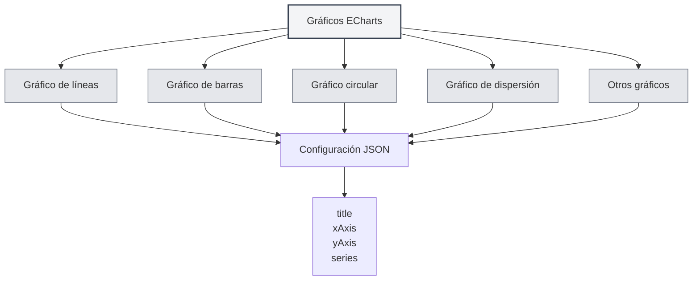

# Gráficos ECharts

## Descripción general

ECharts es una potente biblioteca de visualización de datos que admite múltiples tipos de gráficos. MetaDoc es compatible con los gráficos ECharts, permitiendo crear diversas visualizaciones de datos dentro de documentos Markdown utilizando configuraciones de ECharts.

<DataAnalysisWindow mode="demo" />

## Sintaxis de ECharts

<ChartGenerationDisplay mode="demo" />

### Sintaxis básica

ECharts utiliza un formato de configuración JSON:

````markdown
```echarts
{
  "title": {
    "text": "Ejemplo de gráfico"
  },
  "xAxis": {
    "type": "category",
    "data": ["A", "B", "C"]
  },
  "yAxis": {
    "type": "value"
  },
  "series": [{
    "data": [10, 20, 30],
    "type": "bar"
  }]
}
```
````

### Formato de configuración

La configuración de ECharts debe ser un JSON válido:

- **Formato JSON**: Utilizar el formato JSON estándar.
- **Puntuación en inglés**: Usar comas, dos puntos y comillas en inglés.
- **Configuración completa**: Incluir los elementos de configuración necesarios.



## Tipos de gráficos admitidos

<DataAnalysisDisplay mode="demo" />

### Gráfico de líneas

Crear un gráfico de líneas:

````markdown
```echarts
{
  "xAxis": {
    "type": "category",
    "data": ["Lun", "Mar", "Mié"]
  },
  "yAxis": {
    "type": "value"
  },
  "series": [{
    "data": [120, 200, 150],
    "type": "line"
  }]
}
```
````

### Gráfico de barras

<ChartGenerationDisplay mode="demo" />

Crear un gráfico de barras:

````markdown
```echarts
{
  "xAxis": {
    "type": "category",
    "data": ["A", "B", "C"]
  },
  "yAxis": {
    "type": "value"
  },
  "series": [{
    "data": [10, 20, 30],
    "type": "bar"
  }]
}
```
````

### Gráfico circular

<DataAnalysisDisplay mode="demo" />

Crear un gráfico circular:

````markdown
```echarts
{
  "series": [{
    "type": "pie",
    "data": [
      {"value": 335, "name": "Categoría A"},
      {"value": 310, "name": "Categoría B"},
      {"value": 234, "name": "Categoría C"}
    ]
  }]
}
```
````

### Gráfico de dispersión

<ChartGenerationDisplay mode="demo" />

Crear un gráfico de dispersión:

````markdown
```echarts
{
  "xAxis": {
    "type": "value"
  },
  "yAxis": {
    "type": "value"
  },
  "series": [{
    "type": "scatter",
    "data": [[10, 20], [15, 25], [20, 30]]
  }]
}
```
````

### Gráfico de radar

<OutlineTreeDisplay mode="demo" />

Crear un gráfico de radar:

````markdown
```echarts
{
  "radar": {
    "indicator": [
      {"name": "Indicador 1", "max": 100},
      {"name": "Indicador 2", "max": 100}
    ]
  },
  "series": [{
    "type": "radar",
    "data": [{
      "value": [80, 90]
    }]
  }]
}
```
````

### Mapa de calor

<DataAnalysisDisplay mode="demo" />

Crear un mapa de calor:

````markdown
```echarts
{
  "xAxis": {
    "type": "category",
    "data": ["A", "B", "C"]
  },
  "yAxis": {
    "type": "category",
    "data": ["X", "Y", "Z"]
  },
  "series": [{
    "type": "heatmap",
    "data": [[0, 0, 10], [0, 1, 20], [1, 0, 30]]
  }]
}
```
````

## Configuración del gráfico

<OutlineTreeDisplay mode="demo" />

### Configuración del título

Establecer el título del gráfico:

```json
{
  "title": {
    "text": "Título del gráfico",
    "subtext": "Subtítulo"
  }
}
```

### Configuración de ejes

Configurar los ejes:

```json
{
  "xAxis": {
    "type": "category",
    "data": ["A", "B", "C"]
  },
  "yAxis": {
    "type": "value"
  }
}
```

### Configuración de series

Configurar las series de datos:

```json
{
  "series": [
    {
      "name": "Nombre de la serie",
      "type": "bar",
      "data": [10, 20, 30]
    }
  ]
}
```

### Configuración de la leyenda

Configurar la leyenda:

```json
{
  "legend": {
    "data": ["Serie 1", "Serie 2"]
  }
}
```

### Configuración de la información sobre herramientas

Configurar la información sobre herramientas (tooltip):

```json
{
  "tooltip": {
    "trigger": "axis"
  }
}
```

## Funciones avanzadas

<ChartGenerationDisplay mode="demo" />

### Gráficos con múltiples series

Crear gráficos con múltiples series:

````markdown
```echarts
{
  "xAxis": {
    "type": "category",
    "data": ["Lun", "Mar", "Mié"]
  },
  "yAxis": {
    "type": "value"
  },
  "series": [
    {
      "name": "Serie 1",
      "type": "bar",
      "data": [10, 20, 30]
    },
    {
      "name": "Serie 2",
      "type": "line",
      "data": [15, 25, 35]
    }
  ]
}
```
````

### Zoom de datos

Añadir zoom de datos:

```json
{
  "dataZoom": [
    {
      "type": "slider",
      "start": 0,
      "end": 100
    }
  ]
}
```

### Mapeo visual

Añadir mapeo visual:

```json
{
  "visualMap": {
    "min": 0,
    "max": 100,
    "inRange": {
      "color": ["#50a3ba", "#eac736", "#d94e5d"]
    }
  }
}
```

## Métodos de renderizado

### Renderizado en el proceso principal

ECharts utiliza el renderizado en el proceso principal:

- **Renderizado del lado del servidor**: Los gráficos se renderizan en el proceso principal.
- **Formato SVG**: Se renderizan en formato SVG por defecto.
- **Formato PNG**: Se pueden convertir al formato PNG.

### Rendimiento del renderizado

Características del renderizado de ECharts:

- **Velocidad de renderizado**: El renderizado en el proceso principal es más rápido.
- **Uso de recursos**: Consume recursos del proceso principal durante el renderizado.
- **Manejo de errores**: Los errores de renderizado se muestran en la consola.

## Consideraciones

### Consideraciones de sintaxis

1. **Formato JSON**: Se debe utilizar un formato JSON válido.
2. **Puntuación en inglés**: Usar comas, dos puntos y comillas en inglés.
3. **Configuración completa**: Incluir los elementos de configuración necesarios.
4. **Sintaxis correcta**: Asegurarse de que la sintaxis JSON sea correcta; de lo contrario, no se renderizará.

### Consideraciones de renderizado

1. **Validación de configuración**: Se valida el formato de la configuración antes del renderizado.
2. **Errores de sintaxis**: El gráfico no se renderiza si hay errores de sintaxis JSON.
3. **Gráficos complejos**: Los gráficos excesivamente complejos pueden afectar el rendimiento del renderizado.
4. **Compatibilidad de exportación**: Asegurarse de que el gráfico se muestre correctamente en el formato de destino al exportar.

## Mejores prácticas

1. **Estándares de configuración**: Seguir las especificaciones oficiales de configuración de ECharts.
2. **Formato JSON**: Garantizar que el formato JSON sea correcto.
3. **Código claro**: Mantener el código de configuración claro y legible.
4. **Probar el renderizado**: Probar el efecto de renderizado del gráfico después de editarlo.
5. **Documentación de referencia**: Consultar la documentación oficial y los ejemplos de ECharts.

## Documentación relacionada

- [[charts.introduction|Introducción a las funciones de gráficos]]
- [[charts.mermaid|Gráficos Mermaid]]
- [[charts.plantuml|Gráficos PlantUML]]
