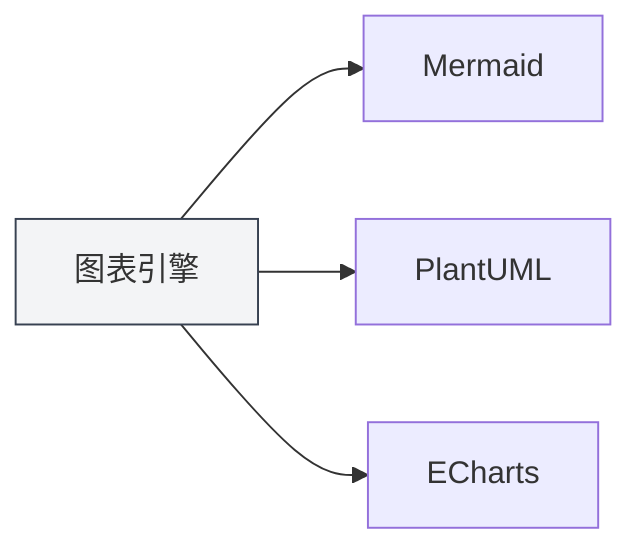
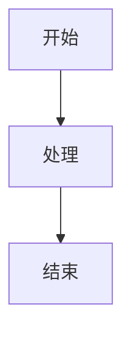

# Funciones de Gráficos

## Descripción General

MetaDoc admite múltiples motores de dibujo de gráficos, permitiendo insertar y renderizar varios tipos de gráficos en documentos Markdown. La función de gráficos le permite crear diagramas de flujo, diagramas UML, gráficos de visualización de datos, entre otros, enriqueciendo el contenido del documento.

<GraphWindow mode="demo" />

## Motores de Gráficos Soportados

<ChartGenerationDisplay mode="demo" />

### Tipos de Gráficos

MetaDoc admite los siguientes motores de gráficos:

- **Mermaid**: Diagramas de flujo, diagramas UML, diagramas de Gantt, etc.
- **PlantUML**: Diagramas de modelado UML profesionales
- **ECharts**: Gráficos de visualización de datos
- **Flowchart**: Diagramas de flujo básicos
- **Graphviz**: Visualización de gráficos
- **Mindmap**: Mapas mentales
- **Markmap**: Mapas mentales en Markdown
- **SMILES**: Fórmulas estructurales químicas
- **ABC**: Partituras musicales

### Comparación de Motores

<DataAnalysisDisplay mode="demo" />

| Motor      | Escenario de Uso Apropiado            | Método de Renderizado |
| ---------- | ------------------------------------- | --------------------- |
| Mermaid    | Diagramas de flujo, secuencia, clases, Gantt | Renderizado en navegador |
| PlantUML   | Modelado UML profesional              | Renderizado en proceso principal |
| ECharts    | Visualización de datos (líneas, barras, etc.) | Renderizado en proceso principal |
| Flowchart  | Diagramas de flujo básicos            | Renderizado Vditor    |
| Graphviz   | Visualización de gráficos             | Renderizado Vditor    |
| Mindmap    | Mapas mentales                        | Renderizado Vditor    |

### Gráfico de Comparación de Motores

<OutlineTreeDisplay mode="demo" />



## Insertar Gráficos

<DataAnalysisWindow mode="demo" />

### Sintaxis de Bloques de Código

Utilice bloques de código en documentos Markdown para insertar gráficos:

````markdown

````

### Identificadores de Tipo de Gráfico

Diferentes tipos de gráficos utilizan diferentes identificadores de bloque de código:

- **Mermaid**: ` ```mermaid `
- **PlantUML**: ` ```plantuml `
- **ECharts**: ` ```echarts `
- **Flowchart**: ` ```flowchart `
- **Graphviz**: ` ```graphviz `
- **Mindmap**: ` ```mindmap `

## Renderizado de Gráficos

<ChartGenerationDisplay mode="demo" />

### Renderizado en Tiempo Real

Los gráficos se renderizan en tiempo real en el editor:

- **Renderizado automático**: Se renderiza automáticamente después de ingresar el código del gráfico.
- **Vista previa en tiempo real**: Muestra el gráfico en tiempo real en la ventana de vista previa.
- **Indicación de errores**: Muestra indicaciones de error cuando hay errores de sintaxis.

### Métodos de Renderizado

Diferentes gráficos utilizan diferentes métodos de renderizado:

- **Renderizado en navegador**: Mermaid, etc., utilizan la API del navegador.
- **Renderizado en proceso principal**: PlantUML, ECharts utilizan el proceso principal.
- **Renderizado Vditor**: Flowchart, etc., utilizan el renderizado Vditor.

### Formatos de Renderizado

Los gráficos se pueden renderizar en diferentes formatos:

- **SVG**: Formato de imagen vectorial (predeterminado)
- **PNG**: Formato de mapa de bits (convertible)

## Exportar Gráficos

<OutlineTreeDisplay mode="demo" />

### Formatos de Exportación Soportados

Los gráficos admiten exportación a múltiples formatos:

- **Exportación a PDF**: Los gráficos se incluyen en el PDF.
- **Exportación a HTML**: Los gráficos se incluyen en el HTML.
- **Exportación de imagen**: Se puede exportar el gráfico individualmente como imagen.

### Calidad de Exportación

Mantiene la calidad del gráfico al exportar:

- **Imagen vectorial**: El formato SVG mantiene la claridad.
- **Mapa de bits**: El formato PNG es adecuado para imprimir.
- **Resolución**: Ajusta la resolución según el formato de exportación.

## Edición de Gráficos

<DataAnalysisDisplay mode="demo" />

### Edición de Código

Se puede editar directamente el código del gráfico:

- **Resaltado de sintaxis**: Los bloques de código admiten resaltado de sintaxis.
- **Autocompletado**: Algunos editores admiten autocompletado.
- **Comprobación de errores**: Verifica errores de sintaxis en tiempo real.

### Actualización de la Vista Previa

La vista previa se actualiza automáticamente después de editar el código:

- **Actualización en tiempo real**: La vista previa se actualiza inmediatamente tras modificar el código.
- **Visualización de errores**: Muestra información de error cuando hay errores de sintaxis.
- **Estado del renderizado**: Muestra el estado de renderizado del gráfico.

## Soporte Multilingüe

<DataAnalysisWindow mode="demo" />

### Código de Gráficos Multilingüe

El código de los gráficos admite múltiples idiomas:

- **Soporte para chino**: Se pueden usar etiquetas y texto en chino.
- **Soporte para inglés**: Se pueden usar etiquetas y texto en inglés.
- **Uso mixto**: Se pueden mezclar chino e inglés.

### Internacionalización

La función de gráficos admite internacionalización:

- **Idioma de la interfaz**: Las interfaces relacionadas con gráficos siguen el idioma del sistema.
- **Indicaciones de error**: Las indicaciones de error usan el idioma actual.
- **Documentación de ayuda**: La documentación de ayuda admite múltiples idiomas.

## Mejores Prácticas

1.  **Seleccionar el motor adecuado**: Elija el motor de gráficos apropiado según sus necesidades.
2.  **Normas de sintaxis**: Siga las normas de sintaxis de cada motor.
3.  **Código claro**: Mantenga el código del gráfico claro y legible.
4.  **Probar el renderizado**: Pruebe el efecto de renderizado del gráfico después de editarlo.
5.  **Probar la exportación**: Pruebe cómo se muestra el gráfico en el formato de destino antes de exportar.

## Consideraciones

1.  **Sintaxis correcta**: Asegúrese de que la sintaxis del código del gráfico sea correcta; de lo contrario, no se renderizará.
2.  **Rendimiento del renderizado**: Los gráficos complejos pueden afectar el rendimiento del renderizado.
3.  **Compatibilidad de exportación**: Algunos formatos de gráficos pueden no ser compatibles con ciertos formatos de exportación.
4.  **Seguridad del código**: Preste atención a la seguridad del código del gráfico para evitar código malicioso.
5.  **Compatibilidad de versiones**: Diferentes versiones de los motores de gráficos pueden tener diferencias de sintaxis.

## Documentación Relacionada

- [[charts.mermaid|Gráficos Mermaid]]
- [[charts.plantuml|Gráficos PlantUML]]
- [[charts.echarts|Gráficos ECharts]]
- [[markdown.features|Funciones del Editor Markdown]]