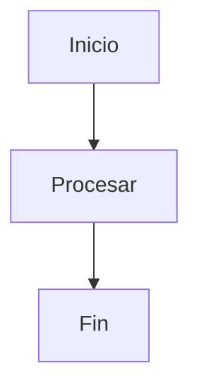
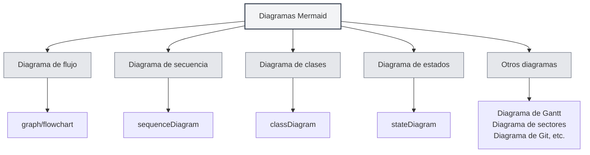
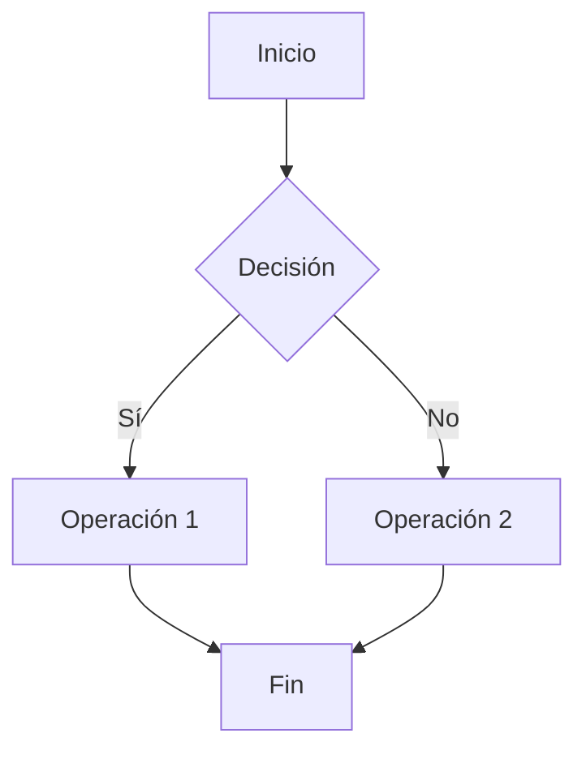
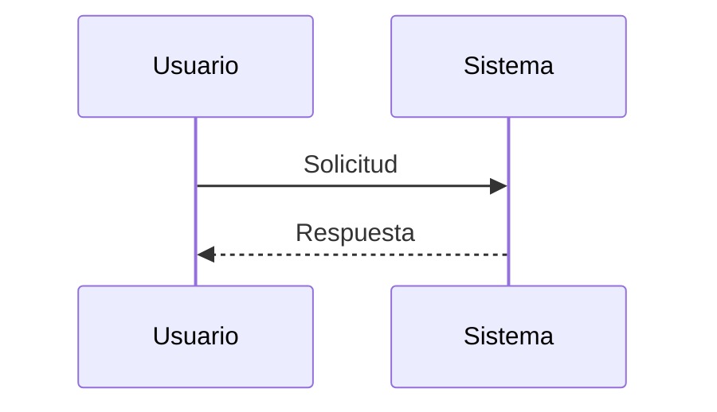
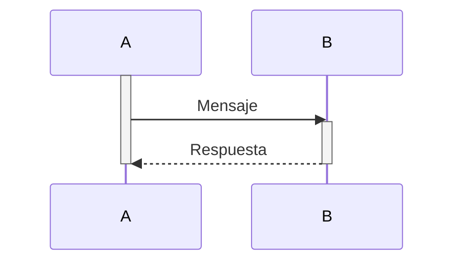
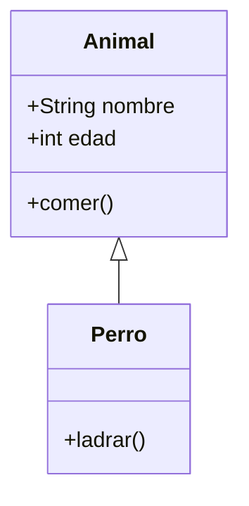
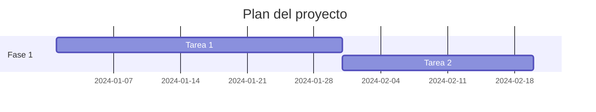
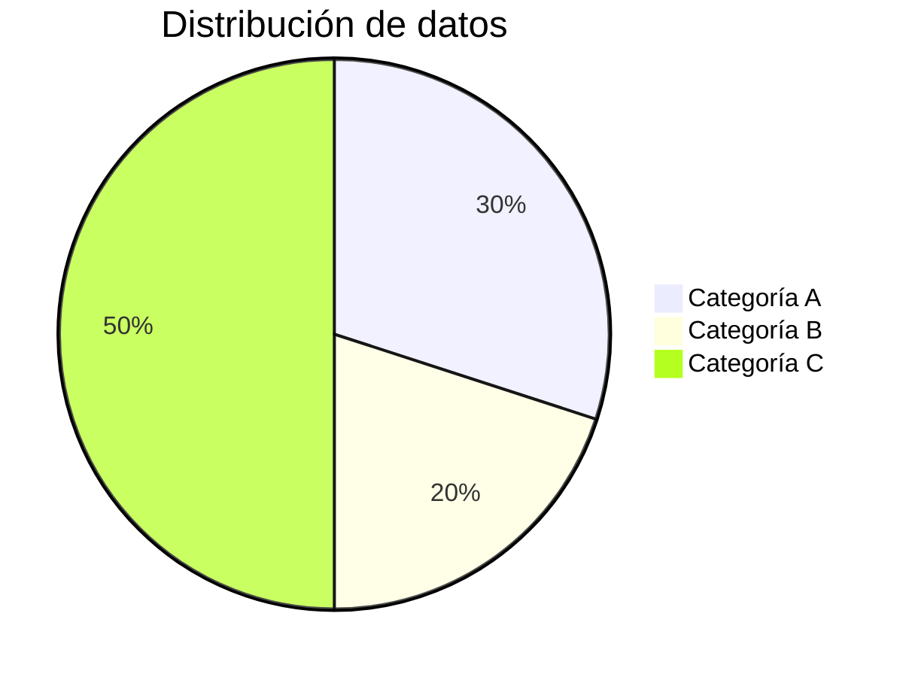
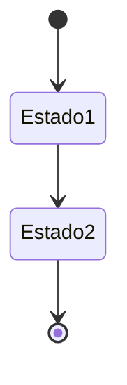
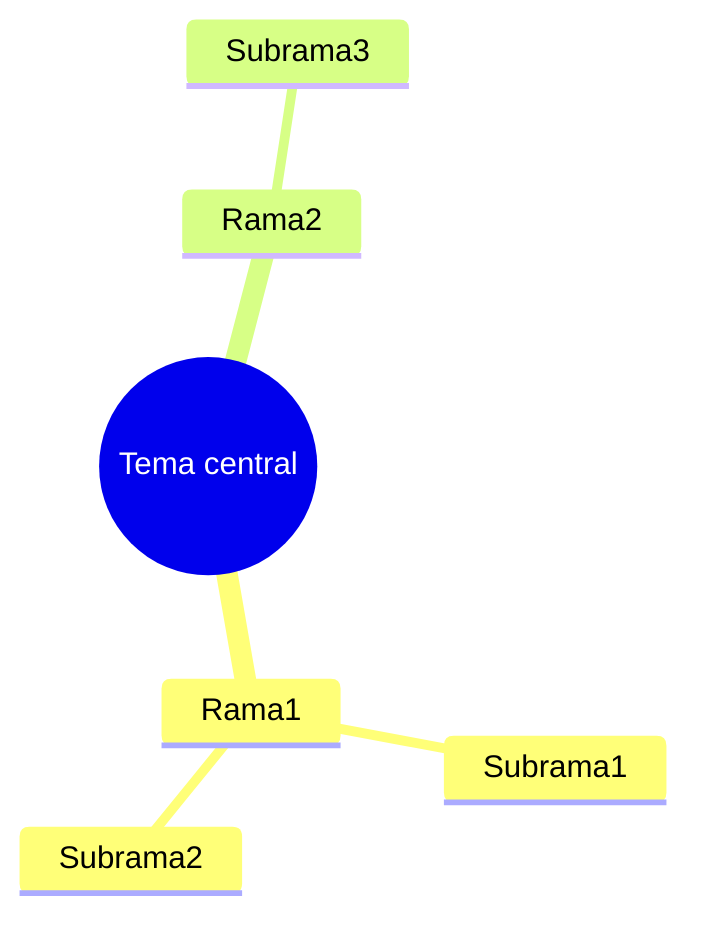

# Diagramas Mermaid

## Descripción general

Mermaid es una herramienta popular para dibujar diagramas, ideal para crear rápidamente diagramas de flujo, diagramas de secuencia, diagramas de clases, diagramas de Gantt, etc. MetaDoc admite diagramas Mermaid, permitiendo utilizar directamente la sintaxis de Mermaid en documentos Markdown para crear diversos tipos de diagramas.

<GraphWindow mode="demo" initialTool="mermaid" />

## Sintaxis de Mermaid

<OutlineTreeDisplay mode="demo" />

### Sintaxis básica

Mermaid utiliza una sintaxis de texto simple para describir diagramas:

````markdown

````

### Tipos de diagramas

<ChartGenerationDisplay mode="demo" />

Mermaid admite múltiples tipos de diagramas:

- **Diagrama de flujo** (graph/flowchart)
- **Diagrama de secuencia** (sequenceDiagram)
- **Diagrama de clases** (classDiagram)
- **Diagrama de estados** (stateDiagram)
- **Diagrama de relaciones de entidades** (erDiagram)
- **Diagrama de Gantt** (gantt)
- **Diagrama de sectores (tarta)** (pie)
- **Diagrama de Git** (gitgraph)
- **Diagrama de viaje del usuario** (journey)
- **Mapa mental** (mindmap)
- **Línea de tiempo** (timeline)



## Diagramas de flujo

<OutlineTreeDisplay mode="demo" />

### Diagrama de flujo básico

Crear un diagrama de flujo básico:

````markdown

````

### Dirección del diagrama de flujo

Se puede establecer la dirección del diagrama de flujo:

- **TD**: De arriba a abajo (Top Down)
- **BT**: De abajo a arriba (Bottom Top)
- **LR**: De izquierda a derecha (Left Right)
- **RL**: De derecha a izquierda (Right Left)

### Formas de nodos

Se pueden utilizar diferentes formas de nodos:

- **Rectángulo**: `[texto]`
- **Rectángulo redondeado**: `(texto)`
- **Rombo**: `{texto}`
- **Círculo**: `((texto))`
- **Hexágono**: `{{texto}}`
- **Trapecio**: `[/texto\]`
- **Trapecio invertido**: `[\texto/]`

## Diagramas de secuencia

<DataAnalysisDisplay mode="demo" />

### Diagrama de secuencia básico

Crear un diagrama de secuencia:

````markdown

````

### Tipos de mensajes

Se pueden utilizar diferentes tipos de mensajes:

- **Flecha de línea continua**: `->>` Mensaje síncrono
- **Flecha de línea discontinua**: `-->>` Mensaje asíncrono
- **Línea continua**: `->` Mensaje síncrono (sin retorno)
- **Línea discontinua**: `-->` Mensaje asíncrono (sin retorno)

### Cajas de activación

Se pueden añadir cajas de activación para representar la actividad de un objeto:

````markdown

````

## Diagramas de clases

<ChartGenerationDisplay mode="demo" />

### Diagrama de clases básico

Crear un diagrama de clases:

````markdown

````

### Relaciones de clases

Se pueden representar diferentes relaciones entre clases:

- **Herencia**: `<|--` o `--|>`
- **Implementación**: `<|..` o `..|>`
- **Composición**: `*--` o `--*`
- **Agregación**: `o--` o `--o`
- **Asociación**: `-->` o `<--`
- **Dependencia**: `..>` o `<..`

### Miembros de clase

Se pueden definir los miembros de una clase:

- **Atributos**: `+nombre: String` (público), `-nombre: String` (privado)
- **Métodos**: `+metodo()` (público), `-metodo()` (privado)

## Diagramas de Gantt

<OutlineTreeDisplay mode="demo" />

### Diagrama de Gantt básico

Crear un diagrama de Gantt:

````markdown

````

### Formato de fecha

Se puede establecer el formato de fecha:

- **YYYY-MM-DD**: Año-Mes-Día
- **MM/DD/YYYY**: Mes/Día/Año
- **Otros formatos**: Admite múltiples formatos de fecha

### Relaciones entre tareas

Se pueden establecer relaciones entre tareas:

- **after**: Después de una tarea específica
- **Hito**: Usar `milestone` para marcar un hito

## Diagramas de sectores (tarta)

<DataAnalysisDisplay mode="demo" />

### Diagrama de sectores básico

Crear un diagrama de sectores:

````markdown

````

## Diagramas de estados

<ChartGenerationDisplay mode="demo" />

### Diagrama de estados básico

Crear un diagrama de estados:

````markdown

````

## Mapas mentales

<OutlineTreeDisplay mode="demo" />

### Mapa mental básico

Crear un mapa mental:

````markdown

````

## Consideraciones

<DataAnalysisDisplay mode="demo" />

### Consideraciones sobre la sintaxis

1.  **Delimitación de cadenas**: Se recomienda usar `["..."]` para delimitar cadenas y evitar errores de escape.
2.  **Identificadores**: En diagramas de clases, evitar identificadores con espacios o caracteres especiales.
3.  **Soporte para chino**: Se puede usar chino, pero se recomienda usar identificadores en inglés.
4.  **Versión de sintaxis**: Prestar atención a la versión de la sintaxis de Mermaid, ya que puede haber diferencias entre versiones.

### Consideraciones sobre la renderización

1.  **Errores de sintaxis**: Si hay errores de sintaxis, el diagrama no se renderizará.
2.  **Diagramas complejos**: Diagramas excesivamente complejos pueden afectar al rendimiento de renderización.
3.  **Compatibilidad del navegador**: Algunos navegadores pueden no admitir ciertas características de Mermaid.
4.  **Compatibilidad de exportación**: Al exportar, asegurarse de que los diagramas se muestren correctamente en el formato de destino.

## Mejores prácticas

1.  **Normas de sintaxis**: Seguir las normas oficiales de sintaxis de Mermaid.
2.  **Código claro**: Mantener el código del diagrama claro y legible.
3.  **Probar la renderización**: Probar el efecto de renderización del diagrama después de editarlo.
4.  **Usar ejemplos**: Consultar los ejemplos de la documentación oficial de Mermaid.
5.  **Compatibilidad de versiones**: Prestar atención a la compatibilidad de versiones de Mermaid.

## Documentación relacionada

- [[charts.introduction|Introducción a las funciones de diagramas]]
- [[charts.plantuml|Diagramas PlantUML]]
- [[charts.echarts|Diagramas ECharts]]
