# Diagramas PlantUML

## Descripción general

PlantUML es una herramienta profesional de modelado UML que admite múltiples tipos de diagramas UML. MetaDoc es compatible con diagramas PlantUML, permitiendo crear diagramas UML profesionales utilizando la sintaxis de PlantUML dentro de documentos Markdown.

<GraphWindow mode="demo" initialTool="plantuml" />

## Sintaxis de PlantUML

<OutlineTreeDisplay mode="demo" />

### Sintaxis básica

PlantUML utiliza marcas y sintaxis específicas:

````markdown
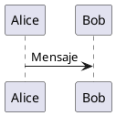
````

### Marcas obligatorias

<ChartGenerationDisplay mode="demo" />

Los diagramas PlantUML deben contener:

- **@startuml**: Marca de inicio del diagrama
- **@enduml**: Marca de fin del diagrama

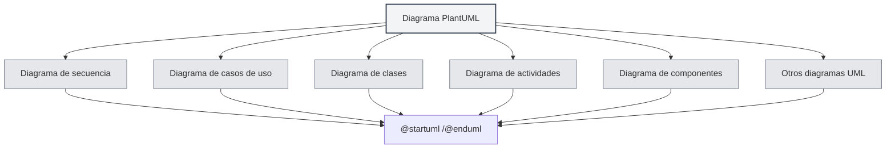

## Tipos de diagramas admitidos

<DataAnalysisDisplay mode="demo" />

### Diagrama de secuencia

Crear un diagrama de secuencia:

````markdown
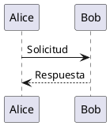
````

### Diagrama de casos de uso

<OutlineTreeDisplay mode="demo" />

Crear un diagrama de casos de uso:

````markdown
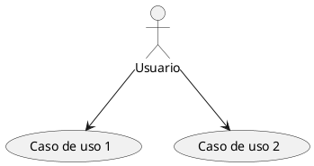
````

### Diagrama de clases

<ChartGenerationDisplay mode="demo" />

Crear un diagrama de clases:

````markdown
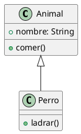
````

### Diagrama de actividades

<DataAnalysisDisplay mode="demo" />

Crear un diagrama de actividades:

````markdown
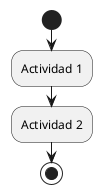
````

### Diagrama de componentes

<OutlineTreeDisplay mode="demo" />

Crear un diagrama de componentes:

````markdown
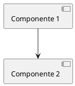
````

### Diagrama de despliegue

<ChartGenerationDisplay mode="demo" />

Crear un diagrama de despliegue:

````markdown
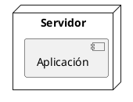
````

### Diagrama de estados

<DataAnalysisDisplay mode="demo" />

Crear un diagrama de estados:

````markdown
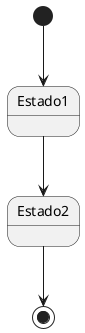
````

## Explicación detallada del diagrama de secuencia

<OutlineTreeDisplay mode="demo" />

### Participantes

Definir participantes:

````markdown
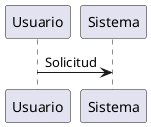
````

### Tipos de mensajes

Se pueden usar diferentes tipos de mensajes:

- **Mensaje síncrono**: `->`
- **Mensaje asíncrono**: `-->`
- **Mensaje de retorno**: `<-` o `<--`
- **Autollamada**: `->` apuntando a sí mismo

### Cajas de activación

Añadir cajas de activación:

````markdown
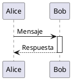
````

## Explicación detallada del diagrama de clases

<ChartGenerationDisplay mode="demo" />

### Definición de clase

Definir una clase:

````markdown
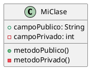
````

### Relaciones entre clases

Representar relaciones entre clases:

- **Herencia**: `<|--` o `--|>`
- **Implementación**: `<|..` o `..|>`
- **Composición**: `*--` o `--*`
- **Agregación**: `o--` o `--o`
- **Asociación**: `-->` o `<--`
- **Dependencia**: `..>` o `<..`

### Interfaces y clases abstractas

Definir interfaces y clases abstractas:

````markdown
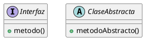
````

## Explicación detallada del diagrama de actividades

### Actividades básicas

Definir actividades:

````markdown

````

### Nodos de decisión

Añadir decisiones:

````markdown
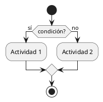
````

### Bucles

Añadir bucles:

````markdown
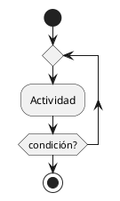
````

## Estilos y temas

### Configuración de temas

Se pueden configurar temas:

````markdown
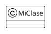
````

### Configuración de colores

Se pueden configurar colores:

````markdown
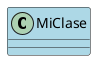
````

## Métodos de renderizado

### Renderizado en el proceso principal

PlantUML utiliza el proceso principal para renderizar:

- **Renderizado en el servidor**: Los diagramas se renderizan en el proceso principal
- **Formato SVG**: Se renderiza en formato SVG por defecto
- **Formato PNG**: Se puede convertir a formato PNG

### Rendimiento del renderizado

Características del renderizado de PlantUML:

- **Velocidad de renderizado**: El renderizado en el proceso principal es rápido
- **Uso de recursos**: Consume recursos del proceso principal durante el renderizado
- **Manejo de errores**: Los errores de renderizado se muestran en la consola

## Consideraciones

### Consideraciones de sintaxis

1. **Marcas obligatorias**: Debe incluir `@startuml` y `@enduml`
2. **Normas de sintaxis**: Seguir las normas oficiales de sintaxis de PlantUML
3. **Soporte para chino**: Se puede usar chino, pero se recomienda usar identificadores en inglés
4. **Compatibilidad de versiones**: Prestar atención a la compatibilidad de versiones de PlantUML

### Consideraciones de renderizado

1. **Extracción de código**: Asegurar que la extracción del código sea correcta, evitando incluir etiquetas XML
2. **Errores de sintaxis**: Los diagramas no se renderizan si hay errores de sintaxis
3. **Diagramas complejos**: Diagramas demasiado complejos pueden afectar el rendimiento del renderizado
4. **Compatibilidad de exportación**: Al exportar, asegurar que los diagramas se muestren correctamente en el formato de destino

## Mejores prácticas

1. **Normas de sintaxis**: Seguir las normas oficiales de sintaxis de PlantUML
2. **Código claro**: Mantener el código del diagrama claro y legible
3. **Usar marcas**: Usar siempre las marcas `@startuml` y `@enduml`
4. **Probar el renderizado**: Probar el efecto de renderizado del diagrama después de editarlo
5. **Documentación de referencia**: Consultar la documentación oficial de PlantUML

## Documentación relacionada

- [[charts.introduction|Introducción a las funciones de gráficos]]
- [[charts.mermaid|Diagramas Mermaid]]
- [[charts.echarts|Diagramas ECharts]]
