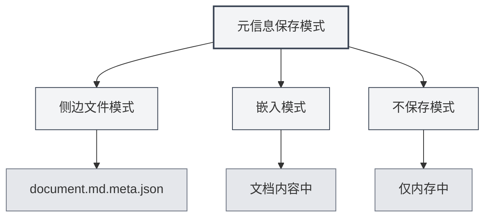

# Metadatos del Documento

## Descripción General

Los metadatos del documento son datos que describen las propiedades básicas de un documento, incluyendo título, autor, descripción, palabras clave, etc. Una configuración adecuada de los metadatos facilita la gestión y recuperación de documentos, y esta información se incluye automáticamente al exportar el documento.

MetaDoc permite configurar metadatos para cada documento. Esta información puede guardarse en un archivo lateral, incrustarse en el contenido del documento o no guardarse. También puede utilizar IA para generar metadatos automáticamente.

<MetaInfoPanel mode="demo" :meta='{"title": "", "author": "", "description": "", "keywords": []}' :outlineJson='""' />

## Introducción a los Metadatos

### Título (Title)

El título del documento, que normalmente se muestra en la parte superior del documento y en las pestañas.

- **Propósito**: Identificar el contenido principal del documento.
- **Ubicación de visualización**: Título de la pestaña, página de título del documento exportado.
- **Ejemplo**: `"Manual de Usuario de MetaDoc"`

<MetaInfoPanel mode="demo" :meta='{"title": "MetaDoc用户手册", "author": "", "description": "", "keywords": []}' :outlineJson='""' />

### Autor (Author)

El autor o creador del documento.

- **Propósito**: Identificar al creador del documento.
- **Ubicación de visualización**: Información del autor en el documento exportado.
- **Ejemplo**: `"张三"`

<MetaInfoPanel mode="demo" :meta='{"title": "示例文档", "author": "张三", "description": "", "keywords": []}' :outlineJson='""' />

### Descripción (Description)

Una breve descripción o resumen del documento.

- **Propósito**: Resumir el contenido principal del documento.
- **Ubicación de visualización**: Sección de resumen del documento exportado.
- **Ejemplo**: `"Este documento introduce los métodos básicos de uso de MetaDoc"`

<MetaInfoPanel mode="demo" :meta='{"title": "示例文档", "author": "作者名", "description": "本文档介绍MetaDoc的基本使用方法", "keywords": []}' :outlineJson='""' />

### Palabras Clave (Keywords)

Lista de palabras clave del documento, utilizada para la recuperación y clasificación de documentos.

- **Propósito**: Ayudar en la recuperación y clasificación de documentos.
- **Formato**: Array de cadenas de texto.
- **Ejemplo**: `["MetaDoc", "Manual de Usuario", "Edición de Documentos"]`

<MetaInfoPanel mode="demo" :meta='{"title": "示例文档", "author": "作者名", "description": "文档描述", "keywords": ["MetaDoc", "用户手册", "文档编辑"]}' :outlineJson='""' />

## Configurar Metadatos

### Configuración Manual

1. **Abrir el panel de metadatos**:
   - Haga clic en el botón "Metadatos" de la barra de herramientas del editor.
   - O utilice el atajo de teclado (si está configurado).

2. **Completar los metadatos**:
   - **Título**: Ingrese el título del documento.
   - **Autor**: Ingrese el nombre del autor.
   - **Descripción**: Ingrese la descripción del documento (admite múltiples líneas).
   - **Palabras clave**: Ingrese las palabras clave, separando múltiples palabras clave con comas.

3. **Guardar**: Haga clic en el botón "Guardar" para guardar los metadatos.

La interfaz del panel de metadatos es la siguiente:

<MetaInfoPanel mode="demo" :meta='{"title": "示例文档", "author": "作者名", "description": "文档描述", "keywords": ["关键词1", "关键词2"]}' :outlineJson='""' />

### Configuración por Lotes

Puede configurar todos los campos de metadatos de una vez:

1. Abra el panel de metadatos.
2. Complete todos los campos.
3. Haga clic en el botón "Guardar".

<MetaInfoPanel mode="demo" :meta='{"title": "批量设置示例", "author": "管理员", "description": "批量设置所有元信息字段的示例", "keywords": ["批量", "设置", "元信息"]}' :outlineJson='""' />

### Editar Metadatos

Los metadatos ya configurados se pueden modificar en cualquier momento:

1. Abra el panel de metadatos.
2. Modifique los campos que necesite cambiar.
3. Haga clic en el botón "Guardar".

Los metadatos modificados entrarán en vigor inmediatamente y se guardarán la próxima vez que guarde el documento.

## Modos de Guardado de Metadatos

MetaDoc admite tres modos de guardado de metadatos, configurables en [[settings.basic|Configuración Básica]]:



### Modo Archivo Lateral

Los metadatos se guardan en un archivo lateral con el mismo nombre que el documento (`.meta.json`).

<MetaInfoPanel mode="demo" :meta='{"title": "侧边文件模式示例", "author": "系统", "description": "元信息保存在.meta.json文件中", "keywords": ["侧边文件", "元数据"]}' :outlineJson='""' />

**Ventajas**:
- No modifica el contenido original del documento.
- Se puede eliminar el archivo lateral en cualquier momento para restaurar el documento original.
- Adecuado para control de versiones.

**Desventajas**:
- Genera archivos adicionales.
- Al mover el documento, es necesario mover también el archivo lateral.

**Ejemplo**:
- Documento: `document.md`
- Archivo de metadatos: `document.md.meta.json`

### Modo Incrustado

Los metadatos se incrustan en el contenido del documento (front matter de Markdown o comentarios de LaTeX).

<MetaInfoPanel mode="demo" :meta='{"title": "嵌入模式示例", "author": "嵌入作者", "description": "元信息嵌入在文档中", "keywords": ["嵌入", "front matter"]}' :outlineJson='""' />

**Ventajas**:
- El documento y los metadatos están juntos, facilitando la gestión.
- No requiere archivos adicionales.

**Desventajas**:
- Modifica el contenido original del documento.
- Algunos formatos pueden no admitir la incrustación.

**Ejemplo** (Markdown):

```markdown
---
title: Título del Documento
author: Nombre del Autor
description: Descripción del Documento
keywords: [PalabraClave1, PalabraClave2]
---

Contenido del documento...
```

### Modo Sin Guardar

Los metadatos solo se utilizan durante la edición y no se guardan en un archivo.

<MetaInfoPanel mode="demo" :meta='{"title": "不保存模式", "author": "临时", "description": "仅在内存中保存元信息", "keywords": ["临时", "不保存"]}' :outlineJson='""' />

**Ventajas**:
- No afecta al documento original.
- No genera archivos adicionales.

**Desventajas**:
- Los metadatos se pierden al cerrar el documento.
- No se pueden utilizar los metadatos al exportar.

## Generación de Metadatos con IA

MetaDoc admite el uso de IA para generar automáticamente metadatos de documentos, generando inteligentemente basándose en el contenido del documento y la estructura del esquema.

### Generar un Campo Individual

Generar metadatos para un campo específico:

1. Abra el panel de metadatos.
2. Haga clic en el botón "Generar con IA" junto al campo.
3. Espere a que la IA genere el resultado.
4. Revise el contenido generado; puede aceptarlo o regenerarlo.

### Generar Todos los Campos

Generar todos los campos de metadatos de una vez:

1. Abra el panel de metadatos.
2. Haga clic en el botón "Generar todo con IA".
3. Espere a que la IA genere el resultado.
4. Revise el contenido generado; puede aceptarlo, modificarlo o regenerarlo.

<MetaInfoPanel mode="demo" :meta='{"title": "AI生成示例", "author": "AI助手", "description": "使用AI自动生成的元信息", "keywords": ["AI", "自动生成", "智能"]}' :outlineJson='""' />

### Principio de Generación

La generación de metadatos con IA se basa en:
- **Esquema del documento**: Analiza la estructura de títulos del documento.
- **Contenido del documento**: Analiza el contenido principal del documento.
- **Comprensión del contexto**: Comprende el tema y propósito del documento.

Los resultados generados se ajustan automáticamente según el contenido del documento, asegurando que los metadatos reflejen con precisión dicho contenido.

## Aplicación de Metadatos en la Exportación

Los documentos exportados incluyen automáticamente los metadatos:

### Exportación a PDF

- **Título**: Se muestra en las propiedades del documento PDF.
- **Autor**: Se muestra en las propiedades del documento PDF.
- **Descripción**: Se utiliza como Asunto (Subject) del PDF.
- **Palabras clave**: Se muestran en las propiedades del documento PDF.

### Exportación a DOCX

- **Título**: Se muestra en las propiedades del documento Word.
- **Autor**: Se muestra en las propiedades del documento Word.
- **Descripción**: Se utiliza como Resumen de Word.
- **Palabras clave**: Se muestran en las propiedades del documento Word.

### Exportación a HTML

- **Título**: Se muestra en la etiqueta `<title>` del HTML.
- **Autor**: Se muestra en la etiqueta `<meta>` del HTML.
- **Descripción**: Se muestra en la etiqueta `<meta>` del HTML.
- **Palabras clave**: Se muestran en la etiqueta `<meta>` del HTML.

## Consejos de Uso

### Configurar el Título Adecuadamente

- **Claro y conciso**: El título debe resumir el contenido del documento de manera concisa.
- **Evitar demasiado largo**: Un título excesivamente largo afecta la visualización.
- **Usar palabras clave**: Incluir palabras clave importantes en el título.

### Configuración de Palabras Clave

- **Cantidad moderada**: Se recomienda configurar entre 3 y 10 palabras clave.
- **Alta relevancia**: Las palabras clave deben estar altamente relacionadas con el contenido del documento.
- **Evitar repeticiones**: Evitar configurar palabras clave repetidas o similares.

### Optimización de la Generación con IA

- **Revisar después de generar**: El contenido generado por IA requiere revisión manual.
- **Modificar según sea necesario**: Modificar el contenido generado según las necesidades reales.
- **Generar múltiples veces**: Si no está satisfecho, puede generar varias veces y seleccionar el mejor resultado.

<MetaInfoPanel mode="demo" :meta='{"title": "元信息完整示例", "author": "演示用户", "description": "展示完整的元信息配置示例", "keywords": ["元信息", "配置", "示例"]}' :outlineJson='""' />

## Preguntas Frecuentes

### P: ¿Dónde se guardan los metadatos?

R: Dependiendo del modo de guardado, los metadatos pueden guardarse en un archivo lateral, incrustarse en el contenido del documento o no guardarse. Puede configurar el modo de guardado en la configuración.

### P: ¿Cómo eliminar los metadatos?

R: En el panel de metadatos, vacíe todos los campos y guarde para eliminar los metadatos.

### P: ¿Qué hacer si el contenido generado por IA no es preciso?

R: El contenido generado por IA es solo de referencia; puede modificarlo manualmente o regenerarlo. Se recomienda revisar y ajustar después de la generación.

### P: ¿Los metadatos afectan el contenido del documento?

R: Si se utiliza el modo incrustado, los metadatos se incrustarán en el contenido del documento. Si se utiliza el modo archivo lateral o el modo sin guardar, no afectará el contenido original del documento.

### P: ¿Se pierden los metadatos al exportar?

R: No. Al exportar, los metadatos se incluyen automáticamente y se muestran en las propiedades del documento exportado.

## Documentación Relacionada

- [[core.file-operations|Operaciones de Archivos]]
- [[core.export|Función de Exportación]]
- [[settings.basic|Configuración Básica]]
- [[ai.assistants|Función de Asistentes de IA]]
