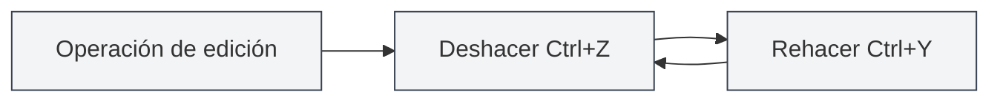
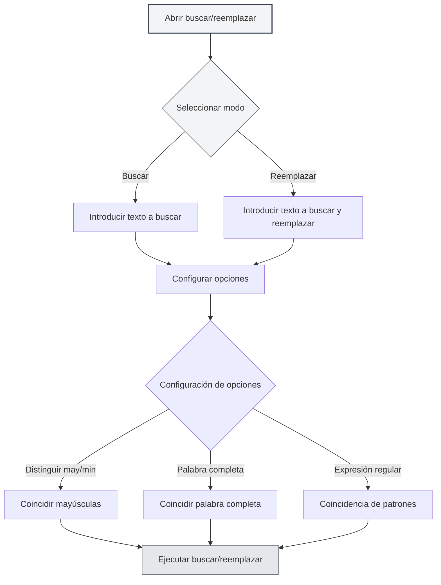

# Operaciones básicas del editor

## Descripción general

Las operaciones básicas del editor son habilidades fundamentales para editar documentos con MetaDoc. Dominar estas operaciones puede mejorar significativamente su eficiencia de edición.

El editor de MetaDoc admite operaciones estándar de edición de texto, incluyendo funciones como deshacer, rehacer, copiar, pegar, cortar, seleccionar todo y buscar y reemplazar.

<SearchReplaceMenu mode="demo" :position='{"top": 100, "left": 200}' :adapter='null' />

<MenuItemsDemo mode="demo" :items='[{"id": "edit"}]' />

## Deshacer y rehacer

### Operación de deshacer

Deshacer la última operación de edición:

- **Atajo de teclado**: `Ctrl+Z` (Windows/Linux) o `Cmd+Z` (macOS)
- **Menú**: Haga clic en "Editar" → "Deshacer"

Puede deshacer múltiples operaciones consecutivas hasta volver al estado inicial del documento.

### Operación de rehacer

<MenuItemsDemo mode="demo" :items='[{"id": "edit"}]' />

Restaurar una operación que fue deshecha:

- **Atajo de teclado**: `Ctrl+Y` o `Ctrl+Shift+Z` (Windows/Linux) o `Cmd+Shift+Z` (macOS)
- **Menú**: Haga clic en "Editar" → "Rehacer"

La operación de rehacer restaurará las acciones en el orden inverso al que fueron deshechas.

## Copiar, pegar, cortar

<MenuItemsDemo mode="demo" :items='[{"id": "edit"}]' />

### Copiar

Copiar el texto seleccionado al portapapeles:

- **Atajo de teclado**: `Ctrl+C` (Windows/Linux) o `Cmd+C` (macOS)
- **Menú**: Haga clic en "Editar" → "Copiar"
- **Menú contextual**: Seleccione el texto, haga clic derecho y elija "Copiar"

### Pegar

<MenuItemsDemo mode="demo" :items='[{"id": "edit"}]' />

Pegar el contenido del portapapeles en la posición actual:

- **Atajo de teclado**: `Ctrl+V` (Windows/Linux) o `Cmd+V` (macOS)
- **Menú**: Haga clic en "Editar" → "Pegar"
- **Menú contextual**: Haga clic derecho y elija "Pegar"

La operación de pegar insertará el contenido en la posición del cursor. Si hay texto seleccionado, lo reemplazará.

### Cortar

<MenuItemsDemo mode="demo" :items='[{"id": "edit"}]' />

Cortar el texto seleccionado al portapapeles (eliminando el contenido de la ubicación original):

- **Atajo de teclado**: `Ctrl+X` (Windows/Linux) o `Cmd+X` (macOS)
- **Menú**: Haga clic en "Editar" → "Cortar"
- **Menú contextual**: Seleccione el texto, haga clic derecho y elija "Cortar"

La operación de cortar eliminará el texto de su ubicación original y lo guardará en el portapapeles, para luego poder pegarlo en otra ubicación.

## Seleccionar todo

<MenuItemsDemo mode="demo" :items='[{"id": "edit"}]' />

Seleccionar todo el contenido del documento:

- **Atajo de teclado**: `Ctrl+A` (Windows/Linux) o `Cmd+A` (macOS)
- **Menú**: Haga clic en "Editar" → "Seleccionar todo"

Después de seleccionar todo, puede:

- Copiar todo el contenido del documento
- Eliminar todo el contenido del documento
- Aplicar formato uniforme a todo el texto

## Buscar y reemplazar

### Buscar

<SearchReplaceMenu mode="demo" :position='{"top": 100, "left": 200}' :adapter='null' />

Buscar texto específico en el documento:

- **Atajo de teclado**: `Ctrl+F` (Windows/Linux) o `Cmd+F` (macOS)
- **Menú**: Haga clic en "Editar" → "Buscar"

La función de búsqueda admite:

- **Coincidencia de mayúsculas/minúsculas**: Búsqueda sensible a mayúsculas
- **Coincidencia de palabra completa**: Solo coincide con palabras completas
- **Expresiones regulares**: Uso de expresiones regulares para búsquedas avanzadas
- **Resaltado**: Los resultados de la búsqueda se resaltan en el documento

### Reemplazar

<SearchReplaceMenu mode="demo" :position='{"top": 100, "left": 200}' :adapter='null' />

Buscar y reemplazar texto:

- **Atajo de teclado**: `Ctrl+H` (Windows/Linux) o `Cmd+H` (macOS)
- **Menú**: Haga clic en "Editar" → "Buscar y reemplazar"

La función de reemplazo admite:

- **Reemplazo individual**: Reemplazar cada coincidencia de texto una por una
- **Reemplazar todo**: Reemplazar todas las coincidencias de texto a la vez
- **Vista previa del reemplazo**: Previsualizar el resultado antes de reemplazar

### Opciones de buscar y reemplazar

El cuadro de diálogo de buscar y reemplazar ofrece las siguientes opciones:

- **Distinguir mayúsculas y minúsculas**: Solo coincide con texto que tenga exactamente las mismas mayúsculas y minúsculas
- **Palabra completa**: Solo coincide con palabras completas (no con partes de palabras)
- **Expresión regular**: Usar expresiones regulares para coincidencia de patrones
- **Búsqueda circular**: Al llegar al final del documento, la búsqueda continúa automáticamente desde el principio

La interfaz del menú de buscar y reemplazar es la siguiente:

<SearchReplaceMenu mode="demo" :position='{"top": 100, "left": 200}' :adapter='null' />

## Selección de texto

### Selección básica

- **Clic único**: Posiciona el cursor en el lugar del clic
- **Arrastrar**: Selecciona el texto desde la posición inicial hasta la final
- **Doble clic**: Selecciona la palabra completa
- **Triple clic**: Selecciona la línea completa

### Selección extendida

- **Shift + clic**: Extiende el rango de selección hasta la posición del clic
- **Ctrl + clic**: Agrega múltiples regiones de selección no contiguas (si el editor lo admite)
- **Alt + arrastrar**: Modo de selección de columna (si el editor lo admite)

## Movimiento del cursor

### Movimiento básico

- **Teclas de dirección**: Mueve el cursor arriba, abajo, izquierda, derecha
- **Inicio/Fin**: Mover al inicio/fin de la línea
- **Ctrl+Inicio/Fin**: Mover al inicio/fin del documento
- **Re Pág/Av Pág**: Desplazar una página hacia arriba/abajo

### Movimiento por palabras

- **Ctrl + flecha izquierda/derecha**: Mover el cursor por palabras
- **Ctrl + flecha arriba/abajo**: Mover hacia arriba/abajo por párrafos

## Operaciones de eliminación

### Eliminación básica

- **Retroceso**: Elimina el carácter anterior al cursor
- **Suprimir**: Elimina el carácter posterior al cursor
- **Ctrl+Retroceso**: Elimina la palabra completa anterior al cursor
- **Ctrl+Suprimir**: Elimina la palabra completa posterior al cursor

## Diferencias entre editores

MetaDoc ofrece dos editores principales:

### Editor Markdown (Vditor)

- Admite vista previa en tiempo real
- Proporciona una barra de herramientas de formato
- Admite múltiples modos de edición (IR/WYSIWYG/SV)
- Consulte la [[markdown.editor|Guía de uso del editor Markdown]] para más detalles

### Editor LaTeX (Monaco)

- Experiencia profesional de edición de código
- Resaltado de sintaxis y autocompletado
- Admite plegado de código
- Consulte la [[latex.editor|Guía de uso del editor LaTeX]] para más detalles

Las operaciones básicas de ambos editores son fundamentalmente las mismas, pero difieren en funciones avanzadas.

## Referencia de atajos de teclado

### Atajos universales

| Operación     | Windows/Linux              | macOS         |
| ------------- | -------------------------- | ------------- |
| Deshacer      | `Ctrl+Z`                   | `Cmd+Z`       |
| Rehacer       | `Ctrl+Y` o `Ctrl+Shift+Z`  | `Cmd+Shift+Z` |
| Copiar        | `Ctrl+C`                   | `Cmd+C`       |
| Pegar         | `Ctrl+V`                   | `Cmd+V`       |
| Cortar        | `Ctrl+X`                   | `Cmd+X`       |
| Seleccionar todo | `Ctrl+A`               | `Cmd+A`       |
| Buscar        | `Ctrl+F`                   | `Cmd+F`       |
| Buscar y reemplazar | `Ctrl+H`           | `Cmd+H`       |

## Consideraciones

1. **Historial de deshacer**: El historial de deshacer se borra al cerrar el documento; se recomienda guardar el documento periódicamente.
2. **Portapapeles**: El contenido copiado o cortado se guarda en el portapapeles del sistema y puede perderse al cerrar la aplicación.
3. **Buscar y reemplazar**: Al usar expresiones regulares, tenga cuidado con los caracteres especiales que necesiten escape.
4. **Documentos grandes**: Al trabajar con documentos grandes, las operaciones de buscar y reemplazar pueden requerir algo de tiempo.

## Documentación relacionada

- [[core.file-operations|Operaciones con archivos]]
- [[core.editor-settings|Configuración del editor]]
- [[markdown.editor|Guía de uso del editor Markdown]]
- [[latex.editor|Guía de uso del editor LaTeX]]