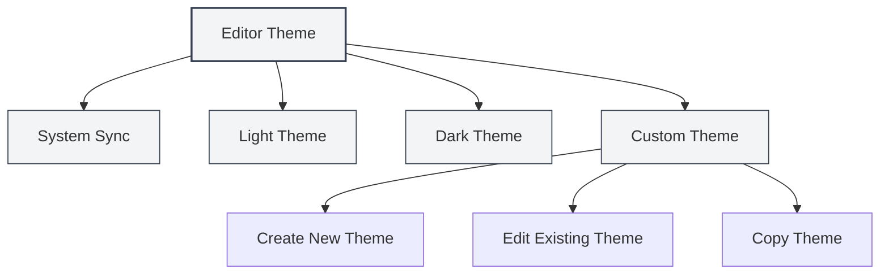
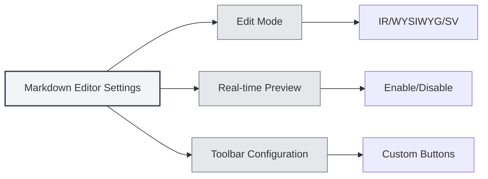

# Configuración del Editor

## Descripción General

La configuración del editor permite personalizar la apariencia y el comportamiento del editor, incluyendo temas, fuentes, visualización de números de línea, entre otros. Una configuración adecuada puede mejorar su experiencia de edición y productividad.

La configuración del editor se divide en configuración global y configuración específica del editor. La configuración global afecta a todos los editores, mientras que ciertos ajustes pueden aplicarse solo a tipos específicos de editores (como el editor Markdown o el editor LaTeX).

<MenuItemsDemo mode="demo" :items='[{"id": "settings"}]' />

## Tema del Editor

<MenuItemsDemo mode="demo" :items='[{"id": "settings"}]' />

### Tipos de Temas

MetaDoc admite varios modos de tema:

- **Sincronización con el Sistema**: Sigue automáticamente el tema del sistema (claro/oscuro)
- **Tema Claro**: Utiliza siempre el tema claro
- **Tema Oscuro**: Utiliza siempre el tema oscuro
- **Tema Personalizado**: Utiliza una configuración de colores personalizada

### Configurar el Tema

<SettingThemeSection mode="demo" />

1.  Abra la página de configuración (haga clic en el menú "Configuración" o use el atajo de teclado)
2.  Acceda a la sección "Configuración del Tema"
3.  Seleccione el tema de su preferencia

Puede acceder a la configuración a través de la barra de menú superior:

Haga clic en el menú "Configuración" de la barra de menú superior para abrir el panel de configuración y configurar opciones como el tema del editor, el tema del contenido, el tema del código, etc.

<MenuItemsDemo mode="demo" :items='[{"id": "settings"}]' />

Los cambios en la configuración del tema se aplican inmediatamente, sin necesidad de reiniciar la aplicación.

### Tema Personalizado

<SettingThemeSection mode="demo" />

Puede crear y editar temas personalizados:

1.  Haga clic en "Nuevo Tema" en la página de configuración de temas
2.  Establezca el nombre del tema y los colores del tema
3.  Una vez guardado, estará listo para usar

Los temas personalizados admiten:

- **Editar**: Modificar el nombre y los colores del tema
- **Copiar**: Copiar un tema existente como punto de partida para uno nuevo
- **Eliminar**: Eliminar temas personalizados que no sean necesarios

## Tema del Contenido

<SettingThemeSection mode="demo" />

El tema del contenido controla el estilo de visualización del área de vista previa del documento:

- **Automático**: Selecciona automáticamente según el tema global
- **Claro**: Utiliza siempre el estilo de vista previa claro
- **Oscuro**: Utiliza siempre el estilo de vista previa oscuro

El tema del contenido afecta principalmente al efecto de visualización de la vista previa de Markdown y la vista previa de PDF.

## Tema del Código

<SettingThemeSection mode="demo" />

El tema del código controla el estilo de resaltado de sintaxis para los bloques de código:

- **Automático**: Selecciona automáticamente según el tema global
- **Temas Predefinidos**: Seleccione un tema de código predefinido (como GitHub, Monokai, Solarized, etc.)

El tema del código afecta:

- El resaltado de sintaxis de los bloques de código en Markdown
- El resaltado de código en el editor LaTeX
- El estilo de visualización de la salida de la consola

## Configuración de Fuentes

<SettingBasicSection mode="demo" />

### Fuente del Editor

La fuente utilizada por el editor se puede configurar en la configuración del sistema. Por defecto se utiliza una fuente monoespaciada, como:

- JetBrains Mono
- Consolas
- Courier New
- Microsoft YaHei Mono

### Tamaño de Fuente

- **Aumentar**: Use `Ctrl+=` o `Ctrl+rueda del ratón hacia arriba`
- **Disminuir**: Use `Ctrl+-` o `Ctrl+rueda del ratón hacia abajo`
- **Restablecer**: Use `Ctrl+0` para volver al tamaño predeterminado

Los ajustes de tamaño de fuente se aplican inmediatamente, pero no se guardan en la configuración.

## Visualización de Números de Línea

<SettingBasicSection mode="demo" />

### Mostrar/Ocultar Números de Línea

La configuración de visualización de números de línea controla si el editor muestra los números de línea:

- **Habilitado**: Muestra los números de línea, facilitando la ubicación en el código
- **Deshabilitado**: Oculta los números de línea, obteniendo un área de edición más amplia

### Configurar la Visualización de Números de Línea

1.  Abra la página de configuración
2.  En la sección "Configuración del Editor", busque "Visualización de Números de Línea"
3.  Active o desactive el interruptor para habilitar o deshabilitar los números de línea

La configuración de números de línea afecta a:

- El editor LaTeX
- El editor de texto plano
- El área de vista previa de código

Nota: La visualización de números de línea en el editor Markdown (Vditor) está controlada por su propia configuración.

## Visualización del Minimapa

El minimapa es una vista en miniatura del código ubicada en el lado derecho del editor, que le ayuda a navegar y localizar rápidamente el contenido del documento.

### Mostrar/Ocultar el Minimapa

Configuración de visualización del minimapa:

- **Habilitado**: Muestra el minimapa, facilitando la navegación en documentos largos
- **Deshabilitado**: Oculta el minimapa, obteniendo un área de edición más amplia

### Configurar el Minimapa

La configuración del minimapa suele estar en el menú contextual del editor o en la barra de herramientas:

1.  Haga clic derecho en el editor
2.  Busque la opción "Minimapa" o "Minimap"
3.  Cambie el estado de visualización

La función de minimapa es principalmente aplicable a:

- Editor LaTeX (Monaco)
- Editor de texto plano (Monaco)

## Configuración Específica del Editor

### Configuración del Editor Markdown

Configuración específica del editor Markdown (Vditor):

- **Modo de Edición**: Modo IR, Modo WYSIWYG, Modo SV
- **Vista Previa en Tiempo Real**: Habilitar/deshabilitar la función de vista previa en tiempo real
- **Configuración de la Barra de Herramientas**: Personalizar los botones de la barra de herramientas

Consulte [[markdown.editor|Guía de Uso del Editor Markdown]] para más detalles.

### Configuración del Editor LaTeX

Configuración específica del editor LaTeX (Monaco):

- **Plegado de Código**: Habilitar/deshabilitar la función de plegado de código
- **Ajuste de Línea**: Controlar cómo se muestran las líneas largas
- **Comprobación de Sintaxis**: Habilitar/deshabilitar la comprobación de sintaxis de LaTeX

Consulte [[latex.editor|Guía de Uso del Editor LaTeX]] para más detalles.

## Sincronización de Configuración

La configuración del editor se guarda en la configuración local, incluyendo:

- Selección de tema
- Preferencia de visualización de números de línea
- Tamaño de fuente (sesión actual)
- Estado de visualización del minimapa

La configuración se restaurará automáticamente al reiniciar la aplicación.

## Referencia de Atajos de Teclado

### Ajuste de Fuente

| Operación               | Windows/Linux | macOS        |
| ----------------------- | ------------- | ------------ |
| Aumentar fuente         | `Ctrl+=`      | `Cmd+=`      |
| Disminuir fuente        | `Ctrl+-`      | `Cmd+-`      |
| Restablecer fuente      | `Ctrl+0`      | `Cmd+0`      |
| Zoom con rueda del ratón | `Ctrl+rueda`  | `Cmd+rueda`  |

## Mejores Prácticas

1.  **Selección de Tema**:

    - Para ediciones prolongadas, se recomienda usar el tema oscuro para reducir la fatiga visual
    - Use el tema claro para la vista previa de impresión, obteniendo mejores resultados de impresión

2.  **Visualización de Números de Línea**:

    - Se recomienda habilitar los números de línea al escribir código, para facilitar la localización de errores
    - Puede desactivar los números de línea al editar texto plano, para obtener un área de edición más amplia

3.  **Minimapa**:

    - Habilite el minimapa al editar documentos largos, para navegar rápidamente por la estructura del documento
    - Puede desactivar el minimapa al editar documentos cortos

4.  **Tamaño de Fuente**:
    - Ajuste el tamaño de fuente según el tamaño de la pantalla y sus hábitos personales
    - Se recomienda usar un tamaño de fuente de 14-16px, equilibrando legibilidad y espacio en pantalla

## Consideraciones

1.  **Sincronización de Temas**: Al seleccionar "Sincronización con el Sistema", el tema cambiará automáticamente siguiendo la configuración del sistema
2.  **Alcance de la Configuración**: Algunos ajustes solo afectan a editores específicos, sin afectar a otros
3.  **Impacto en el Rendimiento**: Habilitar ciertas funciones (como la vista previa en tiempo real) puede afectar el rendimiento de la edición
4.  **Temas Personalizados**: Los colores de un tema personalizado afectan el esquema de color de toda la aplicación

## Documentación Relacionada

- [[core.editor-basics|Operaciones Básicas del Editor]]
- [[settings.basic|Configuración Básica]]
- [[settings.theme|Configuración de Temas]]
- [[markdown.editor|Guía de Uso del Editor Markdown]]
- [[latex.editor|Guía de Uso del Editor LaTeX]]